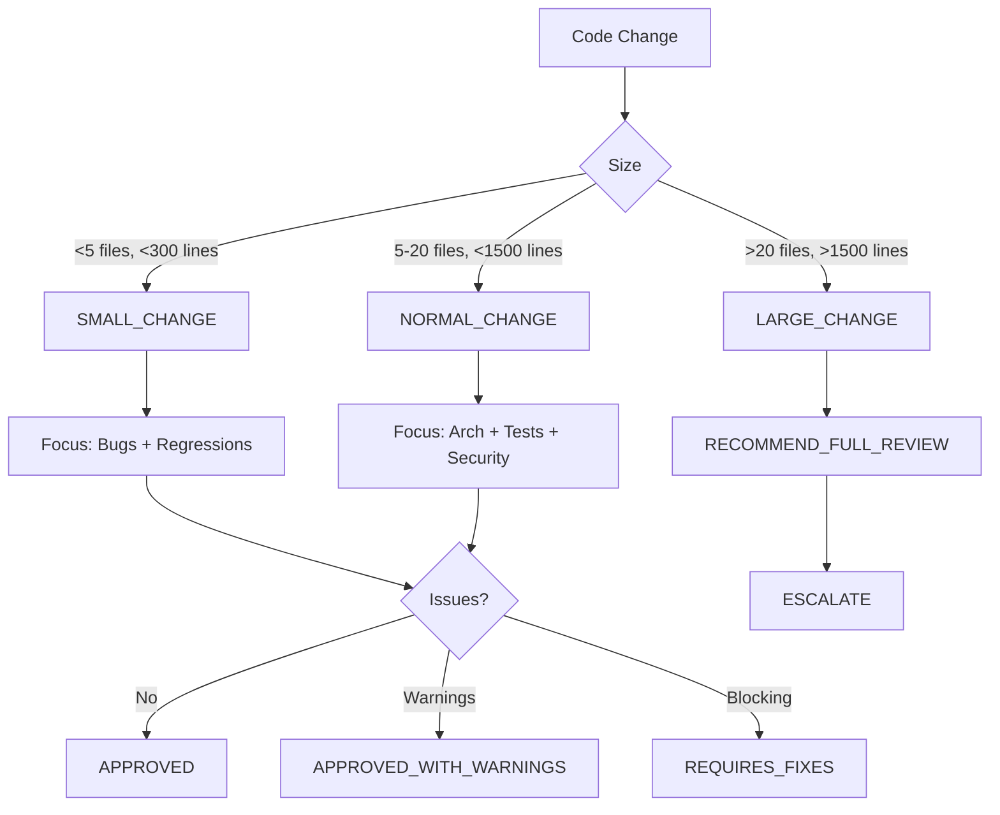

## Quando Usar

### Use quando:
- Finalizar uma feature ou refatoração
- Antes de commit ou push
- Precisar de feedback rápido sobre qualidade
- Detectar regressões óbvias
- Validar alinhamento com ADRs

### Não use quando:
- Mudança envolve autenticação, pagamento, infra, API pública, schema DB, lockfile
- Precisar de auditoria completa de segurança
- Mudança >20 arquivos ou >1500 linhas

### Skills relacionadas:
- `planning` — para alinhamento de escopo
- `adr-generator` — para decisões arquiteturais
- `testing` — para estratégia de testes
- `security-review` — para auditoria completa
- `architecture-review-kilo` — para revisão estrutural

---

# Decision Tree



---

## Workflow

## Fase 1 — Context Loading

Collect:

* changed files
* current task
* ADR references
* TODO references

Determine:

* intended behavior
* expected output
* architectural constraints

If requirements are unclear:

```text
ASK_FOR_CONTEXT
```

**Checkpoint:** [ ] Files identified [ ] Task context loaded [ ] Constraints clear

---

## Fase 2 — Fast Review

Evaluate only five dimensions.

### 1. Plan Alignment

Questions:

* Does implementation match requirements?
* Was scope respected?
* Was unnecessary functionality introduced?

**Checkpoint:** [ ] Scope matches [ ] No gold-plating

---

### 2. Obvious Bugs

Look for:

* null references
* missing imports
* broken conditions
* invalid assumptions
* missing returns
* race conditions
* unhandled exceptions

**Checkpoint:** [ ] No null derefs [ ] Imports resolve [ ] Conditions valid [ ] Returns present [ ] Exceptions handled

---

### 3. Security Regression

Look for:

* exposed secrets
* unsafe input handling
* missing authorization checks
* command injection
* path traversal
* unsafe deserialization

Do not perform full security audit.

**Checkpoint:** [ ] No secrets exposed [ ] Input sanitized [ ] Auth checks present [ ] No injection vectors

---

### 4. Architecture Drift

Look for:

* duplicated logic
* broken abstractions
* circular dependencies
* leaking responsibilities
* violation of ADRs

**Checkpoint:** [ ] No new duplication [ ] Abstractions intact [ ] No circular deps [ ] ADRs respected

---

### 5. Testing

Verify:

* existing tests still make sense
* new behavior is covered
* obvious missing tests

**Checkpoint:** [ ] Tests pass [ ] New behavior tested [ ] No obvious gaps

---

## Review Modes

### SMALL_CHANGE

Criteria:

* less than 5 files
* less than 300 lines

Focus:

* bugs
* regressions

---

### NORMAL_CHANGE

Criteria:

* 5-20 files
* less than 1500 lines

Focus:

* architecture
* tests
* security regressions

---

### LARGE_CHANGE

Criteria:

* more than 20 files
* more than 1500 lines

Action:

```text
RECOMMEND_FULL_REVIEW
```

---

## Output Format

### APPROVED

No blocking issues found.

---

### APPROVED_WITH_WARNINGS

Example:

* missing test
* minor duplication
* documentation lag

---

### REQUIRES_FIXES

Blocking examples:

* broken logic
* security issue
* ADR violation
* regression risk

---

## Escalation Rules

Automatically recommend full review if:

* authentication changed
* payment flow changed
* infrastructure changed
* public API changed
* database schema changed
* dependency lockfile changed

Escalation target:

```text
code-review-v4
```

---

## Anti-patterns

### 🔴 Crítico

#### Massive God Functions
**O que é:** Funções com >200 linhas, múltiplas responsabilidades.
**Por que é ruim:** Impossível testar, entender, manter.
**Como evitar:** Extrair para funções pequenas, single responsibility.

#### Hidden Side Effects
**O que é:** Funções que modificam estado global, DB, filesystem sem indicar na assinatura.
**Por que é ruim:** Quebra referential transparency, causa bugs silenciosos.
**Como evitar:** Pure functions, explicit IO types, command pattern.

#### Copy-Paste Programming
**O que é:** Duplicar código em vez de abstrair.
**Por que é ruim:** Bugs se multiplicam, manutenção exponencial.
**Como evitar:** DRY, extrair para shared module, template pattern.

#### Bypassing Architecture
**O que é:** Ignorar layers, chamar DB direto do controller, pular use cases.
**Por que é ruim:** Acoplamento, impossibilita testes, viola ADRs.
**Como evitar:** Respeitar boundaries, dependency inversion, lint rules.

#### Dead Code Accumulation
**O que é:** Código não executado, comentado, feature flags eternos.
**Por que é ruim:** Ruído cognitivo, falsos positivos em análise.
**Como evitar:** Remover imediatamente, feature flags com TTL, CI check.

---

## Runtime Limits

| Metric         | Limit      |
| -------------- | ---------- |
| Files          | 20         |
| Changed Lines  | 1500       |
| Execution Time | 90 seconds |

---

## Final Rule

If confidence drops below:

```text
70%
```

Return:

```text
ESCALATE_TO_FULL_REVIEW
```

---

## Iron Law

```text
Move fast.
Do not move blindly.
```

---

## Edge Cases

### Change Touches Generated Code
**Situação:** Modificou arquivo gerado (ex: protobuf, GraphQL schema).
**Solução:** Review apenas a fonte (.proto, schema.graphql), ignorar gerado.
**Exceção:** Se gerado não versionado, alertar para versionar fonte.

### Change in Vendored Dependency
**Situação:** Modificou código em `vendor/` ou `node_modules/`.
**Solução:** REJECT — dependências devem ser atualizadas via package manager.
**Exceção:** Fork temporário com PR upstream — documentar no ADR.

### Refactor Without Tests
**Situação:** Refatoração grande sem testes de caracterização.
**Solução:** REQUIRE_TESTS_FIRST — bloquear até testes existirem.
**Exceção:** Nenhuma — regra inegociável.

---

## Checklists

### Checklist Pré-Review
- [ ] Arquivos modificados identificados
- [ ] Task/ADR/TODO referenciados
- [ ] Comportamento esperado claro
- [ ] Contexto suficiente (senão ASK_FOR_CONTEXT)

### Checklist Pós-Review
- [ ] Output format correto (APPROVED/WARNINGS/REQUIRES_FIXES)
- [ ] Checkpoints das 5 dimensões preenchidos
- [ ] Escalação aplicada se necessário
- [ ] Anti-patterns verificados
- [ ] Runtime limits respeitados