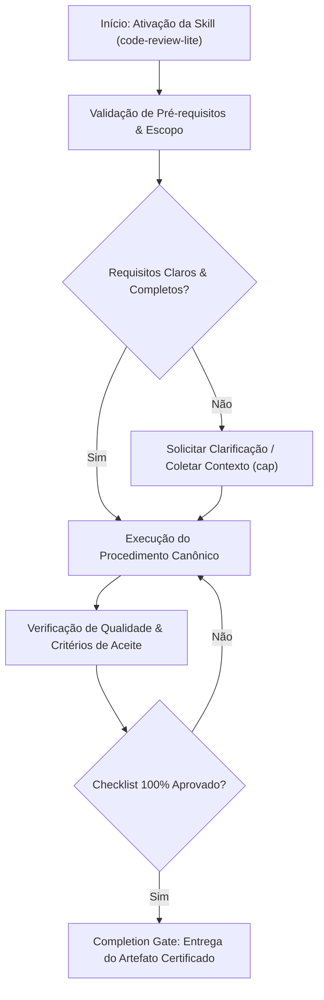

# Code Review Lite (Unified Alias)

## When to Use

### Use when:
- Conducting fast, lightweight peer reviews on PRs with small diffs (<200 lines)
- Checking for obvious bugs, regression risks, and naming inconsistencies
- Rapid sanity checks before deploying patch releases or hotfixes

### Do not use when:
- Major architectural changes or security-critical core domain refactorings (use `code-review`)

## Anti-patterns

### 🔴 Critical
- **Rubber-Stamping Diffs:** Approving PRs without reading the changed files or verifying test output.
- **Ignoring Security in Small Diffs:** Overlooking SQL injection, XSS, or leaked credentials because the diff is short.

### 🟡 Medium
- **Nitpicking Style Over Substance:** Prioritizing minor cosmetic indentation over logic errors.

## Completion Gate & Verification
Before concluding code review:
- [ ] Logic correctness and edge cases verified
- [ ] No hardcoded secrets or unvalidated inputs
- [ ] Regression test included for any bug fix

> 💡 **Architecture Note (ADR-024):** This skill operates as a canonical, rapid alias of the consolidated `code-review` engine.

## Execução Rápida (30-90 segundos)

When receiving requests for iterative review, pre-commit inspection, or rapid code sanity checks:
1. Activate the `code-review` engine with the directive `mode: lite`.
2. Analise o delta de diff recente (`git diff`).
3. Avalie regressões lógicas, segurança imediata (OWASP Top 10) e cobertura de testes.
4. Retorne feedback direto e conciso sem o overhead do protocolo multi-agente.

## Mission

Catch the mistakes that actually matter during day-to-day development while preserving momentum.

# Review Philosophy

Prioritize detection of:

1. Broken behavior
2. Architectural drift
3. Security regressions
4. Missing validation
5. Technical debt explosions

Ignore:

* cosmetic style issues
* micro optimizations
* theoretical edge cases
* premature abstractions

---

# Review Scope

Review only:

* modified files
* directly affected modules
* changed interfaces
* modified dependencies

Never review:

* entire repository
* unrelated modules
* historical commits

---

# Phase 1 — Context Loading

Collect:

* changed files
* current task
* ADR references
* TODO references

Determine:

* intended behavior
* expected output
* architectural constraints

If requirements are unclear:

```text
ASK_FOR_CONTEXT
```

---

# Phase 2 — Fast Review

Evaluate only five dimensions.

## 1. Plan Alignment

Questions:

* Does implementation match requirements?
* Was scope respected?
* Was unnecessary functionality introduced?

---

## 2. Obvious Bugs

Look for:

* null references
* missing imports
* broken conditions
* invalid assumptions
* missing returns
* race conditions
* unhandled exceptions

---

## 3. Security Regression

Look for:

* exposed secrets
* unsafe input handling
* missing authorization checks
* command injection
* path traversal
* unsafe deserialization

Do not perform full security audit.

---

## 4. Architecture Drift

Look for:

* duplicated logic
* broken abstractions
* circular dependencies
* leaking responsibilities
* violation of ADRs

---

## 5. Testing

Verify:

* existing tests still make sense
* new behavior is covered
* obvious missing tests

---

# Review Modes

## SMALL_CHANGE

Criteria:

* less than 5 files
* less than 300 lines

Focus:

* bugs
* regressions

---

## NORMAL_CHANGE

Criteria:

* 5-20 files
* less than 1500 lines

Focus:

* architecture
* tests
* security regressions

---

## LARGE_CHANGE

Criteria:

* more than 20 files
* more than 1500 lines

Action:

```text
RECOMMEND_FULL_REVIEW
```

---

# Output Format

## APPROVED

No blocking issues found.

---

## APPROVED_WITH_WARNINGS

Example:

* missing test
* minor duplication
* documentation lag

---

## REQUIRES_FIXES

Blocking examples:

* broken logic
* security issue
* ADR violation
* regression risk

---

# Escalation Rules

Automatically recommend full review if:

* authentication changed
* payment flow changed
* infrastructure changed
* public API changed
* database schema changed
* dependency lockfile changed

Escalation target:

```text
code-review-v4
```

---

# Anti-Patterns

Reject:

* massive god functions
* hidden side effects
* copy-paste programming
* bypassing architecture
* dead code accumulation

---

# Runtime Limits

| Metric         | Limit      |
| -------------- | ---------- |
| Files          | 20         |
| Changed Lines  | 1500       |
| Execution Time | 90 seconds |

---

# Final Rule

If confidence drops below:

```text
70%
```

Return:

```text
ESCALATE_TO_FULL_REVIEW
```

---

# Iron Law

```text
Move fast.
Do not move blindly.
```


## Decision Workflow


```mermaid
graph TD
    A["Início: Ativação da Skill (code-review-lite)"] --> B["Validação de Pré-requisitos & Escopo"]
    B --> C{"Requisitos Claros & Completos?"}
    C -->|Não| D["Solicitar Clarificação / Coletar Contexto (cap)"]
    C -->|Sim| E["Execução do Procedimento Canônico"]
    D --> E
    E --> F["Verificação de Qualidade & Critérios de Aceite"]
    F --> G{"Checklist 100% Aprovado?"}
    G -->|Não| E
    G -->|Sim| H["Completion Gate: Entrega do Artefato Certificado"]
```


## Anti-Patterns & Operational Guardrails

| Anti-Pattern | Severidade | Impacto Negativo | Mitigação Canônica |
|:---|:---:|:---|:---|
| **Premature Execution Without Context** | 🔴 Critical | Context hallucination and destructive refactoring | Activate `cap` to acquire minimal evidence before editing. |
| **Omission of Validation Checklists** | 🟡 Medium | Delivering artifacts with syntax inconsistencies | Rigorously execute the checklist step-by-step before handoff. |
| **Falta de Documentação de Decisões** | 🟢 Low | Perda de rastreabilidade técnica e drift arquitetural | Registrar trade-offs relevantes via skill `adr-generator`. |


## Edge Cases & Failure Modes

- **Restricted / Read-Only Environment:** If the filesystem or sandbox is write-locked, report the constraint immediately with evidence and generate changes as a markdown diff patch.
- **Specification Conflict:** If contradictions emerge between user intent and the SSOT (`AGENTS.md`), halt and present trade-off options.
- **Context Exhaustion / Timeout:** For massive tasks, decompose into atomic sub-batches utilizing `subagent-driven-development`.


## Domain SOTA & Industry Engineering Standards

- **Triage Paradigms:** Fast-Path Pull Request Triage, Lightweight Linting, and Micro-Diff Reviews.
- **Scope Containment:** High-velocity verification for small, low-risk patches ($N_{\text{lines}} \le 200$).
- **Automated Pre-Checks:** CI gate green verification before starting human review.
- **Fast Turnaround:** SLA target for review turnaround $\le 4$ hours.

### Fast-Path Review Criteria:
A Pull Request qualifies for Lite Review if:

$$N_{\text{lines}} \le 200 \quad \text{and} \quad \text{FilesModified} \le 5 \quad \text{and} \quad \text{BreakingChanges} = \text{False}$$

### Exhaustive Heuristic Decision Rules:
- **Rule of Thumb 1 (Zero-Trust Architectural Boundaries):** Treat all external inputs, third-party payloads, and cross-module boundaries with strict zero-trust schema validation.
- **Rule of Thumb 2 (Fail-Fast & Deterministic Errors):** Reject invalid states immediately with typed, actionable error contracts rather than cascading silent failures.
- **Rule of Thumb 3 (Idempotency & AST Preservation):** State mutations and code transformations must maintain semantic idempotency across repeated executions.
- **Rule of Thumb 4 (Benchmark & Telemetry Alignment):** Measure critical execution latency ($P_{95}$) and memory overhead with structured telemetry and baseline benchmarks.
- **Rule of Thumb 5 (Event-Driven & Circuit Breaker Decoupling):** Isolate asynchronous operations behind circuit breakers and resilient retry mechanisms to prevent cascading failure.
- **Rule of Thumb 6 (Contract-First DDD Modeling):** Define clear domain aggregates, value objects, and typed interface contracts before implementing concrete logic.
- **Rule of Thumb 7 (RAG & Semantic Retrieval Precision):** Optimize context retrieval with hybrid lexical-vector search and reciprocal rank fusion to eliminate hallucinated routing.
- **Rule of Thumb 8 (OWASP & Supply Chain Verification):** Verify dependencies and data flows against OWASP Top 10 and SLSA Level 3 supply chain security standards.
- **Rule of Thumb 9 (Verification Gate Invariant):** Never declare completion without automated test execution evidence and zero compiler/linter warnings.
## Operational Verification Checklist

- [ ] All prerequisites and target files inspected before modification.
- [ ] Procedure strictly adheres to specialization rules and best practices.
- [ ] Security, typing, and architectural style guidelines preserved.
- [ ] Unit tests or validation commands executed successfully.
- [ ] Final deliverable verified against the completion gate.

