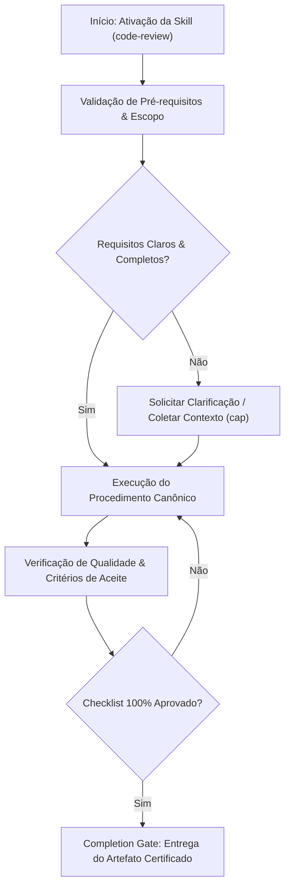

# Unified Code Review Engine (v5.0.0)

## When to Use

### Use when:
- Conducting comprehensive code reviews on Pull Requests or feature branches
- Auditing code changes for security, performance, architecture, and correctness
- Providing structured feedback with severity classification (P1/P2/P3)

### Do not use when:
- Triage of micro-diffs under 50 lines (use `code-review-lite` instead)
- Automated linting that can be handled by standard CI linters (ESLint/Prettier)

This unified engine operates in two interchangeable modes of intensity:


```
                                  UNIFIED CODE REVIEW ENGINE
                                                │
                       ┌────────────────────────┴────────────────────────┐
                       ▼                                                 ▼
             [ MODE: LITE (Default) ]                           [ MODE: FULL (Audit) ]
        - Fast Feedback (30-90s)                        - Multi-Agent Pipeline
        - Logical Regression Checks                 - SBOM and Supply-Chain Security
        - Immediate Security Sanity Checks              - Consensus Voting (Council)
        - Vibe-coding and Iterative PRs                  - Audit Trail and Immutability
```


## Mode Selection

| Mode | Typical Triggers | Average Time | Scope of Verification |
|---|---|:---:|---|
| **`mode: lite`** *(Default)* | "review this diff", "fast code review", "check if I broke something", iterative commits, vibe-coding. | ~30-90s | Logical regressions, immediate security (OWASP Top 10), linting, testing, and alignment with the plan. |
| **`mode: full`** | "formal architecture review", "critical pre-merge", "release candidate", multi-agent audit. | ~3-10 min | Formal verification of SBOM, supply-chain security, multi-agent council deliberation, consensus, and audit trail. |

---

# Runtime Principles

1. Zero Trust
2. Least Privilege
3. Defense in Depth
4. Immutable Audit Trail
5. Human Override
6. Multi-Agent Consensus (in Full Mode)
7. No Raw Untrusted Context
8. Fail Closed

---

## Operational Flow: Lite Mode (Fast Guardrail)

When executed in `mode: lite`:
1. **Delta Analysis:** Inspect only recent `git diff` modifications.
2. **Sanity Check:** Verify if implicit assumptions were broken and if automated tests cover the change.
3. **Security Sanity:** Verify SQL injection, hardcoded credentials, XSS, and input validation.
4. **Rapid Verdict:** Return immediately with a list of improvements and approval/blocking in direct format.

---
## 操作流程：全模式（多代理协议）## Generate SBOM## Dependency Security Scanning
## Approved Tool Verification

Every executable dependency MUST satisfy:
- approved version
- cryptographic hash verification
- signature validation
- approved trust level

Failure result:


```text
BLOCK_EXECUTION
```


---

# Phase 1 — Input Sanitization
## Cél## Security Gateway Pipeline
## Forbidden Inputs

Never expose directly to reviewer agents:
- raw git diff
- shell output
- stack traces
- environment variables
- secrets
- credentials
- configuration files
## 潛在的脆弱性檢測- 概念語法樹 (AST)
- 意義圖
- 代碼屬性圖
- 依賴關係圖## Zakazany artefakt## Semantic Change Schema
## Reviewer Swarm

### Architecture Reviewer

Responsibilities:
- complexity
- maintainability
- coupling
- modularity

### Security Reviewer

Responsibilities:
- OWASP Top 10
- secrets
- injection
- authentication
- authorization
- supply-chain risk

### Quality Reviewer

Responsibilities:
- readability
- duplication
- testing
- conventions

### Performance Reviewer

Responsibilities:
- complexity analysis
- scalability
- memory consumption
- hot paths

---

# Agent Runtime Contract

Example:


```yaml
agent_id: security-reviewer

timeout_seconds: 300
max_tokens: 25000
retries: 2

resources:
  cpu_limit: 1
  memory_limit_mb: 1024

permissions:
  filesystem:
    mode: readonly

  network:
    enabled: false

  shell:
    whitelist:
      - pip-audit
      - pytest
```


---

# Phase 4 — Consensus Evaluation
| Reviewer | Weight |
| ------------ | ------ |
| Security | 0.35 |
| Architecture | 0.25 |
| Quality | 0.20 |
| Performance | 0.20 |
## Decision Rules

Automatic rejection:
- critical vulnerability
- secret exposure
- authentication failure
- undefined behavior
- missing audit

Automatic escalation:
- consensus score < 0.75
- conflicting findings
- reviewer timeout

Automatic approval:
- consensus score ≥ 0.90
- no blocking findings

---

# Phase 5 — Immutable Audit

## Audit Artifact


```json
{
  "review_id": "uuid",
  "trace_id": "uuid",
  "timestamp": "iso8601",
  "semantic_diff_hash": "sha256",
  "reviewers": [],
  "votes": [],
  "consensus_score": 0.0,
  "decision": "approve",
  "signature": "ed25519"
}
```


## Protection

Encryption:


```text
AES256-GCM
```


Integrity:


```text
SHA256
Ed25519
```


Access:


```text
RBAC_REQUIRED
```


---

# Failure Matrix

| Failure                   | Action              |
| ------------------------- | ------------------- |
| Dependency scan timeout   | Block merge         |
| Semantic parser failure   | Escalate            |
| Reviewer timeout          | Retry then escalate |
| Consensus failure         | Escalate            |
| Audit persistence failure | Block merge         |

---

# Governance Lifecycle

## Versioning
- MAJOR → Runtime changes
- MINOR → New reviewers or capabilities
- PATCH → Policy updates
Każda zmiana wymaga:
## Deprecation Policy
- minimum support period: 24 months
- migration window: 12 months

---

# Validation Suite

Mandatory scenarios:
- prompt injection
- dependency poisoning
- tool compromise
- reviewer compromise
- secret leakage
- consensus split
- audit corruption

---

# Iron Law


```text
NO MERGE WITHOUT REVIEW
NO REVIEW WITHOUT CONSENSUS
NO CONSENSUS WITHOUT AUDIT
NO AUDIT WITHOUT TRACEABILITY
NO EXCEPTIONS
```


---

# Final Rule

If uncertainty exists:


```text
FAIL_CLOSED
BLOCK_MERGE
ESCALATE
```


## Decision Workflow





| Anti-Pattern | Severity | Negative Impact | Canonical Mitigation |
| :--- | :---: | :--- | :--- |
| **Early Execution without Context** | 🔴 Critical | Context hallucination and destructive refactoring | Enable the `cap` skill to acquire minimal evidence before editing. |
| **Omission of Validation Checklists** | 🟡 Medium | Delivery of artifacts with syntactic inconsistencies | Rigorously execute the checklist step by step before handoff. |
| **Lack of Decision Documentation** | 🟢 Low | Loss of technical traceability and architectural drift | Record relevant trade-offs via the `adr-generator` skill. |- **Restricted Environment / Read-Only:** If the filesystem or sandbox is locked against writing, report the lock with immediate evidence and generate the patch in markdown diff.
## Domain SOTA & Industry Engineering Standards

- **Code Review Frameworks:** Google Engineering Practices (eng-practices), Conventional Comments, and Chromium Review Guidelines.
- **Review Taxonomy:** 3-Tier Severity Badges (`P1: Blocker`, `P2: Major`, `P3: Polish`).
- **AST Inspection:** Automated AST linting, architectural layer violation checks, and security vulnerability scanning.
- **Psychological Safety & Tone:** Objective, blame-free feedback focusing on code behavior and architectural alignment.

### 3-Tier Severity Taxonomy Matrix:

| Severity Badge | Definition | Action Required | Blocking? |
|:---|:---|:---|:---:|
| **`🔴 P1: BLOCKER`** | Correctness bug, security vulnerability, data corruption risk, breaking API change. | Must fix before merge. | **YES** |
| **`🟡 P2: MAJOR`** | Code smell, architectural violation, missing tests, performance degradation. | Must resolve or record as tech debt. | **YES** |
| **`🟢 P3: POLISH`** | Naming suggestion, minor style polish, non-blocking optimization. | Author's discretion. | **NO** |

### Exhaustive Heuristic Decision Rules:
- **Rule of Thumb 1 (Zero-Trust Architectural Boundaries):** Treat all external inputs, third-party payloads, and cross-module boundaries with strict zero-trust schema validation.
- **Rule of Thumb 2 (Fail-Fast & Deterministic Errors):** Reject invalid states immediately with typed, actionable error contracts rather than cascading silent failures.
- **Rule of Thumb 3 (Idempotency & AST Preservation):** State mutations and code transformations must maintain semantic idempotency across repeated executions.
- **Rule of Thumb 4 (Benchmark & Telemetry Alignment):** Measure critical execution latency ($P_{95}$) and memory overhead with structured telemetry and baseline benchmarks.
- **Rule of Thumb 5 (Event-Driven & Circuit Breaker Decoupling):** Isolate asynchronous operations behind circuit breakers and resilient retry mechanisms to prevent cascading failure.
- **Rule of Thumb 6 (Contract-First DDD Modeling):** Define clear domain aggregates, value objects, and typed interface contracts before implementing concrete logic.
- **Rule of Thumb 7 (RAG & Semantic Retrieval Precision):** Optimize context retrieval with hybrid lexical-vector search and reciprocal rank fusion to eliminate hallucinated routing.
- **Rule of Thumb 8 (OWASP & Supply Chain Verification):** Verify dependencies and data flows against OWASP Top 10 and SLSA Level 3 supply chain security standards.
- **Rule of Thumb 9 (Verification Gate Invariant):** Never declare completion without automated test execution evidence and zero compiler/linter warnings.
## Edge Cases & Failure Modes

- **Edge Case 1 (Massive PR Review Degradation):** Flag pull requests exceeding 400 lines of diff for modular decomposition.
- **Edge Case 2 (Nitpicking vs Architectural Defects):** Prioritize security, performance, and API contract integrity over purely subjective stylistic preferences.
- **Edge Case 3 (Silent Breaking Changes):** Detect unannounced database migration locks or backward-incompatible REST contract modifications.

## Operational Verification Checklist

- [ ] All prerequisites and target files inspected before modification.
- [ ] Procedure strictly adheres to specialization rules and best practices.
- [ ] Security, typing, and architectural style guidelines preserved.
- [ ] Unit tests or validation commands executed successfully.
- [ ] Final deliverable verified against the completion gate.


## Completion Gate & Verification
Before concluding code review:
- [ ] All P1 Blockers resolved or blocking merge
- [ ] All P2 Major issues either resolved or recorded in Tech Debt Registry
- [ ] Test coverage verified with green CI build