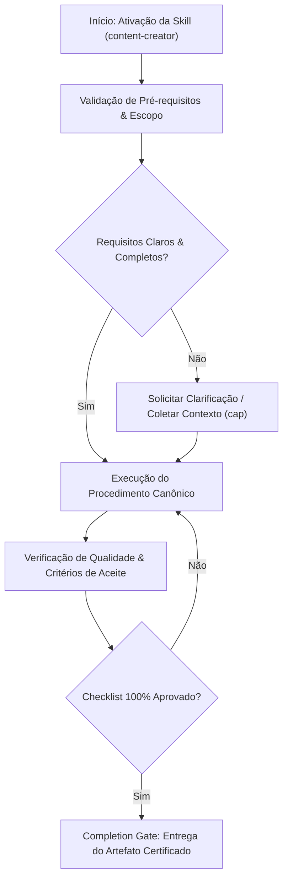

# Content Creator

## When to Use

### Use when:
- Drafting marketing copy, landing page headlines, and social media posts
- Optimizing text for Flesch Reading Ease ($RE \ge 60$) and active voice ($\ge 90\%$)
- Applying AIDA, PAS, or BAB conversion copywriting frameworks

### Do not use when:
- Writing dense academic research papers with formal bibliography citations

## Overview

Create compelling marketing content across channels including social media, email campaigns, landing pages, ad copy, newsletters, and brand messaging. This skill covers brand voice development, audience targeting, copywriting frameworks (AIDA, PAS, BAB), platform-specific optimization, A/B testing copy, content calendars, and conversion-focused writing.

Apply this skill whenever content must persuade, engage, or convert an audience through a specific marketing channel.

## Multi-Phase Process

### Phase 1: Brand and Audience Analysis

1. Define or review the brand voice (tone, personality, values)
2. Identify target audience personas (demographics, psychographics, pain points)
3. Map the customer journey stage for this content
4. Analyze competitor messaging and positioning
5. Establish key differentiators and value propositions

> **STOP — Do NOT create content without a defined brand voice and audience persona.**

### Phase 2: Content Strategy

1. Determine content goal (awareness, engagement, conversion, retention)
2. Select channel(s) and format(s)
3. Identify primary and secondary keywords or themes
4. Define call-to-action (CTA) for each piece
5. Plan content cadence and publishing schedule

> **STOP — Do NOT begin drafting without a clear goal and CTA for each piece.**

### Phase 3: Creation

1. Draft using appropriate copywriting framework (see decision table)
2. Write multiple headline/hook variations (minimum 3)
3. Adapt tone and length for each platform
4. Create supporting visual direction or copy for images
5. Include relevant hashtags, mentions, or links

> **STOP — Do NOT publish without reviewing against brand voice checklist and platform guidelines.**

### Phase 4: Optimization

1. A/B test headlines, CTAs, and opening lines
2. Review for brand voice consistency
3. Check readability (aim for grade 6-8 for general audiences)
4. Verify compliance (disclosures, disclaimers, regulations)
5. Schedule or publish with tracking parameters (UTMs)

## Copywriting Framework Decision Table

| Situation | Framework | Why |
|---|---|---|
| Product launch, new feature announcement | AIDA | Builds from attention to action progressively |
| Audience aware of pain, needs motivation | PAS | Amplifies urgency before presenting solution |
| Transformation story, before/after | BAB | Visualizes the change your product enables |
| Testimonial-driven, social proof heavy | 4Ps | Leverages proof as primary persuasion lever |
| Short-form (tweets, ads under 100 chars) | Hook + CTA | No room for frameworks -- lead with value |
| Email nurture sequence | PAS or BAB | Builds relationship over multiple touches |
| Landing page hero section | AIDA | Maps directly to hero, benefits, proof, CTA sections |

## Copywriting Frameworks

### AIDA (Attention, Interest, Desire, Action)
```
Attention: Hook that stops the scroll
Interest:  Why this matters to the reader
Desire:    Paint the transformation/benefit
Action:    Clear, specific CTA
```

**Example:**
```
Tired of spreadsheets that crash with 10,000 rows?        [Attention]
Our engine handles 10 million rows in under a second.     [Interest]
Imagine finishing your quarterly report in minutes,        [Desire]
not hours.
Start your free trial — no credit card required.           [Action]
```

### PAS (Problem, Agitate, Solution)
```
Problem:   Name the pain point directly
Agitate:   Amplify the consequences of inaction
Solution:  Present your offering as the resolution
```

**Example:**
```
Your team wastes 6 hours/week on manual data entry.       [Problem]
That's 312 hours a year — enough to launch two new        [Agitate]
products. What if you could get that time back?
AutoFlow eliminates manual entry with AI-powered           [Solution]
data capture. See it in action →
```

### BAB (Before, After, Bridge)
```
Before: Current painful state
After:  Desired future state
Bridge: How to get there (your product/service)
```

### 4Ps (Promise, Picture, Proof, Push)
```
Promise: Bold claim or benefit
Picture: Help reader visualize the outcome
Proof:   Social proof, data, testimonials
Push:    Urgency or clear next step
```

## Platform-Specific Guidelines

### Social Media Character Limits and Best Practices

| Platform | Ideal Length | Best Practices |
|---|---|---|
| Twitter/X | 70-100 chars (engagement sweet spot) | Questions, threads, polls; 1-2 hashtags |
| LinkedIn | 1300 chars (before "see more") | Professional tone, personal stories, carousels; 3-5 hashtags |
| Instagram caption | 125 chars (before truncation) | Visual-first, emoji ok, 20-30 hashtags in comment |
| Facebook | 40-80 chars (highest engagement) | Questions, storytelling, video preferred |
| TikTok caption | 150 chars | Trending sounds, hooks in first 3 seconds |
| YouTube title | 60 chars max | Keyword-front, emotional trigger, number |
| Email subject | 30-50 chars | Personalization, curiosity gap, urgency |
| Blog headline | 55-70 chars | How-to, numbered lists, power words |

### Post Structure by Platform
```
# LinkedIn
[Hook line — bold statement or question]

[2-3 short paragraphs with line breaks]

[Insight or lesson]

[CTA — question to drive comments]

#relevant #hashtags

---

# Twitter/X Thread
1/ [Strong hook with the main insight]

2/ [Context or background]

3/ [Key point with evidence]

4/ [Practical takeaway]

5/ [CTA — follow, share, or reply]

---

# Instagram
[First line = hook (shows in feed)]

Full caption with story, value, or education.

CTA: Save this post / Tag someone who needs this

.
.
.
#hashtags #in #comment #or #after #line #breaks
```

## Brand Voice Framework

### Voice Attributes Matrix

| Attribute | We Are | We Are Not | Example |
|---|---|---|---|
| Tone | Confident | Arrogant | "Here's what works" not "We're the best" |
| Language | Clear | Simplistic | Explain complex topics simply |
| Humor | Witty | Sarcastic | Light wordplay, never at reader's expense |
| Formality | Professional | Stuffy | First person, contractions ok |
| Emotion | Empathetic | Manipulative | Acknowledge pain, don't exploit it |

### Voice Consistency Checklist
- Would a real person say this out loud?
- Does it sound like the same person across all channels?
- Is the vocabulary level appropriate for the audience?
- Are we talking WITH the reader, not AT them?
- Does the tone match the content gravity (don't be playful about serious topics)?

## Headline Formulas

### Proven Patterns
```
How to [Achieve Desired Outcome] Without [Common Objection]
[Number] [Adjective] Ways to [Achieve Goal] in [Timeframe]
Why [Common Belief] Is Wrong (And What to Do Instead)
The [Adjective] Guide to [Topic] for [Audience]
[Number] Mistakes [Audience] Make with [Topic] (And How to Fix Them)
What [Authority/Company] Taught Me About [Topic]
[Topic]: [Subtitle That Adds Specificity]
Stop [Bad Practice]. Start [Good Practice]. Here's How.
```

### Headline Testing Criteria

| Factor | Weight | Evaluation |
|---|---|---|
| Clarity | 30% | Reader knows what they'll get |
| Specificity | 25% | Numbers, outcomes, timeframes |
| Emotional trigger | 20% | Curiosity, fear, aspiration |
| Relevance | 15% | Matches audience pain points |
| Uniqueness | 10% | Stands out from competitors |

## Email Copy Patterns

### Welcome Email
```
Subject: Welcome to [Brand] — here's your first win

Hi [Name],

You just made a great decision.

Here's one thing you can do right now to get the most
out of [Product]:

[Single, specific action with link]

That's it. One step. Takes 2 minutes.

If you need anything, just reply to this email — a real
human will answer.

[Signature]
```

### Promotional Email
```
Subject: [Benefit] — [Time Limitation]

[Name], quick question:

[Problem statement as a question?]

We built [Product/Feature] to solve exactly that.

Here's what [Customer/Number] are saying:
"[Testimonial]"

[CTA Button: Get Started / Try Free / See How]

[Urgency element if genuine]
```

## Content Calendar Template

| Day | Platform | Content Type | Topic/Theme | CTA | Status |
|---|---|---|---|---|---|
| Mon | LinkedIn | Thought leadership | Industry trend | Comment | Draft |
| Tue | Twitter | Thread | How-to tip | Follow | Scheduled |
| Wed | Blog | Long-form article | Deep dive | Subscribe | Writing |
| Thu | Instagram | Carousel | Quick tips | Save | Design |
| Fri | Email | Newsletter | Weekly roundup | Read more | Template |

## Anti-Patterns / Common Mistakes

| Anti-Pattern | Why It Fails | What To Do Instead |
|---|---|---|
| Writing for the brand, not the audience | Self-serving content gets ignored | Lead with audience pain points and desires |
| Same copy across all platforms | Ignores platform culture and format | Adapt tone, length, and structure per channel |
| Burying the CTA in long copy | Reader never reaches the ask | Put CTA early or make it impossible to miss |
| Leading with features, not benefits | "What it does" doesn't motivate action | Translate features into outcomes |
| Corporate jargon ("leverage", "synergy") | Feels inauthentic and impersonal | Use plain language a friend would use |
| No clear goal per content piece | Impossible to measure success | Define one measurable goal before drafting |
| Clickbait headlines | Erodes trust when content doesn't deliver | Promise only what the content provides |
| No A/B testing | Missing optimization opportunities | Test 2-3 headline and CTA variations |
| Missing UTM tracking parameters | Cannot attribute traffic to content | Add UTMs to every outbound link |
| Publishing without compliance check | Legal and regulatory risk | Review disclosures, disclaimers, and regulations |

## Anti-Rationalization Guards

- Do NOT skip brand voice definition because "we know our voice" -- document it in the matrix.
- Do NOT publish content without a defined CTA, even for "awareness" posts.
- Do NOT reuse the same copy across platforms without adaptation.
- Do NOT write headlines without generating at least 3 variations to compare.
- Do NOT skip the readability check -- grade 6-8 is the target for general audiences.

## Integration Points

| Skill | How It Connects |
|---|---|
| `seo-optimizer` | Keywords and meta tag strategy inform content headlines and structure |
| `content-research-writer` | Research findings provide evidence for marketing claims |
| `email-composer` | Brand voice and templates feed directly into email campaigns |
| `llm-as-judge` | Evaluate content quality against brand voice rubric |
| `frontend-ui-design` | Landing page copy must align with visual hierarchy and CTA placement |
| `senior-prompt-engineer` | AI-generated copy benefits from structured prompt patterns |

## Skill Type

**FLEXIBLE** — Adapt voice, format, and framework to the brand guidelines, target audience, and distribution channel. The copywriting frameworks and platform guidelines are recommendations; brand voice consistency is the non-negotiable.


## Decision Workflow




## Anti-Patterns & Operational Guardrails

| Anti-Pattern | Severidade | Impacto Negativo | Mitigação Canônica |
|:---|:---:|:---|:---|
| **Execução Prematura sem Contexto** | 🔴 Critical | Alucinação de contexto e refatoração destrutiva | Ativar a skill `cap` para adquirir evidências mínimas antes de editar. |
| **Omissão de Checklists de Validação** | 🟡 Medium | Entrega de artefatos com inconsistências sintáticas | Executar rigorosamente o checklist passo a passo antes do handoff. |
| **Falta de Documentação de Decisões** | 🟢 Low | Perda de rastreabilidade técnica e drift arquitetural | Registrar trade-offs relevantes via skill `adr-generator`. |


## Edge Cases & Failure Modes

- **Ambiente Restrito / Read-Only:** Se o filesystem ou sandbox estiver bloqueado contra escrita, reportar o bloqueio com evidência imediata e gerar o patch em markdown diff.
- **Conflito de Especificação:** Caso encontre contradições entre a intenção do usuário e o SSOT (`AGENTS.md`), interromper e sinalizar as opções com trade-offs.
- **Timeout ou Exaustão de Contexto:** Em tarefas volumosas, decompor em sub-lotes atômicos utilizando a skill `subagent-driven-development`.


## Domain SOTA & Industry Engineering Standards

- **Readability & Ergonomics:** Flesch Reading Ease ($RE$), Flesch-Kincaid Grade Level ($FKGL$), and Gunning Fog Index.
- **Copywriting Frameworks:** AIDA (Attention, Interest, Desire, Action), PAS (Problem, Agitation, Solution), and BAB (Before, After, Bridge).
- **Voice & Tone Consistency:** Formal Brand Voice Guidelines, active voice ratio ($\ge 90\%$), and conversational cadence.
- **Conversion Optimization:** Action-oriented CTAs, scannable subheadings, and inverted pyramid journalism hierarchy.

### Flesch Reading Ease Formula:

$$RE = 206.835 - (1.015 	imes 	ext{ASL}) - (84.6 	imes 	ext{ASW}) \ge 60.0$$

Where $	ext{ASL}$ is Average Sentence Length and $	ext{ASW}$ is Average Syllables per Word.

### Exhaustive Heuristic Decision Rules:
1. **Rule of Thumb 1 (Active Voice Mandate):** At least $90\%$ of sentences must use active voice ("The team deployed the release" vs "The release was deployed by the team").
2. **Rule of Thumb 2 (Scannable Structure):** No paragraph should exceed 4 lines; use bullet points and bold leading terms for high readability.
3. **Rule of Thumb 3 (Single Clear CTA):** Marketing and business content must drive toward a single primary call to action.
4. **Rule of Thumb 4 (Kill Fluff Words):** Eliminate redundant adverbs and filler phrases ("very", "really", "in order to", "essentially").

## Operational Verification Checklist

- [ ] Todos os pré-requisitos e arquivos-alvo foram inspecionados antes da modificação.
- [ ] O procedimento seguiu estritamente as regras e boas práticas da especialização.
- [ ] As diretrizes de segurança, tipagem e estilo foram preservadas.
- [ ] Os testes unitários ou comandos de validação foram executados com sucesso.
- [ ] O artefato final foi inspecionado contra o completion gate.


## Completion Gate & Verification
Before concluding copywriting draft:
- [ ] Readability verified ($RE \ge 60$) with concise paragraphs ($\le 4$ lines)
- [ ] Active voice ratio verified $\ge 90\%$
- [ ] Single clear call-to-action (CTA) included