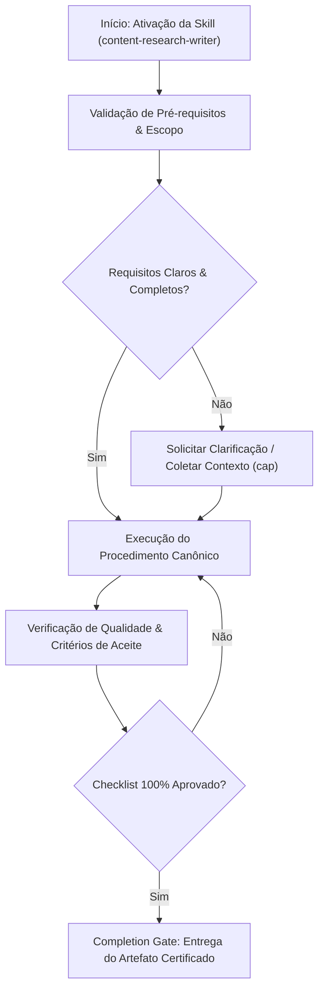

# Content Research Writer

## Overview

Produce well-researched, authoritative long-form content with proper source attribution, structured argumentation, and evidence-based claims. This skill covers research methodology, source evaluation, citation management, outline construction, drafting workflows, fact-checking protocols, and publishing-ready formatting for articles, whitepapers, reports, and educational content.

Apply this skill whenever content must be backed by evidence, cited properly, and structured for credibility with expert audiences.

## Multi-Phase Process

### Phase 1: Research Planning

1. Define the topic scope and target audience
2. Identify key questions the content must answer
3. Determine content type (article, whitepaper, case study, guide)
4. Set word count target and depth level
5. Establish credibility requirements (peer-reviewed, industry reports, primary data)
6. Create a research timeline with milestones

> **STOP — Do NOT begin source discovery until the research plan is documented and scope is agreed upon.**

### Phase 2: Source Discovery and Evaluation

1. Search academic databases (Google Scholar, PubMed, JSTOR, arXiv)
2. Identify industry reports and authoritative publications
3. Find primary sources (official documentation, datasets, specifications)
4. Evaluate source credibility using the CRAAP test (see table below)
5. Organize sources in a reference manager or structured format
6. Extract key findings, statistics, and quotable passages

> **STOP — Do NOT begin outlining until you have sufficient Tier 1-2 sources for every core claim.**

### Phase 3: Outline and Structure

1. Create a thesis statement or central argument
2. Build hierarchical outline with main sections and subsections
3. Map evidence to each section (which sources support which claims)
4. Identify gaps requiring additional research
5. Define transitions between sections for narrative flow
6. Plan visual elements (tables, charts, diagrams, callouts)

> **STOP — Do NOT begin drafting until the outline is reviewed and evidence gaps are filled.**

### Phase 4: Drafting

1. Write section by section following the outline
2. Integrate citations as you write (never retrofit)
3. Balance original analysis with supporting evidence
4. Use topic sentences and clear paragraph structure
5. Include concrete examples, data points, and case studies
6. Write introduction last (after body is complete)

> **STOP — Do NOT move to review until all sections are drafted and all citations are in place.**

### Phase 5: Review and Fact-Check

1. Verify every factual claim against its source
2. Check all statistics for accuracy and context
3. Ensure citations are complete and correctly formatted
4. Review for logical consistency and argument strength
5. Proofread for clarity, grammar, and style
6. Have subject matter expert review if possible

## Content Type Decision Table

| Content Type | Word Count | Research Depth | Audience | Citation Style |
|---|---|---|---|---|
| Blog article | 1,500-3,000 | Tier 2-3 sources | General | Inline links |
| Long-form article | 3,000-5,000 | Tier 1-3 sources | Informed readers | Parenthetical (APA) |
| Whitepaper | 3,000-8,000 | Tier 1-2 mandatory | Decision-makers | Footnotes or numbered |
| Case study | 1,000-2,500 | Primary + Tier 2 | Buyers | Inline attribution |
| Technical report | 5,000-15,000 | Tier 1 mandatory | Experts | IEEE or APA |
| Educational guide | 2,000-6,000 | Tier 1-3 mixed | Learners | Parenthetical |

## Source Evaluation Framework (CRAAP Test)

| Criterion | Questions to Ask | Red Flags |
|---|---|---|
| **Currency** | When was it published? Updated? | > 5 years old for fast-moving topics |
| **Relevance** | Does it directly address your topic? | Tangential connection, different context |
| **Authority** | Who is the author? What are their credentials? | No author, no institutional affiliation |
| **Accuracy** | Is it supported by evidence? Peer-reviewed? | No citations, unverifiable claims |
| **Purpose** | Why does this exist? Inform, sell, persuade? | Strong commercial bias, advocacy without disclosure |

### Source Tier System

| Tier | Source Type | Credibility | Use For |
|---|---|---|---|
| Tier 1 | Peer-reviewed journals, official standards | Highest | Core claims, statistics |
| Tier 2 | Industry reports (Gartner, McKinsey), textbooks | High | Market data, frameworks |
| Tier 3 | Reputable news outlets, official documentation | Good | Context, current events |
| Tier 4 | Expert blogs, conference talks, interviews | Moderate | Perspectives, opinions |
| Tier 5 | Social media, forums, Wikipedia | Low | Discovery only, never cite directly |

## Citation Formats

### Inline Citation Styles
```markdown
# Parenthetical (APA-style)
Research shows that 73% of enterprises have adopted cloud-native architectures
(Smith & Johnson, 2025).

# Narrative
According to Smith and Johnson (2025), 73% of enterprises have adopted
cloud-native architectures.

# Footnote-style (Chicago)
Research shows significant cloud adoption.[^1]

[^1]: Smith, J., & Johnson, R. (2025). Cloud adoption trends.
*Journal of Cloud Computing*, 12(3), 45-62.

# Numbered (IEEE-style)
Research shows significant cloud adoption [1].

## References
[1] J. Smith and R. Johnson, "Cloud adoption trends," *J. Cloud Computing*,
    vol. 12, no. 3, pp. 45-62, 2025.
```

### Reference Format Templates
```markdown
# Journal Article
Author, A. B., & Author, C. D. (Year). Title of article. *Journal Name*,
Volume(Issue), Pages. https://doi.org/xxxxx

# Book
Author, A. B. (Year). *Title of book* (Edition). Publisher.

# Website
Author or Organization. (Year, Month Day). Title of page. Site Name.
https://www.example.com/page

# Report
Organization. (Year). *Title of report* (Report No. XXX).
https://www.example.com/report.pdf
```

## Content Structure Templates

### Long-Form Article (2000-5000 words)
```
1. Hook / Opening Anecdote (100-200 words)
2. Context and Problem Statement (200-300 words)
3. Thesis / Key Insight (50-100 words)
4. Section 1: Background (400-600 words)
   - Historical context
   - Current state
   - Key definitions
5. Section 2: Core Analysis (600-1000 words)
   - Main argument with evidence
   - Data and statistics
   - Expert perspectives
6. Section 3: Implications (400-600 words)
   - Practical applications
   - Case studies
   - Future outlook
7. Section 4: Counterarguments (200-400 words)
   - Acknowledge limitations
   - Address objections
8. Conclusion (200-300 words)
   - Synthesize key findings
   - Call to action or forward-looking statement
9. References
```

### Whitepaper (3000-8000 words)
```
1. Executive Summary (300-500 words)
2. Introduction and Problem Statement (500-800 words)
3. Methodology (300-500 words)
4. Findings / Analysis (1500-3000 words)
   - Section with data visualization
   - Comparative analysis
   - Case studies
5. Recommendations (500-1000 words)
6. Conclusion (300-500 words)
7. Appendices
8. References
```

### Case Study (1000-2500 words)
```
1. Executive Summary (100-200 words)
2. Challenge / Problem (200-400 words)
3. Approach / Solution (300-600 words)
4. Implementation (300-500 words)
5. Results and Metrics (200-400 words)
6. Lessons Learned (200-300 words)
7. About [Company/Subject]
```

## Writing Quality Checklist

### Paragraph Level
- Each paragraph has a clear topic sentence
- Paragraphs are 3-6 sentences (avoid walls of text)
- Transitions connect paragraphs logically
- Evidence follows claims immediately

### Sentence Level
- Vary sentence length (mix short and long)
- Active voice preferred over passive
- Avoid jargon without definition
- Concrete language over abstract

### Document Level
- Introduction establishes the "so what" clearly
- Each section advances the central argument
- No unsupported claims
- Conclusion adds value (doesn't just repeat)
- Consistent tone and reading level throughout

## Fact-Checking Protocol

### Verification Steps
1. **Primary source check**: Trace every claim back to its original source
2. **Cross-reference**: Verify key facts with at least 2 independent sources
3. **Statistical validation**: Check that numbers are current and in context
4. **Quote accuracy**: Verify exact wording of all direct quotes
5. **Date verification**: Confirm all dates and timelines
6. **Name and title check**: Verify correct spelling and current titles

### Common Fact-Checking Pitfalls

| Pitfall | Example | Prevention |
|---|---|---|
| Outdated statistics | "50% of..." from a 2018 study | Always note publication year, seek recent data |
| Misattributed quotes | Einstein didn't say most "Einstein quotes" | Trace to primary source document |
| Survivorship bias | "All successful companies do X" | Look for counterexamples |
| Correlation as causation | "Countries that eat chocolate win more Nobels" | Distinguish correlation from causation |
| Out-of-context numbers | "Revenue grew 500%" (from $1 to $5) | Always provide absolute numbers and context |

## Research Tools

| Tool | Purpose | Best For |
|---|---|---|
| Google Scholar | Academic paper search | Peer-reviewed research |
| Semantic Scholar | AI-powered paper discovery | Finding related work |
| arXiv | Preprints | Cutting-edge CS/ML/Physics |
| PubMed | Medical/bio research | Health and life sciences |
| Statista | Statistics and market data | Industry data points |
| Wayback Machine | Historical web pages | Verifying past claims |
| Zotero / Mendeley | Reference management | Organizing sources |
| Perplexity | AI-assisted research | Initial discovery |

## Anti-Patterns / Common Mistakes

| Anti-Pattern | Why It Fails | What To Do Instead |
|---|---|---|
| Claims without citations | Undermines credibility entirely | Cite every factual claim inline |
| Single-source assertions | One source can be wrong or biased | Cross-reference with 2+ independent sources |
| Citing secondary when primary exists | Telephone game distorts findings | Trace to and cite the original study |
| Writing introduction first | Leads to misalignment with body | Write body first, introduction last |
| Padding to reach word count | Readers detect filler immediately | Add depth or cut the target |
| Weasel words without specifics | "Some experts say" means nothing | Name the expert, cite the source |
| Retrofitting citations after drafting | Gaps in evidence go unnoticed | Integrate citations during writing |
| Ignoring counterarguments | One-sided work lacks credibility | Address objections explicitly |
| Paraphrasing too closely | Borderline plagiarism even with citation | Summarize in your own analytical voice |
| No conflict-of-interest disclosure | Erodes trust when discovered | Disclose sponsorship or affiliations upfront |

## Anti-Rationalization Guards

- Do NOT skip the CRAAP test because "the source looks reputable" -- evaluate it formally.
- Do NOT use Tier 4-5 sources for core claims, regardless of convenience.
- Do NOT begin drafting without a completed outline with evidence mapped to sections.
- Do NOT publish without running the fact-checking protocol on every statistic and quote.
- Do NOT retrofit citations after writing -- integrate them as you draft.

## Integration Points

| Skill | How It Connects |
|---|---|
| `seo-optimizer` | Research content needs SEO-optimized titles, meta descriptions, and structured data |
| `content-creator` | Research findings feed into marketing copy and social media content |
| `email-composer` | Research summaries inform stakeholder update emails and executive briefings |
| `tech-docs-generator` | Technical research follows similar source evaluation and citation practices |
| `llm-as-judge` | Evaluate research content quality against rubric dimensions |
| `clean-code` | Writing quality checklist parallels clean code principles for prose |

## Skill Type

**FLEXIBLE** — Adapt research depth, citation formality, and structure to the content type and audience. Academic whitepapers demand Tier 1 sources and formal citations; blog posts may use a lighter approach. The fact-checking protocol and source evaluation framework are always recommended.


## Decision Workflow




## Anti-Patterns & Operational Guardrails

| Anti-Pattern | Severidade | Impacto Negativo | Mitigação Canônica |
|:---|:---:|:---|:---|
| **Execução Prematura sem Contexto** | 🔴 Critical | Alucinação de contexto e refatoração destrutiva | Ativar a skill `cap` para adquirir evidências mínimas antes de editar. |
| **Omissão de Checklists de Validação** | 🟡 Medium | Entrega de artefatos com inconsistências sintáticas | Executar rigorosamente o checklist passo a passo antes do handoff. |
| **Falta de Documentação de Decisões** | 🟢 Low | Perda de rastreabilidade técnica e drift arquitetural | Registrar trade-offs relevantes via skill `adr-generator`. |


## Edge Cases & Failure Modes

- **Ambiente Restrito / Read-Only:** Se o filesystem ou sandbox estiver bloqueado contra escrita, reportar o bloqueio com evidência imediata e gerar o patch em markdown diff.
- **Conflito de Especificação:** Caso encontre contradições entre a intenção do usuário e o SSOT (`AGENTS.md`), interromper e sinalizar as opções com trade-offs.
- **Timeout ou Exaustão de Contexto:** Em tarefas volumosas, decompor em sub-lotes atômicos utilizando a skill `subagent-driven-development`.


## Domain SOTA & Industry Engineering Standards

- **Academic Citation Standards:** APA 7th Edition, IEEE Citation Style, and BibTeX structured bibliographies.
- **Source Credibility Evaluation:** CRAAP Test (Currency, Relevance, Authority, Accuracy, Purpose).
- **Evidence-Based Argumentation:** Toulmin Model of Argument (Claim, Data, Warrant, Backing, Counterclaim, Rebuttal).
- **Fact-Checking & Provenance:** Primary source attribution, DOI verification, and hallucination elimination.

### CRAAP Source Evaluation Rubric (Target $\ge 80/100$):
- **Currency:** Published within past 24 months (or seminal foundational paper).
- **Relevance:** Directly addresses the technical research question.
- **Authority:** Peer-reviewed journal, IEEE/ACM conference, or official technical vendor documentation.
- **Accuracy:** Backed by reproducible empirical data and statistical methodology.
- **Purpose:** Informative and objective; free from undisclosed commercial bias.

### Exhaustive Heuristic Decision Rules:
- **Rule of Thumb 1 (Zero-Trust Architectural Boundaries):** Treat all external inputs, third-party payloads, and cross-module boundaries with strict zero-trust schema validation.
- **Rule of Thumb 2 (Fail-Fast & Deterministic Errors):** Reject invalid states immediately with typed, actionable error contracts rather than cascading silent failures.
- **Rule of Thumb 3 (Idempotency & AST Preservation):** State mutations and code transformations must maintain semantic idempotency across repeated executions.
- **Rule of Thumb 4 (Benchmark & Telemetry Alignment):** Measure critical execution latency ($P_{95}$) and memory overhead with structured telemetry and baseline benchmarks.
- **Rule of Thumb 5 (Event-Driven & Circuit Breaker Decoupling):** Isolate asynchronous operations behind circuit breakers and resilient retry mechanisms to prevent cascading failure.
- **Rule of Thumb 6 (Contract-First DDD Modeling):** Define clear domain aggregates, value objects, and typed interface contracts before implementing concrete logic.
- **Rule of Thumb 7 (RAG & Semantic Retrieval Precision):** Optimize context retrieval with hybrid lexical-vector search and reciprocal rank fusion to eliminate hallucinated routing.
- **Rule of Thumb 8 (OWASP & Supply Chain Verification):** Verify dependencies and data flows against OWASP Top 10 and SLSA Level 3 supply chain security standards.
- **Rule of Thumb 9 (Verification Gate Invariant):** Never declare completion without automated test execution evidence and zero compiler/linter warnings.
## Operational Verification Checklist

- [ ] Todos os pré-requisitos e arquivos-alvo foram inspecionados antes da modificação.
- [ ] O procedimento seguiu estritamente as regras e boas práticas da especialização.
- [ ] As diretrizes de segurança, tipagem e estilo foram preservadas.
- [ ] Os testes unitários ou comandos de validação foram executados com sucesso.
- [ ] O artefato final foi inspecionado contra o completion gate.

