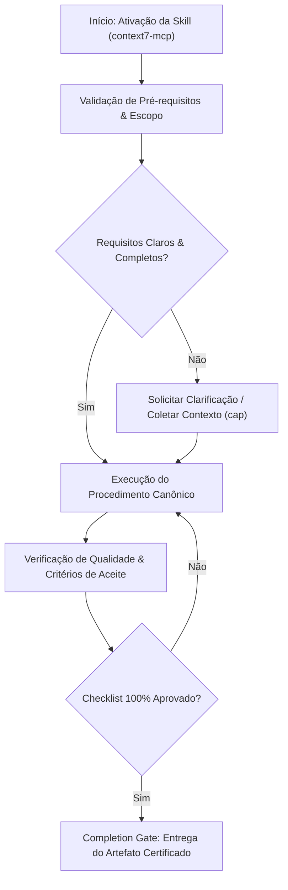

# Context7 Mcp

When the user asks about libraries, frameworks, or needs code examples, use Context7 to fetch current documentation instead of relying on training data.

## When to Use This Skill

## Decision Workflow

Activate this skill when the user:

- Asks setup or configuration questions ("How do I configure Next.js middleware?")
- Requests code involving libraries ("Write a Prisma query for...")
- Needs API references ("What are the Supabase auth methods?")
- Mentions specific frameworks (React, Vue, Svelte, Express, Tailwind, etc.)

## How to Fetch Documentation

### Step 1: Resolve the Library ID

Call `resolve-library-id` with:

- `libraryName`: The library name extracted from the user's question
- `query`: The user's full question (improves relevance ranking)

### Step 2: Select the Best Match

From the resolution results, choose based on:

- Exact or closest name match to what the user asked for
- Higher benchmark scores indicate better documentation quality
- If the user mentioned a version (e.g., "React 19"), prefer version-specific IDs

### Step 3: Fetch the Documentation

Call `query-docs` with:

- `libraryId`: The selected Context7 library ID (e.g., `/vercel/next.js`)
- `query`: The user's specific question

### Step 4: Use the Documentation

Incorporate the fetched documentation into your response:

- Answer the user's question using current, accurate information
- Include relevant code examples from the docs
- Cite the library version when relevant

## Guidelines

- **Be specific**: Pass the user's full question as the query for better results
- **Version awareness**: When users mention versions ("Next.js 15", "React 19"), use version-specific library IDs if available from the resolution step
- **Prefer official sources**: When multiple matches exist, prefer official/primary packages over community forks

## Anti-Patterns & Operational Guardrails

| Anti-Pattern | Severidade | Impacto Negativo | Mitigação Canônica |
|:---|:---:|:---|:---|
| **Premature Execution Without Context** | 🔴 Critical | Context hallucination and destructive refactoring | Activate `cap` to acquire minimal evidence before editing. |
| **Omission of Validation Checklists** | 🟡 Medium | Delivering artifacts with syntax inconsistencies | Rigorously execute the checklist step-by-step before handoff. |
| **Falta de Documentação de Decisões** | 🟢 Low | Perda de rastreabilidade técnica e drift arquitetural | Registrar trade-offs relevantes via skill `adr-generator`. |

## Edge Cases & Failure Modes

- **Restricted / Read-Only Environment:** If the filesystem or sandbox is write-locked, report the constraint immediately with evidence and generate changes as a markdown diff patch.
- **Specification Conflict:** If contradictions emerge between user intent and the SSOT (`AGENTS.md`), halt and present trade-off options.
- **Context Exhaustion / Timeout:** For massive tasks, decompose into atomic sub-batches utilizing `subagent-driven-development`.

## Domain SOTA & Industry Engineering Standards

- **Live Documentation Retrieval:** Real-time API resolution, version pinning, and authoritative documentation indexing.
- **Model Context Protocol Integration:** Fast MCP lazy-loading, caching, and token-optimized query dispatch.
- **Semantic Routing:** Two-phase retrieval (1. `resolve-library-id` $\to$ 2. `query-docs`).
- **Knowledge Freshness:** Strict prioritization of Context7 over model training weights for libraries and SDKs.

### Context7 Operating Protocol:
1. **Phase 1 (Resolve ID):** Call `resolve-library-id` using official library name and question context. Select match matching `/org/project`.
2. **Phase 2 (Query Docs):** Call `query-docs` passing full natural language technical question.
3. **Phase 3 (Doc Ingestion):** Answer strictly based on fetched documentation payload.

### Exhaustive Heuristic Decision Rules:
- **Rule of Thumb 1 (Zero-Trust Architectural Boundaries):** Treat all external inputs, third-party payloads, and cross-module boundaries with strict zero-trust schema validation.
- **Rule of Thumb 2 (Fail-Fast & Deterministic Errors):** Reject invalid states immediately with typed, actionable error contracts rather than cascading silent failures.
- **Rule of Thumb 3 (Idempotency & AST Preservation):** State mutations and code transformations must maintain semantic idempotency across repeated executions.
- **Rule of Thumb 4 (Benchmark & Telemetry Alignment):** Measure critical execution latency ($P_{95}$) and memory overhead with structured telemetry and baseline benchmarks.
- **Rule of Thumb 5 (Event-Driven & Circuit Breaker Decoupling):** Isolate asynchronous operations behind circuit breakers and resilient retry mechanisms to prevent cascading failure.
- **Rule of Thumb 6 (Contract-First DDD Modeling):** Define clear domain aggregates, value objects, and typed interface contracts before implementing concrete logic.
- **Rule of Thumb 7 (RAG & Semantic Retrieval Precision):** Optimize context retrieval with hybrid lexical-vector search and reciprocal rank fusion to eliminate hallucinated routing.
- **Rule of Thumb 8 (OWASP & Supply Chain Verification):** Verify dependencies and data flows against OWASP Top 10 and SLSA Level 3 supply chain security standards.
- **Rule of Thumb 9 (Verification Gate Invariant):** Never declare completion without automated test execution evidence and zero compiler/linter warnings.
## Operational Verification Checklist

- [ ] All prerequisites and target files inspected before modification.
- [ ] Procedure strictly adheres to specialization rules and best practices.
- [ ] Security, typing, and architectural style guidelines preserved.
- [ ] Unit tests or validation commands executed successfully.
- [ ] Final deliverable verified against the completion gate.

## Completion Gate & Verification
Before concluding Context7 query:
- [ ] Best matching library ID resolved via `resolve-library-id`
- [ ] Query executed passing complete technical question context
- [ ] Final answer strictly grounded in fetched documentation payload