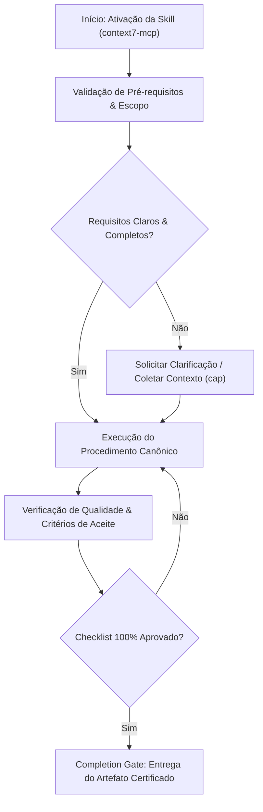

# Context7 Mcp

When the user asks about libraries, frameworks, or needs code examples, use Context7 to fetch current documentation instead of relying on training data.

## When to Use This Skill

## Decision Workflow

Activate this skill when the user:

- Asks setup or configuration questions ("How do I configure Next.js middleware?")
- Requests code involving libraries ("Write a Prisma query for...")
- Needs API references ("What are the Supabase auth methods?")
- Mentions specific frameworks (React, Vue, Svelte, Express, Tailwind, etc.)

## How to Fetch Documentation

### Step 1: Resolve the Library ID

Call `resolve-library-id` with:

- `libraryName`: The library name extracted from the user's question
- `query`: The user's full question (improves relevance ranking)

### Step 2: Select the Best Match

From the resolution results, choose based on:

- Exact or closest name match to what the user asked for
- Higher benchmark scores indicate better documentation quality
- If the user mentioned a version (e.g., "React 19"), prefer version-specific IDs

### Step 3: Fetch the Documentation

Call `query-docs` with:

- `libraryId`: The selected Context7 library ID (e.g., `/vercel/next.js`)
- `query`: The user's specific question

### Step 4: Use the Documentation

Incorporate the fetched documentation into your response:

- Answer the user's question using current, accurate information
- Include relevant code examples from the docs
- Cite the library version when relevant

## Guidelines

- **Be specific**: Pass the user's full question as the query for better results
- **Version awareness**: When users mention versions ("Next.js 15", "React 19"), use version-specific library IDs if available from the resolution step
- **Prefer official sources**: When multiple matches exist, prefer official/primary packages over community forks

## Anti-Patterns & Operational Guardrails

| Anti-Pattern | Severidade | Impacto Negativo | Mitigação Canônica |
|:---|:---:|:---|:---|
| **Execução Prematura sem Contexto** | 🔴 Critical | Alucinação de contexto e refatoração destrutiva | Ativar a skill `cap` para adquirir evidências mínimas antes de editar. |
| **Omissão de Checklists de Validação** | 🟡 Medium | Entrega de artefatos com inconsistências sintáticas | Executar rigorosamente o checklist passo a passo antes do handoff. |
| **Falta de Documentação de Decisões** | 🟢 Low | Perda de rastreabilidade técnica e drift arquitetural | Registrar trade-offs relevantes via skill `adr-generator`. |

## Edge Cases & Failure Modes

- **Ambiente Restrito / Read-Only:** Se o filesystem ou sandbox estiver bloqueado contra escrita, reportar o bloqueio com evidência imediata e gerar o patch em markdown diff.
- **Conflito de Especificação:** Caso encontre contradições entre a intenção do usuário e o SSOT (`AGENTS.md`), interromper e sinalizar as opções com trade-offs.
- **Timeout ou Exaustão de Contexto:** Em tarefas volumosas, decompor em sub-lotes atômicos utilizando a skill `subagent-driven-development`.

## Operational Verification Checklist

- [ ] Todos os pré-requisitos e arquivos-alvo foram inspecionados antes da modificação.
- [ ] O procedimento seguiu estritamente as regras e boas práticas da especialização.
- [ ] As diretrizes de segurança, tipagem e estilo foram preservadas.
- [ ] Os testes unitários ou comandos de validação foram executados com sucesso.
- [ ] O artefato final foi inspecionado contra o completion gate.

