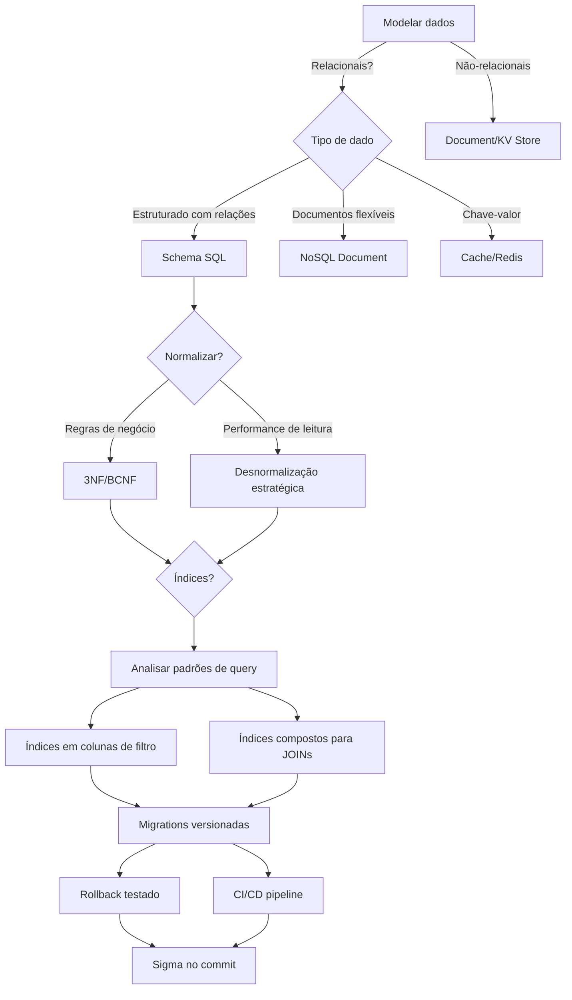

# Data Modeling

Guia completo para modelagem de dados e design de schemas de banco de dados.

## Quando Usar

### Use quando:
- Criando novo banco de dados ou schema
- Projetando tabelas e relacionamentos
- Normalizando ou desnormalizando dados
- Criando e versionando migrações
- Definindo estratégias de índices
- Revisando performance de queries
- Trabalhando com dados geográficos ou temporais

### Não use quando:
- Apenas consultas simples em dados existentes
- Configuração de conexão de banco
- Administração de usuários e permissões
- Backup e restore de banco

### Skills relacionadas:
- `ddd` — para mapear entidades de domínio para tabelas
- `testing` — para testar integridade referencial
- `architecture-review-kilo` — para revisar design do schema

## Decision Tree



## Conceitos Fundamentais

### Normalização

Processo de organizar colunas e tabelas para minimizar redundância.

#### Formas Normais

| Forma | Regra | Exemplo |
|-------|-------|---------|
| 1NF | Colunas atômicas, sem listas | Separar endereço em rua, cidade, CEP |
| 2NF | 1NF + dependência funcional total | Mover nome do produto para tabela separada |
| 3NF | 2NF + sem dependência transitiva | Mover cidade para tabela de cidades |
| BCNF | Determinante é superchave | Todo determinante é chave candidata |

### Tipos de Chave

```sql
-- Chave Primária (PK)
CREATE TABLE users (
    id UUID PRIMARY KEY DEFAULT gen_random_uuid(),
    email VARCHAR(255) NOT NULL UNIQUE
);

-- Chave Estrangeira (FK)
CREATE TABLE orders (
    id UUID PRIMARY KEY,
    user_id UUID NOT NULL REFERENCES users(id) ON DELETE CASCADE
);

-- Chave Composta
CREATE TABLE order_items (
    order_id UUID REFERENCES orders(id),
    product_id UUID REFERENCES products(id),
    quantity INTEGER NOT NULL,
    PRIMARY KEY (order_id, product_id)
);
```

### Tipos de Dados

```sql
-- UUID para identificadores
id UUID DEFAULT gen_random_uuid()

-- TIMESTAMP para datas com timezone
created_at TIMESTAMPTZ DEFAULT NOW()

-- NUMERIC para valores monetários
price NUMERIC(10,2) NOT NULL

-- JSONB para dados flexíveis
metadata JSONB DEFAULT '{}'

-- ENUM para valores fixos
status VARCHAR(20) CHECK (status IN ('active', 'inactive', 'pending'))
```

### Índices

```sql
-- Índice simples
CREATE INDEX idx_users_email ON users(email);

-- Índice composto
CREATE INDEX idx_orders_user_status ON orders(user_id, status);

-- Índice parcial
CREATE INDEX idx_orders_pending ON orders(created_at)
WHERE status = 'pending';

-- Índice para LIKE
CREATE INDEX idx_products_name_gin ON products
USING gin(name gin_trgm_ops);
```

## Workflow

### Fase 1: Analisar Requisitos de Dados

1. Identifique entidades do domínio:
   - Usuários, Pedidos, Produtos, Pagamentos
2. Defina atributos de cada entidade:
   ```
   User: id, name, email, created_at
   Order: id, user_id, status, total, created_at
   Product: id, name, price, category_id
   ```
3. Mapeie relacionamentos:
   - User 1:N Order
   - Order N:M Product (via OrderItem)
   - Product N:1 Category
4. **Checkpoint**: Entidades e relacionamentos documentados

### Fase 2: Projetar Schema SQL

1. Crie tabelas com tipos adequados:
   ```sql
   CREATE TABLE users (
       id UUID PRIMARY KEY DEFAULT gen_random_uuid(),
       name VARCHAR(100) NOT NULL,
       email VARCHAR(255) NOT NULL UNIQUE,
       created_at TIMESTAMPTZ DEFAULT NOW()
   );
   ```
2. Adicione chaves estrangeiras:
   ```sql
   ALTER TABLE orders ADD CONSTRAINT fk_orders_user
       FOREIGN KEY (user_id) REFERENCES users(id) ON DELETE CASCADE;
   ```
3. Valide normalização (3NF mínimo):
   - Sem colunas repetidas em mesma tabela
   - Sem dependências transitivas
   - Dados atômicos em cada coluna
4. **Checkpoint**: Schema válido e normalizado

### Fase 3: Definir Estratégia de Índices

1. Analise queries frequentes:
   ```sql
   -- Query de login
   SELECT * FROM users WHERE email = ?;

   -- Query de pedidos do usuário
   SELECT * FROM orders WHERE user_id = ? AND status = 'pending';
   ```
2. Crie índices correspondentes:
   ```sql
   CREATE UNIQUE INDEX idx_users_email ON users(email);
   CREATE INDEX idx_orders_user_status ON orders(user_id, status);
   ```
3. Verifique selectividade:
   - Colunas com alta seleção (>30% de valores únicos) = bom índice
   - Colunas com baixa seleção (ex: boolean) = índice ineficiente
4. **Checkpoint**: Índices cobrem queries frequentes

### Fase 4: Criar Migrações Versionadas

1. Crie pasta de migrações:
   ```
   migrations/
   ├── 001_create_users.sql
   ├── 002_create_orders.sql
   ├── 003_add_order_items.sql
   └── 004_create_indexes.sql
   ```
2. Implemente cada migração com rollback:
   ```sql
   -- 002_create_orders.sql
   -- UP
   CREATE TABLE orders (
       id UUID PRIMARY KEY DEFAULT gen_random_uuid(),
       user_id UUID NOT NULL,
       status VARCHAR(20) DEFAULT 'pending',
       total NUMERIC(10,2) DEFAULT 0,
       created_at TIMESTAMPTZ DEFAULT NOW()
   );

   -- DOWN
   DROP TABLE IF EXISTS orders;
   ```
3. Teste rollback antes de commit:
   ```bash
   psql -f migrations/002_create_orders.sql
   psql -c "DROP TABLE IF EXISTS orders;"
   ```
4. **Checkpoint**: Migrações versionadas e rollback testado

### Fase 5: Otimizar Performance

1. Analise queries lentas:
   ```sql
   EXPLAIN ANALYZE
   SELECT * FROM orders o
   JOIN users u ON o.user_id = u.id
   WHERE o.status = 'pending';
   ```
2. Aplique otimizações:
   - Adicione índices faltantes
   - Use covering index para queries de leitura
   - Considere particionamento para tabelas grandes
3. Configure connection pooling:
   ```yaml
   database:
     pool:
       min: 5
       max: 20
       idle_timeout: 30s
   ```
4. **Checkpoint**: Queries com tempo < 100ms

### Fase 6: Documentar Schema

1. Crie diagrama ER:
   ```mermaid
   erDiagram
       USERS ||--o{ ORDERS : places
       ORDERS ||--|{ ORDER_ITEMS : contains
       PRODUCTS ||--|{ ORDER_ITEMS : includes
       PRODUCTS }o--|| CATEGORIES : belongs_to
   ```
2. Adicione comentários nas tabelas:
   ```sql
   COMMENT ON TABLE users IS 'Armazena dados dos usuários do sistema';
   COMMENT ON COLUMN users.email IS 'Email único para login e notificações';
   ```
3. Atualize documentação da API:
   - Tipos de dados
   - Relacionamentos
   - Restrições
4. **Checkpoint**: Schema documentado e diagrama atualizado

### Fase 7: Configurar CI/CD para Migrações

1. Adicione pipeline de validação:
   ```yaml
   # .github/workflows/migrations.yml
   steps:
     - name: Validate migrations
       run: |
         for f in migrations/*.sql; do
           psql -f "$f" --dry-run
         done
   ```
2. Automatize testes:
   ```bash
   # Rodar migrações em banco de teste
   migrate -path ./migrations -database $TEST_DB up
   migrate -path ./migrations -database $TEST_DB down
   ```
3. Configure alertas:
   - Migração sem rollback
   - Query sem índice
   - Tabela sem PK
4. **Checkpoint**: CI/CD validando migrações automaticamente

## Templates

### Schema SQL
Localização: `templates/schema.sql`

Template para criação de schema SQL com boas práticas.

**Uso:**
```bash
cp templates/schema.sql migrations/$(date +%Y%m%d)_create_schema.sql
```

### Migração
Localização: `templates/migration.md`

Template para documentação de migrações.

**Uso:**
```bash
cp templates/migration.md migrations/$(date +%Y%m%d)_migration.md
```

### Estratégia de Índices
Localização: `templates/index-strategy.md`

Template para planejamento de índices.

**Uso:**
```bash
cp templates/index-strategy.md docs/index-strategy.md
```

## Anti-patterns

### 🔴 Crítico

#### Migration sem Rollback Testado
**O que é:** Migração criada sem testar se o rollback funciona.
**Por que é ruim:** Impossível reverter em caso de erro em produção, pode causar perda de dados.
**Como evitar:** Sempre testar UP e DOWN antes de commitar.
**Exemplo:**
```sql
-- ❌ ERRADO: Sem seção DOWN
CREATE TABLE orders (
    id UUID PRIMARY KEY,
    user_id UUID NOT NULL
);

-- ✅ CORRETO: Com UP e DOWN testados
-- UP
CREATE TABLE orders (
    id UUID PRIMARY KEY,
    user_id UUID NOT NULL
);

-- DOWN
DROP TABLE IF EXISTS orders;
```

#### Tabela sem PK Definida
**O que é:** Tabela criada sem chave primária.
**Por que é ruim:** Impossível identificar registros de forma única, viola 1NF, causa problemas em réplicas e cache.
**Como evitar:** Sempre definir PK, preferencialmente UUID.
**Exemplo:**
```sql
-- ❌ ERRADO: Sem PK
CREATE TABLE logs (
    message TEXT,
    timestamp TIMESTAMP
);

-- ✅ CORRETO: Com PK
CREATE TABLE logs (
    id UUID PRIMARY KEY DEFAULT gen_random_uuid(),
    message TEXT NOT NULL,
    timestamp TIMESTAMPTZ DEFAULT NOW()
);
```

### 🟡 Médio

#### Índice em Coluna com Baixa Selectividade
**O que é:** Índice em coluna com poucos valores únicos (ex: boolean, status com 3 valores).
**Por que é ruim:** O índice não melhora performance significativamente, apenas ocupa espaço.
**Como evitar:** Usar índices compostos ou parciais para colunas de baixa selectividade.
**Exemplo:**
```sql
-- ❌ ERRADO: Índice em coluna boolean
CREATE INDEX idx_users_active ON users(is_active);

-- ✅ CORRETO: Índice parcial para valores específicos
CREATE INDEX idx_users_active_pending ON users(email)
WHERE is_active = true AND status = 'pending';
```

#### Normalização Excessiva em Tabela de Leitura
**O que é:** Normalizar além do necessário para tabelas de leitura frequente.
**Por que é ruim:** JOINs excessivos degradam performance, queries ficam complexas.
**Como evitar:** Desnormalizar estrategicamente para tabelas de leitura, usar views.
**Exemplo:**
```sql
-- ❌ ERRADO: Muitos JOINs para leitura
SELECT o.*, u.name, u.email, p.name, p.price
FROM orders o
JOIN users u ON o.user_id = u.id
JOIN order_items oi ON o.id = oi.order_id
JOIN products p ON oi.product_id = p.id;

-- ✅ CORRETO: Tabela desnormalizada para leitura
CREATE MATERIALIZED VIEW order_details AS
SELECT o.id, u.name as user_name, u.email,
       json_agg(json_build_object('product', p.name, 'price', p.price)) as items
FROM orders o
JOIN users u ON o.user_id = u.id
JOIN order_items oi ON o.id = oi.order_id
JOIN products p ON oi.product_id = p.id
GROUP BY o.id, u.name, u.email;
```

### 🟢 Baixo

#### SELECT * em Produção
**O que é:** Usar SELECT * em queries de produção.
**Por que é ruim:** Retorna dados desnecessários, aumenta tráfego de rede, pode quebrar código se schema mudar.
**Como evitar:** Selecionar apenas colunas necessárias.
**Exemplo:**
```sql
-- ❌ ERRADO
SELECT * FROM users WHERE id = ?;

-- ✅ CORRETO
SELECT id, name, email FROM users WHERE id = ?;
```

#### Falta de Comentários em Colunas
**O que é:** Schema sem documentação de colunas.
**Por que é ruim:** Dificulta manutenção, novos desenvolvedores não entendem propósito.
**Como evitar:** Adicionar COMMENT em todas as colunas importantes.
**Exemplo:**
```sql
-- ❌ ERRADO: Sem comentários
CREATE TABLE users (
    metadata JSONB
);

-- ✅ CORRETO: Com comentários
CREATE TABLE users (
    metadata JSONB DEFAULT '{}'
);
COMMENT ON COLUMN users.metadata IS 'Dados extras do usuário em formato JSON (preferences, settings)';
```

## Checklists

### Checklist de Schema Design
- [ ] Todas as tabelas têm PK definida
- [ ] Chaves estrangeiras estão configuradas com ON DELETE/UPDATE
- [ ] Colunas NOT NULL definidas corretamente
- [ ] Tipos de dados adequados (UUID para IDs, NUMERIC para moeda)
- [ ] Timestamps com timezone (TIMESTAMPTZ)
- [ ] Valores padrão definidos (DEFAULT)
- [ ] CHECK constraints para validação

### Checklist de Migração
- [ ] Migração tem seção UP e DOWN
- [ ] Rollback testado localmente
- [ ] Migração não quebra dados existentes
- [ ] Nomeclatura consistente (YYYYMMDD_descricao)
- [ ] Versão controlada (não usar IF NOT EXISTS sem DOWN)
- [ ] Comentários explicando mudanças complexas

### Checklist de Índices
- [ ] Índices cobrem queries frequentes
- [ ] Índices compostos seguem ordem de seletividade
- [ ] Índices parciais para queries com WHERE específicas
- [ ] Monitoramento de índices não utilizados
- [ ] Teste de performance antes e depois

### Checklist de Performance
- [ ] Queries com tempo < 100ms
- [ ] Connection pooling configurado
- [ ] EXPLAIN ANALYZE roda sem seq scans em tabelas grandes
- [ ] Paginação implementada para listas
- [ ] Cache configurado para dados frequentes

### Checklist de Documentação
- [ ] Diagrama ER atualizado
- [ ] Comentários em tabelas e colunas
- [ ] README do schema documentado
- [ ] Exemplos de queries comuns

## Edge Cases

### Tabela com Milhões de Registros
**Situação:** Tabela cresceu para milhões de registros e queries estão lentas.
**Solução:** Particionar tabela por data ou chave de particionamento.
**Exceção:** Se dados são acessados uniformemente, considere sharding.

```sql
-- Particionamento por data
CREATE TABLE orders (
    id UUID,
    created_at TIMESTAMPTZ,
    user_id UUID
) PARTITION BY RANGE (created_at);

CREATE TABLE orders_2024_q1 PARTITION OF orders
    FOR VALUES FROM ('2024-01-01') TO ('2024-04-01');
```

### Migração com Dados Existentes
**Situação:** Precisa alterar schema mas tem milhões de registros.
**Solução:** Usar migração em etapas, backfill em background.
**Exceção:** Se downtime é aceitável, pode fazer migration direta.

```sql
-- Etapa 1: Adicionar coluna nullable
ALTER TABLE users ADD COLUMN full_name VARCHAR(200);

-- Etapa 2: Backfill em background
UPDATE users SET full_name = name WHERE full_name IS NULL;

-- Etapa 3: Tornar NOT NULL após backfill
ALTER TABLE users ALTER COLUMN full_name SET NOT NULL;
```

### Schema Multi-Tenant
**Situação:** Mesmo schema precisa servir múltiplos tenants.
**Solução:** Coluna tenant_id com RLS (Row Level Security) ou schema separado por tenant.
**Exceção:** Se tenants são poucos e isolamento não é crítico, usar coluna tenant_id simples.

```sql
-- RLS para multi-tenant
ALTER TABLE orders ENABLE ROW LEVEL SECURITY;

CREATE POLICY tenant_isolation ON orders
    USING (tenant_id = current_setting('app.tenant_id')::uuid);
```

## Referências

- [PostgreSQL Documentation](https://www.postgresql.org/docs/)
- [Use The Index, Luke](https://use-the-index-luke.com/)
- `ddd` — para mapear entidades de domínio para schema
- `testing` — para testar integridade referencial
- `architecture-review-kilo` — para revisar design do schema
