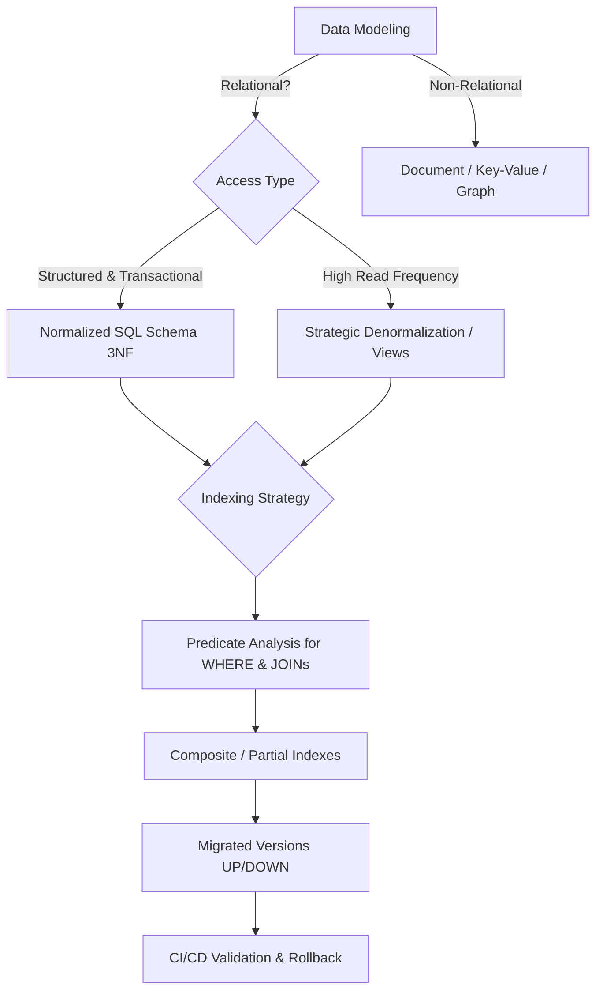

# Database Architecture & Schema Design (v2.0.0)

> 💡 **Lazy Loading of References:** This document contains contracts, decision-making heuristics, and central modeling rules. To consult complete DDL templates, partitioning scripts, and an exhaustive catalog of anti-patterns, execute `view_file` on [`references/patterns-and-migrations.md`](./references/patterns-and-migrations.md).

---

## 1. Decision Tree for Modeling & Storage

---

## 2. Modeling Invariants & Normalization

1. **Required Primary Keys:** Every table MUST contain an immutable primary key (`UUID` or `BIGINT IDENTITY`).
2. **Referential Integrity:** Foreign keys MUST explicitly define `ON DELETE RESTRICT` or `ON DELETE CASCADE`.
3. **Strict Typing & Constraints:**
   - Currency / Monetary Values: `BIGINT` (cents) or `NUMERIC(15,2)`. Never `FLOAT`.
   - Dates: `TIMESTAMPTZ` (always with UTC time zone).
   - Validations: `CHECK constraints` for enums and finite domains.
4. **Normalization vs Denormalization:**
   - Write Path (Transactional): Normalize to 3NF/BCNF to eliminate write anomalies.
   - Read Path (Analytics/Dashboards): Strategically denormalize with Materialized Views or Redis cache.

---

## 3. Indexing Strategy & Query Optimization

| Query Type | Indexing Strategy | Example SQL |
|---|---|---|
| Filter with high selectivity | Simple B-Tree Index | `CREATE INDEX idx_users_email ON users(email);` |
| Filter with multiple columns | Composite Index (Order: equality $\rightarrow$ range) | `CREATE INDEX idx_orders_user_date ON orders(user_id, created_at);` |
| Specific status / Boolean | Partial Index | `CREATE INDEX idx_orders_pending ON orders(user_id) WHERE status = 'pending';` |
| Read without accessing heap | Covering Index (`INCLUDE`) | `CREATE INDEX idx_users_lookup ON users(email) INCLUDE (name, is_active);` |

---

## 4. Migration Governance (Zero Downtime)

1. **Atomicity & Reversibility:** Every migration MUST be strictly reversible with `UP` and `DOWN` scripts.
2. **Expand / Contract Pattern:** Never remove or rename columns in production in a single deploy; use 3-step migration (Add $\rightarrow$ Backfill $\rightarrow$ Deprecate).
3. **Automated Validation:** Execute dry-run and migration tests in CI/CD before deployment.

---

## 5. Extended References

To consult detailed DDL scripts, partitioning examples, and an exhaustive catalog of anti-patterns:
- 👉 [references/patterns-and-migrations.md](./references/patterns-and-migrations.md)