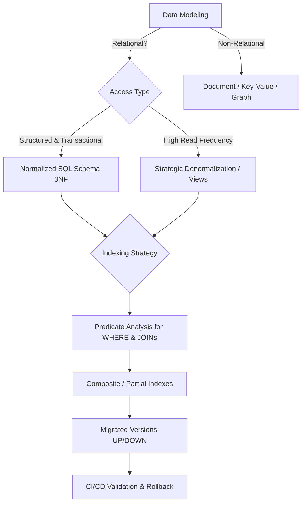

# Database Architecture & Schema Design (v2.0.0)

## When to Use

### Use when:
- Designing relational or NoSQL database schemas, entities, and relationships
- Optimizing indexing strategies ($S_{\text{idx}} \ge 0.15$), query performance, and connection pools
- Planning zero-downtime database migrations via the Expand-Contract pattern

### Do not use when:
- In-memory data structures or simple JSON file storage without database engine

> 💡 **Lazy Loading of References:** This document contains contracts, decision-making heuristics, and central modeling rules. To consult complete DDL templates, partitioning scripts, and an exhaustive catalog of anti-patterns, execute `view_file` on [`references/patterns-and-migrations.md`](./references/patterns-and-migrations.md).

---

## 1. Decision Tree for Modeling & Storage

---

## 2. Modeling Invariants & Normalization

1. **Required Primary Keys:** Every table MUST contain an immutable primary key (`UUID` or `BIGINT IDENTITY`).
2. **Referential Integrity:** Foreign keys MUST explicitly define `ON DELETE RESTRICT` or `ON DELETE CASCADE`.
3. **Strict Typing & Constraints:**
   - Currency / Monetary Values: `BIGINT` (cents) or `NUMERIC(15,2)`. Never `FLOAT`.
   - Dates: `TIMESTAMPTZ` (always with UTC time zone).
   - Validations: `CHECK constraints` for enums and finite domains.
4. **Normalization vs Denormalization:**
   - Write Path (Transactional): Normalize to 3NF/BCNF to eliminate write anomalies.
   - Read Path (Analytics/Dashboards): Strategically denormalize with Materialized Views or Redis cache.

---

## 3. Indexing Strategy & Query Optimization

| Query Type | Indexing Strategy | Example SQL |
|---|---|---|
| Filter with high selectivity | Simple B-Tree Index | `CREATE INDEX idx_users_email ON users(email);` |
| Filter with multiple columns | Composite Index (Order: equality $\rightarrow$ range) | `CREATE INDEX idx_orders_user_date ON orders(user_id, created_at);` |
| Specific status / Boolean | Partial Index | `CREATE INDEX idx_orders_pending ON orders(user_id) WHERE status = 'pending';` |
| Read without accessing heap | Covering Index (`INCLUDE`) | `CREATE INDEX idx_users_lookup ON users(email) INCLUDE (name, is_active);` |

---

## 4. Migration Governance (Zero Downtime)

1. **Atomicity & Reversibility:** Every migration MUST be strictly reversible with `UP` and `DOWN` scripts.
2. **Expand / Contract Pattern:** Never remove or rename columns in production in a single deploy; use 3-step migration (Add $\rightarrow$ Backfill $\rightarrow$ Deprecate).
3. **Automated Validation:** Execute dry-run and migration tests in CI/CD before deployment.

---

## 5. Extended References

To consult detailed DDL scripts, partitioning examples, and an exhaustive catalog of anti-patterns:
- 👉 [references/patterns-and-migrations.md](./references/patterns-and-migrations.md)
| Anti-Pattern | Severity | Negative Impact | Canonical Mitigation |
| :--- | :---: | :--- | :--- |
| **Early Execution without Context** | 🔴 Critical | Context hallucination and destructive refactoring | Enable the `cap` skill to acquire minimal evidence before editing. |
| **Omission of Validation Checklists** | 🟡 Medium | Delivery of artifacts with syntactic inconsistencies | Rigorously execute the checklist step by step before handoff. |
| **Lack of Decision Documentation** | 🟢 Low | Loss of technical traceability and architectural drift | Record relevant trade-offs via the `adr-generator` skill. |- **Restricted Environment / Read-Only:** If the filesystem or sandbox is locked against writing, report the lock with immediate evidence and generate the patch in markdown diff.- [ ] All prerequisites and target files were inspected before the modification.A task associated with the `database-architecture` skill can only be declared complete when:
1. All operational checklist checks have been met.
2. The result has been validated deterministically through execution evidence.
3. There are no outstanding structural issues, placeholders, or unresolved errors.

## Domain SOTA & Industry Engineering Standards

- **Relational Normalization:** Edgar F. Codd's Normal Forms (1NF, 2NF, 3NF, Boyce-Codd BCNF) and pragmatic de-normalization.
- **ACID Transaction Isolation Levels:** ANSI/ISO SQL-92 (Read Uncommitted, Read Committed, Repeatable Read, Serializable) and MVCC internals.
- **Index Engineering:** B-Tree, Hash, GIN, GiST, and BRIN index mechanics with selectivity math.
- **Zero-Downtime Schema Migrations:** Expand-Contract (Parallel Run) Pattern for zero lock contention.

### B-Tree Index Selectivity Formula:

$$S_{\text{idx}} = \frac{D_{\text{distinct}}}{N_{\text{total}}} \in (0, 1]$$

| Metric / Threshold | Recommendation |
|:---|:---|
| **$S_{\text{idx}} \ge 0.15$ ($15\%+$ distinct)** | Create standard B-Tree index. |
| **$0.01 \le S_{\text{idx}} < 0.15$** | Evaluate Composite or Partial / Filtered Index (`WHERE active = true`). |
| **$S_{\text{idx}} < 0.01$ ($<1\%$ distinct / Boolean)** | Do NOT index with B-Tree; use Bitmap or evaluate table scan efficiency. |

### Expand-Contract Migration Lifecycle:
1. **Phase 1 (Expand):** Add new column/table as nullable. Deploy code writing to BOTH old and new locations.
2. **Phase 2 (Backfill):** Run asynchronous batch backfill script in small chunks ($N_{\text{chunk}} = 1000$).
3. **Phase 3 (Switch):** Deploy code reading exclusively from new location.
4. **Phase 4 (Contract):** Remove old column/table safely after 30-day soak period.

### Exhaustive Heuristic Decision Rules:
1. **Rule of Thumb 1 (Zero Table Locks in Production):** Never execute blocking `ALTER TABLE ADD COLUMN NOT NULL DEFAULT ...` without PostgreSQL 11+ metadata-only optimizations or Expand-Contract pattern.
2. **Rule of Thumb 2 (Foreign Key Indexing):** Every foreign key column MUST be indexed to prevent full table scans during parent cascade deletes.
3. **Rule of Thumb 3 (Query Optimization SLA):** Any OLTP query taking $>50\text{ms}$ must be analyzed with `EXPLAIN (ANALYZE, BUFFERS)` to eliminate Seq Scans on large tables.
4. **Rule of Thumb 4 (Idempotent Migrations):** Migration scripts must be deterministic and provide verifiable down/rollback vectors.

## Completion Gate & Verification
Before declaring database architecture change complete:
- [ ] Schema normalized to 3NF/BCNF (or documented de-normalization rationale)
- [ ] Index selectivity calculated and verified with `EXPLAIN ANALYZE`
- [ ] Idempotent migration with reversible rollback vector verified