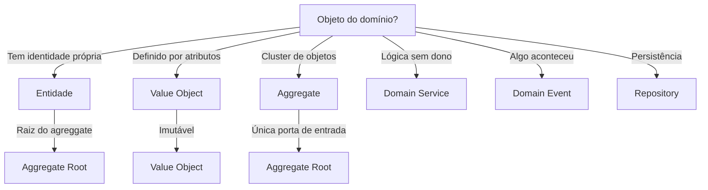

# Domain-Driven Design (DDD)

Guia para modelagem de domínio orientada a negócios.

## Quando Usar

### Use quando:
- Modelando domínio complexo com regras de negócio
- Refatorando entidades anêmicas
- Estruturando Bounded Contexts
- Definindo contratos de domínio
- Trabalhando com Domain Events

### Não use quando:
- CRUD simples sem regras de negócio
- Protótipo rápido
- Projeto sem domínio complexo

### Skills relacionadas:
- `architecture-review` — para validar aderência a DDD
- `testing` — para testar agregados e entidades

## Decision Tree



## Workflow

### Fase 1: Modelar Domínio

1. Realize Event Storming:
   - Liste eventos de negócio
   - Identifique comandos
   - Mapeie aggregates
2. Defina Bounded Contexts:
   - Contexto de Usuário
   - Contexto de Pedido
   - Contexto de Pagamento
3. Crie context map:
   ```
   User Context <---> Order Context (Customer-Supplier)
   ```
4. **Checkpoint**: Contextos bem delimitados, sem overlap

### Fase 2: Implementar Aggregate Root

1. Defina invariantes:
   ```typescript
   // Order invariants
   - Status não pode pular (Draft -> Pending -> Paid -> Shipped)
   - Total deve ser recalculado ao adicionar item
   - Não pode modificar pedido pago
   ```
2. Crie classe com validação:
   ```typescript
   class Order {
     private status: OrderStatus = OrderStatus.Draft;
     
     addItem(item: OrderItem): void {
       if (this.status !== OrderStatus.Draft) {
         throw new DomainError("Cannot modify paid order");
       }
       this.items.push(item);
       this.recalculateTotal();
     }
   }
   ```
3. **Checkpoint**: Aggregate respeita todas as invariantes

### Fase 3: Implementar Value Object

1. Defina atributos imutáveis:
   ```typescript
   class Money {
     constructor(
       private readonly amount: number,
       private readonly currency: string
     ) {}
   }
   ```
2. Adicione validação no construtor:
   ```typescript
   if (amount < 0) {
     throw new DomainError("Amount cannot be negative");
   }
   ```
3. Implemente equals:
   ```typescript
   equals(other: Money): boolean {
     return this.amount === other.amount && 
            this.currency === other.currency;
   }
   ```
4. **Checkpoint**: Value Object imutável e validado

### Fase 4: Implementar Domain Event

1. Crie evento no passado:
   ```typescript
   class OrderCreated {
     constructor(
       public readonly orderId: OrderId,
       public readonly userId: UserId,
       public readonly total: Money
     ) {}
   }
   ```
2. Publique no aggregate:
   ```typescript
   static create(userId: UserId, items: OrderItem[]): Order {
     const order = new Order(userId, items);
     order.addDomainEvent(new OrderCreated(
       order.id, userId, order.total
     ));
     return order;
   }
   ```
3. Crie handler:
   ```typescript
   class SendOrderConfirmationHandler {
     async handle(event: OrderCreated) {
       await emailService.sendConfirmation(event.orderId);
     }
   }
   ```
4. **Checkpoint**: Evento publicado e handler funciona

### Fase 5: Implementar Repository

1. Defina interface no domínio:
   ```typescript
   interface OrderRepository {
     add(order: Order): Promise<void>;
     remove(order: Order): Promise<void>;
     findById(id: OrderId): Promise<Order | null>;
     findByUserId(userId: UserId): Promise<Order[]>;
   }
   ```
2. Implemente na infraestrutura:
   ```typescript
   class PrismaOrderRepository implements OrderRepository {
     async findById(id: OrderId): Promise<Order | null> {
       const data = await prisma.order.findUnique({
         where: { id: id.value }
       });
       return data ? OrderMapper.toDomain(data) : null;
     }
   }
   ```
3. **Checkpoint**: Repository implementa interface corretamente

### Fase 6: Definir Bounded Context

1. Mapeie contextos:
   ```
   User Context
   - Entities: User, Profile
   - Value Objects: Email, Name
   - Services: PasswordHasher
   ```
2. Defina integrações:
   ```
   User Context publishes UserCreated
   Order Context subscribes UserCreated
   ```
3. **Checkpoint**: Contextos bem delimitados com contratos claros

### Fase 7: Refatorar Entidade Anêmica

1. Identifique entidade anêmica:
   ```typescript
   // Anêmica
   class User {
     id: string;
     name: string;
     email: string;
     // só getters/setters
   }
   ```
2. Mova regras para dentro:
   ```typescript
   class User {
     changeEmail(newEmail: string) {
       if (!this.isValidEmail(newEmail)) {
         throw new DomainError("Invalid email");
       }
       this.email = newEmail;
     }
   }
   ```
3. **Checkpoint**: Entidade tem comportamento, não só dados

## Conceitos Fundamentais

### Entidade

Objeto com identidade própria, ciclos de vida e persistência.

```typescript
class Order {
  private id: OrderId;  // identidade
  private items: OrderItem[];
  private status: OrderStatus;
  
  // comportamento, não só dados
  addItem(item: OrderItem): void {
    if (this.status !== OrderStatus.Draft) {
      throw new DomainError("Cannot modify");
    }
    this.items.push(item);
  }
}
```

### Value Object

Objeto imutável definido por seus atributos, sem identidade própria.

```typescript
class Money {
  constructor(
    private readonly amount: number,
    private readonly currency: string
  ) {
    if (amount < 0) {
      throw new DomainError("Amount cannot be negative");
    }
  }
  
  equals(other: Money): boolean {
    return this.amount === other.amount && 
           this.currency === other.currency;
  }
}
```

### Aggregate

Cluster de entidades e value objects com boundary e root.

```typescript
// Order é Aggregate Root
// OrderItem é entidade filha (sem ID próprio)
class Order {
  private items: OrderItem[] = [];  // sem IDs
  
  addItem(item: OrderItem): void {
    this.items.push(item);  // só via root
  }
}
```

### Repository

Abstração de coleção para acesso a agregados.

```typescript
// Interface no domínio
interface OrderRepository {
  add(order: Order): Promise<void>;
  findById(id: OrderId): Promise<Order | null>;
}

// Implementação na infraestrutura
class PrismaOrderRepository implements OrderRepository {
  async findById(id: OrderId): Promise<Order | null> {
    // ...
  }
}
```

### Domain Event

Registro de algo relevante que aconteceu no domínio.

```typescript
class OrderCreated {
  constructor(
    public readonly orderId: OrderId,
    public readonly occurredAt: Date
  ) {}
}
```

### Domain Service

Lógica que não pertence a uma entidade.

```typescript
class CurrencyConverter {
  convert(amount: Money, to: string): Money {
    // lógica que envolve múltiplos agregados
  }
}
```

## Templates

### entity.ts
Localização: `templates/entity.ts`

Template para entidade de domínio.

**Uso:**
```bash
cp templates/entity.ts src/domain/{entity}/{entity}.ts
```

### value-object.ts
Localização: `templates/value-object.ts`

Template para value object imutável.

**Uso:**
```bash
cp templates/value-object.ts src/domain/{vo}/{vo}.ts
```

### aggregate-root.ts
Localização: `templates/aggregate-root.ts`

Template para aggregate root com invariantes.

**Uso:**
```bash
cp templates/aggregate-root.ts src/domain/{aggregate}/{aggregate}.ts
```

### domain-event.ts
Localização: `templates/domain-event.ts`

Template para domain event.

**Uso:**
```bash
cp templates/domain-event.ts src/domain/{event}/{event}.ts
```

### repository.ts
Localização: `templates/repository.ts`

Template para interface de repository.

**Uso:**
```bash
cp templates/repository.ts src/domain/{aggregate}/{aggregate}-repository.ts
```

### domain-service.ts
Localização: `templates/domain-service.ts`

Template para domain service.

**Uso:**
```bash
cp templates/domain-service.ts src/domain/{service}/{service}.ts
```

## Anti-patterns

### 🔴 Crítico

#### Entidade Anêmica
**O que é:** Classe com apenas getters/setters, sem comportamento.
**Por que é ruim:** Regras de negócio espalhadas, impossível manter.
**Como evitar:** Mova regras para dentro da entidade.
**Exemplo:**
```typescript
// ❌ ERRADO
class User {
  setEmail(email: string) {
    this.email = email;
  }
}

// ✅ CORRETO
class User {
  setEmail(email: string) {
    if (!this.isValidEmail(email)) {
      throw new DomainError("Invalid email");
    }
    this.email = email;
  }
}
```

#### Aggregate Grosso
**O que é:** Aggregate com muitas responsabilidades.
**Por que é ruim:** Difícil de testar, acoplamento alto.
**Como evitar:** Quebre em aggregates menores.
**Exemplo:**
```typescript
// ❌ ERRADO
class Order {
  addItem() {}
  calculateShipping() {}
  sendEmail() {}
  processPayment() {}
}

// ✅ CORRETO
class Order {
  addItem() {}
}

class ShippingService {
  calculate() {}
}
```

### 🟡 Médio

#### Repository Genérico
**O que é:** Repository com métodos genéricos como `save`, `find`.
**Por que é ruim:** Perde semântico do domínio.
**Como evitar:** Use nomes específicos do domínio.
**Exemplo:**
```typescript
// ❌ ERRADO
interface Repository<T> {
  save(entity: T): Promise<void>;
  findById(id: string): Promise<T>;
}

// ✅ CORRETO
interface OrderRepository {
  add(order: Order): Promise<void>;
  findById(id: OrderId): Promise<Order | null>;
  findPendingByUserId(userId: UserId): Promise<Order[]>;
}
```

#### Event como Command
**O que é:** Usar evento para executar ação em vez de notificar.
**Por que é ruim:** Acoplamento indesejado, difícil de debug.
**Como evitar:** Event é notificação, command é ação.
**Exemplo:**
```typescript
// ❌ ERRADO
class OrderCreated {
  async process() {
    await paymentService.charge(this.orderId);
  }
}

// ✅ CORRETO
class OrderCreated {
  // só dados
}

class ProcessOrderOnCreated {
  async handle(event: OrderCreated) {
    await paymentService.charge(event.orderId);
  }
}
```

### 🟢 Baixo

#### Value Object Mutável
**O que é:** Value Object com setters ou métodos que mudam estado.
**Por que é ruim:** Comparação por valor falha, bugs difíceis.
**Como evitar:** Sempre retorne novo objeto.
**Exemplo:**
```typescript
// ❌ ERRADO
class Money {
  setAmount(amount: number) {
    this.amount = amount;
  }
}

// ✅ CORRETO
class Money {
  add(other: Money): Money {
    return new Money(this.amount + other.amount, this.currency);
  }
}
```

## Checklists

### Checklist de DDD Modeling
- [ ] Eventos de negócio identificados
- [ ] Aggregates bem delimitados
- [ ] Value Objects imutáveis
- [ ] Domain Events para integração
- [ ] Repositories como abstrações
- [ ] Bounded Contexts mapeados

### Checklist de Aggregate Consistency
- [ ] Invariantes definidas
- [ ] Métodos respeitam invariantes
- [ ] Referências externas só por ID
- [ ] Aggregate Root é única porta de entrada
- [ ] Testes de invariantes passam

### Checklist de Event Schema
- [ ] Evento no passado (OrderCreated, não CreateOrder)
- [ ] Evento imutável
- [ ] Evento contém dados relevantes
- [ ] Handler separado do evento
- [ ] Evento versionado (se necessário)

## Edge Cases

### Aggregate com Muitas Entidades
**Situação:** Aggregate com 10+ entidades filhas.
**Solução:** Quebre em aggregates menores, use eventual consistency.
**Exceção:** Se todas são editadas atomicamente, mantenha junto.

```typescript
// Quebrar Order + OrderItems + Shipments
// Em Order, OrderItems, Shipments separados
```

### Evento com Rollback
**Situação:** Evento publicado mas operação falha.
**Solução:** Use transactional outbox ou compensação.
**Exceção:** Se evento é crítico, use saga pattern.

```typescript
// Transactional outbox
class OrderService {
  async createOrder() {
    const order = Order.create();
    await this.orderRepo.add(order);
    await this.outbox.save(OrderCreated.from(order));
  }
}
```

### Shared Kernel
**Situação:** Dois contextos compartilham código.
**Solução:** Extraia shared kernel, versionamento separado.
**Exceção:** Se compartilhamento é mínimo, considere duplicação.

```typescript
// shared-kernel/
// - Money.ts
// - Email.ts
// - Result.ts
```

## Referências

- [Domain-Driven Design Book](https://www.domainlanguage.com/ddd/)
- `architecture-review` — para validar aderência
- `testing` — para testar agregados