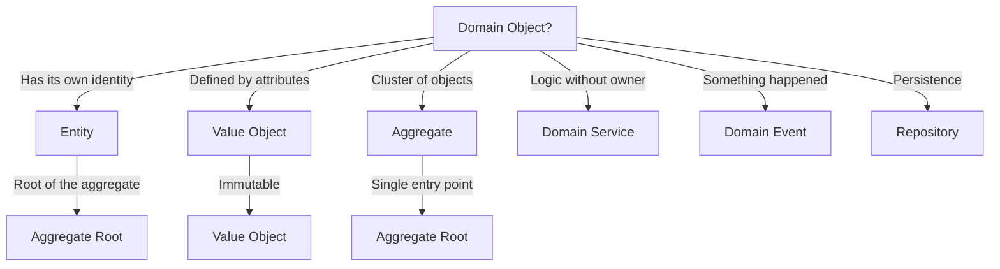

# Domain-Driven Design (DDD)

Guide to business-oriented domain modeling.

## When to Use

### Use when:
- Modeling complex domains with business rules
- Refactoring anemic entities
- Structuring Bounded Contexts
- Defining domain contracts
- Working with Domain Events

### Do not use when:
- Simple CRUD without business rules
- Rapid prototyping
- Project without complex domain

### Related Skills:
- `architecture-review-kilo` — to validate adherence to DDD
- `testing` — to test aggregates and entities

## Decision Tree


```mermaid
graph TD
    A[Domain Object?] -->|Has its own identity| B[Entity]
    A -->|Defined by attributes| C[Value Object]
    A -->|Cluster of objects| D[Aggregate]
    B -->|Root of the aggregate| E[Aggregate Root]
    C -->|Immutable| F[Value Object]
    D -->|Single entry point| G[Aggregate Root]
    A -->|Logic without owner| H[Domain Service]
    A -->|Something happened| I[Domain Event]
    A -->|Persistence| J[Repository]
```

## Workflow

### Phase 1: Model the Domain

1. Perform Event Storming:
   - List business events
   - Identify commands
   - Map aggregates
2. Define Bounded Contexts:
   - User Context
   - Order Context
   - Payment Context
3. Create a context map:
   ```
   User Context <---> Order Context (Customer-Supplier)
   ```
4. **Checkpoint**: Well-defined contexts, no overlap

### Phase 2: Implement Aggregate Root

1. Define invariants:
   ```typescript
   // Order invariants
   - Status cannot skip (Draft -> Pending -> Paid -> Shipped)
   - Total must be recalculated when adding an item
   - Cannot modify a paid order
   ```
2. Create a class with validation:
   ```typescript
   class Order {
     private status: OrderStatus = OrderStatus.Draft;
     
     addItem(item: OrderItem): void {
       if (this.status !== OrderStatus.Draft) {
         throw new DomainError("Cannot modify paid order");
       }
       this.items.push(item);
       this.recalculateTotal();
     }
   }
   ```
3. **Checkpoint**: Aggregate respects all invariants

### Phase 3: Implement Value Object

1. Define immutable attributes:
   ```typescript
   class Money {
     constructor(
       private readonly amount: number,
       private readonly currency: string
     ) {}
   }
   ```
2. Add validation in the constructor:
   ```typescript
   if (amount < 0) {
     throw new DomainError("Amount cannot be negative");
   }
   ```
3. Implement equals:
   ```typescript
   equals(other: Money): boolean {
     return this.amount === other.amount && 
            this.currency === other.currency;
   }
   ```
4. **Checkpoint**: Immutable Value Object with validation

### Phase 4: Implement Domain Event

1. Create an event in the past:
   ```typescript
   class OrderCreated {
     constructor(
       public readonly orderId: OrderId,
       public readonly userId: UserId,
       public readonly total: Money
     ) {}
   }
   ```
2. Publish in the aggregate:
   ```typescript
   static create(userId: UserId, items: OrderItem[]): Order {
     const order = new Order(userId, items);
     order.addDomainEvent(new OrderCreated(
       order.id, userId, order.total
     ));
     return order;
   }
   ```
3. Create a handler:
   ```typescript
   class SendOrderConfirmationHandler {
     async handle(event: OrderCreated) {
       await emailService.sendConfirmation(event.orderId);
     }
   }
   ```
4. **Checkpoint**: Event published and handler works

### Phase 5: Implement Repository

1. Define the interface in the domain:
   ```typescript
   interface OrderRepository {
     add(order: Order): Promise<void>;
     remove(order: Order): Promise<void>;
     findById(id: OrderId): Promise<Order | null>;
     findByUserId(userId: UserId): Promise<Order[]>;
   }
   ```
2. Implement in the infrastructure:
   ```typescript
   class PrismaOrderRepository implements OrderRepository {
     async findById(id: OrderId): Promise<Order | null> {
       const data = await prisma.order.findUnique({
         where: { id: id.value }
       });
       return data ? OrderMapper.toDomain(data) : null;
     }
   }
   ```
3. **Checkpoint**: Repository implements the interface correctly

### Phase 6: Define Bounded Context

1. Map contexts:
   ```
   User Context
   - Entities: User, Profile
   - Value Objects: Email, Name
   - Services: PasswordHasher
   ```
2. Define integrations:
   ```
   User Context publishes UserCreated
   Order Context subscribes UserCreated
   ```
3. **Checkpoint**: Well-defined contexts with clear contracts

### Phase 7: Refactor Anemic Entity

1. Identify anemic entity:
   ```typescript
   // Anemic
   class User {
     id: string;
     name: string;
     email: string;
     // only getters/setters
   }
   ```
2. Move rules inside:
   ```typescript
   class User {
     changeEmail(newEmail: string) {
       if (!this.isValidEmail(newEmail)) {
         throw new DomainError("Invalid email");
       }
       this.email = newEmail;
     }
   }
   ```
3. **Checkpoint**: Entity has behavior, not just data

## Fundamental Concepts

### Entity

Object with its own identity, life cycle, and persistence.

```typescript
class Order {
  private id: OrderId;  // identity
  private items: OrderItem[];
  private status: OrderStatus;
  
  // behavior, not just data
  addItem(item: OrderItem): void {
    if (this.status !== OrderStatus.Draft) {
      throw new DomainError("Cannot modify");
    }
    this.items.push(item);
  }
}
```

### Value Object

Immutable object defined by its attributes, without its own identity.

```typescript
class Money {
  constructor(
    private readonly amount: number,
    private readonly currency: string
  ) {
    if (amount < 0) {
      throw new DomainError("Amount cannot be negative");
    }
  }
  
  equals(other: Money): boolean {
    return this.amount === other.amount && 
           this.currency === other.currency;
  }
}
```

### Aggregate

Cluster of entities and value objects with a boundary and root.

```typescript
// Order is Aggregate Root
// OrderItem is child entity (no ID of its own)
class Order {
  private items: OrderItem[] = [];  // no IDs
  
  addItem(item: OrderItem): void {
    this.items.push(item);  // only via root
  }
}
```

### Repository

Abstraction of a collection for accessing aggregates.

```typescript
// Interface in the domain
interface OrderRepository {
  add(order: Order): Promise<void>;
  findById(id: OrderId): Promise<Order | null>;
}

// Implementation in the infrastructure
class PrismaOrderRepository implements OrderRepository {
  async findById(id: OrderId): Promise<Order | null> {
    // ...
  }
}
```

### Domain Event

Record of something relevant that happened in the domain.

```typescript
class OrderCreated {
  constructor(
    public readonly orderId: OrderId,
    public readonly occurredAt: Date
  ) {}
}
```

### Domain Service

Logic that does not belong to an entity.

```typescript
class CurrencyConverter {
  convert(amount: Money, to: string): Money {
    // logic involving multiple aggregates
  }
}
```

## Templates

### entity.ts
Location: `templates/entity.ts`

Template for a domain entity.

**Usage:**
```bash
cp templates/entity.ts src/domain/{entity}/{entity}.ts
```

### value-object.ts
Location: `templates/value-object.ts`

Template for an immutable value object.

**Usage:**
```bash
cp templates/value-object.ts src/domain/{vo}/{vo}.ts
```

### aggregate-root.ts
Location: `templates/aggregate-root.ts`

Template for an aggregate root with invariants.

**Usage:**
```bash
cp templates/aggregate-root.ts src/domain/{aggregate}/{aggregate}.ts
```

### domain-event.ts
Location: `templates/domain-event.ts`

Template for a domain event.

**Usage:**
```bash
cp templates/domain-event.ts src/domain/{event}/{event}.ts
```

### repository.ts
Location: `templates/repository.ts`

Template for a repository interface.

**Usage:**
```bash
cp templates/repository.ts src/domain/{aggregate}/{aggregate}-repository.ts
```

### domain-service.ts
Location: `templates/domain-service.ts`

Template for a domain service.

**Usage:**
```bash
cp templates/domain-service.ts src/domain/{service}/{service}.ts
```

## Anti-patterns

### Critical

#### Anemic Entity
**What is it:** Class with only getters/setters, no behavior.
**Why is it bad:** Business rules scattered, impossible to maintain.
**How to avoid:** Move rules inside the entity.
**Example:**
```typescript
// ❌ WRONG
class User {
  setEmail(email: string) {
    this.email = email;
  }
}

// ✅ RIGHT
class User {
  setEmail(email: string) {
    if (!this.isValidEmail(email)) {
      throw new DomainError("Invalid email");
    }
    this.email = email;
  }
}
```

#### Aggregate Bloat
**What is it:** Aggregate with many responsibilities.
**Why is it bad:** Difficult to test, high coupling.
**How to avoid:** Break into smaller aggregates.
**Example:**
```typescript
// ❌ WRONG
class Order {
  addItem() {}
  calculateShipping() {}
  sendEmail() {}
  processPayment() {}
}

// ✅ RIGHT
class Order {
  addItem() {}
}

class ShippingService {
  calculate() {}
}
```

### Medium

#### Generic Repository
**What is it:** Repository with generic methods like `save`, `find`.
**Why is it bad:** Loses semantic meaning of the domain.
**How to avoid:** Use specific names from the domain.
**Example:**
```typescript
// ❌ WRONG
interface Repository<T> {
  save(entity: T): Promise<void>;
  findById(id: string): Promise<T>;
}

// ✅ RIGHT
interface OrderRepository {
  add(order: Order): Promise<void>;
  findById(id: OrderId): Promise<Order | null>;
  findPendingByUserId(userId: UserId): Promise<Order[]>;
}
```

#### Event as Command
**What is it:** Using an event to execute an action instead of notifying.
**Why is it bad:** Unwanted coupling, difficult to debug.
**How to avoid:** Event is notification, command is action.
**Example:**
```typescript
// ❌ WRONG
class OrderCreated {
  async process() {
    await paymentService.charge(this.orderId);
  }
}

// ✅ RIGHT
class OrderCreated {
  // only data
}

class ProcessOrderOnCreated {
  async handle(event: OrderCreated) {
    await paymentService.charge(event.orderId);
  }
}
```

### Low

#### Mutable Value Object
**What is it:** Value Object with setters or methods that change state.
**Why is it bad:** Value comparison fails, bugs difficult to find.
**How to avoid:** Always return a new object.
**Example:**
```typescript
// ❌ WRONG
class Money {
  setAmount(amount: number) {
    this.amount = amount;
  }
}

// ✅ RIGHT
class Money {
  add(other: Money): Money {
    return new Money(this.amount + other.amount, this.currency);
  }
}
```

## Checklists

### DDD Modeling Checklist
- [ ] Business events identified
- [ ] Aggregates well-defined
- [ ] Value Objects immutable
- [ ] Domain Events for integration
- [ ] Repositories as abstractions
- [ ] Bounded Contexts mapped

### Aggregate Consistency Checklist
- [ ] Invariants defined
- [ ] Methods respect invariants
- [ ] External references only by ID
- [ ] Aggregate Root is single entry point
- [ ] Tests for invariants pass

### Event Schema Checklist
- [ ] Event in the past (OrderCreated, not CreateOrder)
- [ ] Event is immutable
- [ ] Event contains relevant data
- [ ] Handler separate from event
- [ ] Event versioned (if necessary)

## Edge Cases

### Aggregate with Many Entities
**Situation:** Aggregate with 10+ child entities.
**Solution:** Break into smaller aggregates, use eventual consistency.
**Exception:** If all are edited atomically, keep together.

```typescript
// Break Order + OrderItems + Shipments
// In Order, OrderItems, Shipments separate
```

### Event with Rollback
**Situation:** Event published but operation failed.
**Solution:** Use transactional outbox or compensation.
**Exception:** If event is critical, use saga pattern.

```typescript
// Transactional outbox
class OrderService {
  async createOrder() {
    const order = Order.create();
    await this.orderRepo.add(order);
    await this.outbox.save(OrderCreated.from(order));
  }
}
```

### Shared Kernel
**Situation:** Two contexts share code.
**Solution:** Extract shared kernel, separate versioning.
**Exception:** If sharing is minimal, consider duplication.

```typescript
// shared-kernel/
// - Money.ts
// - Email.ts
// - Result.ts
```

## References

- [Domain-Driven Design Book](https://www.domainlanguage.com/ddd/)
- `architecture-review-kilo` — to validate adherence
- `testing` — to test aggregates

## Domain SOTA & Industry Engineering Standards

- **Strategic DDD:** Bounded Contexts, Context Mapping (Shared Kernel, Customer-Supplier, Anti-Corruption Layer - ACL).
- **Tactical DDD:** Entities, Value Objects, Aggregates, Domain Services, Repositories, and Domain Events.
- **Transactional Invariant:** Exactly ONE Aggregate Root modified per database transaction (Eric Evans / Vaughn Vernon).
- **Event Messaging:** Outbox Pattern for guaranteed at-least-once domain event dispatch.

### Aggregate Root Transaction Invariant:
Modifying multiple aggregates in the same database transaction is an anti-pattern. Use Eventual Consistency:

$$\text{Aggregate } A_1 \xrightarrow{\text{Mutate}} \text{Emit DomainEvent } E_1 \xrightarrow{\text{Outbox Async}} \text{Handler updates Aggregate } A_2$$

### Exhaustive Heuristic Decision Rules:
- **Rule of Thumb 1 (Zero-Trust Architectural Boundaries):** Treat all external inputs, third-party payloads, and cross-module boundaries with strict zero-trust schema validation.
- **Rule of Thumb 2 (Fail-Fast & Deterministic Errors):** Reject invalid states immediately with typed, actionable error contracts rather than cascading silent failures.
- **Rule of Thumb 3 (Idempotency & AST Preservation):** State mutations and code transformations must maintain semantic idempotency across repeated executions.
- **Rule of Thumb 4 (Benchmark & Telemetry Alignment):** Measure critical execution latency ($P_{95}$) and memory overhead with structured telemetry and baseline benchmarks.
- **Rule of Thumb 5 (Event-Driven & Circuit Breaker Decoupling):** Isolate asynchronous operations behind circuit breakers and resilient retry mechanisms to prevent cascading failure.
- **Rule of Thumb 6 (Contract-First DDD Modeling):** Define clear domain aggregates, value objects, and typed interface contracts before implementing concrete logic.
- **Rule of Thumb 7 (RAG & Semantic Retrieval Precision):** Optimize context retrieval with hybrid lexical-vector search and reciprocal rank fusion to eliminate hallucinated routing.
- **Rule of Thumb 8 (OWASP & Supply Chain Verification):** Verify dependencies and data flows against OWASP Top 10 and SLSA Level 3 supply chain security standards.
- **Rule of Thumb 9 (Verification Gate Invariant):** Never declare completion without automated test execution evidence and zero compiler/linter warnings.
## Completion Gate

The task associated with the skill `ddd` can only be declared complete when:
1. All checks in the operational verification checklist have been satisfied.
2. The deliverable has been deterministically validated through execution evidence.
3. No structural debt, unresolved placeholders, or unhandled errors remain.

