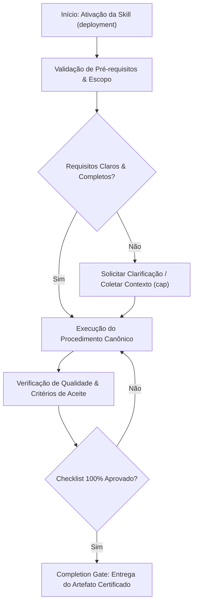

# Deployment

## When to Use

### Use when:
- Creating or updating CI/CD deployment pipelines, container definitions, and manifests
- Configuring Canary, Blue-Green, or Rolling update deployment strategies
- Establishing automated health check probes and metric-driven rollback thresholds

### Do not use when:
- Local development sandbox testing without deployment infrastructure

## Overview

Set up CI/CD pipelines and deployment configurations that automate the path from code to production. This skill detects the deployment target, generates pipeline config, creates pre/post-deploy checklists, and configures monitoring — producing a fully automated, rollback-ready deployment pipeline.

**Announce at start:** "I am using the deployment skill to set up the deployment pipeline."

## Phase 1: Detect Deployment Target

**STOP after this phase — present findings to user for confirmation before proceeding.**

Ask questions to identify the full deployment context:

**Platform Detection:**
- Where does this deploy? (Vercel, AWS, GCP, Azure, DigitalOcean, self-hosted)
- Container-based? (Docker, Kubernetes)
- Serverless? (Lambda, Cloud Functions, Edge Functions)

**CI/CD Detection:**
- What CI system? (GitHub Actions, GitLab CI, CircleCI, Jenkins)
- What triggers deployments? (push to main, tags, manual)
- Multi-environment? (dev, staging, production)

**Infrastructure Detection:**
- Database migrations needed?
- Environment variables management? (secrets manager, .env)
- CDN/caching? Asset pipeline?
- Monitoring/alerting? (Datadog, Sentry, New Relic)

### Platform Selection Decision Table

| Project Type | Recommended Platform | CI/CD | Why |
|---|---|---|---|
| Static site / SPA | Vercel, Netlify, Cloudflare Pages | Built-in | Zero config, edge CDN |
| Node.js API | AWS ECS, Cloud Run, Railway | GitHub Actions | Container support, auto-scaling |
| Monorepo (frontend + backend) | Vercel + AWS / Railway | GitHub Actions | Split concerns, independent scaling |
| Enterprise / compliance-heavy | AWS EKS, GKE | GitLab CI, Jenkins | Full control, audit trails |
| Hobby / side project | Railway, Fly.io, Render | Built-in or GitHub Actions | Simple, low cost |
| ML / data pipelines | AWS SageMaker, GCP Vertex | GitHub Actions + Airflow | GPU support, pipeline orchestration |

## Phase 2: Design Pipeline

**STOP after this phase — present pipeline design to user for approval before generating config.**

### Standard Pipeline Stages

```
┌─────────┐   ┌──────────┐   ┌──────────┐   ┌──────────┐   ┌──────────┐
│  Build   │──▶│   Test   │──▶│  Lint/   │──▶│  Deploy  │──▶│  Verify  │
│          │   │          │   │  Check   │   │          │   │          │
└─────────┘   └──────────┘   └──────────┘   └──────────┘   └──────────┘
```

**Build:** Install dependencies, compile, bundle
**Test:** Unit tests, integration tests, coverage check
**Lint/Check:** Linting, type checking, security audit
**Deploy:** Push to target environment
**Verify:** Health checks, smoke tests, monitoring

### Branch Strategy Decision Table

| Branch | Action | Environment | Gate |
|---|---|---|---|
| `feature/*` | Build + Test + Lint | None | PR checks pass |
| `main` | Build + Test + Lint + Deploy | Staging | All checks green |
| `release/*` or tags | Build + Test + Lint + Deploy | Production | Manual approval |
| `hotfix/*` | Build + Test + Deploy | Production (expedited) | Senior approval |

### Deployment Strategy Decision Table

| Strategy | When to Use | Risk Level | Rollback Speed |
|---|---|---|---|
| Direct deploy | Solo/hobby projects, staging | High | Slow (redeploy) |
| Blue-green | Apps with health checks, low-downtime needs | Low | Instant (switch) |
| Canary | High-traffic production, gradual rollout | Very Low | Fast (reroute) |
| Rolling | Kubernetes clusters, stateless services | Low | Medium |
| Feature flags | Decoupled deploy from release | Very Low | Instant (toggle) |

## Phase 3: Generate Config

### GitHub Actions Example

```yaml
name: CI/CD Pipeline

on:
  push:
    branches: [main]
  pull_request:
    branches: [main]

concurrency:
  group: ${{ github.workflow }}-${{ github.ref }}
  cancel-in-progress: true

jobs:
  build-and-test:
    runs-on: ubuntu-latest
    steps:
      - uses: actions/checkout@v4
      - uses: actions/setup-node@v4
        with:
          node-version: '20'
          cache: 'npm'
      - run: npm ci
      - run: npm run lint
      - run: npm run type-check
      - run: npm test -- --coverage
      - run: npm run build

  deploy-staging:
    needs: build-and-test
    if: github.ref == 'refs/heads/main'
    runs-on: ubuntu-latest
    environment: staging
    steps:
      - uses: actions/checkout@v4
      # [platform-specific deploy steps]

  deploy-production:
    needs: build-and-test
    if: startsWith(github.ref, 'refs/tags/v')
    runs-on: ubuntu-latest
    environment: production
    steps:
      - uses: actions/checkout@v4
      # [platform-specific deploy steps]
```

### GitLab CI Example

```yaml
stages:
  - build
  - test
  - deploy

build:
  stage: build
  script:
    - npm ci
    - npm run build
  artifacts:
    paths: [dist/]

test:
  stage: test
  script:
    - npm run lint
    - npm run type-check
    - npm test -- --coverage

deploy-staging:
  stage: deploy
  environment: staging
  script:
    - # platform-specific deploy
  only:
    - main

deploy-production:
  stage: deploy
  environment: production
  script:
    - # platform-specific deploy
  when: manual
  only:
    - tags
```

## Phase 4: Create Deployment Checklists

**STOP — present checklists to user. Customize based on their stack.**

### Pre-Deploy Checklist

```markdown
## Pre-Deploy Checklist

- [ ] All tests passing on CI
- [ ] Code reviewed and approved
- [ ] No critical/high security vulnerabilities
- [ ] Environment variables configured for target environment
- [ ] Database migrations tested (if applicable)
- [ ] Feature flags configured (if applicable)
- [ ] Rollback plan documented
- [ ] Monitoring/alerts configured
- [ ] Changelog updated
- [ ] Version bumped
```

### Post-Deploy Verification

```markdown
## Post-Deploy Verification

- [ ] Health check endpoint returns 200
- [ ] Smoke tests passing
- [ ] Error rate within normal range
- [ ] Response times within SLA
- [ ] Database migrations applied successfully
- [ ] Feature flags active/inactive as expected
- [ ] Monitoring dashboard showing expected metrics
- [ ] No new errors in error tracking (Sentry, etc.)
```

## Phase 5: Review and Finalize

Present the complete pipeline configuration to the user:
1. VERIFY CI/CD config file syntax is valid
2. VERIFY all environment variables are documented
3. VERIFY rollback plan exists
4. VERIFY pre/post-deploy checklists are complete
5. VERIFY the pipeline can be tested locally (act, etc.)

Save config to `.github/workflows/` or equivalent.

## Anti-Patterns / Common Mistakes

| Anti-Pattern | Why It Is Wrong | What to Do Instead |
|---|---|---|
| Manual production deploys | Error-prone, no audit trail | Automate via CI/CD pipeline |
| No rollback plan | Stuck if deploy breaks production | Define rollback before every deploy |
| Skipping staging | Bugs found in production | Always deploy to staging first |
| Secrets in code/config files | Security breach risk | Use secrets manager or env vars |
| `latest` tag for production images | Non-reproducible deploys | Pin specific version tags |
| No concurrency control | Conflicting deploys | Add concurrency groups to CI |
| Deploying without health checks | No visibility into deploy health | Add health endpoint + post-deploy check |
| Alert fatigue from noisy monitors | Real issues get missed | Alert on symptoms, tune thresholds |

## Key Principles

- **Automate everything** — no manual steps in the critical path
- **Fast feedback** — fail early, fail fast
- **Environment parity** — staging matches production
- **Rollback-ready** — every deploy has a rollback plan
- **Observable** — monitoring before, during, and after deploy
- **Secure** — no secrets in code, use secrets management
- **Idempotent** — deploying the same version twice produces the same result

## Integration Points

| Skill | Integration |
|---|---|
| `senior-devops` | Provides Docker, K8s, and IaC patterns used in deploy config |
| `git-commit-helper` | Conventional commits drive changelog and version bumping |
| `finishing-a-development-branch` | Branch completion triggers deployment pipeline |
| `verification-before-completion` | Post-deploy verification gate |
| `security-review` | Security scan stage in the pipeline |
| `planning` | Deployment plan is part of the implementation plan |

## Skill Type

**FLEXIBLE** — Adapt pipeline design, platform selection, and tooling to the project's cloud provider, team size, and operational maturity. The principles (automation, rollback, observability) are constant; specific tools are interchangeable.


## Decision Workflow




## Anti-Patterns & Operational Guardrails

| Anti-Pattern | Severidade | Impacto Negativo | Mitigação Canônica |
|:---|:---:|:---|:---|
| **Execução Prematura sem Contexto** | 🔴 Critical | Alucinação de contexto e refatoração destrutiva | Ativar a skill `cap` para adquirir evidências mínimas antes de editar. |
| **Omissão de Checklists de Validação** | 🟡 Medium | Entrega de artefatos com inconsistências sintáticas | Executar rigorosamente o checklist passo a passo antes do handoff. |
| **Falta de Documentação de Decisões** | 🟢 Low | Perda de rastreabilidade técnica e drift arquitetural | Registrar trade-offs relevantes via skill `adr-generator`. |


## Edge Cases & Failure Modes

- **Ambiente Restrito / Read-Only:** Se o filesystem ou sandbox estiver bloqueado contra escrita, reportar o bloqueio com evidência imediata e gerar o patch em markdown diff.
- **Conflito de Especificação:** Caso encontre contradições entre a intenção do usuário e o SSOT (`AGENTS.md`), interromper e sinalizar as opções com trade-offs.
- **Timeout ou Exaustão de Contexto:** Em tarefas volumosas, decompor em sub-lotes atômicos utilizando a skill `subagent-driven-development`.


## Domain SOTA & Industry Engineering Standards

- **Deployment Strategies:** Blue-Green Switching, Canary Deployments, Rolling Updates, and Shadow Deployment.
- **Cloud-Native Infrastructure:** Kubernetes Declarative Manifests, GitOps (ArgoCD/Flux), and Infrastructure-as-Code (Terraform/OpenTofu).
- **Automated Rollback Vectors:** Prometheus/Datadog metric-driven rollback thresholds.
- **Zero-Downtime Migrations:** Health checks (Liveness, Readiness, Startup probes) paired with pre-stop lifecycle hooks.

### Canary Deployment Gating Formula:
Canary traffic percentage $\alpha_{\text{canary}}$ scales progressively while error rates remain bounded:

$$\text{ErrorRate}_{\text{canary}} \le \text{ErrorRate}_{\text{baseline}} + \epsilon \quad (\epsilon = 0.005)$$

If $\text{ErrorRate}_{\text{canary}} > \text{Threshold}$, trigger automated instant rollback ($T_{\text{rollback}} \le 30\text{s}$).

### Exhaustive Heuristic Decision Rules:
1. **Rule of Thumb 1 (Readiness Probe Mandate):** Never send production traffic to a pod/container until its Readiness Probe explicitly returns HTTP 200.
2. **Rule of Thumb 2 (Immutable Artifacts):** Build container images and binary packages ONCE; propagate the exact same immutable SHA through Staging and Production.
3. **Rule of Thumb 3 (Database First Deployment):** Run database schema expansion BEFORE deploying application code; never deploy code that depends on unapplied migrations.
4. **Rule of Thumb 4 (Fast Rollback Capability):** Every production deploy must have an automated one-click or zero-click rollback vector.

## Completion Gate & Verification
Before concluding deployment execution:
- [ ] Immutable build artifact verified with green automated test suite
- [ ] Liveness and Readiness probes configured and returning HTTP 200
- [ ] Automated rollback vector tested and verified