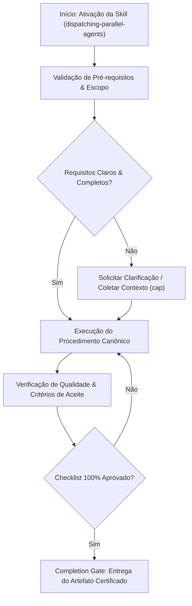

# Dispatching Parallel Agents

## When to Use

### Use when:
- 2+ independent tasks have zero shared dependencies and touch disjoint files
- Batch processing multiple distinct issues, features, or modules in parallel
- Running exploratory prototypes concurrently under strict time budgets

### Do not use when:
- Tasks have sequential dependencies where step B depends on output of step A
- Multiple subagents need to modify the exact same files or shared global state
- The system is operating near API rate limits (use sequential ReAct loop instead)

## Overview

This skill coordinates multiple agents working concurrently on independent subtasks to reduce total execution time while maintaining correctness. It provides strict rules for identifying safe parallelization opportunities, writing focused agent prompts, and integrating results without conflicts. The key constraint is that no two agents may modify the same file.

**Announce at start:** "I'm using the dispatching-parallel-agents skill to run [N] independent tasks concurrently."

## Agent Tool Reference

All dispatch uses the `Agent` tool. Parameters:
- `prompt` (required) — task description with full context
- `description` (required) — short label (3-5 words)
- `subagent_type` — `"Explore"` (codebase search), `"Plan"` (architecture), `"general-purpose"` (default)
- `run_in_background` — `true` for async (you'll be notified on completion)
- `model` — optional override: `"sonnet"`, `"opus"`, `"haiku"`

**Parallel:** Multiple `Agent` calls in one message run concurrently.
**Background:** `run_in_background=true` for non-blocking work.
**Named agents:** Use `subagent_type` to reference installed agent templates (e.g., `"superpowers:code-reviewer"`).

## Trigger Conditions

- A task decomposes into 2+ subtasks with no data dependencies between them
- Each subtask operates on different files or different sections of the codebase
- The combined result can be assembled after all agents complete
- Total serial time would be significantly longer than parallel time
- `/decompose` output reveals independent task clusters

---

## Phase 1: Independence Verification

**Goal:** Confirm subtasks are truly independent and safe to parallelize.

Every subtask must satisfy ALL four independence criteria:

| Criterion | Question | If NO |
|-----------|---------|-------|
| No shared files | Do any two agents write to the same file? | Serialize those tasks |
| No shared mutable state | Does any agent depend on a side effect of another? | Serialize dependent tasks |
| Self-contained context | Can each agent work with only its own inputs? | Provide more context or serialize |
| Independent verification | Can each agent's output be validated alone? | Combine into single task |

### Parallelization Decision Table

| Scenario | Parallelize? | Reason |
|----------|-------------|--------|
| Different files, different concerns | Yes | No conflict possible |
| Same module, different files | Yes (careful) | Verify no shared imports change |
| Same file, different sections | No | Merge conflicts inevitable |
| Task B uses Task A's output | No | Sequential dependency |
| Both read same files, write different | Yes | Reads are safe to parallelize |
| Both modify shared config file | No | Config conflicts |
| Independent test files | Yes | Tests are independent |
| One agent adds dep, another uses it | No | Package-level dependency |

### When NOT to Parallelize

- Subtasks share mutable state or modify the same files
- Task B depends on the output of Task A
- The overhead of coordination exceeds the time saved
- A single agent can complete the work in under 30 seconds
- The task requires iterative refinement where each step informs the next

**STOP — Do NOT dispatch agents (via the `Agent` tool) until:**
- [ ] All four independence criteria verified for every subtask pair
- [ ] No two agents write to the same file
- [ ] Each agent's context is self-contained

---

## Phase 2: Prompt Construction

**Goal:** Write focused, unambiguous prompts that prevent scope creep and conflicts.

Each agent prompt MUST contain exactly four sections:

### Section 1: Scope (What to Do)

Be specific about the exact task, files, and expected changes.

```
SCOPE: Add structured JSON logging to all API route handlers in src/api/.
Replace console.log calls with the logger from src/utils/logger.ts.
Files to modify: src/api/users.ts, src/api/orders.ts, src/api/products.ts.
```

### Section 2: Context (Everything Needed)

Provide all information the agent needs without requiring it to explore.

```
CONTEXT:
- Logger API: logger.info(message, metadata), logger.error(message, error)
- Import: import { logger } from '../utils/logger'
- Current pattern in files: console.log('action', data)
- Target pattern: logger.info('action', { data, requestId: req.id })
```

### Section 3: Output Format (What to Return)

Define exactly what the agent should produce.

```
OUTPUT: For each modified file, return:
1. The file path
2. A summary of changes made
3. Number of console.log calls replaced
```

### Section 4: Constraints (What NOT to Do)

Prevent scope creep and conflicts explicitly.

```
CONSTRAINTS:
- Do NOT modify any files outside src/api/
- Do NOT change the logger utility itself
- Do NOT add new dependencies
- Do NOT refactor function signatures
- Do NOT modify test files
- If you encounter an issue outside your scope, report it but do not fix it
```

### Agent Prompt Template

```
You are a focused agent with a single task.

## Scope
[Specific task description with exact files]

## Context
[All information needed to complete the task]
[Relevant code patterns, APIs, conventions]

## Output Format
[Exact structure of what to return]

## Constraints
- Do NOT modify files outside: [list]
- Do NOT change: [list things to leave alone]
- Do NOT add dependencies
- If you encounter an issue outside your scope, report it but do not fix it
```

### Prompt Quality Checklist

| Check | Question |
|-------|---------|
| Scope is specific | Can the agent complete the task without guessing? |
| Context is complete | Does the agent need to explore the codebase? (should be no) |
| Output is defined | Will the agent return what you need to integrate? |
| Constraints are explicit | Are file boundaries and "do NOT" items clear? |

**STOP — Do NOT dispatch (via the `Agent` tool) until:**
- [ ] Every prompt has all 4 sections
- [ ] No prompt requires the agent to explore beyond provided context
- [ ] File boundaries are explicit in every constraint section

---

## Phase 3: Dispatch and Monitor

**Goal:** Launch all agents (via the `Agent` tool) concurrently and track completion.

1. Launch all agents concurrently by invoking multiple `Agent` tool calls in a single message
2. Each agent works in isolation on its designated files
3. Monitor for completion — wait for ALL agents to finish
4. Collect outputs from every agent

### Dispatch Tracking Table

```
| Agent | Task | Status | Files | Result |
|-------|------|--------|-------|--------|
| Agent 1 | Add logging to API | in_progress | src/api/*.ts | — |
| Agent 2 | Update unit tests | in_progress | tests/unit/*.ts | — |
| Agent 3 | Fix CSS layout | in_progress | src/styles/*.css | — |
```

### Failure Handling During Dispatch

| Scenario | Action |
|----------|--------|
| One agent fails, others succeed | Retry failed agent independently (via the `Agent` tool) |
| Multiple agents fail independently | Retry each independently (via the `Agent` tool) |
| Agent reports out-of-scope issue | Note for post-integration review |
| Agent exceeds scope (modifies wrong files) | Reject output, re-dispatch (via the `Agent` tool) with stricter constraints |

---

## Phase 4: Integration and Verification

**Goal:** Combine all agent outputs and verify the integrated result.

1. **Collect outputs** — Gather results from every agent
2. **Check for conflicts** — Verify no file was modified by multiple agents
3. **Apply changes** — Integrate all outputs into the codebase
4. **Run integration checks** — Execute the full test suite
5. **Resolve issues** — If integration fails, identify which agent's changes caused it
6. **Commit atomically** — All changes go in together or not at all

### Integration Verification Checklist

| Check | Command | Must Pass |
|-------|---------|-----------|
| No file conflicts | Diff outputs for shared files | Yes |
| Tests pass | Full test suite | Yes |
| Build passes | Build command | Yes |
| Lint passes | Lint command | Yes |
| No regressions | Compare test count before/after | Yes |

### Integration Failure Decision Table

| Failure Type | Diagnosis | Action |
|-------------|-----------|--------|
| Test failure in Agent 1's files | Agent 1's changes have a bug | Re-dispatch Agent 1 (via the `Agent` tool) with test failure context |
| Test failure in unrelated files | Cross-cutting regression | Identify root cause, fix manually or re-dispatch (via the `Agent` tool) |
| Build failure | Import/type issue | Check which agent's changes caused it, fix |
| Merge conflict | Agents touched same file (should not happen) | Rollback, serialize those tasks |

**STOP — Do NOT commit until:**
- [ ] All agent outputs collected
- [ ] No file conflicts detected
- [ ] Full test suite passes
- [ ] Build and lint pass

---

## Common Parallel Patterns

### Pattern Decision Table

| Pattern | When to Use | Example |
|---------|-----------|---------|
| By Module | Independent modules or packages | One `Agent` call per microservice |
| By Layer | Layers touch different files | API agent, service agent, data agent |
| By Feature Area | Independent vertical slices | Auth agent, profile agent, billing agent |
| By Task Type | Code, tests, docs touch different files | Code agent, test agent, docs agent |

### Example: Full Dispatch

```
TASK: "Update the API to v2, add tests, and update OpenAPI spec"

AGENT 1 - API Routes:
  Scope: Update route handlers in src/routes/v2/
  Context: [v2 API spec, breaking changes list]
  Output: Modified files list, breaking changes implemented
  Constraints: Do NOT touch tests or docs

AGENT 2 - Tests:
  Scope: Write tests in tests/v2/
  Context: [v2 API spec, test conventions, existing v1 tests as reference]
  Output: New test files, coverage summary
  Constraints: Do NOT modify source code

AGENT 3 - OpenAPI Spec:
  Scope: Update openapi/v2.yaml
  Context: [v2 API spec, OpenAPI 3.1 format]
  Output: Updated spec file
  Constraints: Do NOT modify code or tests
```

---

## Anti-Patterns / Common Mistakes

| Anti-Pattern | Why It Fails | Correct Approach |
|-------------|-------------|-----------------|
| Two agents modifying the same file | Merge conflicts, data loss | One file owner per `Agent` dispatch |
| Shared mutable state between agents | Race conditions, inconsistency | Eliminate shared state |
| Incomplete context in prompts | Agents explore and step on each other | Provide ALL needed context |
| Vague file boundaries | Agents guess scope, modify wrong files | Explicit file lists in constraints |
| No integration check after completion | Cross-cutting bugs go undetected | Full test suite after integration |
| Parallelizing sequential tasks | Agent B needs Agent A's output | Verify independence first |
| Not tracking which agent touched which file | Cannot diagnose integration failures | Maintain dispatch tracking table |
| Dispatching too many agents (10+) | Coordination overhead exceeds savings | 2-5 `Agent` calls per dispatch round |
| Skipping rollback preparation | Cannot recover from integration failure | Keep pre-dispatch state recoverable |

---

## Anti-Rationalization Guards

<HARD-GATE>
Do NOT dispatch agents (via the `Agent` tool) that modify the same file. Do NOT parallelize tasks with data dependencies. Do NOT skip integration verification. If independence criteria are not met, serialize the tasks.
</HARD-GATE>

If you catch yourself thinking:
- "These agents probably won't conflict..." — Verify. Do not assume.
- "The integration will be fine..." — Run the full test suite. Always.
- "I can merge their changes to the same file manually..." — No. One file, one owner.

---

## Integration Points

| Skill | Relationship | When |
|-------|-------------|------|
| `task-decomposition` | Upstream — identifies independent task clusters | Before dispatching |
| `subagent-driven-development` | Complementary — provides review gates | Quality gates for agent output |
| `executing-plans` | Upstream — may delegate independent tasks | During plan execution |
| `verification-before-completion` | Downstream — verifies integrated result | After integration |
| `code-review` | Downstream — reviews integrated changes | After all agents complete |
| `resilient-execution` | On failure — retries failed agents | When individual agents fail |

---

## Parallelism Safety Rules Summary

| Rule | Rationale |
|------|-----------|
| No two agents modify the same file | Prevents merge conflicts and race conditions |
| No shared mutable state | Eliminates data races |
| Each agent gets complete context | Prevents agents from exploring and stepping on each other |
| Define file boundaries explicitly | Makes ownership unambiguous |
| Review integration after completion | Catches cross-cutting issues |
| Atomic commit for all changes | All in or all out |
| Always have a rollback path | Keep pre-dispatch state recoverable |

---

## Skill Type

**RIGID** — Follow this process exactly. Independence verification is mandatory. All four prompt sections are mandatory. Integration verification is mandatory. No shortcuts on parallelism safety.


## Decision Workflow




## Anti-Patterns & Operational Guardrails

| Anti-Pattern | Severidade | Impacto Negativo | Mitigação Canônica |
|:---|:---:|:---|:---|
| **Execução Prematura sem Contexto** | 🔴 Critical | Alucinação de contexto e refatoração destrutiva | Ativar a skill `cap` para adquirir evidências mínimas antes de editar. |
| **Omissão de Checklists de Validação** | 🟡 Medium | Entrega de artefatos com inconsistências sintáticas | Executar rigorosamente o checklist passo a passo antes do handoff. |
| **Falta de Documentação de Decisões** | 🟢 Low | Perda de rastreabilidade técnica e drift arquitetural | Registrar trade-offs relevantes via skill `adr-generator`. |


## Edge Cases & Failure Modes

- **Ambiente Restrito / Read-Only:** Se o filesystem ou sandbox estiver bloqueado contra escrita, reportar o bloqueio com evidência imediata e gerar o patch em markdown diff.
- **Conflito de Especificação:** Caso encontre contradições entre a intenção do usuário e o SSOT (`AGENTS.md`), interromper e sinalizar as opções com trade-offs.
- **Timeout ou Exaustão de Contexto:** Em tarefas volumosas, decompor em sub-lotes atômicos utilizando a skill `subagent-driven-development`.


## Domain SOTA & Industry Engineering Standards

- **Concurrency & Parallelism Models:** Actor Model, Fork-Join Parallelism, and Work-Stealing Pool architectures.
- **Resource Budgeting:** Mathematical Token Partitioning across concurrent execution threads.
- **Merge & Conflict Resolution:** Three-way merge algorithms and deterministic AST reconciliation.
- **Rate Limiting & Throttling:** Token Bucket algorithm for API request pacing under concurrent agent load.

### Dynamic Token Budget Partitioning Formula:

$$B_{\text{subagent}}^{(i)} = \frac{B_{\text{total}} - B_{\text{orchestrator}}}{M} \times W_i \quad \text{where} \quad \sum_{i=1}^M W_i = 1.0$$

### Exhaustive Heuristic Decision Rules:
- **Rule of Thumb 1 (Zero-Trust Architectural Boundaries):** Treat all external inputs, third-party payloads, and cross-module boundaries with strict zero-trust schema validation.
- **Rule of Thumb 2 (Fail-Fast & Deterministic Errors):** Reject invalid states immediately with typed, actionable error contracts rather than cascading silent failures.
- **Rule of Thumb 3 (Idempotency & AST Preservation):** State mutations and code transformations must maintain semantic idempotency across repeated executions.
- **Rule of Thumb 4 (Benchmark & Telemetry Alignment):** Measure critical execution latency ($P_{95}$) and memory overhead with structured telemetry and baseline benchmarks.
- **Rule of Thumb 5 (Event-Driven & Circuit Breaker Decoupling):** Isolate asynchronous operations behind circuit breakers and resilient retry mechanisms to prevent cascading failure.
- **Rule of Thumb 6 (Contract-First DDD Modeling):** Define clear domain aggregates, value objects, and typed interface contracts before implementing concrete logic.
- **Rule of Thumb 7 (RAG & Semantic Retrieval Precision):** Optimize context retrieval with hybrid lexical-vector search and reciprocal rank fusion to eliminate hallucinated routing.
- **Rule of Thumb 8 (OWASP & Supply Chain Verification):** Verify dependencies and data flows against OWASP Top 10 and SLSA Level 3 supply chain security standards.
- **Rule of Thumb 9 (Verification Gate Invariant):** Never declare completion without automated test execution evidence and zero compiler/linter warnings.
## Completion Gate & Verification
Before declaring parallel dispatching complete:
- [ ] All subagent result envelopes received and schema-validated
- [ ] AST diff reconciliation executed with zero syntax errors
- [ ] Consolidated test suite executed with exit code 0