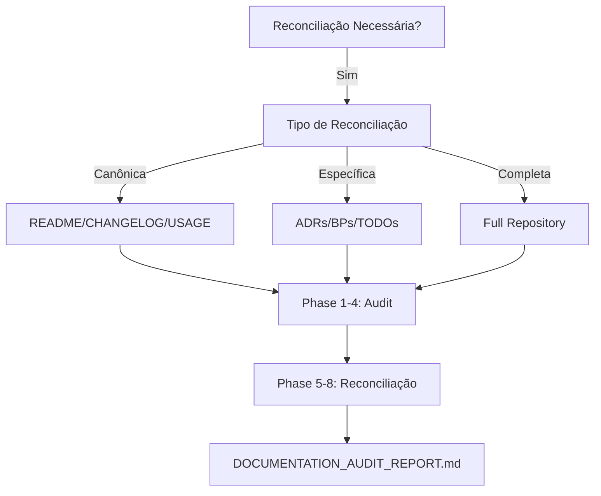

# Documentation Reconciliation

Audita e reconcilia documentação canônica e específica contra realidade do código, identificando gaps, status incorretos e artefatos não arquivados.

## Quando Usar

### Use quando:
- README/CHANGELOG/USAGE desatualizados
- ADRs/BPs/TODOs com status incorretos
- ADRs implementadas não arquivadas
- Antes de release ou deploy gh-pages
- Gaps entre documentação e implementação

### Não use quando:
- Documentação já está sincronizada
- Apenas atualização pontual de texto

### Skills relacionadas:
- `governance` — processos de governança e versionamento
- `adr-generator` — criação de ADRs
- `skill-audit-bulletin` — auditoria de qualidade de skills

## Decision Tree



## Workflow

### Fase 1: Repository Inventory
1. Executar `git status`, `git log --oneline -50`, `git diff --stat`
2. Identificar arquivos modificados recentemente
3. **Checkpoint**: Listar mudanças não documentadas

### Fase 2: Canonical Docs Audit
1. Comparar README.md ↔ index.json ↔ skills/
2. Verificar CHANGELOG.md tem entradas para commits recentes
3. Validar USAGE.md tem comandos atuais
4. **Checkpoint**: Identificar drift em cada documento

### Fase 3: ADR/BP/TODO Audit
1. Listar ADRs com status "Implementado" mas não arquivadas
2. Verificar BPs com TODOs incompletos
3. Identificar ADRs sem templates completos
4. **Checkpoint**: Listar artefatos com gaps

### Fase 4: Governance Audit
1. Verificar branch protection rules seguidas
2. Validar SemVer aplicado corretamente
3. Checar processos de arquivamento
4. **Checkpoint**: Identificar violações de governance

### Fase 5: Documentation Reconciliation
1. Atualizar README.md com features/skills atuais
2. Gerar CHANGELOG.md com commits não documentados
3. Sincronizar USAGE.md com comandos reais
4. **Checkpoint**: Documentos reconciliados

### Fase 6: Origin Artifact Reconciliation
1. Arquivar ADRs implementadas com `./scripts/archive-adrs.sh`
2. Atualizar `docs/adr/INDEX.md`
3. Reconciliar BPs/TODOs com status real
4. **Checkpoint**: Artefatos origem reconciliados

### Fase 7: Governance Report
1. Gerar `docs/DOCUMENTATION_AUDIT_REPORT.md`
2. Incluir: drift findings, arquivos atualizados, compliance score
3. **Checkpoint**: Relatório completo

## Conceitos Fundamentais

### Repository Truth Model
Modelo autoritativo derivado de: código fonte, git history, diffs, governance. Documentação deve refletir este modelo.

### Canonical Documents
Documentos canônicos: README.md, CHANGELOG.md, USAGE.md. Devem sempre refletir realidade.

### Origin Artifacts
Artefatos que originaram implementações: ADRs, BPs, TODOs. Devem ser reconciliados quando implementação divergir.

## Templates

### audit-report
Localização: `templates/audit-report.md`

Template para DOCUMENTATION_AUDIT_REPORT.md.

**Uso:**
```bash
cp templates/audit-report.md docs/DOCUMENTATION_AUDIT_REPORT.md
```

### reconciliation-checklist
Localização: `templates/reconciliation-checklist.md`

Checklist de reconciliação documental.

**Uso:**
```bash
cp templates/reconciliation-checklist.md ./RECONCILIATION_CHECKLIST.md
```

## Anti-patterns

### 🔴 Crítico
#### Documentação não sincronizada
**O que é:** README/CHANGELOG/USAGE não refletem mudanças no código.
**Por que é ruim:** Usuários e agentes seguem instruções obsoletas.
**Como evitar:** Executar reconciliação antes de cada release.

#### ADR implementada não arquivada
**O que é:** ADR com status "Implementado" mas não movida para archive.
**Por que é ruim:** INDEX.md mostra ADRs que já foram implementadas.
**Como evitar:** Sempre executar `./scripts/archive-adrs.sh` após implementação.

### 🟡 Médio
#### Changelog desorganizado
**O que é:** Entradas não categorizadas ou em ordem cronológica.
**Por que é ruim:** Difícil rastrear mudanças significativas.
**Como evitar:** Usar formato Keep a Changelog (Added, Changed, Fixed).

#### Status incorreto em ADR
**O que é:** ADR com status "Proposto" mas já implementada.
**Por que é ruim:** Dificulta rastreamento de decisões ativas.
**Como evitar:** Atualizar status imediatamente após implementação.

### 🟢 Baixo
#### Frontmatter incompleto
**O que é:** SKILL.md sem campos obrigatórios.
**Por que é ruim:** Dificulta descoberta automática.
**Como evitar:** Validar com `./scripts/validate-skill.sh`.

## Checklists

### Checklist de Reconciliação Canônica
- [ ] README.md reflete skills atuais
- [ ] CHANGELOG.md tem entrada para commits recentes
- [ ] USAGE.md comandos são executáveis
- [ ] index.json sincronizado com skills/

### Checklist de Reconciliação ADR
- [ ] ADRs "Implementado" estão em archive/
- [ ] INDEX.md atualizado
- [ ] BPs/TODOs reconciliados com status real
- [ ] Scripts de arquivamento executados

### Checklist de Governance
- [ ] Branch protection seguida
- [ ] SemVer aplicado corretamente
- [ ] Processos de arquivamento completos
- [ ] CI/CD validando mudanças

## Edge Cases

### ADR com múltiplas implementações parciais
**Situação:** ADR implementada parcialmente em múltiplos branches.
**Solução:** Criar ADR filha para cada implementação parcial.
**Exceção:** Se implementação for contínua, manter status "Em Progresso".

### Changelog com commits de merge
**Situação:** Commits de merge poluem o changelog.
**Solução:** Filtrar commits com `git log --merges --first-parent`.
**Exceção:** Se merge contém mudanças significativas, documentar.

### README com badges quebrados
**Situação:** Badges apontam para URLs que não existem.
**Solução:** Remover badges quebrados ou corrigir URLs.
**Exceção:** Badges de CI que podem estar temporariamente quebrados.

## Referências

- [ADR-006](./docs/adr/archive/ADR-006.md) — Ultra-High Quality Grade
- [Governance](./skills/governance/SKILL.md) — Processos de governança
- [ADR Generator](./skills/adr-generator/SKILL.md) — Templates ADR
- [Keep a Changelog](https://keepachangelog.com/) — Formato de changelog