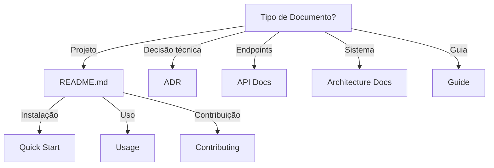

# Documentation

Guia para documentação técnica eficaz e padronizada.

## Quando Usar

### Use quando:
- Precisa criar documentação de projeto
- Precisa escrever ADR
- Precisa documentar API
- Precisa revisar documentação existente
- Precisa padronizar documentação entre projetos

### Não use quando:
- Protótipo rápido sem documentação
- Código autoexplicativo (ex: script pequeno)
- Documentação já existe e está atualizada

### Skills relacionadas:
- `adr-generator` — para Architecture Decision Records
- `repo-bootstrap` — para arquivos iniciais de documentação

## Decision Tree



## Workflow

### Fase 1: Criar Documentação de Projeto

1. Crie README.md com estrutura:
   ```markdown
   # Nome do Projeto
   
   ## Visão Geral
   {O que o projeto faz}
   
   ## Instalação
   {Como instalar em 5 minutos}
   
   ## Uso
   {Exemplos básicos}
   
   ## Documentação
   {Links para docs detalhadas}
   ```
2. Adicione badges:
   ```markdown
   
   
   ```
3. **Checkpoint**: README renderiza corretamente no GitHub

### Fase 2: Escrever ADR

1. Crie arquivo em `docs/adr/ADR-XXX.md`:
   ```bash
   cp templates/adr.md docs/adr/ADR-003.md
   ```
2. Preencha contexto:
   - Problema
   - Motivação
   - Restrições
3. Liste alternativas:
   - Alternativa A: prós/contras
   - Alternativa B: prós/contras
4. Defina decisão
5. Documente consequências
6. **Checkpoint**: ADR aprovado e linkado em README

### Fase 3: Documentar API

1. Identifique endpoints:
   ```bash
   # Listar rotas
   grep -r "router\." src/
   ```
2. Para cada endpoint, documente:
   - Method e path
   - Request body (exemplo)
   - Response (exemplo)
   - Códigos de erro
3. Use OpenAPI/Swagger:
   ```yaml
   /users/{id}:
     get:
       summary: Get user by ID
       parameters:
         - name: id
           in: path
           required: true
           schema:
             type: string
       responses:
         200:
           description: User found
         404:
           description: User not found
   ```
4. **Checkpoint**: Swagger UI funciona e documenta todos endpoints

### Fase 4: Revisar Documentação Existente

1. Verifique links quebrados:
   ```bash
   # Usar markdown-link-check
   npx markdown-link-check README.md
   ```
2. Verifique datas:
   - README atualizado?
   - CHANGELOG atualizado?
3. Verifique exemplos:
   - Código funciona?
   - Versões corretas?
4. **Checkpoint**: Nenhum link quebrado, exemplos funcionam

## Conceitos Fundamentais

### Docs-as-Code

Documentação versionada no mesmo repo que código.

- Use Markdown
- Review via PR
- CI verifica links
- Versionamento junto com código

### Progressive Disclosure

Informação básica primeiro, detalhes depois.

```markdown
# Visão Geral (1 parágrafo)

## Instalação (passo a passo)

### Configuração Avançada (opcional)
```

### Single Source of Truth

Uma fonte, não cópias.

- README aponta para docs/
- ADRs em docs/adr/
- API docs em docs/api/

## Templates

### readme.md
Localização: `templates/readme.md`

Template para README de projeto.

**Uso:**
```bash
cp templates/readme.md README.md
```

### adr.md
Localização: `templates/adr.md`

Template para Architecture Decision Record.

**Uso:**
```bash
cp templates/adr.md docs/adr/ADR-00X.md
```

### api-doc.md
Localização: `templates/api-doc.md`

Template para documentação de API.

**Uso:**
```bash
cp templates/api-doc.md docs/api/endpoints.md
```

### architecture-doc.md
Localização: `templates/architecture-doc.md`

Template para documentação de arquitetura.

**Uso:**
```bash
cp templates/architecture-doc.md docs/architecture/overview.md
```

## Anti-patterns

### 🔴 Crítico

#### Documentação Desatualizada
**O que é:** Documentação que não reflete código atual.
**Por que é ruim:** Desinforma usuários, causa frustração.
**Como evitar:** Atualize docs junto com código, CI verifica.
**Exemplo:**
```
# ❌ ERRADO
README: "Use npm start para rodar"
package.json: "start": "node server.js"  # mas arquivo se chama index.js

# ✅ CORRETO
README: "Use npm start para rodar"
package.json: "start": "node index.js"  # alinhado
```

#### Documentação sem Exemplos
**O que é:** Documentação que só descreve sem mostrar código.
**Por que é ruim:** Usuários não sabem como usar, abrem issues.
**Como evitar:** Sempre inclua exemplos funcionais.
**Exemplo:**
```
# ❌ ERRADO
"Use a função createUser para criar usuário"

# ✅ CORRETO
"Use a função createUser para criar usuário:
```javascript
const user = await createUser({
  name: 'John',
  email: 'john@example.com'
});
```"
```

### 🟡 Médio

#### Documentação Duplicada
**O que é:** Mesma informação em múltiplos arquivos.
**Por que é ruim:** Manutenção dupla, inconsistência.
**Como evitar:** Single source of truth, links internos.
**Exemplo:**
```
# ❌ ERRADO
README.md: "Instale com npm install"
docs/install.md: "Instale com npm install"

# ✅ CORRETO
README.md: "Instale com npm install. Veja [Instalação Detalhada](docs/install.md)"
docs/install.md: "Instale com npm install"
```

#### Documentação sem Estrutura
**O que é:** Documentação sem headings, impossível navegar.
**Por que é ruim:** Usuários não encontram informação.
**Como evitar:** Use headings hierárquicos (#, ##, ###).
**Exemplo:**
```
# ❌ ERRADO
"Projeto X faz Y. Para instalar, rode npm install. Para usar..."

# ✅ CORRETO
# Projeto X

## Instalação
npm install

## Uso
..."
```

### 🟢 Baixo

#### Documentação sem Badges
**O que é:** README sem badges de CI, coverage, versão.
**Por que é ruim:** Usuários não sabem status do projeto.
**Como evitar:** Adicione badges padrão no topo.
**Exemplo:**
```markdown
# ✅ CORRETO


```

## Checklists

### Checklist de Review de Doc
- [ ] Links internos funcionam
- [ ] Links externos funcionam
- [ ] Exemplos de código funcionam
- [ ] Versões especificadas corretamente
- [ ] Gramática e português corretos

### Checklist de Link Checker
- [ ] README.md sem links quebrados
- [ ] docs/ sem links quebrados
- [ ] ADRs sem links quebrados
- [ ] API docs sem links quebrados

### Checklist de Freshness
- [ ] README atualizado (últimos 6 meses)
- [ ] CHANGELOG atualizado
- [ ] API docs atualizados
- [ ] Architecture docs atualizados

## Edge Cases

### Documentação para Projeto Legado
**Situação:** Projeto sem documentação, precisa ser criada.
**Solução:** Comece com README mínimo, evolua incrementalmente.
**Exceção:** Se projeto será descontinuado, documente apenas o essencial.

```bash
# README mínimo para legado
# Projeto Legado

## Como rodar
docker-compose up -d
```

### Documentação para Microserviço
**Situação:** Documentar microserviço vs monolito.
**Solução:** Foque em contrato de API, não em implementação.
**Exceção:** Se microserviço é crítico, documente arquitetura também.

```markdown
# Microserviço X

## API
{Endpoints e contratos}

## Integração
{Como outros serviços consomem}
```

## Referências

- [Keep a Changelog](https://keepachangelog.com/)
- [Markdown Guide](https://www.markdownguide.org/)
- `adr-generator` — para ADRs
- `repo-bootstrap` — para estrutura inicial