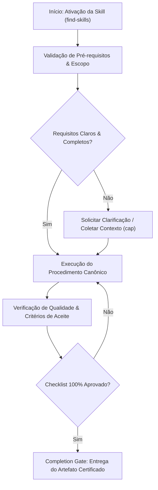

# Find Skills

This skill helps you discover and install skills from the open agent skills ecosystem.

## When to Use This Skill


## Decision Workflow



Use this skill when the user:

- Asks "how do I do X" where X might be a common task with an existing skill
- Says "find a skill for X" or "is there a skill for X"
- Asks "can you do X" where X is a specialized capability
- Expresses interest in extending agent capabilities
- Wants to search for tools, templates, or workflows
- Mentions they wish they had help with a specific domain (design, testing, deployment, etc.)

## What is the Skills CLI?

The Skills CLI (`npx skills`) is the package manager for the open agent skills ecosystem. Skills are modular packages that extend agent capabilities with specialized knowledge, workflows, and tools.

**Key commands:**

- `npx skills find [query] [--owner <owner>]` - Search for skills interactively or by keyword, optionally scoped to a GitHub owner
- `npx skills add <package>` - Install a skill from GitHub or other sources
- `npx skills check` - Check for skill updates
- `npx skills update` - Update all installed skills

**Browse skills at:** https://skills.sh/

## How to Help Users Find Skills

### Step 1: Understand What They Need

When a user asks for help with something, identify:

1. The domain (e.g., React, testing, design, deployment)
2. The specific task (e.g., writing tests, creating animations, reviewing PRs)
3. Whether this is a common enough task that a skill likely exists

### Step 2: Check the Leaderboard First

Before running a CLI search, check the [skills.sh leaderboard](https://skills.sh/) to see if a well-known skill already exists for the domain. The leaderboard ranks skills by total installs, surfacing the most popular and battle-tested options.

For example, top skills for web development include:
- `vercel-labs/agent-skills` — React, Next.js, web design (100K+ installs each)
- `anthropics/skills` — Frontend design, document processing (100K+ installs)

### Step 3: Search for Skills

If the leaderboard doesn't cover the user's need, run the find command:

```bash
npx skills find [query] [--owner <owner>]
```

For example:

- User asks "how do I make my React app faster?" → `npx skills find react performance`
- User asks "can you help me with PR reviews?" → `npx skills find pr review`
- User asks "I need to create a changelog" → `npx skills find changelog`

### Step 4: Verify Quality Before Recommending

**Do not recommend a skill based solely on search results.** Always verify:

1. **Install count** — Prefer skills with 1K+ installs. Be cautious with anything under 100.
2. **Source reputation** — Official sources (`vercel-labs`, `anthropics`, `microsoft`) are more trustworthy than unknown authors.
3. **GitHub stars** — Check the source repository. A skill from a repo with <100 stars should be treated with skepticism.

### Step 5: Present Options to the User

When you find relevant skills, present them to the user with:

1. The skill name and what it does
2. The install count and source
3. The install command they can run
4. A link to learn more at skills.sh

Example response:

```
I found a skill that might help! The "react-best-practices" skill provides
React and Next.js performance optimization guidelines from Vercel Engineering.
(185K installs)

To install it:
npx skills add vercel-labs/agent-skills@react-best-practices

Learn more: https://skills.sh/vercel-labs/agent-skills/react-best-practices
```

### Step 6: Offer to Install

If the user wants to proceed, you can install the skill for them:

```bash
npx skills add <owner/repo@skill> -g -y
```

The `-g` flag installs globally (user-level) and `-y` skips confirmation prompts.

## Common Skill Categories

When searching, consider these common categories:

| Category        | Example Queries                          |
| --------------- | ---------------------------------------- |
| Web Development | react, nextjs, typescript, css, tailwind |
| Testing         | testing, jest, playwright, e2e           |
| DevOps          | deploy, docker, kubernetes, ci-cd        |
| Documentation   | docs, readme, changelog, api-docs        |
| Code Quality    | review, lint, refactor, best-practices   |
| Design          | ui, ux, design-system, accessibility     |
| Productivity    | workflow, automation, git                |

## Tips for Effective Searches

1. **Use specific keywords**: "react testing" is better than just "testing"
2. **Try alternative terms**: If "deploy" doesn't work, try "deployment" or "ci-cd"
3. **Check popular sources**: Many skills come from `vercel-labs/agent-skills` or `ComposioHQ/awesome-claude-skills`

## When No Skills Are Found

If no relevant skills exist:

1. Acknowledge that no existing skill was found
2. Offer to help with the task directly using your general capabilities
3. Suggest the user could create their own skill with `npx skills init`

Example:

```
I searched for skills related to "xyz" but didn't find any matches.
I can still help you with this task directly! Would you like me to proceed?

If this is something you do often, you could create your own skill:
npx skills init my-xyz-skill
```


## Anti-Patterns & Operational Guardrails

| Anti-Pattern | Severidade | Impacto Negativo | Mitigação Canônica |
|:---|:---:|:---|:---|
| **Execução Prematura sem Contexto** | 🔴 Critical | Alucinação de contexto e refatoração destrutiva | Ativar a skill `cap` para adquirir evidências mínimas antes de editar. |
| **Omissão de Checklists de Validação** | 🟡 Medium | Entrega de artefatos com inconsistências sintáticas | Executar rigorosamente o checklist passo a passo antes do handoff. |
| **Falta de Documentação de Decisões** | 🟢 Low | Perda de rastreabilidade técnica e drift arquitetural | Registrar trade-offs relevantes via skill `adr-generator`. |


## Edge Cases & Failure Modes

- **Ambiente Restrito / Read-Only:** Se o filesystem ou sandbox estiver bloqueado contra escrita, reportar o bloqueio com evidência imediata e gerar o patch em markdown diff.
- **Conflito de Especificação:** Caso encontre contradições entre a intenção do usuário e o SSOT (`AGENTS.md`), interromper e sinalizar as opções com trade-offs.
- **Timeout ou Exaustão de Contexto:** Em tarefas volumosas, decompor em sub-lotes atômicos utilizando a skill `subagent-driven-development`.


## Domain SOTA & Industry Engineering Standards

- **Lexical Search Engines:** SQLite FTS5 with BM25 ranking, Porter stemmer, and unicode61 tokenizer.
- **Query Expansion:** Automatic synonym expansion, kebab-case splitting, and tag matching.
- **Fuzzy Search Ladders:** Exact Match $	o$ Prefix Match (`prefix*`) $	o$ Trigram/Levenshtein Fuzzy Match.
- **Zero-Latency Invariants:** In-memory caching for sub-millisecond CLI routing lookups.

### Search Fallback Ladder:

```text
Query ──> Exact Match in index.json?
             ├── YES ──> Return Skill (Rank #1)
             └── NO  ──> SQLite FTS5 BM25 Search
                            ├── MATCH ──> Return Ranked Results
                            └── NO MATCH ──> Trigram Fuzzy Match Fallback
```

### Exhaustive Heuristic Decision Rules:
- **Rule of Thumb 1 (Zero-Trust Architectural Boundaries):** Treat all external inputs, third-party payloads, and cross-module boundaries with strict zero-trust schema validation.
- **Rule of Thumb 2 (Fail-Fast & Deterministic Errors):** Reject invalid states immediately with typed, actionable error contracts rather than cascading silent failures.
- **Rule of Thumb 3 (Idempotency & AST Preservation):** State mutations and code transformations must maintain semantic idempotency across repeated executions.
- **Rule of Thumb 4 (Benchmark & Telemetry Alignment):** Measure critical execution latency ($P_{95}$) and memory overhead with structured telemetry and baseline benchmarks.
- **Rule of Thumb 5 (Event-Driven & Circuit Breaker Decoupling):** Isolate asynchronous operations behind circuit breakers and resilient retry mechanisms to prevent cascading failure.
- **Rule of Thumb 6 (Contract-First DDD Modeling):** Define clear domain aggregates, value objects, and typed interface contracts before implementing concrete logic.
- **Rule of Thumb 7 (RAG & Semantic Retrieval Precision):** Optimize context retrieval with hybrid lexical-vector search and reciprocal rank fusion to eliminate hallucinated routing.
- **Rule of Thumb 8 (OWASP & Supply Chain Verification):** Verify dependencies and data flows against OWASP Top 10 and SLSA Level 3 supply chain security standards.
- **Rule of Thumb 9 (Verification Gate Invariant):** Never declare completion without automated test execution evidence and zero compiler/linter warnings.
## Operational Verification Checklist

- [ ] Todos os pré-requisitos e arquivos-alvo foram inspecionados antes da modificação.
- [ ] O procedimento seguiu estritamente as regras e boas práticas da especialização.
- [ ] As diretrizes de segurança, tipagem e estilo foram preservadas.
- [ ] Os testes unitários ou comandos de validação foram executados com sucesso.
- [ ] O artefato final foi inspecionado contra o completion gate.


## Completion Gate & Verification
Before concluding skill search:
- [ ] Relevant skills retrieved with name, version, and concise summary
- [ ] Sub-millisecond lookup latency achieved via local SQLite index
- [ ] Exact match or fuzzy match fallback clearly identified