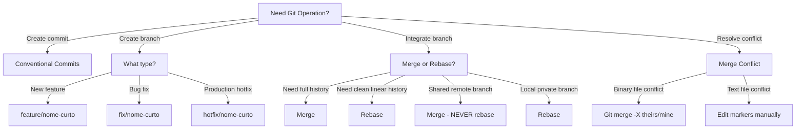

# Git Workflow & Version Control Hub

Unified Git operations, commit styling, worktree management, and branch completion workflows.


## Domain Architecture: Git Operations

# Git

Standards and workflows for version control with Git.

## When to Use

### Use when:
- Need to create commits with standardized messages (Conventional Commits)
- Need to decide between merge, rebase, or cherry-pick
- Need to resolve merge conflicts deterministically
- Need to configure branching strategy for a team
- Need to manage releases via Git Flow or Trunk-Based workflows

### Do not use when:
- Working in a read-only repository
- Using non-Git version control systems (e.g., SVN, Mercurial)
- Working in a repository managed by non-Git source control

### Related Skills:
- `governance` — for branch protection rules and CODEOWNERS
- `release` — for semantic versioning and release tags
- `repo-bootstrap` — for configuring .gitignore and gitignore.io templates

## Decision Tree



## Workflow

### Phase 1: Create Conventional Commit

1. Stage the relevant files:
   ```bash
   git add src/services/user.ts src/controllers/user.ts
   ```
2. Verify working tree status:
   ```bash
   git status
   ```
3. Create the commit:
   ```bash
   git commit -m "feat(user): add email validation to registration"
   ```
4. **Checkpoint**: Verify the commit in git log:
   ```bash
   git log -1 --pretty=format:"%s"
   # Should display: feat(user): add email validation to registration
   ```

### Fase 2: Resolver Merge Conflict

1. Identifique arquivos conflitantes:
   ```bash
   git status
   # Files marked "both modified" are in conflict
   ```
2. Abra o arquivo e localize marcadores:
   ```
   <<<<<<< HEAD
   código da branch atual
   =======
   code from the incoming branch
   >>>>>>> branch-name
   ```
3. Edit manually to resolve conflicts:
   - Mantenha código correto
   - Remova marcadores de conflito
4. Stageie o arquivo resolvido:
   ```bash
   git add caminho/arquivo.ts
   ```
5. Complete o merge:
   ```bash
   git commit  # Cria commit de merge
   # ou
   git rebase --continue  # Se for rebase
   ```
6. **Checkpoint**: Execute testes:
   ```bash
   npm test && npm run lint
   ```

### Fase 3: Fazer Release via Git Flow

1. Ensure you are on the develop branch:
   ```bash
   git checkout develop
   git pull origin develop
   ```
2. Crie branch de release:
   ```bash
   git checkout -b release/v1.2.0
   ```
3. Atualize versão:
   ```bash
   npm version minor --no-git-tag-version
   # ou
   # Atualize package.json manualmente
   ```
4. Atualize CHANGELOG.md
5. Commit release preparation changes:
   ```bash
   git add .
   git commit -m "chore(release): prepare v1.2.0"
   ```
6. Merge into main:
   ```bash
   git checkout main
   git merge --no-ff release/v1.2.0
   ```
7. Crie tag:
   ```bash
   git tag -a v1.2.0 -m "Release v1.2.0"
   ```
8. Merge back into develop:
   ```bash
   git checkout develop
   git merge --no-ff release/v1.2.0
   ```
9. Delete branch de release:
   ```bash
   git branch -d release/v1.2.0
   ```
10. **Checkpoint**: Push commits with tags:
    ```bash
    git push origin main --tags
    git push origin develop
    ```

### Fase 4: Limpar Histórico (Rebase Interativo)

1. Identifique commits a limpar (últimos 3):
   ```bash
   git log --oneline -5
   ```
2. Inicie rebase interativo:
   ```bash
   git rebase -i HEAD~3
   ```
3. In the editor, choose the rebase action for each commit:
   - `pick` — manter commit
   - `squash` — combine with the previous commit
   - `fixup` — unir sem mensagem
   - `reword` — editar mensagem
   - `drop` — remover commit
4. Edite mensagens se necessário
5. **Checkpoint**: Verifique histórico limpo:
   ```bash
   git log --oneline -5
   ```

## Conceitos Fundamentais

### Conventional Commits

Formato: `<tipo>(<escopo>): <descrição>`

```bash
# Tipos válidos
feat: nova funcionalidade
fix: correção de bug
docs: documentação
style: formatação
refactor: refatoração
perf: performance
test: testes
chore: manutenção
```

### Branching Strategies

#### Git Flow (recommended for scheduled milestone releases)
- `main`: código em produção
- `develop`: branch de integração
- `feature/*`: novas features
- `release/*`: preparação de release
- `hotfix/*`: correções urgentes

#### Trunk-Based (recommended for continuous integration and delivery)
- `main`: trunk sempre deployável
- `feature/*`: branches curtas (< 1 dia)
- Commits pequenos e frequentes

### Merge vs Rebase

| Ação | Merge | Rebase |
|------|-------|--------|
| Preserva histórico | ✅ | ❌ |
| Linear history | ❌ | ✅ |
| Safe for shared branch | ✅ | ❌ |
| Shared remote branch | ✅ | ❌ |

## Templates

### commit-message.md
Localização: `templates/commit-message.md`

Template for standardized commit messages.

**Uso:**
```bash
# Consulte antes de criar commit
cat templates/commit-message.md
```

### branch-naming.md
Localização: `templates/branch-naming.md`

Naming conventions for branches.

**Uso:**
```bash
# Crie branch seguindo convenção
git checkout -b feature/user-authentication
```

### pr-description.md
Localização: `templates/pr-description.md`

Template for Pull Request descriptions.

**Uso:**
```bash
# Copy to use as a baseline
cp templates/pr-description.md .github/PULL_REQUEST_TEMPLATE.md
```

## Anti-patterns

### 🔴 Crítico

#### Force push to shared branch
**What it is:** Using `git push --force` on branches shared with other developers.
**Why it is bad:** Overwrites upstream commit history, causing unrecoverable data loss for collaborators.
**How to avoid:** Use `git push --force-with-lease` and enforce branch protection on shared branches.
**Exemplo:**
```
# ❌ ERRADO
git push --force origin feature/user-auth

# ✅ CORRETO
git push --force-with-lease origin feature/user-auth
# ou
git merge origin/main  # preserva histórico
```

#### Committing secrets or credentials
**What it is:** Committing files containing passwords, API tokens, or credentials.
**Why it is bad:** Leaks credentials into permanent git history, necessitating credential revocation.
**Como evitar:** Use .env, .gitignore, e git-secrets.
**Exemplo:**
```
# ❌ ERRADO
git add .env
git commit -m "feat: add config"

# ✅ CORRETO
echo ".env" >> .gitignore
git add .env
git commit -m "feat: add config"
```

### 🟡 Médio

#### Mensagem de commit vaga
**What it is:** Using generic messages such as 'fix bug', 'wip', or 'update code'.
**Why it is bad:** Degrades git log traceability, bisect debugging, and changelog generation.
**How to avoid:** Follow Conventional Commits with concise scope and descriptive summaries.
**Exemplo:**
```
# ❌ ERRADO
git commit -m "fix"

# ✅ CORRETO
git commit -m "fix(auth): handle expired JWT token"
```

#### Branch sem PR
**What it is:** Pushing direct commits to main without peer review or automated CI verification.
**Why it is bad:** Bypasses review gates and increases deployment breakage risks.
**How to avoid:** Always open a Pull Request and require automated CI status checks.
**Exemplo:**
```
# ❌ ERRADO
git checkout main
git add .
git commit -m "feat: quick fix"

# ✅ CORRETO
git checkout -b feature/quick-fix
git add .
git commit -m "feat: quick fix"
gh pr create --title "Quick fix" --body "Descrição"
```

### 🟢 Baixo

#### Giant commits with multi-topic changes
**What it is:** Bundling unrelated refactorings, feature changes, and formatting in one commit.
**Why it is bad:** Impairs atomic rollbacks and makes PR review cognitive load unmanageable.
**Como evitar:** Commits atômicos, um conceito por commit.
**Exemplo:**
```
# ❌ ERRADO
git add .
git commit -m "feat: add user and fix login and update docs"

# ✅ CORRETO
git add src/user.ts
git commit -m "feat(user): add user entity"
git add src/auth.ts
git commit -m "fix(auth): handle login error"
git add README.md
git commit -m "docs: update user flow"
```

## Checklists

### Checklist Pré-Commit
- [ ] Código compila sem erros
- [ ] Testes passam (`npm test`)
- [ ] Lint passa (`npm run lint`)
- [ ] Mensagem de commit segue Conventional Commits
- [ ] .env and secret files excluded from staging

### Checklist Pré-Merge
- [ ] Branch rebased and updated against main
- [ ] All unit and integration tests pass
- [ ] Coverage ≥ 80%
- [ ] PR tem descrição completa
- [ ] At least 1 approving peer review received

### Checklist Pré-Release
- [ ] CHANGELOG.md atualizado
- [ ] Versão bumpado em package.json
- [ ] All CI/CD and E2E checks pass
- [ ] Build de produção funciona
- [ ] Tag created using semantic versioning

## Edge Cases

### Submodule conflict
**Situation:** Conflict in repository utilizing git submodules.
**Solução:** Atualize o submodule separadamente, depois resolva o conflito.
**Exceção:** Se o submodule é externo, considere usar subtree.

```bash
# Atualizar submodule
git submodule update --remote --merge
git add path/to/submodule
git commit -m "chore: update submodule"
```

### Rebase with binary file conflict
**Situação:** Conflito em arquivo binário durante rebase.
**Solution:** Use checkout merge strategy for binary assets (`git checkout --ours/--theirs`).
**Exceção:** Se o binário é gerado, remova e regenere.

```bash
# Resolve conflict em binário
git checkout --ours path/to/file.bin
git add path/to/file.bin
git rebase --continue
```

### Detached HEAD
**Situação:** Git checkout em commit específico, ficando em estado detached HEAD.
**Solution:** Create a tracking branch or return to previous branch state.
**Exception:** If inspecting read-only state, detached HEAD is acceptable.

```bash
# Sair do detached HEAD
git checkout main
# or create new branch
git switch -c temp-branch
```

## Referências

- [Conventional Commits](https://www.conventionalcommits.org/)
- [Git Flow](https://nvie.com/posts/a-successful-git-branching-model/)
- `governance` — for branch protection and CODEOWNERS
- `release` — for semantic versioning
- `repo-bootstrap` — for .gitignore patterns

---


## Sub-Domain / Component: `git-commit-helper`

# Git Commit Helper

## Overview

Enforce conventional commit standards, guide semantic versioning decisions, generate changelogs, and ensure commit message quality. This skill provides a structured approach to version control communication that enables automated tooling and clear project history.

## Phase 1: Analyze Changes

Analyze the staged diff to understand what was changed:

```bash
git diff --cached --stat
git diff --cached
```

1. Identify the files and modules affected
2. Determine the nature of the change (new feature, bug fix, refactoring, etc.)
3. Check if the change is breaking (API changes, removed features, changed contracts)

**STOP — Do NOT write a commit message until you understand the full scope of changes.**

## Phase 2: Classify and Compose

### Commit Type Decision Table

| Type | When to Use | Version Bump | Example |
|---|---|---|---|
| `feat` | New feature for the user | MINOR | `feat(auth): add OAuth2 login flow` |
| `fix` | Bug fix for the user | PATCH | `fix(api): handle null response in user endpoint` |
| `docs` | Documentation only changes | None | `docs(readme): update installation steps` |
| `style` | Formatting, missing semicolons, etc. | None | `style(lint): fix trailing whitespace` |
| `refactor` | Code change with no behavior change | None | `refactor(utils): extract date formatting helpers` |
| `perf` | Performance improvement | PATCH | `perf(query): add index for user lookup` |
| `test` | Adding or correcting tests | None | `test(auth): add login failure scenarios` |
| `chore` | Maintenance, deps, tooling | None | `chore(deps): update typescript to 5.4` |
| `ci` | CI/CD configuration changes | None | `ci(github): add Node 20 to test matrix` |
| `build` | Build system or external dependencies | None | `build(webpack): optimize chunk splitting` |

### Conventional Commit Format

```
<type>(<scope>): <description>

[optional body]

[optional footer(s)]
```

### Scope Guidelines

Scope should identify the area of the codebase affected:

| Scope Strategy | Examples | When to Use |
|---|---|---|
| By module | `auth`, `billing`, `dashboard`, `api` | Feature-organized codebases |
| By layer | `db`, `ui`, `middleware`, `config` | Layer-organized codebases |
| By package | `@app/core`, `@app/shared` | Monorepos |
| General | `deps`, `ci`, `lint`, `types` | Cross-cutting changes |

Rules:
- Lowercase, kebab-case
- Keep consistent within a project
- Optional but recommended for projects with 10+ files changed regularly
- Omit scope for truly cross-cutting changes

### Description Rules

- Use imperative mood: "add" not "added" or "adds"
- No capital first letter
- No period at the end
- Maximum 72 characters (type + scope + description combined)
- Describe WHAT changed, not HOW

## Phase 3: Write the Commit Message

### Body Guidelines

```
feat(cart): add quantity update functionality

Users can now change item quantities directly in the cart
without removing and re-adding items. The quantity selector
supports values from 1 to 99 with real-time price updates.

Closes #234
```

- Wrap at 72 characters
- Explain WHY the change was made (motivation)
- Explain WHAT changed at a high level
- Use blank line to separate from description and footer

### Breaking Changes

```
feat(api)!: change user endpoint response format

BREAKING CHANGE: The /api/users endpoint now returns a paginated
response object instead of a plain array. Clients must update
to read from the `data` field.

Migration guide:
- Before: const users = await fetch('/api/users').json()
- After:  const { data: users } = await fetch('/api/users').json()
```

Two ways to indicate breaking changes:
1. `!` after type/scope: `feat(api)!: description`
2. `BREAKING CHANGE:` footer (provides space for migration details)

Both trigger a MAJOR version bump.

**STOP — Present the commit message to the user for approval before committing.**

## Phase 4: Assess Version Impact

### Semantic Versioning (SemVer): MAJOR.MINOR.PATCH

| Component | Increment When | Example |
|---|---|---|
| MAJOR | Breaking changes (incompatible API changes) | 1.0.0 -> 2.0.0 |
| MINOR | New features (backward compatible) | 1.0.0 -> 1.1.0 |
| PATCH | Bug fixes (backward compatible) | 1.0.0 -> 1.0.1 |

### Version Bumping Rules

```
Commits since last release:
  fix(auth): handle expired tokens       -> PATCH
  feat(search): add fuzzy matching       -> MINOR (overrides PATCH)
  fix(ui): correct button alignment      -> already MINOR
  feat(api)!: change response format     -> MAJOR (overrides MINOR)

Result: MAJOR bump (highest wins)
```

### Pre-Release Versions

```
1.0.0-alpha.1    -> Early testing
1.0.0-beta.1     -> Feature complete, testing
1.0.0-rc.1       -> Release candidate
1.0.0            -> Stable release
```

### Initial Development (0.x.y)

- 0.1.0: First usable version
- 0.x.y: API is not stable; MINOR can include breaking changes
- 1.0.0: First stable release; SemVer rules fully apply

## Phase 5: Generate Changelog (if applicable)

### CHANGELOG.md Format

```markdown
# Changelog

## [1.2.0] - 2025-03-15

### Added
- Fuzzy search matching for product catalog (#234)
- Bulk export functionality for reports (#245)

### Fixed
- Handle expired authentication tokens gracefully (#230)
- Correct button alignment on mobile viewports (#232)

### Changed
- Update TypeScript to 5.4 (#240)

## [1.1.0] - 2025-02-28
...
```

### Commit Type to Changelog Section Mapping

| Commit Type | Changelog Section |
|---|---|
| `feat` | Added |
| `fix` | Fixed |
| `perf` | Performance |
| `refactor` | Changed |
| `docs` | Documentation |
| `BREAKING CHANGE` | Breaking Changes (top of release) |
| `chore`, `ci`, `build`, `style`, `test` | Typically excluded |

### Automation Tools

| Tool | Use Case |
|---|---|
| `conventional-changelog` | Generate changelog from git history |
| `semantic-release` | Fully automated versioning + publishing |
| `changeset` | Manual changeset files for monorepos |
| `release-please` | Google's release automation |

## Commit Message Quality Checklist

### Must Pass

- [ ] Uses conventional commit format (`type(scope): description`)
- [ ] Type is from the allowed list
- [ ] Description uses imperative mood
- [ ] Description is under 72 characters total
- [ ] No period at end of description
- [ ] Breaking changes are clearly marked

### Should Pass

- [ ] Scope accurately identifies the affected area
- [ ] Body explains WHY, not just WHAT (for non-trivial changes)
- [ ] References issue/ticket number (`Closes #123`, `Refs #456`)
- [ ] Single logical change per commit (atomic commits)
- [ ] No "WIP" or "temp" commits in main branch history

## Commit Splitting Guide

### When to Split Decision Table

| Condition | Action |
|---|---|
| Changes to different modules/features | Split into separate commits |
| Refactor combined with feature addition | Split: refactor first, then feature |
| Test additions for existing code + new feature | Split: tests first, then feature |
| Config changes + code changes | Split into separate commits |
| Single logical change across multiple files | Keep as one commit |

### How to Split

```bash
# Interactive staging for partial commits
git add -p                    # Stage hunks interactively
git add path/to/specific/file # Stage specific files

# Example: split refactor + feature
git add src/utils/date.ts
git commit -m "refactor(utils): extract date formatting helpers"

git add src/components/DatePicker.tsx src/components/DatePicker.test.tsx
git commit -m "feat(ui): add date range picker component"
```

## Anti-Patterns / Common Mistakes

| Anti-Pattern | Why It Is Wrong | What to Do Instead |
|---|---|---|
| `fix` type for a new feature | Misleads version bump automation | Use `feat` for new functionality |
| Squashing meaningful history | Loses context of development process | Keep atomic commits, squash only WIP |
| Using `--no-verify` to skip hooks | Bypasses quality gates | Fix the hook failure instead |
| Amending published/pushed commits | Breaks other developers' history | Create new commit instead |
| Empty or "." commit messages | Zero information for future readers | Write a descriptive message |
| Mixing formatting with logic changes | Cannot revert one without the other | Separate into distinct commits |
| "change X to Y" duplicating the diff | Adds no information beyond the diff | Describe WHY the change was made |
| Huge commits touching 20+ files | Impossible to review or bisect | Split into logical atomic commits |

## Integration Points

| Skill | Integration |
|---|---|
| `finishing-a-development-branch` | Squash commit message follows conventional format |
| `code-review` | Commit quality is part of review checklist |
| `deployment` | Version bumps trigger release pipelines |
| `planning` | Commit scoping aligns with plan task granularity |
| `verification-before-completion` | Verify tests pass before committing |

## Skill Type

**FLEXIBLE** — Conventional commit format is strongly recommended but can be adapted to existing project conventions. Version bumping rules are deterministic when conventional commits are used. Changelog sections map directly from commit types.

---


## Sub-Domain / Component: `using-git-worktrees`

# Using Git Worktrees

## Overview

Create isolated working directories for parallel development tasks using `git worktree`, allowing multiple branches to be checked out simultaneously without conflicts. This skill enforces a deterministic, multi-phase process from directory selection through setup verification, ensuring every worktree is production-ready before any work begins.

## When to Use

- Starting a new feature branch that should not interfere with current work
- Working on multiple tasks simultaneously (bug fix + feature)
- Creating a clean environment for testing or code review
- Running long processes (tests, builds) while continuing development

## Phase 1: Select Worktree Directory

[HARD-GATE] Do NOT skip directory selection. Do NOT assume a default path without checking priorities.

Follow this priority order exactly:

### Priority 1: Existing Worktree Matching Task

Check if a worktree already exists for the task:

```bash
git worktree list
```

If a matching worktree exists, use it. Do NOT create a duplicate.

### Priority 2: CLAUDE.md Worktree Directory Hint

Check the project's CLAUDE.md for a configured worktree directory:

```
# Example CLAUDE.md entry
worktree-directory: ../worktrees
```

If specified, create worktrees under that directory.

### Priority 3: Ask the User

If no hint is configured and no convention is obvious, ask the user where worktrees should be created. Suggest a sensible default:

```
../worktrees/<project-name>/<branch-name>
```

**STOP — Confirm the worktree directory with the user before proceeding.**

### Directory Selection Decision Table

| Condition | Action |
|---|---|
| Worktree for this branch already exists | Navigate to existing worktree |
| CLAUDE.md has `worktree-directory` | Use configured path |
| Project has existing worktrees | Use same parent directory pattern |
| No convention found | Ask user, suggest `../worktrees/<project>/<branch>` |
| User specifies path inside repo root | Warn — must add to `.gitignore` |

## Phase 2: Safety Verification

[HARD-GATE] Do NOT create any worktree until all safety checks pass.

### Check .gitignore Coverage

If the worktree directory is inside the repository root, ensure it is in `.gitignore`:

```bash
# Check if the worktree path would be tracked
git check-ignore <worktree-path>
```

If not ignored, warn the user and suggest adding it to `.gitignore`.

### Verify Clean Working Tree

Check for uncommitted changes that could cause issues:

```bash
git status --porcelain
```

If the working tree is dirty, inform the user and ask how to proceed:
- Commit changes first
- Stash changes
- Proceed anyway (worktree creation itself is safe)

### Verify Branch Does Not Exist in Another Worktree

```bash
git worktree list
```

A branch cannot be checked out in two worktrees simultaneously. If the branch is already checked out, navigate to that existing worktree instead.

### Safety Check Decision Table

| Check | Result | Action |
|---|---|---|
| Path inside repo, not in `.gitignore` | FAIL | Add to `.gitignore` first |
| Branch already in another worktree | FAIL | Use existing worktree |
| Working tree dirty | WARN | Inform user, ask preference |
| Path already exists (not worktree) | FAIL | Choose different path |
| All checks pass | PASS | Proceed to Phase 3 |

## Phase 3: Create the Worktree

```bash
# For a new branch
git worktree add <path> -b <branch-name> <base-branch>

# For an existing branch
git worktree add <path> <existing-branch>
```

Always tell the user the full path where the worktree was created:

```
Worktree created at: /absolute/path/to/worktree
Branch: feature/my-feature
Base: main
```

**STOP — Confirm the worktree was created successfully before proceeding to setup.**

## Phase 4: Project Setup and Auto-Detection

After creating the worktree, detect and run the project's setup commands.

### Setup Detection Decision Table

| Indicator File | Ecosystem | Setup Command |
|---|---|---|
| `pnpm-lock.yaml` | Node.js (pnpm) | `pnpm install` |
| `yarn.lock` | Node.js (yarn) | `yarn install` |
| `package-lock.json` | Node.js (npm) | `npm install` |
| `package.json` (no lock) | Node.js (npm) | `npm install` |
| `pyproject.toml` + `tool.poetry` | Python (poetry) | `poetry install` |
| `pyproject.toml` (no poetry) | Python (pip) | `pip install -e .` |
| `setup.py` | Python (pip) | `pip install -e .` |
| `requirements.txt` | Python (pip) | `pip install -r requirements.txt` |
| `go.mod` | Go | `go mod download` |
| `Cargo.toml` | Rust | `cargo build` |
| `Gemfile` | Ruby | `bundle install` |
| `composer.json` | PHP | `composer install` |

### Multiple Ecosystems

If the project uses multiple ecosystems (e.g., a Go backend with a Node.js frontend), run setup for each detected ecosystem in the appropriate subdirectories.

### Environment Files

If the project has `.env.example` or `.env.template`:

```bash
# Copy environment template if .env does not exist in worktree
cp .env.example .env  # then inform user to update values
```

## Phase 5: Clean Baseline Test Verification

[HARD-GATE] Do NOT proceed with any work until baseline tests pass or failures are acknowledged.

Run the project's test suite to establish a clean baseline BEFORE starting any work:

```bash
# Use the project's test command
# Node.js: npm test / yarn test / pnpm test
# Python: pytest / python -m pytest
# Go: go test ./...
# Rust: cargo test
```

Purpose:
- Confirms the worktree is set up correctly
- Establishes that all tests pass before changes are made
- Any test failures after this point are caused by your changes, not pre-existing issues

If baseline tests fail:
- Report the failures to the user
- Do NOT proceed with work until the baseline is understood
- The base branch may have broken tests that need addressing first

## Phase 6: Location Reporting

Always report the worktree location clearly to the user:

```
Worktree ready:
  Path:    /Users/dev/worktrees/myproject/feature-auth
  Branch:  feature/auth-refactor
  Base:    main
  Setup:   npm install (completed)
  Tests:   24 passed, 0 failed
```

## Cleanup Patterns

### After Merging or Completing Work

```bash
# Remove the worktree
git worktree remove <path>

# If files remain (dirty worktree), force removal
git worktree remove --force <path>

# Prune stale worktree references
git worktree prune
```

### List All Worktrees

```bash
git worktree list
```

### Handling Locked Worktrees

If a worktree is locked (to prevent accidental removal):

```bash
# Unlock before removing
git worktree unlock <path>
git worktree remove <path>
```

## Anti-Patterns / Common Mistakes

| Anti-Pattern | Why It Is Wrong | What to Do Instead |
|---|---|---|
| Creating duplicate worktree for same branch | Git does not allow it; wastes time | Check `git worktree list` first |
| Worktree inside repo without `.gitignore` | Worktree files show as untracked | Add path to `.gitignore` |
| Skipping dependency install in worktree | Build/test failures from missing deps | Always run project setup |
| Skipping baseline test run | Cannot distinguish pre-existing vs new failures | Run tests before starting work |
| Assuming worktree has same env vars | `.env` files are not shared between worktrees | Copy and configure `.env` |
| Leaving stale worktrees after merge | Disk waste, confusing `git worktree list` | Remove worktrees after branch completion |
| Force-removing worktree with uncommitted work | Permanent data loss | Commit or stash first |

## Integration Points

| Skill | Integration |
|---|---|
| `finishing-a-development-branch` | After completing work in a worktree, use this to merge or create a PR |
| `dispatching-parallel-agents` | Run agents in separate worktrees for true isolation |
| `verification-before-completion` | Validate work before leaving the worktree |
| `self-learning` | Check CLAUDE.md for worktree directory preferences |
| `planning` | Worktree creation is often the first step of plan execution |

## Skill Type

**RIGID** — Follow this process exactly. Every phase must be completed in order. Do NOT skip safety checks. Do NOT skip baseline test verification. Do NOT create worktrees without confirming the directory.

---


## Sub-Domain / Component: `finishing-a-development-branch`

# Finishing a Development Branch

## Overview

Provide a structured, safe process for completing work on a development branch, including verification, merge strategy selection, and cleanup. This skill ensures no branch is merged without passing tests, and every destructive operation requires explicit user confirmation.

## When to Use

- All planned work on a feature branch is complete
- A branch is ready for code review or merge
- Cleaning up after development work is finished
- Preparing a pull request for team review

## Phase 1: Verify All Tests Pass

[HARD-GATE] Do NOT proceed to any merge or PR activity without passing verification.

Before any merge or PR activity, invoke **verification-before-completion** to confirm:

- All tests pass (unit, integration, e2e as applicable)
- No lint errors or warnings
- Build succeeds
- No untracked files that should be committed

```bash
# Run the project's full verification suite
# Do NOT skip this step even if "tests were passing earlier"
```

If verification fails, STOP. Fix the failures before proceeding. Do NOT create PRs or merge branches with failing tests.

**STOP — Verification must pass before continuing to Phase 2.**

## Phase 2: Determine Base Branch

Identify the branch to merge into, using this detection logic:

### Auto-Detection

```bash
# Check for common base branch names
git branch -a | grep -E 'remotes/origin/(main|master|develop)$'

# Check what branch was the fork point
git log --oneline --decorate --graph HEAD...main --first-parent 2>/dev/null
git log --oneline --decorate --graph HEAD...master --first-parent 2>/dev/null
```

### Base Branch Selection Decision Table

| Condition | Base Branch | Confidence |
|---|---|---|
| `main` exists | `main` | High |
| Only `master` exists | `master` | High |
| `develop` exists and project uses GitFlow | `develop` | Medium |
| Multiple candidates found | Ask user | Required |
| None of the above exist | Ask user | Required |

### Verify Base Branch is Up to Date

```bash
git fetch origin
git log HEAD..<base-branch> --oneline
```

If the base branch has advanced since the feature branch was created, inform the user. They may want to rebase or merge base into the feature branch first.

### Base Branch Divergence Decision Table

| Divergence | Action |
|---|---|
| Base has 0 new commits | Proceed normally |
| Base has 1-5 new commits | Inform user, suggest rebase |
| Base has 6+ new commits | Warn user, recommend merge or rebase before proceeding |
| Merge conflicts detected | STOP — resolve conflicts first |

**STOP — Confirm the base branch with the user before proceeding.**

## Phase 3: Present Merge Options

Present exactly these four options to the user. Do NOT add or remove options.

```
How would you like to finish this branch?

  A) Create PR    -- push and open a pull request for review
  B) Merge        -- merge into <base> with a merge commit
  C) Squash merge -- squash into one commit, merge into <base>
  D) Leave as-is  -- keep the branch, decide later
```

### Option Selection Decision Table

| Context | Recommended Option | Why |
|---|---|---|
| Team project with code review | A) Create PR | Enables review workflow |
| Solo project, clean history | B) Merge | Preserves full branch history |
| Many WIP commits, messy history | C) Squash merge | Clean single commit on base |
| Work incomplete or uncertain | D) Leave as-is | No risk, decide later |

**STOP — Wait for user to select an option. Do NOT assume a default.**

## Phase 4: Execute Chosen Option

### Option A: Create Pull Request

```bash
# Push the branch
git push -u origin <branch-name>

# Generate PR title from branch name or recent commits
# Generate PR body from commit messages and diff summary
gh pr create --title "<title>" --body "<body>"
```

**PR Title Generation:**
- Derive from branch name: `feature/add-auth` becomes `Add authentication`
- Keep under 70 characters
- Use imperative mood

**PR Body Generation:**
- Summarize the changes (what and why)
- List key modifications
- Note any breaking changes
- Include test plan

### Option B: Merge Locally

```bash
# Switch to base branch
git checkout <base-branch>

# Merge feature branch
git merge <feature-branch>

# Delete the feature branch
git branch -d <feature-branch>
```

**Confirmation required** before executing the merge.

### Option C: Squash Merge

```bash
# Switch to base branch
git checkout <base-branch>

# Squash merge
git merge --squash <feature-branch>

# Commit with a comprehensive message
git commit -m "<squash commit message>"

# Delete the feature branch
git branch -d <feature-branch>
```

**Squash commit message** should summarize all changes from the branch, not just the last commit.

**Confirmation required** before executing the squash merge.

### Option D: Leave Branch As-Is

No action needed. Inform the user:

```
Branch <branch-name> left as-is.
You can return to it later with: git checkout <branch-name>
```

## Phase 5: Cleanup

After executing options A, B, or C, perform cleanup:

### Remove Worktree (if applicable)

If the branch was developed in a git worktree:

```bash
# Navigate out of the worktree first
git worktree remove <worktree-path>
git worktree prune
```

### Clean Up Remote Tracking (Option B and C only)

If the branch was previously pushed:

```bash
# Delete remote branch after local merge
git push origin --delete <branch-name>
```

**Confirmation required** before deleting remote branches.

### Verify Final State

```bash
git status
git log --oneline -5
```

Confirm the base branch is in the expected state.

## Confirmation Requirements

[HARD-GATE] The following operations require explicit user confirmation before execution. Do NOT proceed on assumption. Always ask.

| Operation | Why Confirmation Is Required |
|---|---|
| Merge into base branch | Changes base branch history |
| Squash merge | Loses individual commit history |
| Delete local branch | Cannot be undone if not pushed |
| Delete remote branch | Affects other collaborators |
| Force remove worktree | May discard uncommitted changes |
| Rebase onto updated base | Rewrites commit history |

## Anti-Patterns / Common Mistakes

| Anti-Pattern | Why It Is Wrong | What to Do Instead |
|---|---|---|
| Merging without running tests | Broken code reaches base branch | Always run full verification first |
| Skipping base branch freshness check | Merge conflicts discovered late | `git fetch` and check divergence |
| Auto-selecting merge strategy | User may prefer different approach | Always present all four options |
| Deleting branch without confirmation | Data loss risk | Ask before every deletion |
| Creating PR with failing CI | Wastes reviewer time | Fix CI before creating PR |
| Squash message from last commit only | Loses context of full branch work | Summarize all changes in squash msg |
| Leaving stale remote branches | Cluttered repository | Clean up remote after merge |
| Force-pushing after PR creation | Destroys review comments | Avoid force-push on PR branches |

## Error Handling

| Error | Action |
|---|---|
| Merge conflicts | Report conflicts, ask user to resolve, do NOT auto-resolve |
| Push rejected | Fetch and check if rebase/merge is needed |
| PR creation fails | Check `gh auth status`, report error details |
| Branch already deleted | Skip deletion, continue with remaining cleanup |
| Tests fail | STOP immediately, do NOT merge or create PR |
| Base branch does not exist on remote | Ask user to confirm the correct base |

## Integration Points

| Skill | Integration |
|---|---|
| `verification-before-completion` | Must invoke in Phase 1 before any merge activity |
| `using-git-worktrees` | Cleanup includes worktree removal if applicable |
| `git-commit-helper` | Squash commit message follows conventional commit format |
| `code-review` | PR creation (Option A) feeds into code review workflow |
| `planning` | Branch completion is the final step of plan execution |
| `deployment` | Merge to main/release may trigger deployment pipeline |

## Skill Type

**RIGID** — Follow this process exactly. Every phase must be completed in order. Do NOT skip verification. Do NOT merge without user confirmation. Do NOT assume a merge strategy. Do NOT delete branches without asking.

## Domain SOTA & Industry Engineering Standards

- **Trunk-Based Development:** Short-lived feature branches ($T_{	ext{branch}} \le 24	ext{h}$), continuous integration, and atomic merges.
- **Commit Disciplines:** Conventional Commits (v1.0.0) format with scope and descriptive summaries.
- **Branch Naming Conventions:** `feature/*`, `fix/*`, `docs/*`, `adr-XXX/*`, and `chore/*`.
- **Security & Integrity:** GPG/SSH signed commits and rebase-first history hygiene (`git pull --rebase`).

### Git Branching & Merge Strategy:

```text
main / master ─────────────────────────────────────────────────► (Deployable SSOT)
   │                                              ▲
   └──► feature/short-lived-branch (≤24h) ────────┘ (Squash / Rebase Merge)
```

### Exhaustive Heuristic Decision Rules:
- **Rule of Thumb 1 (Zero-Trust Architectural Boundaries):** Treat all external inputs, third-party payloads, and cross-module boundaries with strict zero-trust schema validation.
- **Rule of Thumb 2 (Fail-Fast & Deterministic Errors):** Reject invalid states immediately with typed, actionable error contracts rather than cascading silent failures.
- **Rule of Thumb 3 (Idempotency & AST Preservation):** State mutations and code transformations must maintain semantic idempotency across repeated executions.
- **Rule of Thumb 4 (Benchmark & Telemetry Alignment):** Measure critical execution latency ($P_{95}$) and memory overhead with structured telemetry and baseline benchmarks.
- **Rule of Thumb 5 (Event-Driven & Circuit Breaker Decoupling):** Isolate asynchronous operations behind circuit breakers and resilient retry mechanisms to prevent cascading failure.
- **Rule of Thumb 6 (Contract-First DDD Modeling):** Define clear domain aggregates, value objects, and typed interface contracts before implementing concrete logic.
- **Rule of Thumb 7 (RAG & Semantic Retrieval Precision):** Optimize context retrieval with hybrid lexical-vector search and reciprocal rank fusion to eliminate hallucinated routing.
- **Rule of Thumb 8 (OWASP & Supply Chain Verification):** Verify dependencies and data flows against OWASP Top 10 and SLSA Level 3 supply chain security standards.
- **Rule of Thumb 9 (Verification Gate Invariant):** Never declare completion without automated test execution evidence and zero compiler/linter warnings.
## Completion Gate

The task associated with the skill `git-workflow` can only be declared complete when:
1. All checks in the operational verification checklist have been satisfied.
2. The deliverable has been deterministically validated through execution evidence.
3. No structural debt, unresolved placeholders, or unhandled errors remain.

