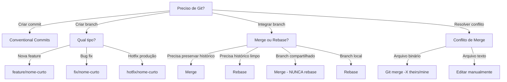

# Git

Padrões e workflows para versionamento com Git.

## Quando Usar

### Use quando:
- Precisa criar commits com mensagens padronizadas
- Precisa decidir entre merge, rebase ou cherry-pick
- Precisa resolver conflitos de merge
- Precisa configurar branching strategy para equipe
- Precisa fazer release via Git Flow

### Não use quando:
- Trabalhando em repositório somente leitura
- Precisa de versionamento sem Git (ex: SVN)
- Trabalhando com monorepo que usa outro sistema

### Skills relacionadas:
- `governance` — para processos de branch protection e CODEOWNERS
- `release` — para versionamento semântico e tags
- `repo-bootstrap` — para configurar .gitignore e gitignore.io

## Decision Tree



## Workflow

### Fase 1: Criar Commit Convencional

1. Stageie os arquivos relevantes:
   ```bash
   git add src/services/user.ts src/controllers/user.ts
   ```
2. Verifique o status:
   ```bash
   git status
   ```
3. Crie o commit:
   ```bash
   git commit -m "feat(user): add email validation to registration"
   ```
4. **Checkpoint**: Verifique o commit no log:
   ```bash
   git log -1 --pretty=format:"%s"
   # Deve mostrar: feat(user): add email validation to registration
   ```

### Fase 2: Resolver Conflito de Merge

1. Identifique arquivos conflitantes:
   ```bash
   git status
   # Arquivos com "both modified" são conflitantes
   ```
2. Abra o arquivo e localize marcadores:
   ```
   <<<<<<< HEAD
   código da branch atual
   =======
   código da branch que está mergeando
   >>>>>>> branch-name
   ```
3. Edite manualmente para resolver:
   - Mantenha código correto
   - Remova marcadores de conflito
4. Stageie o arquivo resolvido:
   ```bash
   git add caminho/arquivo.ts
   ```
5. Complete o merge:
   ```bash
   git commit  # Cria commit de merge
   # ou
   git rebase --continue  # Se for rebase
   ```
6. **Checkpoint**: Execute testes:
   ```bash
   npm test && npm run lint
   ```

### Fase 3: Fazer Release via Git Flow

1. Certifique-se que está em develop:
   ```bash
   git checkout develop
   git pull origin develop
   ```
2. Crie branch de release:
   ```bash
   git checkout -b release/v1.2.0
   ```
3. Atualize versão:
   ```bash
   npm version minor --no-git-tag-version
   # ou
   # Atualize package.json manualmente
   ```
4. Atualize CHANGELOG.md
5. Commit das mudanças:
   ```bash
   git add .
   git commit -m "chore(release): prepare v1.2.0"
   ```
6. Merge para main:
   ```bash
   git checkout main
   git merge --no-ff release/v1.2.0
   ```
7. Crie tag:
   ```bash
   git tag -a v1.2.0 -m "Release v1.2.0"
   ```
8. Merge de volta para develop:
   ```bash
   git checkout develop
   git merge --no-ff release/v1.2.0
   ```
9. Delete branch de release:
   ```bash
   git branch -d release/v1.2.0
   ```
10. **Checkpoint**: Push com tags:
    ```bash
    git push origin main --tags
    git push origin develop
    ```

### Fase 4: Limpar Histórico (Rebase Interativo)

1. Identifique commits a limpar (últimos 3):
   ```bash
   git log --oneline -5
   ```
2. Inicie rebase interativo:
   ```bash
   git rebase -i HEAD~3
   ```
3. No editor, escolha ação para cada commit:
   - `pick` — manter commit
   - `squash` — unir com commit anterior
   - `fixup` — unir sem mensagem
   - `reword` — editar mensagem
   - `drop` — remover commit
4. Edite mensagens se necessário
5. **Checkpoint**: Verifique histórico limpo:
   ```bash
   git log --oneline -5
   ```

## Conceitos Fundamentais

### Conventional Commits

Formato: `<tipo>(<escopo>): <descrição>`

```bash
# Tipos válidos
feat: nova funcionalidade
fix: correção de bug
docs: documentação
style: formatação
refactor: refatoração
perf: performance
test: testes
chore: manutenção
```

### Branching Strategies

#### Git Flow (recomendado para releases agendadas)
- `main`: código em produção
- `develop`: branch de integração
- `feature/*`: novas features
- `release/*`: preparação de release
- `hotfix/*`: correções urgentes

#### Trunk-Based (recomendado para CI/CD contínuo)
- `main`: trunk sempre deployável
- `feature/*`: branches curtas (< 1 dia)
- Commits pequenos e frequentes

### Merge vs Rebase

| Ação | Merge | Rebase |
|------|-------|--------|
| Preserva histórico | ✅ | ❌ |
| Histórico linear | ❌ | ✅ |
| Seguro para shared | ✅ | ❌ |
| Branch compartilhado | ✅ | ❌ |

## Templates

### commit-message.md
Localização: `templates/commit-message.md`

Template para mensagens de commit padronizadas.

**Uso:**
```bash
# Consulte antes de criar commit
cat templates/commit-message.md
```

### branch-naming.md
Localização: `templates/branch-naming.md`

Convenção de nomes para branches.

**Uso:**
```bash
# Crie branch seguindo convenção
git checkout -b feature/user-authentication
```

### pr-description.md
Localização: `templates/pr-description.md`

Template para descrição de Pull Request.

**Uso:**
```bash
# Copie para usar como base
cp templates/pr-description.md .github/PULL_REQUEST_TEMPLATE.md
```

## Anti-patterns

### 🔴 Crítico

#### Force push em branch compartilhado
**O que é:** Usar `git push --force` em branch que outros desenvolvedores estão usando.
**Por que é ruim:** Destrói histórico que outros desenvolvedores dependem, causando perda de trabalho.
**Como evitar:** Use `git push --force-with-lease` ou nunca force push em branches compartilhados.
**Exemplo:**
```
# ❌ ERRADO
git push --force origin feature/user-auth

# ✅ CORRETO
git push --force-with-lease origin feature/user-auth
# ou
git merge origin/main  # preserva histórico
```

#### Commit com segredos/credenciais
**O que é:** Commitar arquivos contendo senhas, tokens ou credenciais.
**Por que é ruim:** Exposição de credenciais no histórico do Git, impossível remover completamente.
**Como evitar:** Use .env, .gitignore, e git-secrets.
**Exemplo:**
```
# ❌ ERRADO
git add .env
git commit -m "feat: add config"

# ✅ CORRETO
echo ".env" >> .gitignore
git add .env
git commit -m "feat: add config"
```

### 🟡 Médio

#### Mensagem de commit vaga
**O que é:** Mensagens genéricas como "fix bug" ou "update code".
**Por que é ruim:** Dificulta busca no histórico e gera documentação ruim.
**Como evitar:** Use Conventional Commits com escopo e descrição clara.
**Exemplo:**
```
# ❌ ERRADO
git commit -m "fix"

# ✅ CORRETO
git commit -m "fix(auth): handle expired JWT token"
```

#### Branch sem PR
**O que é:** Trabalhar diretamente em main sem Pull Request.
**Por que é ruim:** Nenhuma revisão de código, histórico de decisões perdido.
**Como evitar:** Sempre crie PR, mesmo para mudanças pequenas.
**Exemplo:**
```
# ❌ ERRADO
git checkout main
git add .
git commit -m "feat: quick fix"

# ✅ CORRETO
git checkout -b feature/quick-fix
git add .
git commit -m "feat: quick fix"
gh pr create --title "Quick fix" --body "Descrição"
```

### 🟢 Baixo

#### Commit grande com múltiplas mudanças
**O que é:** Commitar vários arquivos com mudanças não relacionadas.
**Por que é ruim:** Dificulta rollback seletivo e revisão de código.
**Como evitar:** Commits atômicos, um conceito por commit.
**Exemplo:**
```
# ❌ ERRADO
git add .
git commit -m "feat: add user and fix login and update docs"

# ✅ CORRETO
git add src/user.ts
git commit -m "feat(user): add user entity"
git add src/auth.ts
git commit -m "fix(auth): handle login error"
git add README.md
git commit -m "docs: update user flow"
```

## Checklists

### Checklist Pré-Commit
- [ ] Código compila sem erros
- [ ] Testes passam (`npm test`)
- [ ] Lint passa (`npm run lint`)
- [ ] Mensagem de commit segue Conventional Commits
- [ ] Arquivo .env não está no stage

### Checklist Pré-Merge
- [ ] Branch está atualizada com main
- [ ] Todos os testes passam
- [ ] Coverage ≥ 80%
- [ ] PR tem descrição completa
- [ ] Pelo menos 1 aprovação

### Checklist Pré-Release
- [ ] CHANGELOG.md atualizado
- [ ] Versão bumpado em package.json
- [ ] Todos os testes E2E passam
- [ ] Build de produção funciona
- [ ] Tag criada com semantic versioning

## Edge Cases

### Submodule com conflito
**Situação:** Conflito em repositório que usa submodules.
**Solução:** Atualize o submodule separadamente, depois resolva o conflito.
**Exceção:** Se o submodule é externo, considere usar subtree.

```bash
# Atualizar submodule
git submodule update --remote --merge
git add path/to/submodule
git commit -m "chore: update submodule"
```

### Rebase com arquivo binário conflito
**Situação:** Conflito em arquivo binário durante rebase.
**Solução:** Use merge strategy para binários.
**Exceção:** Se o binário é gerado, remova e regenere.

```bash
# Resolver conflito em binário
git checkout --ours path/to/file.bin
git add path/to/file.bin
git rebase --continue
```

### Detached HEAD
**Situação:** Git checkout em commit específico, ficando em estado detached HEAD.
**Solução:** Crie branch para trabalhar ou retorne ao branch anterior.
**Exceção:** Se for só para inspecionar, não há problema.

```bash
# Sair do detached HEAD
git checkout main
# ou criar branch
git switch -c temp-branch
```

## Referências

- [Conventional Commits](https://www.conventionalcommits.org/)
- [Git Flow](https://nvie.com/posts/a-successful-git-branching-model/)
- `governance` — para branch protection e CODEOWNERS
- `release` — para versionamento semântico
- `repo-bootstrap` — para .gitignore patterns