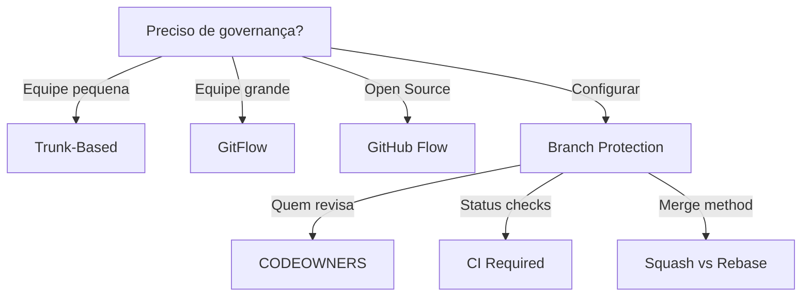

# Governance

Define diretrizes de governança para projetos e equipes.

## Quando Usar

### Use quando:
- Precisa definir processos de equipe
- Precisa configurar branch protection
- Precisa padronizar branching strategy
- Precisa configurar CODEOWNERS
- Precisa criar processo de revisão e aprovação

### Não use quando:

- Projeto pessoal sem colaboração
- Repositório somente leitura
- Projeto sem CI/CD

### Modos de Colaboração

#### Solo + Agentes (recomendado para projetos individuais com IA)
- **Operador solo** trabalha com **time de agentes de IA** como colaboradores
- Branch protection ainda se aplica: agentes devem trabalhar em branches isoladas
- SemVer obrigatório: cada mudança significativa gera nova tag
- Processo:
  ```
  Branch de trabalho → Implementação → Validação 100% → Merge → gh-pages sync → Tag SemVer
  ```
- Skills relacionadas: `implementation`, `adr-generator`, `agent-orchestration`

### Skills relacionadas:
- `git` — para padrões de commits e branches
- `release` — para versionamento semântico
- `repo-bootstrap` — para arquivos de governança iniciais

## Decision Tree



## Workflow

### Fase 1: Configurar Branch Protection

1. Acesse Settings > Branches no GitHub/GitLab
2. Adicione regra para `main`:
   ```
   Branch name pattern: main
   ```
3. Configure proteções:
   - [x] Require pull request reviews before merging
   - [x] Dismiss stale reviews when new commits are pushed
   - [x] Require status checks to pass before merging
   - [ ] Require branches to be up to date before merging
   - [x] Include administrators
   - [x] Allow force pushes (desmarque)
   - [x] Allow deletions (desmarque)
4. **Checkpoint**: Crie branch de teste e tente push direto para main (deve falhar)

### Fase 2: Configurar CODEOWNERS

1. Crie arquivo `.github/CODEOWNERS`:
   ```bash
   mkdir -p .github
   cp templates/codeowners .github/CODEOWNERS
   ```
2. Edite com equipes do projeto:
   ```
   * @minha-equipe/core
   /src/domain/ @minha-equipe/domain
   ```
3. Commit e push:
   ```bash
   git add .github/CODEOWNERS
   git commit -m "docs(governance): add CODEOWNERS"
   ```
4. **Checkpoint**: Crie PR e verifique se CODEOWNERS são notificados

### Fase 3: Processo de PR Completo

1. Crie branch a partir de `main` ou `develop`:
   ```bash
   git checkout -b feature/nova-funcionalidade
   ```
2. Faça commits pequenos e focados:
   ```bash
   git commit -m "feat: add user validation"
   ```
3. Abra PR com descrição completa:
   ```bash
   gh pr create --title "feat: add user validation" \
     --body-file templates/pull-request-template.md
   ```
4. Aguarde CI verde:
   ```bash
   gh pr checks --watch
   ```
5. Responda aos reviews
6. **Checkpoint**: PR aprovado e CI verde

### Fase 4: Release Management

1. Atualize CHANGELOG.md
2. Crie branch de release (se GitFlow):
   ```bash
   git checkout -b release/v1.2.0
   ```
3. Bump versão em package.json
4. Merge após aprovação
5. Crie tag:
   ```bash
   git tag v1.2.0
   git push --tags
   ```
6. **Checkpoint**: Release publicada e documentada

## Conceitos Fundamentais

### Branching Strategy

#### GitFlow (recomendado para releases agendadas)
- `main`: código em produção
- `develop`: branch de integração
- `feature/*`: novas features
- `release/*`: preparação de release
- `hotfix/*`: correções urgentes

#### Trunk-Based (recomendado para CI/CD contínuo)
- `main`: trunk sempre deployável
- `feature/*`: branches curtas (< 1 dia)
- Commits pequenos e frequentes

#### GitHub Flow (recomendado para open source)
- `main`: branch principal
- Branches curtas
- PR obrigatório
- Deploy automático após merge

### Versionamento Semântico

Formato: `MAJOR.MINOR.PATCH[-PRERELEASE][+BUILD]`

- **MAJOR**: mudanças incompatíveis
- **MINOR**: funcionalidades novas, retrocompatível
- **PATCH**: correções, retrocompatível

### Processo de PR

1. Feature branch a partir de `main` ou `develop`
2. Commits pequenos e focados
3. Abre PR com descrição completa
4. Pelo menos 1 aprovação (2 para mudanças arquiteturais)
5. CI verde (lint, testes, build)
6. Merge com squash ou rebase

## Templates

### pull-request-template.md
Localização: `templates/pull-request-template.md`

Template para descrição de Pull Request.

**Uso:**
```bash
cp templates/pull-request-template.md .github/PULL_REQUEST_TEMPLATE.md
```

### issue-template.md
Localização: `templates/issue-template.md`

Template para criação de issues.

**Uso:**
```bash
cp templates/issue-template.md .github/ISSUE_TEMPLATE.md
```

### codeowners
Localização: `templates/codeowners`

Configuração de CODEOWNERS para revisão automática.

**Uso:**
```bash
mkdir -p .github
cp templates/codeowners .github/CODEOWNERS
```

## Anti-patterns

### 🔴 Crítico

#### Approve sem Review
**O que é:** Aprovar PR sem ler código ou sem entender mudanças.
**Por que é ruim:** Bugs e problemas de arquitetura entram no codebase.
**Como evitar:** Sempre leia diff completo, execute localmente.
**Exemplo:**
```
# ❌ ERRADO
PR aberto às 14:00
Aprovado às 14:05 sem comentários

# ✅ CORRETO
PR aberto às 14:00
Review às 14:30 com 3 comentários
Discussão e ajustes
Aprovado às 15:30
```

#### Merge com CI Vermelho
**O que é:** Merge de PR mesmo com CI falhando.
**Por que é ruim:** Quebra main/develop, deploy falha.
**Como evitar:** Nunca merge com CI vermelho, resolva primeiro.
**Exemplo:**
```
# ❌ ERRADO
CI: failing
git merge --no-ff feature/branch

# ✅ CORRETO
CI: failing
# Investigar e corrigir
CI: passing
git merge --no-ff feature/branch
```

### 🟡 Médio

#### Branch sem PR
**O que é:** Trabalhar diretamente em main ou develop sem PR.
**Por que é ruim:** Nenhuma revisão, histórico de decisões perdido.
**Como evitar:** Sempre crie PR, mesmo para mudanças pequenas.
**Exemplo:**
```
# ❌ ERRADO
git checkout main
git add .
git commit -m "fix: quick fix"

# ✅ CORRETO
git checkout -b fix/quick-fix
git add .
git commit -m "fix: quick fix"
gh pr create
```

#### Review Superficial
**O que é:** Review que só comenta formatação, não lógica.
**Por que é ruim:** Problemas de arquitetura e bugs não são detectados.
**Como evitar:** Use checklist de review, foque em lógica e segurança.
**Exemplo:**
```
# ❌ ERRADO
"Missing semicolon" (único comentário)

# ✅ CORRETO
"Consider extracting this logic to a service for testability"
"Missing null check for user.email"
"Good use of early return pattern"
```

### 🟢 Baixo

#### PR sem Descrição
**O que é:** PR criado sem descrição ou com descrição genérica.
**Por que é ruim:** Revisores não entendem contexto, demora review.
**Como evitar:** Use template, preencha todos os campos.
**Exemplo:**
```
# ❌ ERRADO
Título: "fix"
Descrição: "fix bug"

# ✅ CORRETO
Título: "fix(auth): handle expired JWT token"
Descrição: "Implementa renovação automática de token expirado..."
```

## Checklists

### Checklist de PR
- [ ] Título claro e descritivo
- [ ] Descrição explica o que e por que
- [ ] Screenshots incluídos (se UI)
- [ ] Checklist preenchido
- [ ] Testes adicionados
- [ ] Coverage mantido
- [ ] Lint passa
- [ ] Build passa

### Checklist de Release
- [ ] CHANGELOG.md atualizado
- [ ] Versão bumpada
- [ ] Todos os testes passam
- [ ] Documentação atualizada
- [ ] Tag criada
- [ ] Release publicada

### Checklist de Onboarding
- [ ] Acesso ao repositório concedido
- [ ] CODEOWNERS configurado
- [ ] Branch protection explicada
- [ ] Processo de PR treinado
- [ ] CI/CD explicado

## Edge Cases

### Hotfix em Produção
**Situação:** Bug crítico precisa ser corrigido imediatamente.
**Solução:** Use branch hotfix, merge direto para main e develop.
**Exceção:** Se bug não é crítico, use processo normal.

```bash
# Hotfix
git checkout -b hotfix/critical-bug main
# ... corrigir ...
git commit -m "fix: critical bug"
git checkout main
git merge --no-ff hotfix/critical-bug
git tag v1.2.1
# Merge para develop também
git checkout develop
git merge --no-ff hotfix/critical-bug
```

### Revert de Release
**Situação:** Release quebrou produção, precisa reverter.
**Solução:** Crie branch de revert com tag especial.
**Exceção:** Se bug é pequeno, hotfix pode ser suficiente.

```bash
# Revert
git revert --no-commit v1.2.0
git commit -m "revert(release): v1.2.0 - breaks production"
git tag v1.2.0-rollback-20240115
```

### Contributor Externo
**Situação:** Pull Request de contribuinte externo.
**Solução:** Review mais rigoroso, verificar segurança e licença.
**Exceção:** Contribuinte já conhecido e confiável.

```bash
# Checklist adicional para externos
- [ ] Verificar histórico do contribuinte
- [ ] Revisar dependências novas
- [ ] Verificar licença de código incluído
- [ ] Testes adicionais para mudanças externas
```

## Referências

- [GitHub Flow](https://guides.github.com/introduction/flow/)
- [Semantic Versioning](https://semver.org/)
- `git` — para padrões de commits
- `release` — para processo de release