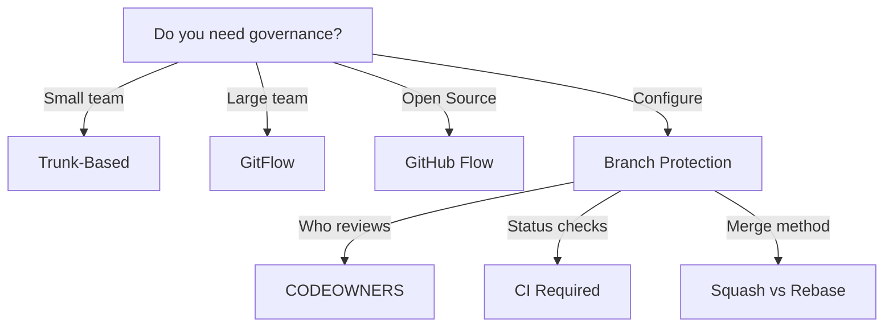

# Governance

Define governance guidelines for projects and teams.

## When to Use

### Use when:
- You need to define team processes
- You need to configure branch protection
- You need to standardize branching strategy
- You need to configure CODEOWNERS
- You need to create a review and approval process

### Do not use when:

- The project is personal and has no collaboration
- The repository is read-only
- The project has no CI/CD

### Collaboration Modes

#### Solo + Agents (Recommended for individual projects with AI)
- **Solo operator** works with **AI agents** as collaborators
- Branch protection still applies: agents must work in isolated branches
- SemVer is mandatory: each significant change generates a new tag
- Process:
  ```
  Work branch → Implementation → 100% Validation → Merge → gh-pages sync → Tag SemVer
  ```
- Related skills: `implementation`, `adr-generator`, `agent-orchestration`

### Related Skills:
- `git` — for commit and branch standards
- `release` — for semantic versioning
- `repo-bootstrap` — for initial governance files

## Decision Tree


```mermaid
graph TD
    A[Do you need governance?] -->|Small team| B[Trunk-Based]
    A -->|Large team| C[GitFlow]
    A -->|Open Source| D[GitHub Flow]
    A -->|Configure| E[Branch Protection]
    E -->|Who reviews| F[CODEOWNERS]
    E -->|Status checks| G[CI Required]
    E -->|Merge method| H[Squash vs Rebase]
```

## Workflow

### Phase 1: Configure Branch Protection

1. Access Settings > Branches on GitHub/GitLab
2. Add rule for `main`:
   ```
   Branch name pattern: main
   ```
3. Configure protections:
   - [x] Require pull request reviews before merging
   - [x] Dismiss stale reviews when new commits are pushed
   - [x] Require status checks to pass before merging
   - [ ] Require branches to be up to date before merging
   - [x] Include administrators
   - [x] Allow force pushes (uncheck)
   - [x] Allow deletions (uncheck)
4. **Checkpoint**: Create a test branch and try to push directly to main (should fail)

### Phase 2: Configure CODEOWNERS

1. Create file `.github/CODEOWNERS`:
   ```bash
   mkdir -p .github
   cp templates/codeowners .github/CODEOWNERS
   ```
2. Edit with project teams:
   ```
   * @my-team/core
   /src/domain/ @my-team/domain
   ```
3. Commit and push:
   ```bash
   git add .github/CODEOWNERS
   git commit -m "docs(governance): add CODEOWNERS"
   ```
4. **Checkpoint**: Create a PR and verify CODEOWNERS are notified

### Phase 3: Complete PR Process

1. Create a branch from `main` or `develop`:
   ```bash
   git checkout -b feature/new-feature
   ```
2. Make small and focused commits:
   ```bash
   git commit -m "feat: add user validation"
   ```
3. Open a PR with a complete description:
   ```bash
   gh pr create --title "feat: add user validation" \
     --body-file templates/pull-request-template.md
   ```
4. Wait for CI to be green:
   ```bash
   gh pr checks --watch
   ```
5. Respond to reviews
6. **Checkpoint**: PR approved and CI green

### Phase 4: Release Management

1. Update CHANGELOG.md
2. Create a release branch (if using GitFlow):
   ```bash
   git checkout -b release/v1.2.0
   ```
3. Bump version in package.json
4. Merge after approval
5. Create a tag:
   ```bash
   git tag v1.2.0
   git push --tags
   ```
6. **Checkpoint**: Release published and documented

## Fundamental Concepts

### Branching Strategy

#### GitFlow (Recommended for scheduled releases)
- `main`: production code
- `develop`: integration branch
- `feature/*`: new features
- `release/*`: release preparation
- `hotfix/*`: urgent fixes

#### Trunk-Based (Recommended for continuous CI/CD)
- `main`: trunk always deployable
- `feature/*`: short-lived branches (< 1 day)
- Small and frequent commits

#### GitHub Flow (Recommended for open source)
- `main`: main branch
- Short-lived branches
- PR required
- Automatic deploy after merge

### Semantic Versioning

Format: `MAJOR.MINOR.PATCH[-PRERELEASE][+BUILD]`

- **MAJOR**: incompatible changes
- **MINOR**: new features, backward compatible
- **PATCH**: fixes, backward compatible

### PR Process

1. Feature branch from `main` or `develop`
2. Small and focused commits
3. Open a PR with a complete description
4. At least 1 approval (2 for architectural changes)
5. CI green (lint, tests, build)
6. Merge with squash or rebase

## Templates

### pull-request-template.md
Location: `templates/pull-request-template.md`

Template for PR descriptions.

**Usage:**
```bash
cp templates/pull-request-template.md .github/PULL_REQUEST_TEMPLATE.md
```

### issue-template.md
Location: `templates/issue-template.md`

Template for issue creation.

**Usage:**
```bash
cp templates/issue-template.md .github/ISSUE_TEMPLATE.md
```

### codeowners
Location: `templates/codeowners`

Configuration for automatic CODEOWNERS review.

**Usage:**
```bash
mkdir -p .github
cp templates/codeowners .github/CODEOWNERS
```

## Anti-patterns

### 🔴 Critical

#### Approve without Review
**What is it:** Approving a PR without reading the code or understanding the changes.
**Why is it bad:** Bugs and architectural problems enter the codebase.
**How to avoid:** Always read the complete diff, execute locally.
**Example:**
```
# ❌ WRONG
PR opened at 14:00
Approved at 14:05 without comments

# ✅ RIGHT
PR opened at 14:00
Reviewed at 14:30 with 3 comments
Discussion and adjustments
Approved at 15:30
```

#### Merge with Red CI
**What is it:** Merging a PR even with CI failing.
**Why is it bad:** Breaks main/develop, deploy fails.
**How to avoid:** Never merge with red CI, resolve first.
**Example:**
```
# ❌ WRONG
CI: failing
git merge --no-ff feature/branch

# ✅ RIGHT
CI: failing
# Investigate and fix
CI: passing
git merge --no-ff feature/branch
```

### 🟡 Medium

#### Branch without PR
**What is it:** Working directly on main or develop without a PR.
**Why is it bad:** No review, historical decision loss.
**How to avoid:** Always create a PR, even for small changes.
**Example:**
```
# ❌ WRONG
git checkout main
git add .
git commit -m "fix: quick fix"

# ✅ RIGHT
git checkout -b fix/quick-fix
git add .
git commit -m "fix: quick fix"
gh pr create
```

#### Superficial Review
**What is it:** Review that only comments on formatting, not logic.
**Why is it bad:** Architectural and bug problems are not detected.
**How to avoid:** Use a review checklist, focus on logic and security.
**Example:**
```
# ❌ WRONG
"Missing semicolon" (only comment)

# ✅ RIGHT
"Consider extracting this logic to a service for testability"
"Missing null check for user.email"
"Good use of early return pattern"
```

### 🟢 Low

#### PR without Description
**What is it:** PR created without a description or with a generic description.
**Why is it bad:** Reviewers do not understand the context, review takes longer.
**How to avoid:** Use a template, fill in all fields.
**Example:**
```
# ❌ WRONG
Title: "fix"
Description: "fix bug"

# ✅ RIGHT
Title: "fix(auth): handle expired JWT token"
Description: "Implement automatic token renewal..."
```

## Checklists

### PR Checklist
- [ ] Clear and descriptive title
- [ ] Description explains what and why
- [ ] Screenshots included (if UI)
- [ ] Checklist completed
- [ ] Tests added
- [ ] Coverage maintained
- [ ] Lint passes
- [ ] Build passes

### Release Checklist
- [ ] CHANGELOG.md updated
- [ ] Version bumped
- [ ] All tests pass
- [ ] Documentation updated
- [ ] Tag created
- [ ] Release published

### Onboarding Checklist
- [ ] Repository access granted
- [ ] CODEOWNERS configured
- [ ] Branch protection explained
- [ ] PR process trained
- [ ] CI/CD explained

## Edge Cases

### Hotfix in Production
**Situation:** Critical bug needs to be fixed immediately.
**Solution:** Use a hotfix branch, merge directly to main and develop.
**Exception:** If the bug is not critical, use the normal process.

```bash
# Hotfix
git checkout -b hotfix/critical-bug main
# ... fix ...
git commit -m "fix: critical bug"
git checkout main
git merge --no-ff hotfix/critical-bug
git tag v1.2.1
# Merge to develop also
git checkout develop
git merge --no-ff hotfix/critical-bug
```

### Revert of Release
**Situation:** Release broke production, needs to be reverted.
**Solution:** Create a revert branch with a special tag.
**Exception:** If the bug is small, a hotfix may be sufficient.

```bash
# Revert
git revert --no-commit v1.2.0
git commit -m "revert(release): v1.2.0 - breaks production"
git tag v1.2.0-rollback-20240115
```

### External Contributor
**Situation:** Pull Request from an external contributor.
**Solution:** More rigorous review, check security and license.
**Exception:** Known and trusted contributor.

```bash
# Additional checklist for externals
- [ ] Verify contributor history
- [ ] Review new dependencies
- [ ] Check code license included
- [ ] Additional tests for external changes
```

## References

- [GitHub Flow](https://guides.github.com/introduction/flow/)
- [Semantic Versioning](https://semver.org/)
- `git` — for commit and branch standards
- `release` — for semantic versioning