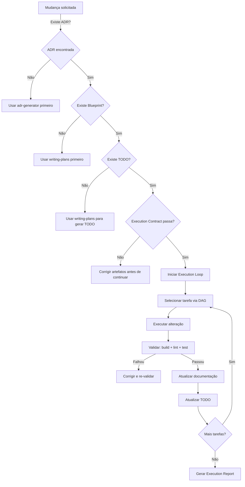

# Implementation

Executa mudanças previamente planejadas de forma governada e incremental, fechando o ciclo do SDLC baseado em Agent Skills.

## Quando Usar

### Use quando:
- Existe uma ADR aprovada (status "Aceito") que precisa ser implementada
- Existe um Blueprint e TODO associados à ADR
- Precisa de execução padronizada e reproduzível entre diferentes agentes
- Precisa de rastreabilidade completa durante a implementação
- Precisa de Execution Report ao término

### Não use quando:
- Ainda não existe ADR (use `adr-generator` primeiro)
- Precisa de planejamento (use `writing-plans` ou `planning`)
- A mudança é trivial (< 1 arquivo, < 30min) e não justifica governança
- Precisa de apenas um commit sem validação intermediária

### Skills relacionadas:
- `adr-generator` — gera as ADRs que esta skill consome
- `writing-plans` — gera Blueprints e TODOs que esta skill consome
- `testing` — executa testes durante validação contínua
- `git` — cria commits seguindo Conventional Commits
- `documentation` — atualiza documentação durante implementação
- `governance` — respeita processos de revisão e aprovação

## Decision Tree



## Conceitos Fundamentais

### Execution Contract

Contrato obrigatório que valida se todos os artefatos necessários estão presentes e coerentes antes de qualquer alteração.

**Campos do contrato:**
- ADR: path, status, decisão
- Blueprint: path, tarefas listadas
- TODO: path, tarefas com estados
- Branch: nome, estado limpo
- Workspace: sem alterações não commitadas
- Arquivos impactados: lista extraída do Blueprint
- Critérios de aceite: extraídos do TODO
- Critérios de rollback: definidos no Blueprint

**Regra:** Se qualquer campo obrigatório falhar, a implementação é interrompida.

### Artifact Resolution

Processo de descoberta e correlação automática dos documentos envolvidos na mudança.

**Algoritmo:**
1. Buscar `ADR-XXX.md` no diretório `docs/adr/`
2. Derivar paths do Blueprint (`ADR-XXX-BP.md`) e TODO (`ADR-XXX-TODO.md`)
3. Verificar existência de cada artefato
4. Extrair `related_skills` do frontmatter
5. Mapear arquivos impactados a partir do Blueprint
6. Retornar mapa consolidado

### Execution Loop

Modelo incremental de execução. Cada iteração processa uma tarefa do TODO:

1. **Selecionar** tarefa (via DAG, respeitando dependências)
2. **Executar** alteração no código
3. **Validar** (build, lint, typecheck, testes)
4. **Atualizar** documentação afetada
5. **Marcar** tarefa como concluída no TODO
6. **Reavaliar** dependências (próximas tarefas podem iniciar)

**Regras:**
- Máximo 1 tarefa "Em andamento" por vez
- Tarefa só inicia se todas as dependências estão "Concluído"
- Se validação falhar, tarefa vai para "Bloqueado" até correção
- Big Bang é estritamente proibido

### Change Lifecycle

Modelo formal do ciclo de vida de uma mudança:

```
ADR → Blueprint → TODO → Execution Contract → Artifact Resolution
  → Implementation → Validation → Documentation Update → Execution Report
```

## Workflow

### Workflow 1: Artifact Resolution

**Objetivo:** Descobrir e correlacionar todos os artefatos envolvidos.

1. Identificar a ADR de referência (por nome ou contexto)
2. Derivar paths: `ADR-XXX-BP.md`, `ADR-XXX-TODO.md`
3. Verificar existência de cada artefato
4. Ler frontmatter da ADR para extrair status e decisão
5. Ler Blueprint para extrair tarefas e dependências
6. Ler TODO para extrair estados atuais
7. Mapear `related_skills` do frontmatter
8. Extrair arquivos impactados do Blueprint
9. Retornar **Artifact Map** consolidado
10. **Checkpoint**: Todos os artefatos existem e estão coerentes

### Workflow 2: Execution Contract

**Objetivo:** Validar que a implementação pode iniciar com segurança.

1. Carregar Artifact Map (Workflow 1)
2. Validar que ADR existe e está "Aceito" ou "Proposto"
3. Validar que Blueprint existe e contém tarefas
4. Validar que TODO existe e contém tarefas com estados
5. Validar branch atual (não main/master sem PR)
6. Validar workspace limpo (sem uncommitted changes)
7. Validar que arquivos impactados existem
8. Extrair critérios de aceite do TODO
9. Extrair critérios de rollback do Blueprint
10. Gerar `execution-contract.md` preenchido
11. **Checkpoint**: Contrato assinado (todos os campos válidos)

### Workflow 3: Dependency Analysis & Execution Plan

**Objetivo:** Construir DAG e plano de execução.

1. Ler TODO e extrair todas as tarefas
2. Ler dependências de cada tarefa
3. Construir grafo dirigido acíclico (DAG)
4. Detectar ciclos (se existir, reportar erro e interromper)
5. Topological sort para ordem de execução
6. Identificar tarefas paralelizáveis (sem dependência entre si)
7. Gerar `change-plan.md` com DAG e ordem
8. Estimar tempo total a partir das estimativas do TODO
9. **Checkpoint**: DAG válido, sem ciclos, ordem definida

### Workflow 4: Incremental Execution

**Objetivo:** Executar tarefas uma a uma com validação.

Para cada tarefa na ordem do DAG:

1. Verificar que todas as dependências estão "Concluído"
2. Marcar tarefa como "Em andamento" no TODO
3. Gerar `task-progress.md` para a tarefa
4. Ler descrição e critérios de aceite da tarefa
5. Executar as alterações no código
6. Executar validação contínua (Workflow 5)
7. Se validação passar:
   - Atualizar documentação afetada
   - Marcar tarefa como "Concluído" no TODO
   - Atualizar `task-progress.md`
8. Se validação falhar:
   - Analisar causa raiz
   - Corrigir
   - Re-executar validação
   - Se não corrigir em 3 tentativas: marcar "Bloqueado"
9. Reavaliar dependências (tarefas dependentes podem iniciar)
10. **Checkpoint**: Tarefa concluída, TODO atualizado

### Workflow 5: Continuous Validation

**Objetivo:** Validar estado do projeto após cada alteração.

**Sequência de validação (quando aplicável):**

1. **Build**: `npm run build` / `cargo build` / equivalente
2. **Lint**: `npm run lint` / `cargo clippy` / equivalente
3. **Typecheck**: `npm run typecheck` / `cargo check` / equivalente
4. **Testes unitários**: `npm run test` / `cargo test` / equivalente
5. **Testes de integração**: se existirem
6. **Validação arquitetural**: verificar consistência com ADR
7. **Validação documental**: verificar que docs estão atualizados

**Regra:** Se qualquer passo falhar, a tarefa não pode ser marcada como "Concluído".

### Workflow 6: Documentation Synchronization

**Objetivo:** Garantir que documentação está sincronizada com código.

Após cada tarefa concluída:

1. Verificar se a alteração impacta ADRs existentes
2. Se sim, atualizar a ADR com novas informações
3. Verificar se o Blueprint precisa de ajustes
4. Se sim, atualizar o Blueprint
5. Verificar se README precisa de atualização
6. Se sim, atualizar README
7. Verificar se `related_skills` de outras skills precisam de ajuste
8. **Checkpoint**: Nenhuma documentação divergente do código

### Workflow 7: Progress Tracking

**Objetivo:** Manter TODO sincronizado durante toda a implementação.

**Estados permitidos:**

| Estado | Descrição | Transições |
|--------|-----------|------------|
| ⬜ Pendente | Tarefa não iniciada | → Em andamento |
| 🔄 Em andamento | Tarefa em execução | → Concluído, Bloqueado |
| ✅ Concluído | Tarefa finalizada com sucesso | — |
| ❌ Bloqueado | Tarefa impedida | → Em andamento, Pendente |
| ⏸️ Pausado | Tarefa adiada voluntariamente | → Pendente |

**Regras:**
- Máximo 1 tarefa "Em andamento" por vez
- "Concluído" só após validação bem-sucedida
- "Bloqueado" requer justificativa
- Estado deve ser atualizado no TODO imediatamente

### Workflow 8: Execution Report

**Objetivo:** Gerar relatório final da implementação.

**Campos do relatório:**
- Resumo da implementação
- ADR referência
- Data de início e término
- Tarefas concluídas, adiadas, bloqueadas
- Validações executadas (build, lint, test)
- Riscos remanescentes
- Dívida técnica criada
- Recomendações futuras

## Templates

### execution-contract.md
Localização: `templates/execution-contract.md`

Contrato obrigatório que deve ser preenchido e validado antes de qualquer alteração. Contém artefatos, ambiente, critérios de aceite e rollback.

### execution-report.md
Localização: `templates/execution-report.md`

Relatório final gerado ao término da implementação. Documenta tarefas concluídas, validações, riscos e recomendações.

### change-plan.md
Localização: `templates/change-plan.md`

Plano interno de execução com DAG de dependências, ordem de execução e estimativas.

### rollback-report.md
Localização: `templates/rollback-report.md`

Relatório produzido quando uma implementação requer reversão. Documenta motivo, tarefas revertidas e ações corretivas.

### task-progress.md
Localização: `templates/task-progress.md`

Progresso individual de cada tarefa durante a execução. Rastreia estado, alterações, validações e bloqueadores.

## Anti-patterns

### 🔴 Crítico

#### Executar sem Execution Contract
**O que é:** Iniciar alterações sem validar que ADR, Blueprint e TODO existem e estão coerentes.
**Por que é ruim:** Pode levar a implementação inconsistente com a decisão arquitetural.
**Como evitar:** Sempre gerar e validar o Execution Contract antes de qualquer alteração.
**Exemplo:**
```
# ❌ ERRADO
"Vou implementar a ADR-005 agora" (sem verificar se Blueprint existe)

# ✅ CORRETO
1. Gerar Artifact Map
2. Validar Execution Contract
3. Só então iniciar execução
```

#### Big Bang Implementation
**O que é:** Implementar todas as tarefas de uma vez sem validação intermediária.
**Por que é ruim:** Se algo falhar, não há ponto de retorno claro; dificulta rollback.
**Como evitar:** Seguir o Execution Loop estritamente — uma tarefa por vez.
**Exemplo:**
```
# ❌ ERRADO
Modificar 15 arquivos de uma vez, commitar tudo junto

# ✅ CORRETO
Tarefa 1 → validar → commit
Tarefa 2 → validar → commit
Tarefa 3 → validar → commit
```

#### Ignorar Falha de Validação
**O que é:** Prosseguir com tarefa seguinte quando build/test/lint falhou na tarefa atual.
**Por que é ruim:** Acumula erros; cada tarefa depende do estado anterior.
**Como evitar:** Se validação falhar, corrigir antes de avançar. Sem exceções.
**Exemplo:**
```
# ❌ ERRADO
"O teste falhou, mas vou continuar e corrigir depois"

# ✅ CORRETO
"O teste falhou → analisar causa → corrigir → re-testar → só então avançar"
```

### 🟡 Médio

#### Atualizar código sem atualizar documentação
**O que é:** Implementar alteração mas esquecer de sincronizar ADR, Blueprint ou README.
**Por que é ruim:** Documentação fica desatualizada; perde rastreabilidade.
**Como evitar:** Workflow 6 (Documentation Synchronization) deve rodar após cada tarefa.

#### Executar tarefas fora da ordem do DAG
**O que é:** Pular dependências e executar tarefa que depende de outra não concluída.
**Por que é ruim:** Pode causar erros de compilação, lógica inconsistente.
**Como evitar:** Respeitar topological sort do DAG; verificar dependências antes de cada tarefa.

#### Marcar tarefa como "Concluído" sem validação
**O que é:** Declarar tarefa pronta sem rodar build/test/lint.
**Por que é ruim:** Tarefa pode conter erros silenciosos.
**Como evitar:** Workflow 5 (Continuous Validation) é obrigatório antes de marcar "Concluído".

### 🟢 Baixo

#### Não gerar Execution Report
**O que é:** Finalizar implementação sem produzir relatório.
**Por que é ruim:** Perde-se oportunidade de documentar lições e riscos.
**Como evitar:** Sempre gerar relatório ao término, mesmo para mudanças simples.

#### Estimativas muito otimistas no change-plan
**O que é:** Subestimar tempo de tarefas no DAG.
**Por que é ruim:** Cria expectativa irreal; pode levar a pressão desnecessária.
**Como evitar:** Usar estimativas do TODO como base; adicionar buffer de 20%.

## Checklists

### Checklist de Pré-Execução
Localização: `checklists/pre-execution.md`

Executar antes de iniciar qualquer implementação. Valida artefatos, coerência, ambiente, arquivos impactados, critérios e dependências.

### Checklist de Pós-Execução
Localização: `checklists/post-execution.md`

Executar após concluir toda a implementação. Valida tarefas, build, qualidade, testes, documentação, registry, git, riscos e relatório.

## Edge Cases

### ADR com status "Proposto" (não "Aceito")
**Situação:** O usuário quer implementar uma ADR que ainda não foi formalmente aceita.
**Solução:** Alertar que a ADR não está aceita; pedir confirmação explícita antes de prosseguir.
**Exceção:** Em contexto de prototipação, "Proposto" pode ser suficiente.

### Blueprint incompleto (tarefas sem dependências)
**Situação:** O Blueprint existe mas não documenta dependências entre tarefas.
**Solução:** Assumir que tarefas sem dependência explícita são independentes; construir DAG com base no que está disponível.
**Exceção:** Se mais de 50% das tarefas não têm dependências, alertar sobre possível incompletude.

### TODO com tarefas desatualizadas
**Situação:** O TODO não reflete o estado atual do código (tarefas já executadas manualmente).
**Solução:** Antes de iniciar, verificar estado real do código contra o TODO; atualizar estados antes de construir DAG.
**Exceção:** Nenhuma — TODO deve sempre estar sincronizado antes de execução.

### Implementação com múltiplas ADRs
**Situação:** A mudança envolve mais de uma ADR (ex: ADR-004 + ADR-005).
**Solução:** Criar um Execution Contract para cada ADR; executar sequencialmente (uma ADR por vez); ou criar um "meta-contracto" se as ADRs são acopladas.
**Exceção:** Se as ADRs são totalmente independentes, podem ser executadas em paralelo (worktrees separados).

### Rollback durante execução
**Situação:** Tarefa executada causou problema que requer rollback.
**Solução:** Gerar `rollback-report.md`, reverter commits da tarefa, marcar tarefa como "Bloqueado", analisar causa raiz.
**Exceção:** Se o rollback corrompe o estado, interromper toda a implementação.

### Agente sem acesso a comandos de build/test
**Situação:** O agente não consegue rodar `npm test`, `cargo build`, etc.
**Solução:** Pular validação automatizada; marcar tarefa como "Concluído com ressalva"; documentar no Execution Report que validação manual é necessária.
**Exceção:** Nenhuma — neste caso, o Execution Report deve indicar claramente a ausência de validação.

## Referências

- [ADR-005: Introdução da Skill implementation](../../docs/adr/archive/ADR-005.md)
- [ADR-005-BP: Blueprint detalhado](../../docs/adr/archive/ADR-005-BP.md)
- [ADR-002: Ultra-High Quality Grade](../../docs/adr/archive/ADR-002.md)
- [Skill adr-generator](../adr-generator/SKILL.md)
- [Skill writing-plans](../writing-plans/SKILL.md)
- [Skill testing](../testing/SKILL.md)
- [Skill governance](../governance/SKILL.md)
