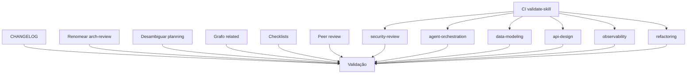

# Exemplo: Mudança Complexa (Multi-ADR)

> Exemplo de implementação governada para uma mudança que envolve múltiplas ADRs e 10+ tarefas.

---

## Contexto

- **ADR principal:** ADR-004 (Implementação das Recomendações da Ultra-Auditoria)
- **ADR secundária:** ADR-005 (Skill `implementation`)
- **Blueprint:** ADR-004-BP.md (7 tarefas Fase A + 6 skills Fase B)
- **TODO:** ADR-004-TODO.md (124 tarefas, 3 fases)

---

## Fluxo Completo

### 1. Artifact Resolution

```bash
ADR_PATH="docs/adr/ADR-004.md"
BP_PATH="docs/adr/ADR-004-BP.md"
TODO_PATH="docs/adr/ADR-004-TODO.md"
```

**Resultado:**
- ADR existe ✅
- Blueprint existe ✅
- TODO existe ✅
- 124 tarefas identificadas
- 3 fases: Débitos (7), Skills (6), Validação (1)

---

### 2. Execution Contract

```markdown
## Artefatos
| Artefato | Status | Coerente |
|----------|--------|----------|
| ADR-004.md | Aceito | ✅ |
| ADR-004-BP.md | Existente | ✅ |
| ADR-004-TODO.md | Existente | ✅ |

## Ambiente
| Campo | Valor |
|-------|-------|
| Branch | feature/adr-004-audit-fixes |
| Workspace limpo | Sim |
| Arquivos impactados | 20+ skills, index.json, CI workflow |
```

**Contrato validado ✅**

---

### 3. Change Plan (DAG)



**Ordem de execução:**

| Fase | Tarefas | Paralelizável? |
|------|---------|----------------|
| 1 | A1-A7 (débitos) | Sim (todas independentes) |
| 2 | B1-B6 (skills) | Não (sequencial, cada uma depende de A1) |
| 3 | C1 (validação) | Não (depende de todas) |

---

### 4. Execution Loop (resumo)

#### Fase 1: Débitos Técnicos (7 tarefas)

| Tarefa | Estado | Duração | Validações |
|--------|--------|---------|------------|
| A1: CI validate-skill.sh | ✅ | 30min | CI passa |
| A2: CHANGELOG v2.0.x | ✅ | 20min | Formato OK |
| A3: Renomear arch-review | ✅ | 30min | 0 refs quebradas |
| A4: Desambiguar planning | ✅ | 20min | Cross-refs OK |
| A5: Grafo related_skills | ✅ | 10min | Grafo conexo |
| A6: Checklists/ | ✅ | 15min | Pasta existe |
| A7: Peer review | ✅ | 10min | Nota presente |

**Fase 1 concluída ✅ (2h15min)**

---

#### Fase 2: Skills Novas (6 skills)

| Skill | Estado | Linhas | Templates | Validação |
|-------|--------|--------|-----------|-----------|
| security-review | ✅ | 285 | 3 | validate-skill.sh passa |
| agent-orchestration | ✅ | 270 | 3 | validate-skill.sh passa |
| data-modeling | ✅ | 260 | 3 | validate-skill.sh passa |
| api-design | ✅ | 245 | 3 | validate-skill.sh passa |
| observability | ✅ | 255 | 3 | validate-skill.sh passa |
| refactoring | ✅ | 240 | 3 | validate-skill.sh passa |

**Fase 2 concluída ✅ (14h)**

---

#### Fase 3: Validação Final

| Validação | Resultado |
|-----------|-----------|
| validate-index.sh | ✅ 20/20 skills |
| validate-skill.sh (todas) | ✅ 0 erros |
| related_skills | ✅ Grafo conexo |
| index.json | ✅ 20 entradas |

**Fase 3 concluída ✅ (30min)**

---

### 5. Documentation Synchronization

- CHANGELOG.md: atualizado com v2.0.2 ✅
- README.md: atualizado com 20 skills ✅
- ADR-004.md: status "Aceito (Implementação concluída)" ✅
- ADR-004-TODO.md: todas as tarefas ✅

---

### 6. Execution Report

```markdown
## Resumo
| Campo | Valor |
|-------|-------|
| Duração total | ~16.5h |
| Tarefas totais | 124 |
| Concluídas | 124 |
| Adiadas | 0 |
| Bloqueadas | 0 |
| Taxa de conclusão | 100% |

## Validações
| Validação | Resultado |
|-----------|-----------|
| validate-index.sh | ✅ |
| validate-skill.sh (20 skills) | ✅ |
| related_skills grafo | ✅ |
```

**Implementação concluída com sucesso ✅**

---

## Lições

1. **Mudanças grandes benefitiam de DAG:** a visualização das dependências evita execução fora de ordem
2. **Fases paralelizáveis aceleram:** a Fase 1 (débitos) foi toda paralelizável
3. **Validação contínua evita retrabalho:** cada skill foi validada individualmente antes de prosseguir
4. **Execution Report documenta tudo:** future reference para decisões similares
5. **Múltiplas ADRs podem ser encadeadas:** ADR-004 gerou ADR-005 como consequência
