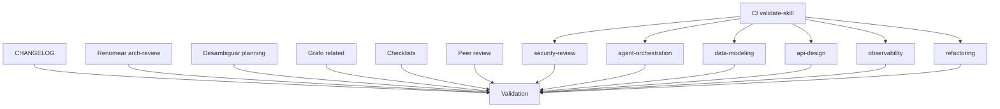

# Example: Complex Change (Multi-ADR)

> Example of a governed implementation for a change that involves multiple ADRs and 10+ tasks.

---

## Context

- **Primary ADR:** ADR-004 (Implementation of Ultra-Audit Recommendations)
- **Secondary ADR:** ADR-005 (Skill implementation)
- **Blueprint:** ADR-004-BP.md (7 tasks Phase A + 6 skills Phase B)
- **TODO:** ADR-004-TODO.md (124 tasks, 3 phases)

---

## Complete Flow

### 1. Artifact Resolution

```bash
ADR_PATH="docs/adr/ADR-004.md"
BP_PATH="docs/adr/ADR-004-BP.md"
TODO_PATH="docs/adr/ADR-004-TODO.md"
```

**Result:**
- ADR exists ✅
- Blueprint exists ✅
- TODO exists ✅
- 124 tasks identified
- 3 phases: Debts (7), Skills (6), Validation (1)

---

### 2. Execution Contract

```markdown
## Artifacts
| Artifact | Status | Consistent |
|----------|--------|-------------|
| ADR-004.md | Accepted | ✅ |
| ADR-004-BP.md | Exists | ✅ |
| ADR-004-TODO.md | Exists | ✅ |

## Environment
| Field | Value |
|-------|-------|
| Branch | feature/adr-004-audit-fixes |
| Clean Workspace | Yes |
| Affected Files | 20+ skills, index.json, CI workflow |
```

**Contract validated ✅**

---

### 3. Change Plan (DAG)


```mermaid
graph TD
    A1[CI validate-skill] --> B1[security-review]
    A1 --> B2[agent-orchestration]
    A1 --> B3[data-modeling]
    A1 --> B4[api-design]
    A1 --> B5[observability]
    A1 --> B6[refactoring]
    A2[CHANGELOG] --> C1[Validation]
    A3[Renomear arch-review] --> C1
    A4[Desambiguar planning] --> C1
    A5[Grafo related] --> C1
    A6[Checklists] --> C1
    A7[Peer review] --> C1
    B1 --> C1
    B2 --> C1
    B3 --> C1
    B4 --> C1
    B5 --> C1
    B6 --> C1
```

**Execution order:**

| Phase | Tasks | Parallelizable? |
|------|---------|------------------|
| 1 | A1-A7 (debts) | Yes (all independent) |
| 2 | B1-B6 (skills) | No (sequential, each depends on A1) |
| 3 | C1 (validation) | No (depends on all) |

---

### 4. Execution Loop (summary)

#### Phase 1: Technical Debts (7 tasks)

| Task | Status | Duration | Validations |
|--------|--------|---------|------------|
| A1: CI validate-skill.sh | ✅ | 30min | CI passes |
| A2: CHANGELOG v2.0.x | ✅ | 20min | Format OK |
| A3: Renomear arch-review | ✅ | 30min | 0 broken refs |
| A4: Desambiguar planning | ✅ | 20min | Cross-refs OK |
| A5: Grafo related_skills | ✅ | 10min | Graph connected |
| A6: Checklists/ | ✅ | 15min | Folder exists |
| A7: Peer review | ✅ | 10min | Note present |

**Phase 1 completed ✅ (2h15min)**

---

#### Phase 2: New Skills (6 skills)

| Skill | Status | Lines | Templates | Validation |
|-------|--------|--------|-----------|-----------|
| security-review | ✅ | 285 | 3 | validate-skill.sh passes |
| agent-orchestration | ✅ | 270 | 3 | validate-skill.sh passes |
| data-modeling | ✅ | 260 | 3 | validate-skill.sh passes |
| api-design | ✅ | 245 | 3 | validate-skill.sh passes |
| observability | ✅ | 255 | 3 | validate-skill.sh passes |
| refactoring | ✅ | 240 | 3 | validate-skill.sh passes |

**Phase 2 completed ✅ (14h)**

---

#### Phase 3: Final Validation

| Validation | Result |
|-----------|-----------|
| validate-index.sh | ✅ 20/20 skills |
| validate-skill.sh (all) | ✅ 0 errors |
| related_skills | ✅ Graph connected |
| index.json | ✅ 20 entries |

**Phase 3 completed ✅ (30min)**

---

### 5. Documentation Synchronization

- CHANGELOG.md: updated with v2.0.2 ✅
- README.md: updated with 20 skills ✅
- ADR-004.md: status "Accepted (Implementation completed)" ✅
- ADR-004-TODO.md: all tasks ✅

---

### 6. Execution Report

```markdown
## Summary
| Field | Value |
|-------|-------|
| Total duration | ~16.5h |
| Total tasks | 124 |
| Completed | 124 |
| Deferred | 0 |
| Blocked | 0 |
| Completion rate | 100% |

## Validations
| Validation | Result |
|-----------|-----------|
| validate-index.sh | ✅ |
| validate-skill.sh (20 skills) | ✅ |
| related_skills graph | ✅ |
```

**Implementation completed successfully ✅**

---

## Lessons

1. **Large changes benefit from DAG:** visualizing dependencies avoids out-of-order execution
2. **Parallelizable phases accelerate:** Phase 1 (debts) was entirely parallelizable
3. **Continuous validation avoids rework:** each skill was validated individually before proceeding
4. **Execution Report documents everything:** future reference for similar decisions
5. **Multiple ADRs can be chained:** ADR-004 generated ADR-005 as a consequence