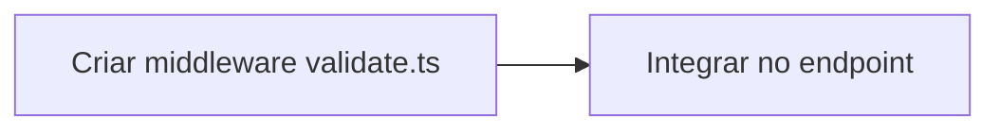

# Exemplo: Mudança Simples (1-2 Tarefas)

> Exemplo de implementação governada para uma mudança pontual: adicionar validação de input em um endpoint.

---

## Contexto

- **ADR:** ADR-006 (proposta para adicionar validação de input)
- **Blueprint:** ADR-006-BP.md (2 tarefas: criar middleware + integrar)
- **TODO:** ADR-006-TODO.md (2 tarefas, sem dependências entre si)

---

## Fluxo Completo

### 1. Artifact Resolution

```bash
# Agente identifica os artefatos
ADR_PATH="docs/adr/ADR-006.md"
BP_PATH="docs/adr/ADR-006-BP.md"
TODO_PATH="docs/adr/ADR-006-TODO.md"
```

**Resultado:**
- ADR existe ✅
- Blueprint existe ✅
- TODO existe ✅
- Coerência verificada ✅

---

### 2. Execution Contract

```markdown
## Artefatos
| Artefato | Status | Coerente |
|----------|--------|----------|
| ADR-006.md | Aceito | ✅ |
| ADR-006-BP.md | Existente | ✅ |
| ADR-006-TODO.md | Existente | ✅ |

## Ambiente
| Campo | Valor |
|-------|-------|
| Branch | feature/input-validation |
| Workspace limpo | Sim |
| Arquivos impactados | src/middleware/validate.ts, src/routes/users.ts |
```

**Contrato validado ✅**

---

### 3. Change Plan (DAG)



**Ordem:** T1 → T2 (sequencial, T2 depende de T1)

---

### 4. Execution Loop

#### Tarefa 1: Criar middleware validate.ts

**Estado:** ⬜ → 🔄 Em andamento

**Alterações:**
```
Criado: src/middleware/validate.ts (+45 linhas)
```

**Validações:**
| Validação | Resultado | Tentativa |
|-----------|-----------|-----------|
| Build | ✅ | 1 |
| Lint | ✅ | 1 |
| Typecheck | ✅ | 1 |

**Estado:** 🔄 → ✅ Concluído

---

#### Tarefa 2: Integrar no endpoint

**Estado:** ⬜ → 🔄 Em andamento

**Alterações:**
```
Modificado: src/routes/users.ts (+3 linhas, -1 linha)
```

**Validações:**
| Validação | Resultado | Tentativa |
|-----------|-----------|-----------|
| Build | ✅ | 1 |
| Lint | ✅ | 1 |
| Typecheck | ✅ | 1 |
| Testes unitários | ✅ | 1 |

**Estado:** 🔄 → ✅ Concluído

---

### 5. Documentation Synchronization

- ADR-006.md: adicionada nota de implementação ✅
- README.md: não requer atualização (feature interna)

---

### 6. Execution Report

```markdown
## Resumo
| Campo | Valor |
|-------|-------|
| Tarefas totais | 2 |
| Concluídas | 2 |
| Adiadas | 0 |
| Bloqueadas | 0 |
| Taxa de conclusão | 100% |

## Validações
| Validação | Resultado |
|-----------|-----------|
| Build | ✅ |
| Lint | ✅ |
| Typecheck | ✅ |
| Testes | ✅ |
```

**Implementação concluída com sucesso ✅**

---

## Lições

1. Mudanças simples (1-2 tarefas) podem ser executadas em um único ciclo
2. Mesmo para mudanças simples, o Execution Contract garante que nada foi esquecido
3. O relatório final documenta que a implementação foi validada
