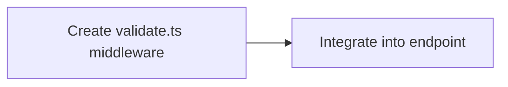

# Example: Simple Change (1-2 Tasks)

> Example of a governed implementation for a point change: adding input validation to an endpoint.

---

## Context

- **ADR:** ADR-006 (proposed for adding input validation)
- **Blueprint:** ADR-006-BP.md (2 tasks: create middleware + integrate)
- **TODO:** ADR-006-TODO.md (2 tasks, no dependencies between them)

---

## Complete Flow

### 1. Artifact Resolution

```bash
# Agent identifies artifacts
ADR_PATH="docs/adr/ADR-006.md"
BP_PATH="docs/adr/ADR-006-BP.md"
TODO_PATH="docs/adr/ADR-006-TODO.md"
```

**Result:**
- ADR exists ✅
- Blueprint exists ✅
- TODO exists ✅
- Coherence verified ✅

---

### 2. Execution Contract

```markdown
## Artifacts
| Artifact | Status | Coherent |
|----------|--------|----------|
| ADR-006.md | Accepted | ✅ |
| ADR-006-BP.md | Exists | ✅ |
| ADR-006-TODO.md | Exists | ✅ |

## Environment
| Field | Value |
|-------|-------|
| Branch | feature/input-validation |
| Clean Workspace | Yes |
| Affected Files | src/middleware/validate.ts, src/routes/users.ts |
```

**Contract validated ✅**

---

### 3. Change Plan (DAG)


```mermaid
graph LR
    T1[Create validate.ts middleware] --> T2[Integrate into endpoint]
```

**Order:** T1 → T2 (sequential, T2 depends on T1)

---

### 4. Execution Loop

#### Task 1: Create validate.ts middleware

**State:** ⬜ → 🔄 In progress

**Changes:**
```
Created: src/middleware/validate.ts (+45 lines)
```

**Validations:**
| Validation | Result | Attempt |
|-----------|--------|----------|
| Build | ✅ | 1 |
| Lint | ✅ | 1 |
| Typecheck | ✅ | 1 |

**State:** 🔄 → ✅ Completed

---

#### Task 2: Integrate into endpoint

**State:** ⬜ → 🔄 In progress

**Changes:**
```
Modified: src/routes/users.ts (+3 lines, -1 line)
```

**Validations:**
| Validation | Result | Attempt |
|-----------|--------|----------|
| Build | ✅ | 1 |
| Lint | ✅ | 1 |
| Typecheck | ✅ | 1 |
| Unit Tests | ✅ | 1 |

**State:** 🔄 → ✅ Completed

---

### 5. Documentation Synchronization

- ADR-006.md: added implementation note ✅
- README.md: no update required (internal feature)

---

### 6. Execution Report

```markdown
## Summary
| Field | Value |
|-------|-------|
| Total Tasks | 2 |
| Completed | 2 |
| Deferred | 0 |
| Blocked | 0 |
| Completion Rate | 100% |

## Validations
| Validation | Result |
|-----------|--------|
| Build | ✅ |
| Lint | ✅ |
| Typecheck | ✅ |
| Tests | ✅ |
```

**Implementation completed successfully ✅**

---

## Lessons

1. Simple changes (1-2 tasks) can be executed in a single cycle
2. Even for simple changes, the Execution Contract ensures nothing was overlooked
3. The final report documents that the implementation was validated