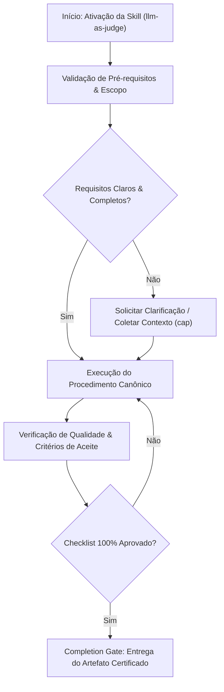

# LLM-as-Judge

## When to Use

### Use when:
- Establishing automated LLM evaluation benchmarks and model grading
- Evaluating conversational outputs against 1-5 rubrics with CoT justifications
- Measuring Cohen's Kappa ($\kappa \ge 0.70$) agreement between model and human evaluators

### Do not use when:
- Deterministic unit tests with exact binary assertion matching

## Overview

Some quality criteria are inherently subjective — tone of voice, visual aesthetics, UX feel, documentation clarity, code readability. These cannot be verified by deterministic tests. The LLM-as-judge pattern provides structured, repeatable evaluation using an LLM reviewer with defined rubrics, ensuring subjective quality is measured consistently.

**Announce at start:** "I'm using the llm-as-judge skill to evaluate subjective quality."

---

## Phase 1: Determine Evaluation Method

**Goal:** Decide whether LLM-as-judge is the right tool.

### Decision Table: LLM-as-Judge vs Deterministic Tests

| Criterion Type | Method | Example |
| --------------- | -------- | --------- |
| **Objective, measurable** | Deterministic test | "Response time < 200ms" |
| **Structural, verifiable** | Deterministic test | "Returns valid JSON" |
| **Subjective, qualitative** | LLM-as-judge | "Error messages are friendly and helpful" |
| **Aesthetic, perceptual** | LLM-as-judge | "UI feels clean and modern" |
| **Linguistic, tonal** | LLM-as-judge | "Documentation is clear for beginners" |
| **Holistic, experiential** | LLM-as-judge | "The onboarding flow feels intuitive" |

**Rule of thumb:** If you can write a boolean assertion, use a deterministic test. If evaluation requires judgment, use LLM-as-judge.

### STOP — Do NOT proceed to Phase 2 until

- [ ] Confirmed that criteria are genuinely subjective
- [ ] Deterministic testing has been ruled out
- [ ] Specific artifacts to evaluate are identified

---

## Phase 2: Define Rubric

**Goal:** Create evaluation dimensions with weights and anchor points.

### Actions

1. Define 3-5 evaluation dimensions
2. Assign weights (must sum to 1.0)
3. Define anchor points for each dimension (1=worst, 5=adequate, 10=best)
4. Set passing threshold

### Rubric Structure

| Dimension | Weight | Scale | Anchor: 1 | Anchor: 5 | Anchor: 10 |
|-----------|--------|-------|-----------|-----------|------------|
| [Name] | 0.X | 1-10 | [Worst case] | [Adequate] | [Excellent] |

### Threshold Selection Table

| Quality Level | Threshold | Use For |
| -------------- | ----------- | --------- |
| Minimum viable | 5.0 | Internal docs, draft content |
| Production quality | 7.0 | User-facing content, public APIs |
| Excellence | 8.5 | Marketing, critical UX flows |

### STOP — Do NOT proceed to Phase 3 until

- [ ] 3-5 dimensions are defined with clear descriptions
- [ ] Weights sum to exactly 1.0
- [ ] Anchor points are specific (not vague)
- [ ] Passing threshold is set before evaluation

---

## Phase 3: Evaluate

**Goal:** Submit the artifact with rubric to an LLM reviewer.

### Review Request Structure

```javascript
{
  criteria: "Description of what to evaluate and the quality standard",
  artifact: "The content to be evaluated (code, text, UI markup, etc.)",
  rubric: [
    { dimension: "Clarity", weight: 0.3, description: "Is the content easy to understand?" },
related_skills:
  - cap
  - implementation
  - technical-documentation
    { dimension: "Tone", weight: 0.3, description: "Is the tone appropriate for the audience?" },
related_skills:
  - cap
  - implementation
  - technical-documentation
    { dimension: "Completeness", weight: 0.2, description: "Does it cover all necessary points?" },
related_skills:
  - cap
  - implementation
  - technical-documentation
    { dimension: "Engagement", weight: 0.2, description: "Does it hold the reader's interest?" }
related_skills:
  - cap
  - implementation
  - technical-documentation
  ],
  passing_threshold: 7.0,
  intelligence: "opus"
}
```

### Review Response Structure

```javascript
{
  scores: [
    { dimension: "Clarity", score: 8, reasoning: "Well-structured with clear headings..." },
    { dimension: "Tone", score: 7, reasoning: "Professional but occasionally too formal..." },
    { dimension: "Completeness", score: 9, reasoning: "Covers all key topics..." },
    { dimension: "Engagement", score: 6, reasoning: "Could use more examples..." }
  ],
  weighted_score: 7.4,
  pass: true,
  summary: "Overall good quality with minor tone and engagement improvements suggested.",
  suggestions: [
    "Add a real-world example in section 3",
    "Use more conversational language in the introduction"
  ]
}
```

### STOP — Do NOT proceed to Phase 4 until

- [ ] Artifact has been submitted with full rubric
- [ ] Each dimension has been scored independently
- [ ] Reasoning is provided for every score
- [ ] Weighted total is calculated

---

## Phase 4: Iterate or Accept

**Goal:** Act on the evaluation results.

### Result Action Table

| Result | Action | Max Iterations |
| -------- | -------- | --------------- |
| **Pass** (score >= threshold) | Accept the artifact, proceed | Done |
| **Marginal fail** (within 1 point) | Apply suggestions, re-evaluate once | 1 |
| **Clear fail** (> 1 point below) | Significant revision, apply all suggestions | 2 |
| **Repeated fail** (3+ attempts) | Escalate — rubric or approach may need adjustment | Escalate |

### STOP — Evaluation complete when

- [ ] Artifact passes threshold, OR
- [ ] 3 iterations completed and escalation decision made

---

## Common Rubric Templates

### Documentation Quality

```
Clarity (0.3): Is the content easy to understand for the target audience?
  1=incomprehensible  5=adequate but requires re-reading  10=crystal clear
Accuracy (0.3): Is the information technically correct?
  1=factually wrong  5=mostly correct  10=perfectly accurate
Completeness (0.2): Does it cover all necessary topics?
  1=missing critical info  5=covers basics  10=comprehensive
Examples (0.2): Are there sufficient, relevant code examples?
  1=no examples  5=some examples  10=rich, varied examples
Threshold: 7.0
```

### Error Message Quality

```
Helpfulness (0.4): Does the message help the user fix the problem?
  1=no help at all  5=vague direction  10=exact fix steps
Clarity (0.3): Is the message easy to understand?
  1=cryptic  5=understandable  10=immediately clear
Tone (0.2): Is the tone empathetic and non-blaming?
  1=hostile/blaming  5=neutral  10=empathetic and supportive
Actionability (0.1): Does it suggest a concrete next step?
  1=no suggestion  5=vague suggestion  10=specific actionable step
Threshold: 7.5
```

### Code Readability

```
Naming (0.3): Are variable/function names descriptive and consistent?
  1=single letters everywhere  5=adequate  10=self-documenting
Structure (0.3): Is the code logically organized?
  1=spaghetti  5=functional  10=elegant and clear
Simplicity (0.2): Is the code as simple as possible (but not simpler)?
  1=over-engineered  5=reasonable  10=minimal and clear
Documentation (0.2): Are complex sections adequately commented?
  1=no comments where needed  5=some comments  10=well-documented why
Threshold: 7.0
```

### UX Copy

```
Clarity (0.3): Is the copy easy to understand?
  1=confusing  5=understandable  10=immediately clear
Brevity (0.2): Is it concise without losing meaning?
  1=verbose  5=adequate length  10=perfectly concise
Tone (0.2): Does it match the brand voice?
  1=off-brand  5=neutral  10=perfectly on-brand
Actionability (0.2): Do CTAs clearly communicate what happens next?
  1=unclear  5=adequate  10=crystal clear action
Accessibility (0.1): Is the language inclusive and jargon-free?
  1=exclusionary  5=neutral  10=fully inclusive
Threshold: 7.5
```

---

## Anti-Patterns / Common Mistakes

| Anti-Pattern | Why It Is Wrong | Correct Approach |
| ------------- | ---------------- | ----------------- |
| Using LLM-as-judge for measurable criteria | Wastes tokens, less reliable than assertions | Use deterministic tests for anything quantifiable |
| Vague rubric dimensions ("is it good?") | Produces unreliable, inconsistent scores | Specific dimensions with anchored examples |
| No passing threshold defined | No way to determine pass/fail objectively | Always set threshold before evaluation |
| Adjusting rubric to pass failing content | Defeats the purpose of quality gates | Fix the content, not the rubric |
| Single evaluation without reasoning | Cannot improve without understanding why | Always require per-dimension reasoning |
| Using weaker model for evaluation | Lower quality judgments | Use strongest available model (Opus) |
| Skipping re-evaluation after changes | No verification that changes improved quality | Always re-evaluate after revisions |

---

## Integration Points

| Skill | Relationship |
| ------- | ------------- |
| `acceptance-testing` | LLM-as-judge handles subjective acceptance criteria |
| `spec-writing` | Specs may include subjective quality criteria |
| `code-review` | Readability evaluation during code review |
| `verification-before-completion` | Subjective validation gate before completion |
| `senior-prompt-engineer` | Prompt quality evaluation uses LLM-as-judge |
| `tech-docs-generator` | Documentation quality evaluation |

---

## Downstream Steering Pattern

```
+----------+     +----------+     +----------+     +----------+
|  SPECS   |---->|   CODE   |---->|  TESTS   |---->| LLM-AS-  |
|          |     |          |     |(determin)|     |  JUDGE   |
|          |     |          |     |          |     |(subject) |
+----------+     +----------+     +----------+     +----+-----+
                      ^                                  |
                      |          backpressure             |
                      +----------------------------------+
```

Deterministic tests validate objective criteria. LLM-as-judge validates subjective criteria. Both must pass.

---

## Skill Type

**FLEXIBLE** — Adapt rubric dimensions and thresholds to context. The pattern structure (define rubric, evaluate, score, iterate) is fixed. Always set the threshold before evaluation, never after.

## Decision Workflow



## Anti-Patterns & Operational Guardrails

| Anti-Pattern | Severidade | Impacto Negativo | Mitigação Canônica |
| :--- | :---: | :--- | :--- |
| **Premature Execution Without Context** | 🔴 Critical | Context hallucination and destructive refactoring | Activate `cap` to acquire minimal evidence before editing. |
| **Omission of Validation Checklists** | 🟡 Medium | Delivering artifacts with syntax inconsistencies | Rigorously execute the checklist step-by-step before handoff. |
| **Falta de Documentação de Decisões** | 🟢 Low | Perda de rastreabilidade técnica e drift arquitetural | Registrar trade-offs relevantes via skill `adr-generator`. |

## Edge Cases & Failure Modes

- **Restricted / Read-Only Environment:** If the filesystem or sandbox is write-locked, report the constraint immediately with evidence and generate changes as a markdown diff patch.
- **Specification Conflict:** If contradictions emerge between user intent and the SSOT (`AGENTS.md`), halt and present trade-off options.
- **Context Exhaustion / Timeout:** For massive tasks, decompose into atomic sub-batches utilizing `subagent-driven-development`.


## Domain SOTA & Industry Engineering Standards

- **Evaluation Frameworks:** G-Eval (GPT-4 evaluation with CoT), MT-Bench, and AlpacaEval 2.0.
- **Statistical Reliability:** Cohen's Kappa ($\kappa \ge 0.70$) and Fleiss' Kappa for inter-annotator agreement.
- **Bias Mitigation:** Position Bias calibration (swapped pair scoring), Verbosity Bias normalization, and Self-Enhancement bias prevention.
- **Grading Scales:** Explicit 1-to-5 Rubric scales with distinct anchor definitions for each score.

### Cohen's Kappa Inter-Annotator Agreement Formula:

$$\kappa = rac{P_o - P_e}{1 - P_e} \ge 0.70$$

Where $P_o$ is relative observed agreement and $P_e$ is hypothetical chance agreement probability.

### Pairwise Position Bias Normalization Formula:

$$	ext{FinalScore}(A, B) = rac{	ext{Judge}(A 	ext{ first}, B 	ext{ second}) + 	ext{Judge}(B 	ext{ first}, A 	ext{ second})}{2}$$

### Exhaustive Heuristic Decision Rules:
- **Rule of Thumb 1 (Zero-Trust Architectural Boundaries):** Treat all external inputs, third-party payloads, and cross-module boundaries with strict zero-trust schema validation.
- **Rule of Thumb 2 (Fail-Fast & Deterministic Errors):** Reject invalid states immediately with typed, actionable error contracts rather than cascading silent failures.
- **Rule of Thumb 3 (Idempotency & AST Preservation):** State mutations and code transformations must maintain semantic idempotency across repeated executions.
- **Rule of Thumb 4 (Benchmark & Telemetry Alignment):** Measure critical execution latency ($P_{95}$) and memory overhead with structured telemetry and baseline benchmarks.
- **Rule of Thumb 5 (Event-Driven & Circuit Breaker Decoupling):** Isolate asynchronous operations behind circuit breakers and resilient retry mechanisms to prevent cascading failure.
- **Rule of Thumb 6 (Contract-First DDD Modeling):** Define clear domain aggregates, value objects, and typed interface contracts before implementing concrete logic.
- **Rule of Thumb 7 (RAG & Semantic Retrieval Precision):** Optimize context retrieval with hybrid lexical-vector search and reciprocal rank fusion to eliminate hallucinated routing.
- **Rule of Thumb 8 (OWASP & Supply Chain Verification):** Verify dependencies and data flows against OWASP Top 10 and SLSA Level 3 supply chain security standards.
- **Rule of Thumb 9 (Verification Gate Invariant):** Never declare completion without automated test execution evidence and zero compiler/linter warnings.
## Completion Gate & Verification
Before concluding LLM judge evaluation:
- [ ] Symmetric pairwise evaluation executed to eliminate position bias
- [ ] Step-by-step reasoning emitted before numerical score
- [ ] Inter-annotator agreement ($\kappa \ge 0.70$) verified across evaluation sample