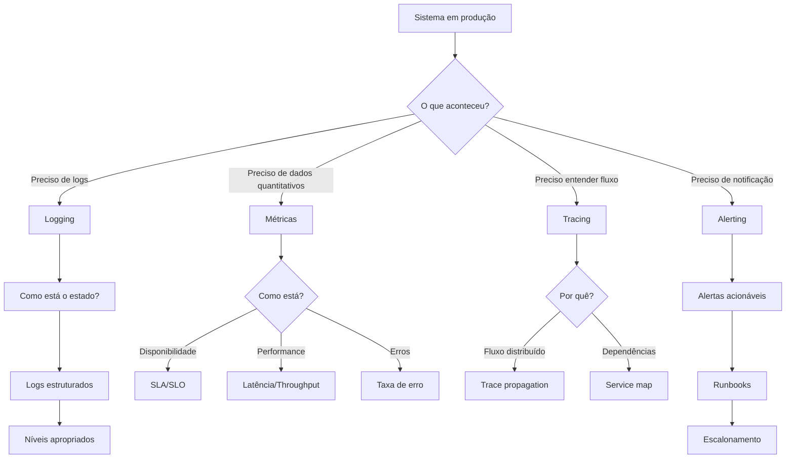

# Observability

Guia completo para observabilidade de sistemas em produção.

## Quando Usar

### Use quando:
- Sistema em produção precisa de monitoramento
- Precisa investigar incidentes ou bugs em produção
- Quer implementar logging estruturado
- Precisa definir métricas e SLAs
- Quer configurar alertas acionáveis
- Precisa de tracing distribuído em microsserviços

### Não use quando:
- Projeto em fase de protótipo (sem requisitos de observabilidade)
- Sistema single-server sem necessidade de tracing
- Logs simples de debug em desenvolvimento

### Skills relacionadas:
- `testing` — para testar instrumentação e mocks de métricas
- `release` — para métricas de deploy e rollback
- `governance` — para políticas de retenção de logs e compliance

## Decision Tree



## Conceitos Fundamentais

### Os 3 Pilares da Observabilidade

| Pilar | O que responde | Exemplo |
|-------|----------------|---------|
| **Logging** | O que aconteceu? | "Erro de conexão com DB" |
| **Metrics** | Como está o sistema? | "99.9% disponibilidade" |
| **Tracing** | Por que aconteceu? | "Request falhou no service B" |

### Níveis de Log

| Nível | Uso | Exemplo |
|-------|-----|---------|
| `ERROR` | Falha que precisa de ação | "DB connection failed" |
| `WARN` | Anormalidade sem falha | "Retrying request" |
| `INFO` | Evento significativo | "User created" |
| `DEBUG` | Detalhes para debug | "Query executed: SELECT *..." |

### Métricas (RED Method)

- **Rate**: Taxa de requisições por segundo
- **Errors**: Taxa de erros
- **Duration**: Latência das requisições (p50, p95, p99)

### Tracing

- **Trace ID**: Identificador único por request
- **Span**: Unidade de trabalho dentro de um trace
- **Parent Span**: Span que originou outro

## Workflow

### Workflow 1: Implementar Logging Estruturado

1. Escolha formato de log (JSON recomendado):
   ```bash
   # Exemplo com pino (Node.js)
   import pino from 'pino';
   const logger = pino({ level: 'info' });
   ```
2. Defina campos obrigatórios no template `templates/logging-spec.md`
3. Implemente logger centralizado:
   ```typescript
   // src/lib/logger.ts
   export const logger = pino({
     level: process.env.LOG_LEVEL || 'info',
     formatters: { level: (label) => ({ level: label }) },
   });
   ```
4. Substitua todos `console.log` por logger
5. **Checkpoint**: Todos os logs usam formato estruturado

### Workflow 2: Configurar Métricas e SLAs

1. Defina SLAs no template `templates/metrics-sla.md`
2. Configure coletor de métricas (Prometheus/DataDog):
   ```typescript
   // Exemplo com prom-client
   const httpRequestDuration = new Histogram({
     name: 'http_request_duration_seconds',
     help: 'Duration of HTTP requests',
     labelNames: ['method', 'route', 'status_code'],
     buckets: [0.1, 0.5, 1, 2, 5],
   });
   ```
3. Instrumente endpoints principais
4. Configure dashboards (Grafana/DataDog)
5. **Checkpoint**: Métricas visíveis no dashboard

### Workflow 3: Implementar Tracing Distribuído

1. Configure propagador de trace (OpenTelemetry):
   ```typescript
   import { NodeTracerProvider } from '@opentelemetry/sdk-trace-node';
   const provider = new NodeTracerProvider();
   provider.register();
   ```
2. Instrumente serviços com spans:
   ```typescript
   const span = tracer.startSpan('process-order');
   try {
     await validateOrder(order);
     span.setStatus({ code: SpanStatusCode.OK });
   } catch (e) {
     span.setStatus({ code: SpanStatusCode.ERROR });
     throw e;
   } finally {
     span.end();
   }
   ```
3. Configure exportador (Jaeger/Zipkin)
4. Adicione contexto entre serviços (headers)
5. **Checkpoint**: Traces visíveis no Jaeger/Zipkin

### Workflow 4: Criar Alertas Acionáveis

1. Defina regras no template `templates/alert-rules.md`
2. Implemente alertas com runbook:
   ```yaml
   # alert-rules.yml
   - alert: HighErrorRate
     expr: rate(http_requests_total{status=~"5.."}[5m]) > 0.05
     for: 5m
     labels:
       severity: critical
     annotations:
       summary: "Taxa de erro > 5%"
       runbook_url: "https://wiki/runbooks/high-error-rate"
   ```
3. Configure notificações (PagerDuty/Slack)
4. Teste alertas com cenários simulados
5. **Checkpoint**: Alertas disparam e notificam corretamente

### Workflow 5: Investigar Incidente

1. Identifique alerta disparado
2. Acesse dashboard de métricas
3. Use trace ID para rastrear request problemático
4. Analise logs correlacionados
5. Documente causa raiz
6. **Checkpoint**: Incidente resolvido e documentado

## Templates

### logging-spec.md
Localização: `templates/logging-spec.md`

Especificação de logging estruturado. Define formato, campos obrigatórios e níveis.

**Uso:**
```bash
cp templates/logging-spec.md docs/logging-spec.md
```

### metrics-sla.md
Localização: `templates/metrics-sla.md`

Template para definir métricas RED e SLAs/SLOs do sistema.

**Uso:**
```bash
cp templates/metrics-sla.md docs/metrics-sla.md
```

### alert-rules.md
Localização: `templates/alert-rules.md`

Template para regras de alerta com severidade e runbooks.

**Uso:**
```bash
cp templates/alert-rules.md docs/alert-rules.md
```

## Anti-patterns

### 🔴 Crítico

#### Log com Dados Sensíveis
**O que é:** Logs contendo senhas, tokens, CPFs ou dados pessoais.
**Por que é ruim:** Violação de LGPD/GDPR, risco de vazamento.
**Como evitar:** Use mascaramento e sanitize dados antes de logar.
**Exemplo:**
```typescript
// ❌ ERRADO - loga senha e token
logger.info({ user: 'john', password: 'secret123', token: 'abc123' });

// ✅ CORRETO - sanitiza dados sensíveis
logger.info({ user: 'john', password: '***', token: '***' });
```

#### Alerta sem Ação Definida
**O que é:** Alerta dispara mas ninguém sabe o que fazer.
**Por que é ruim:** Alerta é ignorado, time perde confiança.
**Como evitar:** Sempre inclua runbook com passos claros.
**Exemplo:**
```yaml
# ❌ ERRADO - sem runbook
- alert: HighCPU
  expr: cpu_usage > 90

# ✅ CORRETO - com runbook
- alert: HighCPU
  expr: cpu_usage > 90
  annotations:
    runbook_url: "https://wiki/runbooks/high-cpu"
    steps: "1. Verificar processos 2. Escalar se necessário"
```

### 🟡 Médio

#### Log sem Contexto
**O que é:** Logs sem identificador de request, usuário ou ambiente.
**Por que é ruim:** Impossível correlacionar eventos em microsserviços.
**Como evitar:** Sempre inclua trace_id, user_id e environment.
**Exemplo:**
```typescript
// ❌ ERRADO - sem contexto
logger.error('Failed to process order');

// ✅ CORRETO - com contexto
logger.error({ traceId, userId, environment: 'prod' }, 'Failed to process order');
```

#### Métricas sem Dimensão Temporal
**O que é:** Métricas sem série temporal ou agregação adequada.
**Por que é ruim:** Impossível identificar tendências ou comparar períodos.
**Como evitar:** Use contadores, histogramas e séries temporais.
**Exemplo:**
```typescript
// ❌ ERRADO - apenas último valor
gauge.set(errorCount);

// ✅ CORRETO - com contagem e taxa
counter.inc({ status: 'error' });
const errorRate = counter.rate({ status: 'error' });
```

### 🟢 Baixo

#### console.log em Produção
**O que é:** Uso de `console.log` em código de produção.
**Por que é ruim:** Sem estrutura, sem níveis, difícil de filtrar.
**Como evitar:** Use biblioteca de logging estruturado.
**Exemplo:**
```typescript
// ❌ ERRADO
console.log('User created:', user);

// ✅ CORRETO
logger.info({ userId: user.id, action: 'user_created' });
```

## Checklists

### Checklist de Logging
- [ ] Logs em formato JSON estruturado
- [ ] Níveis de log apropriados (ERROR, WARN, INFO, DEBUG)
- [ ] Campos obrigatórios: timestamp, level, message, service
- [ ] Campos de contexto: trace_id, user_id, environment
- [ ] Dados sensíveis mascarados
- [ ] Retenção de logs definida
- [ ] Logs centralizados (ELK/Datadog)

### Checklist de Métricas
- [ ] Métricas RED implementadas (Rate, Errors, Duration)
- [ ] SLAs/SLOs documentados
- [ ] Dashboards configurados
- [ ] Métricas de negócio definidas
- [ ] Retenção de métricas definida
- [ ] Alertas baseados em métricas

### Checklist de Tracing
- [ ] Trace propagation configurado entre serviços
- [ ] Spans instrumentados nos pontos principais
- [ ] Contexto propagado via headers
- [ ] Exportador configurado (Jaeger/Zipkin)
- [ ] Sampling rate definido

### Checklist de Alertas
- [ ] Alertas têm severidade definida
- [ ] Runbooks anexados a cada alerta
- [ ] Escalonamento configurado
- [ ] Testes de alertas realizados
- [ ] Alertas review periódico (quarterly)

### Checklist de Incidente
- [ ] Alerta identificado e confirmado
- [ ] Dashboard analisado
- [ ] Trace ID rastreado
- [ ] Logs correlacionados
- [ ] Causa raiz identificada
- [ ] Documentação pós-incidente

## Edge Cases

### Alto Volume de Logs
**Situação:** Sistema gera milhões de logs por minuto.
**Solução:** Use sampling, levels apropriados e compressão.
**Exceção:** Logs de auditoria não devem ser sampled.

```typescript
// Sampling para debug
const logger = pino({
  level: 'info',
  // Apenas 10% dos logs DEBUG
  base: { sampleRate: process.env.NODE_ENV === 'prod' ? 0.1 : 1 },
});
```

### Tracing em Microsserviços Assíncronos
**Situação:** Eventos via Kafka/RabbitMQ sem request HTTP.
**Solução:** Propague trace context via message headers.
**Exceção:** Consumers batch podem precisar de trace separado.

```typescript
// Producer
const headers = { 'trace-id': span.context().traceId };
await kafka.produce({ topic: 'orders', message: data, headers });

// Consumer
const traceId = message.headers['trace-id'];
const span = tracer.startSpan('process-order', { traceId });
```

### Correlação entre Serviços
**Situação:** Logs de diferentes serviços não correlacionados.
**Solução:** Use trace_id como campo comum e propague via headers.
**Exceção:** Serviços legados sem suporte a tracing.

```typescript
// Middleware para propagar trace_id
app.use((req, res, next) => {
  const traceId = req.headers['x-trace-id'] || generateTraceId();
  req.traceId = traceId;
  res.setHeader('x-trace-id', traceId);
  next();
});
```

## Referências

- [OpenTelemetry](https://opentelemetry.io/)
- [Prometheus](https://prometheus.io/)
- [Grafana](https://grafana.com/)
- [Jaeger](https://www.jaegertracing.io/)
- [Structured Logging](https://www.structuredlogging.org/)
- `testing` — para testar instrumentação
- `release` — para métricas de deploy
- `governance` — para políticas de retenção
