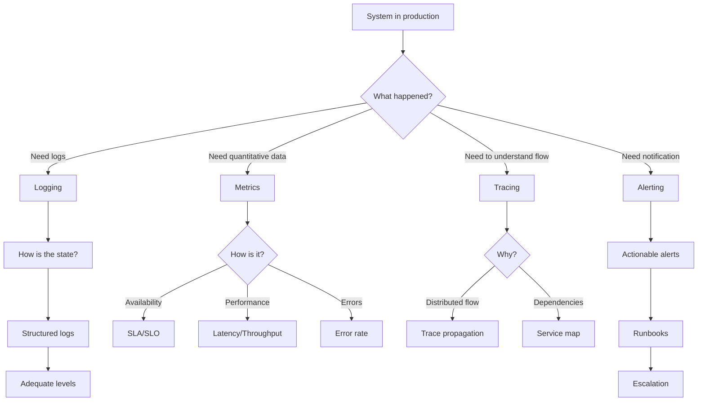

# Observability

Comprehensive guide to system observability in production.

## When to Use

### Use when:
- System in production requires monitoring
- Need to investigate incidents or bugs in production
- Want to implement structured logging
- Need to define metrics and SLAs
- Want to configure actionable alerts
- Need distributed tracing in microservices

### Do not use when:
- Project in prototype phase (without observability requirements)
- Single-server system without tracing needs
- Simple debug logs in development

### Related Skills:
- `testing` — for testing instrumentation and metric mocks
- `release` — for metrics of deploy and rollback
- `governance` — for policies of log retention and compliance

## Decision Tree


```mermaid
graph TD
    A[System in production] --> B{What happened?}
    B -->|Need logs| C[Logging]
    B -->|Need quantitative data| D[Metrics]
    B -->|Need to understand flow| E[Tracing]
    B -->|Need notification| F[Alerting]
    
    C --> C1[How is the state?]
    C1 --> C2[Structured logs]
    C2 --> C3[Adequate levels]
    
    D --> D1{How is it?}
    D1 -->|Availability| D2[SLA/SLO]
    D1 -->|Performance| D3[Latency/Throughput]
    D1 -->|Errors| D4[Error rate]
    
    E --> E1{Why?}
    E1 -->|Distributed flow| E2[Trace propagation]
    E1 -->|Dependencies| E3[Service map]
    
    F --> F1[Actionable alerts]
    F1 --> F2[Runbooks]
    F2 --> F3[Escalation]
```

## Fundamental Concepts

### The 3 Pillars of Observability

| Pillar | What it answers | Example |
|-------|----------------|---------|
| **Logging** | What happened? | "DB connection failed" |
| **Metrics** | How is the system? | "99.9% availability" |
| **Tracing** | Why did it happen? | "Request failed in service B" |

### Log Levels

| Level | Use | Example |
|-------|-----|---------|
| `ERROR` | Failure requiring action | "DB connection failed" |
| `WARN` | Anomaly without failure | "Retrying request" |
| `INFO` | Significant event | "User created" |
| `DEBUG` | Details for debugging | "Query executed: SELECT *..." |

### Metrics (RED Method)

- **Rate**: Requests per second rate
- **Errors**: Error rate
- **Duration**: Request latency (p50, p95, p99)

### Tracing

- **Trace ID**: Unique identifier per request
- **Span**: Unit of work within a trace
- **Parent Span**: Span that originated another

## Workflow

### Workflow 1: Implement Structured Logging

1. Choose log format (JSON recommended):
   ```bash
   # Example with pino (Node.js)
   import pino from 'pino';
   const logger = pino({ level: 'info' });
   ```
2. Define required fields in `templates/logging-spec.md`
3. Implement centralized logger:
   ```typescript
   // src/lib/logger.ts
   export const logger = pino({
     level: process.env.LOG_LEVEL || 'info',
     formatters: { level: (label) => ({ level: label }) },
   });
   ```
4. Replace all `console.log` with logger
5. **Checkpoint**: All logs use structured format

### Workflow 2: Configure Metrics and SLAs

1. Define SLAs in `templates/metrics-sla.md`
2. Configure metric collector (Prometheus/DataDog):
   ```typescript
   // Example with prom-client
   const httpRequestDuration = new Histogram({
     name: 'http_request_duration_seconds',
     help: 'Duration of HTTP requests',
     labelNames: ['method', 'route', 'status_code'],
     buckets: [0.1, 0.5, 1, 2, 5],
   });
   ```
3. Instrument main endpoints
4. Configure dashboards (Grafana/DataDog)
5. **Checkpoint**: Metrics visible in dashboard

### Workflow 3: Implement Distributed Tracing

1. Configure trace propagator (OpenTelemetry):
   ```typescript
   import { NodeTracerProvider } from '@opentelemetry/sdk-trace-node';
   const provider = new NodeTracerProvider();
   provider.register();
   ```
2. Instrument services with spans:
   ```typescript
   const span = tracer.startSpan('process-order');
   try {
     await validateOrder(order);
     span.setStatus({ code: SpanStatusCode.OK });
   } catch (e) {
     span.setStatus({ code: SpanStatusCode.ERROR });
     throw e;
   } finally {
     span.end();
   }
   ```
3. Configure exporter (Jaeger/Zipkin)
4. Add context between services (headers)
5. **Checkpoint**: Traces visible in Jaeger/Zipkin

### Workflow 4: Create Actionable Alerts

1. Define rules in `templates/alert-rules.md`
2. Implement alerts with runbook:
   ```yaml
   # alert-rules.yml
   - alert: HighErrorRate
     expr: rate(http_requests_total{status=~"5.."}[5m]) > 0.05
     for: 5m
     labels:
       severity: critical
     annotations:
       summary: "Error rate > 5%"
       runbook_url: "https://wiki/runbooks/high-error-rate"
   ```
3. Configure notifications (PagerDuty/Slack)
4. Test alerts with simulated scenarios
5. **Checkpoint**: Alerts fire and notify correctly

### Workflow 5: Investigate Incident

1. Identify triggered alert
2. Access metric dashboard
3. Use trace ID to track problematic request
4. Analyze correlated logs
5. Document root cause
6. **Checkpoint**: Incident resolved and documented

## Templates

### logging-spec.md
Location: `templates/logging-spec.md`

Structured logging specification. Defines format, required fields, and levels.

**Use:**
```bash
cp templates/logging-spec.md docs/logging-spec.md
```

### metrics-sla.md
Location: `templates/metrics-sla.md`

Template for defining metrics RED and SLAs/SLOs of the system.

**Use:**
```bash
cp templates/metrics-sla.md docs/metrics-sla.md
```

### alert-rules.md
Location: `templates/alert-rules.md`

Template for alert rules with severity and runbooks.

**Use:**
```bash
cp templates/alert-rules.md docs/alert-rules.md
```

## Anti-patterns

### Critical

#### Log with Sensitive Data
**What is it:** Logs containing passwords, tokens, CPFs, or personal data.
**Why is it bad:** Violation of LGPD/GDPR, risk of leakage.
**How to avoid:** Use masking and sanitize data before logging.
**Example:**
```typescript
// ❌ WRONG - logs password and token
logger.info({ user: 'john', password: 'secret123', token: 'abc123' });

// ✅ RIGHT - sanitizes sensitive data
logger.info({ user: 'john', password: '***', token: '***' });
```

#### Alert without Defined Action
**What is it:** Alert fires but nobody knows what to do.
**Why is it bad:** Alert is ignored, team loses trust.
**How to avoid:** Always include runbook with clear steps.
**Example:**
```yaml
# ❌ WRONG - without runbook
- alert: HighCPU
  expr: cpu_usage > 90

# ✅ RIGHT - with runbook
- alert: HighCPU
  expr: cpu_usage > 90
  annotations:
    runbook_url: "https://wiki/runbooks/high-cpu"
    steps: "1. Check processes 2. Scale if necessary"
```

### Medium

#### Log without Context
**What is it:** Logs without request ID, user ID, or environment.
**Why is it bad:** Impossible to correlate events in microservices.
**How to avoid:** Always include trace ID, user ID, and environment.
**Example:**
```typescript
// ❌ WRONG - without context
logger.error('Failed to process order');

// ✅ RIGHT - with context
logger.error({ traceId, userId, environment: 'prod' }, 'Failed to process order');
```

#### Metrics without Temporal Dimension
**What is it:** Metrics without time series or adequate aggregation.
**Why is it bad:** Impossible to identify trends or compare periods.
**How to avoid:** Use counters, histograms, and time series.
**Example:**
```typescript
// ❌ WRONG - only last value
gauge.set(errorCount);

// ✅ RIGHT - with count and rate
counter.inc({ status: 'error' });
const errorRate = counter.rate({ status: 'error' });
```

### Low

#### console.log in Production
**What is it:** Use of `console.log` in production code.
**Why is it bad:** Unstructured, no levels, hard to filter.
**How to avoid:** Use structured logging library.
**Example:**
```typescript
// ❌ WRONG
console.log('User created:', user);

// ✅ RIGHT
logger.info({ userId: user.id, action: 'user_created' });
```

## Checklists

### Logging Checklist
- [ ] Logs in JSON structured format
- [ ] Log levels adequate (ERROR, WARN, INFO, DEBUG)
- [ ] Required fields: timestamp, level, message, service
- [ ] Context fields: trace ID, user ID, environment
- [ ] Sensitive data masked
- [ ] Log retention defined
- [ ] Centralized logs (ELK/Datadog)

### Metrics Checklist
- [ ] RED metrics implemented (Rate, Errors, Duration)
- [ ] SLAs/SLOs documented
- [ ] Dashboards configured
- [ ] Business metrics defined
- [ ] Metric retention defined
- [ ] Alerts based on metrics

### Tracing Checklist
- [ ] Trace propagation configured between services
- [ ] Spans instrumented in main points
- [ ] Context propagated via headers
- [ ] Exporter configured (Jaeger/Zipkin)
- [ ] Sampling rate defined

### Alert Checklist
- [ ] Alerts have defined severity
- [ ] Runbooks attached to each alert
- [ ] Escalation configured
- [ ] Alert tests performed
- [ ] Alert review periodic (quarterly)

### Incident Checklist
- [ ] Triggered alert identified and confirmed
- [ ] Dashboard analyzed
- [ ] Trace ID tracked
- [ ] Correlated logs analyzed
- [ ] Root cause identified
- [ ] Post-incident documentation

## Edge Cases

### High Log Volume
**Situation:** System generates millions of logs per minute.
**Solution:** Use sampling, adequate levels, and compression.
**Exception:** Audit logs should not be sampled.

```typescript
// Sampling for debugging
const logger = pino({
  level: 'info',
  // Only 10% of DEBUG logs
  base: { sampleRate: process.env.NODE_ENV === 'prod' ? 0.1 : 1 },
});
```

### Tracing in Asynchronous Microservices
**Situation:** Events via Kafka/RabbitMQ without HTTP request.
**Solution:** Propagate trace context via message headers.
**Exception:** Consumers batch may need separate trace.

```typescript
// Producer
const headers = { 'trace-id': span.context().traceId };
await kafka.produce({ topic: 'orders', message: data, headers });

// Consumer
const traceId = message.headers['trace-id'];
const span = tracer.startSpan('process-order', { traceId });
```

### Correlation between Services
**Situation:** Logs from different services not correlated.
**Solution:** Use trace ID as common field and propagate via headers.
**Exception:** Legacy services without tracing support.

```typescript
// Middleware to propagate trace ID
app.use((req, res, next) => {
  const traceId = req.headers['x-trace-id'] || generateTraceId();
  req.traceId = traceId;
  res.setHeader('x-trace-id', traceId);
  next();
});
```

## References

- [OpenTelemetry](https://opentelemetry.io/)
- [Prometheus](https://prometheus.io/)
- [Grafana](https://grafana.com/)
- [Jaeger](https://www.jaegertracing.io/)
- [Structured Logging](https://www.structuredlogging.org/)
- `testing` — for testing instrumentation
- `release` — for metrics of deploy
- `governance` — for policies of retention

## Completion Gate

A tarefa associada à skill `observability` só pode ser declarada concluída quando:
1. Todas as verificações do checklist operacional foram atendidas.
2. O resultado foi validado deterministamente através de evidências de execução.
3. Não restam pendências estruturais, placeholders ou erros não tratados.

