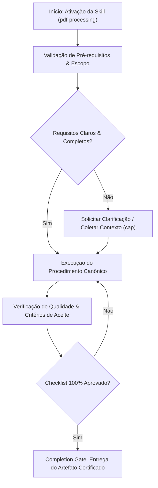

# PDF Processing

## When to Use

### Use when:
- Extracting text, tables, and form fields from PDF documents programmatically
- Generating ISO 19005 compliant PDF/A archival reports and certificates
- Running OCR fallback pipelines on scanned image-only PDF files

### Do not use when:
- Simple plain text or Markdown document generation without PDF styling requirements

## Overview

Generate, manipulate, and extract data from PDF documents. This skill covers the Python PDF ecosystem: pypdf for merging/splitting/metadata, pdfplumber for text and table extraction, reportlab for generation, pytesseract for OCR, and strategies for form filling, watermarking, and complex document assembly.

Apply this skill whenever PDFs need to be created, parsed, transformed, or combined through code.

## Multi-Phase Process

### Phase 1: Requirements

1. Determine operation type (generate, extract, manipulate)
2. Identify input PDF characteristics (scanned, digital, forms)
3. Define output requirements (format, quality, size)
4. Plan data pipeline (source data to PDF or PDF to data)
5. Assess volume and performance requirements

> **STOP — Do NOT select a library until the operation type and input characteristics are clear.**

### Phase 2: Implementation

1. Select appropriate library for the task (see decision table)
2. Implement core processing logic
3. Handle edge cases (corrupted files, encrypted PDFs, mixed content)
4. Add error handling and validation
5. Optimize for file size and processing speed

> **STOP — Do NOT skip edge case handling for encrypted, rotated, or scanned PDFs.**

### Phase 3: Validation

1. Verify output renders correctly in multiple PDF viewers
2. Check text is selectable (not rasterized) when applicable
3. Validate extracted data accuracy
4. Test with edge case PDFs (large, encrypted, scanned)
5. Verify accessibility (tagged PDF where needed)

## Library Selection Decision Table

| Task | Library | Why | Alternative |
|---|---|---|---|
| Text extraction | pdfplumber | Best accuracy, handles layouts | pypdf (simpler, less accurate) |
| Table extraction | pdfplumber | Structured table parsing | camelot (dedicated table tool) |
| PDF generation | reportlab | Full control, professional quality | weasyprint (HTML-to-PDF) |
| Merge / split | pypdf | Simple, reliable, fast | — |
| Form filling | pypdf | Reads and fills AcroForms | pdfrw (alternative API) |
| Metadata read/write | pypdf | Read/write PDF properties | — |
| OCR (scanned docs) | pytesseract + pdf2image | Scanned document text extraction | EasyOCR (deep learning) |
| Watermarking | pypdf + reportlab | Overlay pages | — |
| HTML to PDF | weasyprint | CSS-based layout, server-friendly | playwright (browser rendering) |

## PDF Generation with ReportLab

```python
from reportlab.lib.pagesizes import A4
from reportlab.lib.styles import getSampleStyleSheet, ParagraphStyle
from reportlab.lib.units import cm, mm
from reportlab.lib.colors import HexColor
from reportlab.platypus import (
    SimpleDocTemplate, Paragraph, Spacer, Table,
    TableStyle, Image, PageBreak
)
from reportlab.lib import colors

def generate_report(output_path, data):
    doc = SimpleDocTemplate(
        output_path,
        pagesize=A4,
        topMargin=2.5*cm,
        bottomMargin=2.5*cm,
        leftMargin=2.5*cm,
        rightMargin=2.5*cm,
    )

    styles = getSampleStyleSheet()
    styles.add(ParagraphStyle(
        name='CustomTitle',
        parent=styles['Title'],
        fontSize=24,
        textColor=HexColor('#2F5496'),
        spaceAfter=20,
    ))

    story = []

    # Title
    story.append(Paragraph(data['title'], styles['CustomTitle']))
    story.append(Spacer(1, 12))

    # Body text
    story.append(Paragraph(data['body'], styles['Normal']))
    story.append(Spacer(1, 20))

    # Table
    table_data = [['Name', 'Value', 'Status']]
    for row in data['rows']:
        table_data.append([row['name'], row['value'], row['status']])

    table = Table(table_data, colWidths=[6*cm, 4*cm, 4*cm])
    table.setStyle(TableStyle([
        ('BACKGROUND', (0, 0), (-1, 0), HexColor('#2F5496')),
        ('TEXTCOLOR', (0, 0), (-1, 0), colors.white),
        ('FONTNAME', (0, 0), (-1, 0), 'Helvetica-Bold'),
        ('FONTSIZE', (0, 0), (-1, 0), 11),
        ('ALIGN', (0, 0), (-1, -1), 'CENTER'),
        ('GRID', (0, 0), (-1, -1), 0.5, colors.grey),
        ('ROWBACKGROUNDS', (0, 1), (-1, -1), [colors.white, HexColor('#F0F4FA')]),
        ('TOPPADDING', (0, 0), (-1, -1), 8),
        ('BOTTOMPADDING', (0, 0), (-1, -1), 8),
    ]))
    story.append(table)

    doc.build(story)
```

### Custom Page Template (Headers/Footers)
```python
from reportlab.platypus import BaseDocTemplate, Frame, PageTemplate
from datetime import datetime

def add_header_footer(canvas, doc):
    canvas.saveState()
    # Header
    canvas.setFont('Helvetica', 9)
    canvas.setFillColor(HexColor('#888888'))
    canvas.drawString(2.5*cm, A4[1] - 1.5*cm, 'Company Name — Confidential')
    canvas.drawRightString(A4[0] - 2.5*cm, A4[1] - 1.5*cm, f'Page {doc.page}')
    # Footer
    canvas.drawCentredString(A4[0]/2, 1.5*cm, f'Generated on {datetime.now():%Y-%m-%d}')
    canvas.restoreState()

doc = BaseDocTemplate(output_path, pagesize=A4)
frame = Frame(2.5*cm, 2.5*cm, A4[0]-5*cm, A4[1]-5*cm)
doc.addPageTemplates([PageTemplate(id='main', frames=[frame], onPage=add_header_footer)])
```

## Text and Table Extraction

### pdfplumber
```python
import pdfplumber

with pdfplumber.open('document.pdf') as pdf:
    # Extract text from all pages
    full_text = ''
    for page in pdf.pages:
        full_text += page.extract_text() + '\n'

    # Extract tables
    for page in pdf.pages:
        tables = page.extract_tables()
        for table in tables:
            for row in table:
                print(row)

    # Extract text from specific area
    page = pdf.pages[0]
    bbox = (50, 100, 400, 300)  # (x0, top, x1, bottom)
    cropped = page.within_bbox(bbox)
    text = cropped.extract_text()
```

### Table Extraction Settings
```python
table_settings = {
    "vertical_strategy": "lines",    # or "text", "explicit"
    "horizontal_strategy": "lines",
    "snap_tolerance": 3,
    "join_tolerance": 3,
    "edge_min_length": 3,
    "min_words_vertical": 3,
    "min_words_horizontal": 1,
}

tables = page.extract_tables(table_settings)
```

## Form Filling

```python
from pypdf import PdfReader, PdfWriter

reader = PdfReader('form.pdf')
writer = PdfWriter()
writer.append(reader)

# Fill form fields
writer.update_page_form_field_values(
    writer.pages[0],
    {
        'full_name': 'Alice Johnson',
        'email': 'alice@example.com',
        'date': '2025-03-15',
        'agree_terms': '/Yes',  # Checkbox
    },
    auto_regenerate=False,
)

with open('filled_form.pdf', 'wb') as f:
    writer.write(f)
```

## OCR (Scanned PDFs)

```python
from pdf2image import convert_from_path
import pytesseract

def ocr_pdf(pdf_path, language='eng'):
    images = convert_from_path(pdf_path, dpi=300)
    full_text = ''
    for i, image in enumerate(images):
        text = pytesseract.image_to_string(image, lang=language)
        full_text += f'\n--- Page {i+1} ---\n{text}'
    return full_text

# For better accuracy with specific layouts:
def ocr_with_config(image):
    custom_config = r'--oem 3 --psm 6'  # LSTM engine, assume uniform block
    return pytesseract.image_to_string(image, config=custom_config)
```

## Merge and Split

```python
from pypdf import PdfReader, PdfWriter

# Merge multiple PDFs
def merge_pdfs(input_paths, output_path):
    writer = PdfWriter()
    for path in input_paths:
        reader = PdfReader(path)
        for page in reader.pages:
            writer.add_page(page)
    with open(output_path, 'wb') as f:
        writer.write(f)

# Split PDF by page ranges
def split_pdf(input_path, ranges, output_dir):
    reader = PdfReader(input_path)
    for i, (start, end) in enumerate(ranges):
        writer = PdfWriter()
        for page_num in range(start - 1, min(end, len(reader.pages))):
            writer.add_page(reader.pages[page_num])
        with open(f'{output_dir}/part_{i+1}.pdf', 'wb') as f:
            writer.write(f)

# Extract specific pages
def extract_pages(input_path, page_numbers, output_path):
    reader = PdfReader(input_path)
    writer = PdfWriter()
    for num in page_numbers:
        writer.add_page(reader.pages[num - 1])
    with open(output_path, 'wb') as f:
        writer.write(f)
```

## Watermarking

```python
from pypdf import PdfReader, PdfWriter
from reportlab.pdfgen import canvas as rl_canvas
from reportlab.lib.pagesizes import A4
from io import BytesIO

def create_watermark(text, opacity=0.1):
    buffer = BytesIO()
    c = rl_canvas.Canvas(buffer, pagesize=A4)
    c.setFillAlpha(opacity)
    c.setFont('Helvetica-Bold', 60)
    c.setFillColorRGB(0.5, 0.5, 0.5)
    c.translate(A4[0]/2, A4[1]/2)
    c.rotate(45)
    c.drawCentredString(0, 0, text)
    c.save()
    buffer.seek(0)
    return PdfReader(buffer)

def apply_watermark(input_path, output_path, watermark_text):
    watermark = create_watermark(watermark_text)
    reader = PdfReader(input_path)
    writer = PdfWriter()

    for page in reader.pages:
        page.merge_page(watermark.pages[0])
        writer.add_page(page)

    with open(output_path, 'wb') as f:
        writer.write(f)
```

## Metadata Handling

```python
from pypdf import PdfReader, PdfWriter

# Read metadata
reader = PdfReader('document.pdf')
info = reader.metadata
print(f'Title: {info.title}')
print(f'Author: {info.author}')
print(f'Pages: {len(reader.pages)}')

# Write metadata
writer = PdfWriter()
writer.append(reader)
writer.add_metadata({
    '/Title': 'Updated Title',
    '/Author': 'Author Name',
    '/Subject': 'Document Subject',
    '/Creator': 'My Application',
})
with open('updated.pdf', 'wb') as f:
    writer.write(f)
```

## Anti-Patterns / Common Mistakes

| Anti-Pattern | Why It Fails | What To Do Instead |
|---|---|---|
| OCR on digital (text-based) PDFs | Slow and inaccurate when text is already extractable | Check if text extracts first, OCR only if empty |
| Not handling encrypted PDFs | Crashes or silent failures | Detect encryption, prompt for password or skip gracefully |
| Loading entire large PDFs into memory | Memory exhaustion on server | Stream pages or process in chunks |
| Ignoring page rotation metadata | Text extraction returns garbled results | Read and apply rotation before extraction |
| Hardcoding page dimensions | Breaks on non-A4 documents | Read dimensions from source PDF |
| Not closing file handles | Resource leaks in long-running processes | Use context managers (`with` statements) |
| Generating without multi-viewer testing | Rendering differences across viewers | Test in Adobe Reader, Preview, and Chrome |
| Extracting tables without tuning settings | Poor column alignment, merged cells | Adjust `table_settings` per document type |

## Anti-Rationalization Guards

- Do NOT use OCR without first attempting direct text extraction -- check the PDF type.
- Do NOT skip encryption detection -- handle it explicitly even if "most PDFs aren't encrypted."
- Do NOT assume A4 page size -- read dimensions from the source document.
- Do NOT test in only one PDF viewer -- rendering varies across Adobe, Preview, and Chrome.
- Do NOT process large PDFs without memory-conscious patterns (streaming, chunking).

## Integration Points

| Skill | How It Connects |
|---|---|
| `docx-processing` | DOCX-to-PDF conversion pipeline, or choosing between formats |
| `xlsx-processing` | Data from Excel populates PDF report tables |
| `email-composer` | Generated PDFs attach to professional emails |
| `content-research-writer` | Research output formatted as PDF whitepapers |
| `file-organizer` | Output file naming and directory structure conventions |
| `deployment` | PDF generation pipelines in server/CI environments |

## Skill Type

**FLEXIBLE** — Select the appropriate library and approach based on the specific PDF task. ReportLab for generation, pdfplumber for extraction, pypdf for manipulation. Combine as needed.


## Decision Workflow




## Anti-Patterns & Operational Guardrails

| Anti-Pattern | Severidade | Impacto Negativo | Mitigação Canônica |
|:---|:---:|:---|:---|
| **Premature Execution Without Context** | 🔴 Critical | Context hallucination and destructive refactoring | Activate `cap` to acquire minimal evidence before editing. |
| **Omission of Validation Checklists** | 🟡 Medium | Delivering artifacts with syntax inconsistencies | Rigorously execute the checklist step-by-step before handoff. |
| **Falta de Documentação de Decisões** | 🟢 Low | Perda de rastreabilidade técnica e drift arquitetural | Registrar trade-offs relevantes via skill `adr-generator`. |


## Edge Cases & Failure Modes

- **Restricted / Read-Only Environment:** If the filesystem or sandbox is write-locked, report the constraint immediately with evidence and generate changes as a markdown diff patch.
- **Specification Conflict:** If contradictions emerge between user intent and the SSOT (`AGENTS.md`), halt and present trade-off options.
- **Context Exhaustion / Timeout:** For massive tasks, decompose into atomic sub-batches utilizing `subagent-driven-development`.


## Domain SOTA & Industry Engineering Standards

- **Archival Standards:** ISO 19005 (PDF/A-1b, PDF/A-2b) for long-term digital document preservation.
- **Spatial Table Extraction:** Vector bounding box analysis (PDFPlumber, Tabula) and layout-aware text extraction.
- **OCR Fallback Pipeline:** Tesseract OCR (v5.x) preprocessing (deskew, binarization, DPI scaling to 300 DPI).
- **Security & Metadata:** PDF metadata stripping (exif), encryption (AES-256), and digital signature verification.

### Spatial Extraction vs OCR Fallback Pipeline:

```text
Input PDF ──> Native Text Layer Present?
                 ├── YES ──> Spatial Vector Extraction (PDFPlumber) ──> Structured Data
                 └── NO  ──> Render Page to Image (300 DPI) ──> Tesseract OCR ──> Text
```

### Exhaustive Heuristic Decision Rules:
- **Rule of Thumb 1 (Zero-Trust Architectural Boundaries):** Treat all external inputs, third-party payloads, and cross-module boundaries with strict zero-trust schema validation.
- **Rule of Thumb 2 (Fail-Fast & Deterministic Errors):** Reject invalid states immediately with typed, actionable error contracts rather than cascading silent failures.
- **Rule of Thumb 3 (Idempotency & AST Preservation):** State mutations and code transformations must maintain semantic idempotency across repeated executions.
- **Rule of Thumb 4 (Benchmark & Telemetry Alignment):** Measure critical execution latency ($P_{95}$) and memory overhead with structured telemetry and baseline benchmarks.
- **Rule of Thumb 5 (Event-Driven & Circuit Breaker Decoupling):** Isolate asynchronous operations behind circuit breakers and resilient retry mechanisms to prevent cascading failure.
- **Rule of Thumb 6 (Contract-First DDD Modeling):** Define clear domain aggregates, value objects, and typed interface contracts before implementing concrete logic.
- **Rule of Thumb 7 (RAG & Semantic Retrieval Precision):** Optimize context retrieval with hybrid lexical-vector search and reciprocal rank fusion to eliminate hallucinated routing.
- **Rule of Thumb 8 (OWASP & Supply Chain Verification):** Verify dependencies and data flows against OWASP Top 10 and SLSA Level 3 supply chain security standards.
- **Rule of Thumb 9 (Verification Gate Invariant):** Never declare completion without automated test execution evidence and zero compiler/linter warnings.
## Operational Verification Checklist

- [ ] All prerequisites and target files inspected before modification.
- [ ] Procedure strictly adheres to specialization rules and best practices.
- [ ] Security, typing, and architectural style guidelines preserved.
- [ ] Unit tests or validation commands executed successfully.
- [ ] Final deliverable verified against the completion gate.


## Completion Gate & Verification
Before concluding PDF processing:
- [ ] Native vector text extracted without rasterization if text layer is present
- [ ] Generated PDFs validated for PDF/A compliance and font embedding
- [ ] Sensitive author metadata stripped from generated outputs