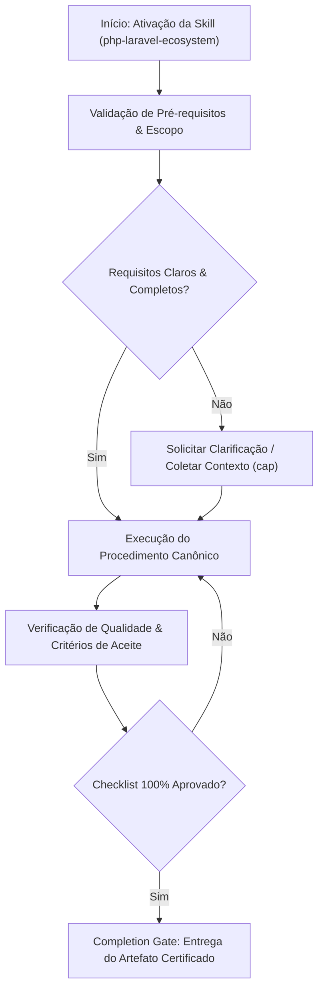

# PHP & Laravel Development Ecosystem

Specialized development guidelines and best practices for PHP and the Laravel framework.


## Sub-Domain / Component: `php-specialist`

# PHP Specialist

## Overview

Write modern, type-safe, and maintainable PHP 8.x code adhering to PSR standards and SOLID principles. This skill covers the full modern PHP toolchain: language features introduced in PHP 8.0 through 8.4, PSR interoperability standards, Composer dependency management, static analysis with PHPStan and Psalm, coding style enforcement with PHP CS Fixer and Pint, and architectural patterns that leverage the type system for correctness at compile time rather than runtime.

Apply this skill whenever PHP code is being written, reviewed, or refactored in any framework or standalone context.

## Multi-Phase Process

### Phase 1: Environment Assessment

1. Identify PHP version from `composer.json` -> `require.php`
2. Review `composer.json` for autoloading strategy (PSR-4 namespaces)
3. Check for static analysis configuration (`phpstan.neon`, `psalm.xml`)
4. Identify coding standard tool (`pint.json`, `.php-cs-fixer.php`)
5. Catalog existing patterns: enums, DTOs, value objects, interfaces

> **STOP — Do NOT write code without knowing the PHP version and autoloading strategy.**

### Phase 2: Design

1. Define interfaces and contracts before implementations
2. Design value objects and DTOs with readonly properties
3. Map domain concepts to backed enums where applicable
4. Plan exception hierarchy for the domain
5. Identify seams for dependency injection

> **STOP — Do NOT implement without interfaces defined for key boundaries.**

### Phase 3: Implementation

1. Write interfaces first — contracts before concrete classes
2. Implement with constructor promotion, readonly properties, union/intersection types
3. Use match expressions over switch; named arguments for clarity
4. Leverage first-class callable syntax for functional composition
5. Apply SOLID principles at every class boundary

> **STOP — Do NOT skip strict_types declaration in any PHP file.**

### Phase 4: Quality Assurance

1. Run PHPStan at maximum achievable level (target level 9)
2. Enforce coding style with PHP CS Fixer or Laravel Pint
3. Verify type coverage — no `mixed` without justification
4. Review for SOLID violations and code smells
5. Confirm Composer autoload is optimized (`--classmap-authoritative`)

## PHP Version Feature Decision Table

| Feature | Minimum Version | Use When |
|---|---|---|
| Constructor promotion | 8.0 | Any class with constructor parameters |
| Named arguments | 8.0 | Functions with 3+ params or boolean flags |
| Match expressions | 8.0 | Any switch statement (strict, returns value) |
| Union types | 8.0 | Parameter accepts multiple types |
| Backed enums | 8.1 | Any set of named constants with values |
| Readonly properties | 8.1 | Immutable DTOs, value objects |
| Fibers | 8.1 | Async frameworks (rarely used directly) |
| First-class callables | 8.1 | Functional composition, array_map/filter |
| Readonly classes | 8.2 | All-readonly DTOs (shorthand) |
| DNF types | 8.2 | Complex union + intersection combinations |
| Override attribute | 8.3 | Overriding parent methods (safety check) |
| Property hooks | 8.4 | Computed properties without separate methods |

## Modern PHP 8.x Features

### Enums (PHP 8.1+)

```php
// Backed enum with methods — replaces class constants and magic strings
enum OrderStatus: string
{
    case Draft     = 'draft';
    case Pending   = 'pending';
    case Confirmed = 'confirmed';
    case Shipped   = 'shipped';
    case Delivered = 'delivered';
    case Cancelled = 'cancelled';

    public function label(): string
    {
        return match ($this) {
            self::Draft     => 'Draft',
            self::Pending   => 'Pending Review',
            self::Confirmed => 'Confirmed',
            self::Shipped   => 'Shipped',
            self::Delivered => 'Delivered',
            self::Cancelled => 'Cancelled',
        };
    }

    public function isFinal(): bool
    {
        return in_array($this, [self::Delivered, self::Cancelled], true);
    }

    /** @return list<self> */
    public static function active(): array
    {
        return array_filter(self::cases(), fn (self $s) => ! $s->isFinal());
    }
}
```

### Readonly Properties and Classes (PHP 8.1 / 8.2)

```php
// Readonly class — all properties are implicitly readonly
readonly class Money
{
    public function __construct(
        public int    $amount,
        public string $currency,
    ) {}

    public function add(self $other): self
    {
        if ($this->currency !== $other->currency) {
            throw new CurrencyMismatchException($this->currency, $other->currency);
        }

        return new self($this->amount + $other->amount, $this->currency);
    }

    public function isPositive(): bool
    {
        return $this->amount > 0;
    }
}
```

### Constructor Promotion

```php
class CreateUserAction
{
    public function __construct(
        private readonly UserRepository $users,
        private readonly Hasher         $hasher,
        private readonly EventDispatcher $events,
    ) {}

    public function execute(CreateUserData $data): User
    {
        $user = $this->users->create([
            'name'     => $data->name,
            'email'    => $data->email,
            'password' => $this->hasher->make($data->password),
        ]);

        $this->events->dispatch(new UserCreated($user));

        return $user;
    }
}
```

### Named Arguments

```php
// Improves readability for functions with many parameters or boolean flags
$user = User::create(
    name: $request->name,
    email: $request->email,
    isAdmin: false,
    sendWelcomeEmail: true,
);

// Particularly valuable with optional parameters
$response = Http::timeout(seconds: 30)
    ->retry(times: 3, sleepMilliseconds: 500, throw: true)
    ->get($url);
```

### Match Expressions

```php
// match is strict (===), exhaustive, and returns a value
$discount = match (true) {
    $total >= 10000 => 0.15,
    $total >= 5000  => 0.10,
    $total >= 1000  => 0.05,
    default         => 0.00,
};

// Replaces switch with no fall-through risk
$handler = match ($event::class) {
    OrderPlaced::class   => new HandleOrderPlaced(),
    PaymentFailed::class => new HandlePaymentFailed(),
    default              => throw new UnhandledEventException($event),
};
```

### Union and Intersection Types

```php
// Union type — accepts either type
function findUser(int|string $identifier): User
{
    return is_int($identifier)
        ? User::findOrFail($identifier)
        : User::where('email', $identifier)->firstOrFail();
}

// Intersection type — must satisfy all interfaces
function processLoggableEntity(Loggable&Serializable $entity): void
{
    $entity->log();
    $data = $entity->serialize();
}

// DNF types (PHP 8.2) — combine union and intersection
function handle((Renderable&Countable)|string $content): string
{
    if (is_string($content)) {
        return $content;
    }

    return $content->render();
}
```

### First-Class Callable Syntax (PHP 8.1+)

```php
// Create closures from named functions
$slugify = Str::slug(...);
$titles  = array_map($slugify, $names);

// Method references
$validator = Validator::make(...);

// Useful for pipeline / collection patterns
$activeUsers = collect($users)
    ->filter(UserPolicy::isActive(...))
    ->map(UserTransformer::toArray(...))
    ->values();
```

### Fibers (PHP 8.1+)

```php
// Fibers enable cooperative multitasking — foundation for async frameworks
$fiber = new Fiber(function (): void {
    $value = Fiber::suspend('paused');
    echo "Resumed with: {$value}";
});

$result = $fiber->start();        // Returns 'paused'
$fiber->resume('hello world');    // Prints: "Resumed with: hello world"

// Practical use: async HTTP client internals, event loops (Revolt, ReactPHP)
// Application developers rarely use Fiber directly — frameworks abstract it
```

## PSR Standards

| PSR | Name | Relevance |
|---|---|---|
| PSR-1 | Basic Coding Standard | Baseline: `<?php` tag, UTF-8, namespace/class conventions |
| PSR-4 | Autoloading | Map namespaces to directories in `composer.json` — mandatory |
| PSR-7 | HTTP Message Interfaces | Immutable request/response objects for middleware pipelines |
| PSR-11 | Container Interface | Dependency injection container interoperability |
| PSR-12 | Extended Coding Style | Supersedes PSR-2: formatting, spacing, declarations |
| PSR-15 | HTTP Server Middleware | `MiddlewareInterface` and `RequestHandlerInterface` |
| PSR-17 | HTTP Factories | Create PSR-7 objects (RequestFactory, ResponseFactory) |
| PSR-18 | HTTP Client | `ClientInterface` for interoperable HTTP clients |

### PSR-4 Autoloading

```json
{
    "autoload": {
        "psr-4": {
            "App\\": "app/",
            "Domain\\": "src/Domain/"
        }
    },
    "autoload-dev": {
        "psr-4": {
            "Tests\\": "tests/"
        }
    }
}
```

Rule: namespace segment maps 1:1 to directory. `App\Http\Controllers\UserController` lives at `app/Http/Controllers/UserController.php`.

## Composer Dependency Management

### Essential Commands

| Command | Purpose |
|---|---|
| `composer require package/name` | Add production dependency |
| `composer require package/name --dev` | Add development dependency |
| `composer update --dry-run` | Preview what would change |
| `composer why package/name` | Show why a package is installed |
| `composer audit` | Check for known security vulnerabilities |
| `composer bump` | Update version constraints to installed versions |
| `composer validate --strict` | Validate `composer.json` and `composer.lock` |

### Best Practices
- Always commit `composer.lock` — reproducible installs across environments
- Use `^` (caret) constraints: `"laravel/framework": "^12.0"` allows minor/patch updates
- Separate dev dependencies: testing, static analysis, and debug tools go in `require-dev`
- Run `composer audit` in CI to catch known vulnerabilities
- Use `composer dump-autoload --classmap-authoritative` in production for speed

## Static Analysis

### PHPStan Levels

| Level | What It Checks |
|---|---|
| 0 | Basic: undefined variables, unknown classes, wrong function calls |
| 1 | + possibly undefined variables, unknown methods on `$this` |
| 2 | + unknown methods on all expressions (not just `$this`) |
| 3 | + return types verified |
| 4 | + dead code, always-true/false conditions |
| 5 | + argument types of function calls |
| 6 | + missing typehints reported |
| 7 | + union types checked exhaustively |
| 8 | + nullable types checked strictly |
| 9 | + `mixed` type is forbidden without explicit handling |

### PHPStan Configuration

```neon
# phpstan.neon
parameters:
    level: 9
    paths:
        - app
        - src
    excludePaths:
        - app/Console/Kernel.php
    ignoreErrors: []
    checkMissingIterableValueType: true
    checkGenericClassInNonGenericObjectType: true

includes:
    - vendor/larastan/larastan/extension.neon  # Laravel-specific rules
```

### PHP CS Fixer / Pint

```php
// .php-cs-fixer.php — for non-Laravel projects
return (new PhpCsFixer\Config())
    ->setRules([
        '@PER-CS'            => true,
        'strict_types'       => true,
        'declare_strict_types' => true,
        'ordered_imports'    => ['sort_algorithm' => 'alpha'],
        'no_unused_imports'  => true,
        'trailing_comma_in_multiline' => true,
    ])
    ->setFinder(
        PhpCsFixer\Finder::create()->in([__DIR__ . '/src', __DIR__ . '/tests'])
    );
```

For Laravel projects, use Pint with a `pint.json` preset — it wraps PHP CS Fixer with Laravel-specific defaults.

## SOLID Principles in PHP

| Principle | Guideline | PHP Mechanism |
|---|---|---|
| **S** — Single Responsibility | One reason to change per class | Action classes, small services |
| **O** — Open/Closed | Extend behavior without modifying source | Interfaces, strategy pattern, enums |
| **L** — Liskov Substitution | Subtypes must be substitutable for base types | Covariant returns, contravariant params |
| **I** — Interface Segregation | Clients depend only on methods they use | Small, focused interfaces |
| **D** — Dependency Inversion | Depend on abstractions, not concretions | Constructor injection, interface bindings |

### Dependency Inversion Example

```php
// Contract (abstraction)
interface PaymentGateway
{
    public function charge(Money $amount, PaymentMethod $method): PaymentResult;
}

// Implementation (concretion) — can be swapped without changing consumers
final class StripeGateway implements PaymentGateway
{
    public function __construct(private readonly StripeClient $client) {}

    public function charge(Money $amount, PaymentMethod $method): PaymentResult
    {
        // Stripe-specific logic
    }
}

// Consumer depends on abstraction only
final class ProcessPaymentAction
{
    public function __construct(private readonly PaymentGateway $gateway) {}

    public function execute(Order $order): PaymentResult
    {
        return $this->gateway->charge($order->total, $order->paymentMethod);
    }
}
```

## Error Handling Patterns

### Custom Exception Hierarchy

```php
// Base domain exception
abstract class DomainException extends \RuntimeException {}

// Specific exceptions with factory methods
final class InsufficientFundsException extends DomainException
{
    public static function forAccount(Account $account, Money $required): self
    {
        return new self(sprintf(
            'Account %s has %d %s but %d %s is required.',
            $account->id,
            $account->balance->amount,
            $account->balance->currency,
            $required->amount,
            $required->currency,
        ));
    }
}
```

### Result Pattern (Error as Value)

```php
/** @template T */
readonly class Result
{
    /** @param T|null $value */
    private function __construct(
        public bool    $ok,
        public mixed   $value = null,
        public ?string $error = null,
    ) {}

    /** @param T $value */
    public static function success(mixed $value): self
    {
        return new self(ok: true, value: $value);
    }

    public static function failure(string $error): self
    {
        return new self(ok: false, error: $error);
    }
}

// Usage — caller must handle both paths
$result = $action->execute($data);
if (! $result->ok) {
    return response()->json(['error' => $result->error], 422);
}
```

## Type Safety Patterns

### Branded / Opaque Types via Readonly Classes

```php
// Prevent accidental mixing of IDs from different entities
readonly class UserId
{
    public function __construct(public int $value) {}

    public function equals(self $other): bool
    {
        return $this->value === $other->value;
    }
}

readonly class OrderId
{
    public function __construct(public int $value) {}
}

// Compiler prevents: processOrder(new UserId(1)) when OrderId is expected
function processOrder(OrderId $orderId): void { /* ... */ }
```

### Generic Collections via PHPStan Annotations

```php
/**
 * @template T
 * @implements \IteratorAggregate<int, T>
 */
final class TypedCollection implements \IteratorAggregate, \Countable
{
    /** @param list<T> $items */
    public function __construct(private array $items = []) {}

    /** @param T $item */
    public function add(mixed $item): void
    {
        $this->items[] = $item;
    }

    /** @return \ArrayIterator<int, T> */
    public function getIterator(): \ArrayIterator
    {
        return new \ArrayIterator($this->items);
    }

    public function count(): int
    {
        return count($this->items);
    }
}
```

## Anti-Patterns / Common Mistakes

| Anti-Pattern | Why It Fails | What To Do Instead |
|---|---|---|
| Using `mixed` as escape hatch | Holes in type safety net | Narrow with union types or generics |
| Stringly-typed code | Runtime errors from typos | Use backed enums for named constants |
| God classes (many responsibilities) | Untestable, high coupling | Split into Action classes |
| Suppressing static analysis | Hides real bugs | Fix the issue, add `@phpstan-ignore` only with explanation |
| Missing `declare(strict_types=1)` | Silent type coercion bugs | Add to every PHP file |
| Array-shaped domain data | No IDE support, no type safety | Use readonly DTOs or value objects |
| Service locator (`app()` in logic) | Hidden dependencies, untestable | Constructor injection |
| Catching `\Exception` broadly | Swallows unexpected errors | Catch specific exception types |
| Mutable value objects | Shared state bugs | Use `readonly` classes, return new instances |
| Ignoring `composer audit` | Known vulnerabilities in production | Run in CI, treat as build failure |
| Deep inheritance (3+ levels) | Fragile base class problem | Prefer composition and interfaces |
| Classes not marked `final` | Unintended extension | Default to `final`, open only when designed for it |

## Anti-Rationalization Guards

- Do NOT skip `declare(strict_types=1)` because "it's just a small script" -- add it everywhere.
- Do NOT use `mixed` without a comment justifying why a narrower type is impossible.
- Do NOT suppress PHPStan errors without a written explanation of why the code is correct.
- Do NOT use the service locator pattern (`app()`) in business logic, even in Laravel.
- Do NOT skip interfaces for key boundaries because "there's only one implementation" -- there will be two.

## Documentation Lookup (Context7)

Use `mcp__context7__resolve-library-id` then `mcp__context7__query-docs` for up-to-date docs. Returned docs override memorized knowledge.
- `php` — for language features, built-in functions, or PHP 8.x syntax
- `composer` — for package management, autoloading, or scripts configuration

---

## Integration Points

| Skill | How It Connects |
|---|---|
| `laravel-specialist` | PHP 8.x features power Eloquent casts, enums, readonly DTOs, and typed collections |
| `senior-backend` | SOLID architecture, interface-driven design, error handling patterns |
| `test-driven-development` | PHPUnit/Pest testing with strong type assertions |
| `clean-code` | SOLID, DRY, code smell detection at the PHP level |
| `security-review` | Input validation, type coercion risks, dependency vulnerabilities |
| `laravel-boost` | AI-generated PHP code quality via guidelines and MCP tools |

## Skill Type

**FLEXIBLE** — Adapt the process phases to the scope of work. A single function may need only Phase 3 and 4. A new module or package should follow all four phases. Non-negotiable regardless of scope: `declare(strict_types=1)`, PHPStan compliance at the project's configured level, and PSR-4 autoloading.

---


## Sub-Domain / Component: `laravel-specialist`

# Laravel Specialist

## Overview

Design, build, and maintain production-grade Laravel applications following the framework's conventions and best practices. This skill covers the full Laravel ecosystem: Eloquent ORM with advanced relationship patterns, Blade templating and Livewire interactivity, queue and event systems, middleware pipelines, service providers, Pest testing at every layer, and Artisan tooling for migrations, seeders, and factories.

Apply this skill whenever Laravel is the application framework, whether greenfield or brownfield.

## Multi-Phase Process

### Phase 1: Context Discovery

1. Identify Laravel version (`composer.json` -> `laravel/framework`)
2. Scan `config/` for enabled packages and custom configuration
3. Map existing models, relationships, and migration history
4. Review `routes/` for API, web, console, and channel definitions
5. Catalog installed first-party packages (Sanctum, Horizon, Telescope, Pulse, Pennant, Scout, Cashier)
6. Check for Livewire, Inertia, or Blade-only frontend stack

> **STOP — Do NOT begin architecture review without knowing the Laravel version and installed packages.**

### Documentation Verification Protocol

**[HARD-GATE]** When uncertain about any Laravel API — verify, don't guess. Use `mcp__context7__resolve-library-id` then `mcp__context7__query-docs` (preferred). Fallback: fetch from `https://github.com/laravel/docs`. For Livewire, Pest, Inertia — resolve each via context7 separately. Returned docs override memorized knowledge.

### Phase 2: Architecture Review

1. Verify directory structure follows Laravel conventions (see section below)
2. Assess service provider registrations and deferred loading
3. Review middleware stack ordering and grouping
4. Evaluate queue connection configuration and worker topology
5. Check caching strategy (config, route, view, application-level)

> **STOP — Do NOT begin implementation until architecture gaps are documented.**

### Phase 3: Implementation

1. Write migrations first — schema is the source of truth
2. Build Eloquent models with relationships, scopes, casts, and accessors
3. Implement business logic in dedicated Action or Service classes
4. Create controllers (single-action or resourceful) bound to routes
5. Add Form Requests for validation, Policies for authorization
6. Wire events, listeners, and jobs for asynchronous workflows

> **STOP — Do NOT skip Form Requests and Policies. Inline validation and authorization are anti-patterns.**

### Phase 4: Testing

1. Unit tests for isolated logic (Actions, Value Objects, Casts)
2. Feature tests for HTTP endpoints and middleware behavior
3. Browser tests with Laravel Dusk for critical user flows
4. Database assertions with `assertDatabaseHas`, `assertSoftDeleted`
5. Queue and event fakes for side-effect verification

> **STOP — Do NOT proceed to optimization without passing tests at all layers.**

### Phase 5: Optimization

1. Apply eager loading to eliminate N+1 queries
2. Cache expensive computations and config/route/view
3. Index frequently-queried columns; use `EXPLAIN` to verify
4. Profile with Telescope or Debugbar in development
5. Configure Horizon for production queue monitoring

## Eloquent Patterns

### Relationships

| Relationship | Method | Inverse | Use Case |
|---|---|---|---|
| One-to-One | `hasOne` | `belongsTo` | User -> Profile |
| One-to-Many | `hasMany` | `belongsTo` | Post -> Comments |
| Many-to-Many | `belongsToMany` | `belongsToMany` | User <-> Roles (pivot) |
| Has-Many-Through | `hasManyThrough` | — | Country -> Posts (through Users) |
| Polymorphic | `morphMany` / `morphTo` | `morphTo` | Comments on Posts and Videos |
| Many-to-Many Polymorphic | `morphToMany` | `morphedByMany` | Tags on Posts and Videos |

### Scopes

```php
// Local scope — reusable query constraint
public function scopeActive(Builder $query): Builder
{
    return $query->where('status', 'active');
}

// Usage: User::active()->where('role', 'admin')->get();

// Global scope — applied to all queries on the model
protected static function booted(): void
{
    static::addGlobalScope('published', function (Builder $builder) {
        $builder->whereNotNull('published_at');
    });
}
```

### Accessors, Mutators, and Casts

```php
// Attribute accessor/mutator (Laravel 11+ syntax)
protected function fullName(): Attribute
{
    return Attribute::make(
        get: fn () => "{$this->first_name} {$this->last_name}",
    );
}

// Custom cast
protected function casts(): array
{
    return [
        'options'    => AsCollection::class,
        'address'    => AddressCast::class,
        'status'     => OrderStatus::class,  // Backed enum
        'metadata'   => 'array',
        'is_active'  => 'boolean',
        'amount'     => MoneyCast::class,
    ];
}
```

### Query Optimization with Eager Loading

```php
// BAD — N+1 problem: 1 query for posts + N queries for authors
$posts = Post::all();
foreach ($posts as $post) {
    echo $post->author->name;  // Triggers lazy load each iteration
}

// GOOD — Eager load: 2 queries total
$posts = Post::with('author')->get();

// Nested eager loading
$posts = Post::with(['author', 'comments.user'])->get();

// Constrained eager loading
$posts = Post::with(['comments' => function ($query) {
    $query->where('approved', true)->latest()->limit(5);
}])->get();

// Prevent lazy loading in development
Model::preventLazyLoading(! app()->isProduction());
```

## Blade Templates and Livewire Components

### Blade Conventions
- Layouts: `resources/views/layouts/app.blade.php` using `@yield` / `@section` or component-based `<x-app-layout>`
- Components: `resources/views/components/` — anonymous or class-based
- Partials: `@include('partials.sidebar')` for reusable fragments
- Use `{{ }}` for escaped output, `{!! !!}` only when HTML is explicitly trusted
- Prefer Blade directives (`@auth`, `@can`, `@env`) over raw PHP conditionals

### Livewire Patterns

```php
// Full-page Livewire component (Livewire 3+)
#[Layout('layouts.app')]
#[Title('Dashboard')]
class Dashboard extends Component
{
    public string $search = '';

    #[Computed]
    public function users(): LengthAwarePaginator
    {
        return User::where('name', 'like', "%{$this->search}%")->paginate(15);
    }

    public function render(): View
    {
        return view('livewire.dashboard');
    }
}
```

### Frontend Stack Decision Table

| Decision | Choose Livewire | Choose Inertia |
|---|---|---|
| Existing Blade codebase | Yes | No |
| SPA-like experience required | Partial (with wire:navigate) | Yes |
| Team has Vue/React expertise | No | Yes |
| Server-side rendering priority | Yes | Depends on adapter |
| Real-time reactivity | Yes (polling, streams) | Requires Echo setup |
| SEO-critical pages | Either works | Either works (SSR adapter) |

## Queue, Job, and Event Patterns

### Job Design

```php
class ProcessInvoice implements ShouldQueue
{
    use Dispatchable, InteractsWithQueue, Queueable, SerializesModels;

    public int $tries = 3;
    public int $backoff = 60;
    public int $timeout = 120;
    public string $queue = 'invoices';

    public function __construct(public readonly Invoice $invoice) {}

    public function handle(PdfGenerator $generator): void
    {
        $generator->generate($this->invoice);
    }

    public function failed(Throwable $exception): void
    {
        // Notify admin, log to error tracker
    }
}
```

### Event / Listener Pattern

```php
// Dispatch event
OrderPlaced::dispatch($order);

// Listener (queued)
class SendOrderConfirmation implements ShouldQueue
{
    public function handle(OrderPlaced $event): void
    {
        Mail::to($event->order->user)->send(new OrderConfirmationMail($event->order));
    }
}
```

### Sync vs Async Decision Table

| Task | Queued | Synchronous |
|---|---|---|
| Sending emails / notifications | Yes | Never in request cycle |
| PDF generation | Yes | Only if < 2s and user waits |
| Payment processing | Depends — webhook-driven preferred | If gateway responds < 5s |
| Cache warming | Yes | Never |
| Audit logging | Yes (high-volume) or Sync (low-volume) | If guaranteed delivery needed |
| Search indexing | Yes | Never |

## Middleware and Service Providers

### Middleware Stack Ordering

Middleware order matters. The default stack in `bootstrap/app.php` (Laravel 11+):

```php
->withMiddleware(function (Middleware $middleware) {
    $middleware->web(append: [
        HandleInertiaRequests::class,  // After session, before response
    ]);

    $middleware->api(prepend: [
        EnsureFrontendRequestsAreStateful::class,  // Sanctum SPA auth
    ]);

    $middleware->alias([
        'role'     => EnsureUserHasRole::class,
        'verified' => EnsureEmailIsVerified::class,
    ]);
})
```

### Service Provider Best Practices
- Register bindings in `register()`, never resolve from the container there
- Boot logic (event listeners, route model binding, macros) goes in `boot()`
- Use deferred providers for bindings that are not needed on every request
- Avoid heavy logic in providers — delegate to dedicated classes

## Testing with Pest

### Unit Test

```php
test('order total calculates tax correctly', function () {
    $order = Order::factory()->make(['subtotal' => 10000, 'tax_rate' => 0.08]);

    expect($order->total)->toBe(10800);
});
```

### Feature Test

```php
test('authenticated user can create a post', function () {
    $user = User::factory()->create();

    $response = $this->actingAs($user)
        ->postJson('/api/posts', [
            'title' => 'My Post',
            'body'  => 'Content here.',
        ]);

    $response->assertCreated()
        ->assertJsonPath('data.title', 'My Post');

    $this->assertDatabaseHas('posts', [
        'user_id' => $user->id,
        'title'   => 'My Post',
    ]);
});
```

### Queue and Event Fakes

```php
test('placing an order dispatches confirmation job', function () {
    Queue::fake();

    $order = Order::factory()->create();
    PlaceOrder::dispatch($order);

    Queue::assertPushed(SendOrderConfirmation::class, function ($job) use ($order) {
        return $job->order->id === $order->id;
    });
});
```

### Browser Test (Dusk)

```php
test('user can complete checkout flow', function () {
    $this->browse(function (Browser $browser) {
        $browser->loginAs(User::factory()->create())
            ->visit('/cart')
            ->press('Checkout')
            ->waitForText('Order Confirmed')
            ->assertSee('Thank you');
    });
});
```

## Artisan Commands, Migrations, Seeders, Factories

### Migration Conventions

```php
// Always include down() for rollback capability
public function up(): void
{
    Schema::create('invoices', function (Blueprint $table) {
        $table->id();
        $table->foreignId('user_id')->constrained()->cascadeOnDelete();
        $table->string('number')->unique();
        $table->integer('amount');          // Store money as cents
        $table->string('currency', 3);
        $table->string('status')->default('draft');
        $table->timestamp('due_at')->nullable();
        $table->timestamps();
        $table->softDeletes();

        $table->index(['user_id', 'status']);
    });
}
```

### Factory Patterns

```php
class InvoiceFactory extends Factory
{
    public function definition(): array
    {
        return [
            'user_id'  => User::factory(),
            'number'   => $this->faker->unique()->numerify('INV-####'),
            'amount'   => $this->faker->numberBetween(1000, 100000),
            'currency' => 'USD',
            'status'   => 'draft',
            'due_at'   => now()->addDays(30),
        ];
    }

    public function paid(): static
    {
        return $this->state(fn () => ['status' => 'paid']);
    }

    public function overdue(): static
    {
        return $this->state(fn () => [
            'status' => 'sent',
            'due_at' => now()->subDays(7),
        ]);
    }
}
```

## Laravel Directory Structure Conventions

```
app/
├── Actions/              # Single-purpose action classes
├── Casts/                # Custom Eloquent casts
├── Console/Commands/     # Artisan commands
├── Enums/                # PHP backed enums
├── Events/               # Event classes
├── Exceptions/           # Custom exception classes
├── Http/
│   ├── Controllers/      # Resourceful or single-action controllers
│   ├── Middleware/        # Request/response middleware
│   └── Requests/         # Form Request validation
├── Jobs/                 # Queued job classes
├── Listeners/            # Event listener classes
├── Mail/                 # Mailable classes
├── Models/               # Eloquent models
├── Notifications/        # Notification classes
├── Observers/            # Model observers
├── Policies/             # Authorization policies
├── Providers/            # Service providers
├── Rules/                # Custom validation rules
├── Services/             # Domain service classes
└── View/Components/      # Blade view components
database/
├── factories/            # Model factories
├── migrations/           # Schema migrations (timestamped)
└── seeders/              # Database seeders
resources/views/
├── components/           # Blade components
├── layouts/              # Layout templates
├── livewire/             # Livewire component views
└── mail/                 # Email templates
routes/
├── api.php               # API routes
├── channels.php          # Broadcast channels
├── console.php           # Artisan closures
└── web.php               # Web routes
tests/
├── Feature/              # Feature (integration) tests
├── Unit/                 # Unit tests
└── Browser/              # Dusk browser tests
```

## Decision Tables

### Authentication Strategy

| Scenario | Recommended Approach |
|---|---|
| SPA + same domain | Sanctum (cookie-based, CSRF) |
| SPA + different domain | Sanctum (token-based) |
| Mobile app | Sanctum (token-based) |
| Third-party API consumers | Passport (OAuth2) |
| Simple API tokens | Sanctum (plaintext hash) |
| Social login | Socialite + Sanctum |

### Caching Layer

| Data Type | Cache Driver | TTL | Invalidation |
|---|---|---|---|
| Config / routes / views | File (artisan cache) | Until next deploy | `artisan optimize:clear` |
| Database query results | Redis / Memcached | 5-60 min | Event-driven or TTL |
| Full-page / fragment | Redis | 1-15 min | Cache tags |
| Session data | Redis | Session lifetime | Automatic |
| Rate limiting | Redis | Window duration | Automatic |

### File Storage

| Scenario | Disk | Driver |
|---|---|---|
| User uploads (production) | `s3` | Amazon S3 / compatible |
| User uploads (local dev) | `local` | Local filesystem |
| Public assets | `public` | Local with symlink |
| Temporary files | `local` | Local, pruned by schedule |

## Anti-Patterns / Common Mistakes

| Anti-Pattern | Why It Fails | What To Do Instead |
|---|---|---|
| Fat controllers | Untestable, unmaintainable business logic | Move logic to Action or Service classes |
| Raw SQL in controllers | SQL injection risk, not portable | Use Eloquent or Query Builder |
| Missing mass-assignment protection | Data manipulation vulnerabilities | Always define `$fillable` or `$guarded` |
| Inline validation in controllers | Couples validation to HTTP layer | Use Form Requests |
| Jobs without retry/backoff config | Silent failures, no recovery | Configure `$tries`, `$backoff`, `failed()` |
| Over-using global scopes | Hidden query behavior surprises developers | Prefer local scopes |
| Storing money as floats | Floating-point precision errors | Use integer cents, convert at presentation |
| Missing database indexes | Slow queries at scale | Add composite indexes for WHERE + ORDER BY |
| Secrets in config files | Credential leaks in version control | Use `.env` exclusively |
| Testing against production DB | Data corruption, unreliable tests | Use SQLite in-memory or dedicated test DB |
| Lazy loading in API responses | N+1 queries, slow API responses | Enable `preventLazyLoading()` in dev |

## Anti-Rationalization Guards

- Do NOT skip migrations and edit the database directly -- migrations are the source of truth.
- Do NOT put business logic in controllers because "it's faster" -- use Action classes.
- Do NOT skip Form Requests because "the validation is simple" -- it always grows.
- Do NOT disable `preventLazyLoading()` because "it's annoying" -- fix the N+1 queries.
- Do NOT store money as floats because "the amounts are small" -- precision errors compound.

## Integration Points

| Skill | How It Connects |
|---|---|
| `php-specialist` | Modern PHP 8.x patterns underpin all Laravel code |
| `laravel-boost` | AI-assisted development guidelines and MCP tooling |
| `senior-backend` | API design, caching strategies, event-driven architecture |
| `test-driven-development` | Pest testing workflow with RED-GREEN-REFACTOR |
| `database-schema-design` | Migration planning, indexing strategy, data modeling |
| `security-review` | Sanctum/Passport configuration, CSRF, input validation |
| `performance-optimization` | Query profiling, cache tuning, queue worker scaling |
| `deployment` | Forge/Vapor/Envoyer deployment, `artisan optimize` |
| `context7 MCP` | Fetches up-to-date Laravel docs when information is uncertain |
| `laravel/docs` GitHub | Authoritative source for Laravel API reference |

## Skill Type

**FLEXIBLE** — Adapt the multi-phase process to the scope of work. A single model change may skip Phase 2 entirely, while a new module should follow all five phases. Core conventions (eager loading, Form Requests, Pest tests, migration-first schema changes) are non-negotiable regardless of scope.

---


## Sub-Domain / Component: `laravel-boost`

# Laravel Boost

## Overview

Laravel Boost is an official Laravel package that accelerates AI-assisted development by providing composable guidelines, on-demand agent skills, an MCP (Model Context Protocol) server, and a documentation API with semantic search across 17,000+ Laravel-specific knowledge pieces. It bridges AI coding tools and the Laravel ecosystem, ensuring that AI agents generate high-quality, convention-compliant Laravel code.

Apply this skill when setting up, configuring, or extending Laravel Boost in a project, or when integrating AI agents with a Laravel application.

## Multi-Phase Process

### Phase 1: Assessment

1. Confirm Laravel version compatibility (10.x, 11.x, 12.x)
2. Identify the AI IDE or agent in use (Cursor, Claude Code, Codex, Gemini CLI, GitHub Copilot, Junie)
3. Check if an MCP configuration already exists (`.mcp.json`)
4. Review existing guideline and skill customizations in `.ai/`

> **STOP — Do NOT install Boost without confirming Laravel version compatibility and target IDE.**

### Phase 2: Installation and Configuration

1. Install the package and run the installer
2. Configure MCP server for the target IDE
3. Set up automatic updates via Composer hooks
4. Verify MCP tools are accessible from the AI agent

> **STOP — Do NOT proceed until MCP server connectivity is verified with at least one tool call.**

### Phase 3: Customization

1. Add project-specific guidelines in `.ai/guidelines/`
2. Create domain-specific skills in `.ai/skills/`
3. Override built-in guidelines or skills where project conventions differ
4. Register custom agents if extending to unsupported IDEs

> **STOP — Do NOT override built-in guidelines unless project conventions genuinely differ from Laravel defaults.**

### Phase 4: Validation

1. Confirm MCP server responds to tool calls (Application Info, Database Schema, Search Docs)
2. Verify guidelines load in the AI agent's context window
3. Test skill activation for domain-relevant tasks
4. Check that `boost:update` keeps resources current after dependency changes

## IDE Setup Decision Table

| IDE / Agent | Setup Method | Configuration File |
|---|---|---|
| **Claude Code** | CLI command | `.mcp.json` (auto-generated) |
| **Codex** | CLI command | `.mcp.json` |
| **Gemini CLI** | CLI command | `.mcp.json` |
| **Cursor** | Command Palette GUI | `.cursor/mcp.json` |
| **GitHub Copilot** | Command Palette GUI | `.mcp.json` |
| **Junie** | Settings GUI | `.mcp.json` |
| **Custom / Unsupported** | Custom agent class | Manual MCP config |

## Installation

```bash
# Install as a development dependency
composer require laravel/boost --dev

# Run the installer — generates .mcp.json, guideline files, and boost.json
php artisan boost:install
```

The installer generates:
- `.mcp.json` — MCP server configuration for IDE integration
- Guideline files (`CLAUDE.md`, `AGENTS.md`, etc.) tailored to detected packages
- `boost.json` — Boost configuration file

### IDE-Specific MCP Setup

| IDE / Agent | Setup Command or Action |
|---|---|
| **Claude Code** | `claude mcp add -s local -t stdio laravel-boost php artisan boost:mcp` |
| **Codex** | `codex mcp add laravel-boost -- php "artisan" "boost:mcp"` |
| **Gemini CLI** | `gemini mcp add -s project -t stdio laravel-boost php artisan boost:mcp` |
| **Cursor** | Command Palette -> "Open MCP Settings" -> toggle on `laravel-boost` |
| **GitHub Copilot** | Command Palette -> "MCP: List Servers" -> select `laravel-boost` -> "Start server" |
| **Junie** | Shift-Shift -> "MCP Settings" -> check `laravel-boost` -> Apply |

### Manual MCP Configuration

```json
{
    "mcpServers": {
        "laravel-boost": {
            "command": "php",
            "args": ["artisan", "boost:mcp"]
        }
    }
}
```

### Keeping Resources Updated

```bash
# Manual update after dependency changes
php artisan boost:update

# Automatic updates — add to composer.json scripts
{
    "scripts": {
        "post-update-cmd": [
            "@php artisan boost:update --ansi"
        ]
    }
}
```

## MCP Server Tools

Laravel Boost exposes the following tools through its MCP server, giving AI agents direct access to application context:

| Tool | Purpose | Typical Use |
|---|---|---|
| **Application Info** | Read PHP and Laravel versions, database engine, ecosystem packages, Eloquent models | Context discovery at session start |
| **Database Schema** | Read full database schema | Migration planning, model generation |
| **Database Query** | Execute queries against the database | Data inspection, debugging |
| **Database Connections** | Inspect available database connections | Multi-database configuration |
| **Search Docs** | Semantic search across Laravel documentation API | Finding best practices, API references |
| **Last Error** | Read the most recent application log error | Debugging workflow |
| **Read Log Entries** | Read last N log entries | Monitoring, debugging |
| **Browser Logs** | Read logs and errors from browser | Frontend debugging |
| **Get Absolute URL** | Convert relative path URIs to absolute URLs | Link generation |

## AI Guidelines

Guidelines are composable instruction files loaded upfront into the AI agent's context, providing broad conventions and best practices.

### Available Built-in Guidelines

| Package | Versions Supported |
|---|---|
| Laravel Framework | Core, 10.x, 11.x, 12.x |
| Livewire | Core, 2.x, 3.x, 4.x |
| Flux UI | Core, Free, Pro |
| Inertia | React, Vue, Svelte (1.x-3.x) |
| Tailwind CSS | Core, 3.x, 4.x |
| Pest | Core, 3.x, 4.x |
| PHPUnit, Pint, Sail, Pennant, Volt, Wayfinder, Folio, Herd, MCP | Core |

### Custom Guidelines

Create `.blade.php` or `.md` files in `.ai/guidelines/`:

```
.ai/guidelines/team-conventions.md
.ai/guidelines/billing/stripe-patterns.blade.php
```

Override a built-in guideline by matching its path:

```
.ai/guidelines/inertia-react/2/forms.blade.php
```

### Third-Party Package Guidelines

Package authors can ship guidelines at:

```
resources/boost/guidelines/core.blade.php
```

## Agent Skills

Skills are on-demand knowledge modules activated only when relevant, reducing context window bloat.

### Available Built-in Skills

| Skill | Domain |
|---|---|
| `livewire-development` | Livewire components and reactivity |
| `inertia-react-development` | Inertia.js with React |
| `inertia-vue-development` | Inertia.js with Vue |
| `inertia-svelte-development` | Inertia.js with Svelte |
| `pest-testing` | Pest test patterns |
| `fluxui-development` | Flux UI components |
| `folio-routing` | Folio page-based routing |
| `tailwindcss-development` | Tailwind CSS utility classes |
| `volt-development` | Volt single-file Livewire components |
| `pennant-development` | Pennant feature flags |
| `wayfinder-development` | Wayfinder type-safe routing |
| `mcp-development` | MCP server/tool development |

### Custom Skills

Create `.ai/skills/{skill-name}/SKILL.md`:

```markdown
---
name: invoice-management
description: Build and work with invoice features including PDF generation and payment tracking.
related_skills:
  - cap
  - implementation
  - technical-documentation
---

# Invoice Management

## When to use this skill
Use when working with the invoicing module...
```

### Guidelines vs Skills Decision Table

| Question | Guidelines | Skills |
|---|---|---|
| When is it loaded? | Always — upfront context | On-demand — when the task matches |
| How broad is the scope? | Foundational conventions | Focused implementation patterns |
| Impact on context window? | Constant (always present) | Minimal (loaded only when needed) |
| Best for? | Coding standards, package versions | Step-by-step implementation guides |
| Content changes often? | Rarely (stable conventions) | Frequently (evolving patterns) |
| Team-wide applicability? | High (everyone follows) | Varies (domain-specific) |

## Documentation API

Boost provides semantic search across 17,000+ documentation pieces covering:

| Package | Versions |
|---|---|
| Laravel Framework | 10.x, 11.x, 12.x |
| Filament | 2.x, 3.x, 4.x, 5.x |
| Flux UI | 2.x Free, 2.x Pro |
| Inertia | 1.x, 2.x |
| Livewire | 1.x, 2.x, 3.x, 4.x |
| Nova | 4.x, 5.x |
| Pest | 3.x, 4.x |
| Tailwind CSS | 3.x, 4.x |

The `Search Docs` MCP tool queries this API. Guidelines and skills automatically instruct agents to use it when they need implementation details.

## When to Use vs When Not Needed


## Decision Workflow



| Scenario | Use Laravel Boost? | Why |
|---|---|---|
| Laravel project with AI-assisted development | Yes | Primary use case |
| Team uses Cursor, Claude Code, Copilot, or other AI IDE | Yes | MCP integration improves output |
| Need consistent Laravel conventions across AI-generated code | Yes | Guidelines enforce standards |
| Non-Laravel PHP project | No | Boost is Laravel-specific |
| No AI coding tools in workflow | No | Boost's value is in AI agent integration |
| Production runtime performance optimization | No | Boost is dev-time only, not a runtime optimizer |
| Already have comprehensive custom AI prompts | Optional | Boost may supplement or replace them |

## Extending Boost

### Custom Agent Registration

For AI tools not supported out of the box:

```php
// In AppServiceProvider::boot()
use Laravel\Boost\Boost;

Boost::registerAgent('custom-ide', CustomAgent::class);
```

The custom agent class must extend `Laravel\Boost\Install\Agents\Agent` and implement the relevant interfaces:
- `SupportsGuidelines` — for guideline file generation
- `SupportsMcp` — for MCP server configuration
- `SupportsSkills` — for skill file generation

## Anti-Patterns / Common Mistakes

| Anti-Pattern | Why It Fails | What To Do Instead |
|---|---|---|
| Installing in production | Boost is dev-time only, adds unnecessary overhead | Use `composer require --dev` |
| Overriding every built-in guideline | Drifts from Laravel core team recommendations | Override only where project genuinely differs |
| Ignoring `boost:update` | Guidelines fall out of sync with installed packages | Run after every `composer update` |
| Overly broad custom skills | Wastes context window tokens when activated | Focus each skill on a single domain |
| Skipping MCP verification | Misconfigured MCP silently degrades AI agent quality | Test tool calls after installation |
| Not committing `.mcp.json` | Team members get inconsistent AI agent experience | Commit to version control |
| Mixing guidelines and skills | Context window pollution with always-loaded content | Conventions in guidelines, patterns in skills |
| Not running installer after upgrade | Missing new guideline files and MCP tools | Run `php artisan boost:install` after major upgrades |

## Anti-Rationalization Guards

- Do NOT skip MCP verification because "the install succeeded" -- test at least one tool call.
- Do NOT override built-in guidelines without a documented reason for the deviation.
- Do NOT create broad skills -- if it covers more than one domain, split it.
- Do NOT install Boost in production -- it is a `--dev` dependency exclusively.
- Do NOT forget to run `boost:update` after dependency changes -- stale guidelines degrade AI output.

## Documentation Lookup (Context7)

Use `mcp__context7__resolve-library-id` then `mcp__context7__query-docs` for up-to-date docs. Returned docs override memorized knowledge.
- `laravel/framework` — for core Laravel APIs, configuration, or Artisan commands
- `livewire` — for component lifecycle, wire directives, or Alpine.js integration

---

## Integration Points

| Skill | How It Connects |
|---|---|
| `laravel-specialist` | Boost guidelines and skills enhance AI-generated Laravel code quality |
| `php-specialist` | Boost respects PHP version and PSR standards in generated guidelines |
| `mcp-builder` | Boost's MCP server is an example of the MCP pattern; extend it for custom tools |
| `self-learning` | Boost's Application Info tool feeds project context into the learning phase |
| `senior-backend` | Boost's Database Schema and Query tools support backend architecture decisions |
| `test-driven-development` | Boost's Pest skill provides testing patterns for AI-generated tests |

## Skill Type

**FLEXIBLE** — Adapt the process phases to what the project needs. A new project requires full installation and IDE setup (Phases 1-4). An existing Boost installation may only need customization (Phase 3) or validation after a Laravel upgrade (Phase 4). The non-negotiable minimum: verify MCP server connectivity and confirm guidelines match installed package versions.

## Anti-Patterns & Operational Guardrails

| Anti-Pattern | Severidade | Impacto Negativo | Mitigação Canônica |
|:---|:---:|:---|:---|
| **Premature Execution Without Context** | 🔴 Critical | Context hallucination and destructive refactoring | Activate `cap` to acquire minimal evidence before editing. |
| **Omission of Validation Checklists** | 🟡 Medium | Delivering artifacts with syntax inconsistencies | Rigorously execute the checklist step-by-step before handoff. |
| **Falta de Documentação de Decisões** | 🟢 Low | Perda de rastreabilidade técnica e drift arquitetural | Registrar trade-offs relevantes via skill `adr-generator`. |


## Edge Cases & Failure Modes

- **Restricted / Read-Only Environment:** If the filesystem or sandbox is write-locked, report the constraint immediately with evidence and generate changes as a markdown diff patch.
- **Specification Conflict:** If contradictions emerge between user intent and the SSOT (`AGENTS.md`), halt and present trade-off options.
- **Context Exhaustion / Timeout:** For massive tasks, decompose into atomic sub-batches utilizing `subagent-driven-development`.


## Domain SOTA & Industry Engineering Standards

- **Modern Architecture:** Laravel 11/12 streamlined application structure, action-oriented controllers, and form request validation.
- **High-Performance Runtimes:** Laravel Octane (Swoole / RoadRunner) with strict state persistence and memory leak prevention.
- **Testing Architecture:** Pest v3 Testing Framework with architectural testing (`arch()->expect('App\Models')->toOnlyBeUsedIn(...)`).
- **Code Standards:** Laravel Pint (PHP-CS-Fixer preset) and PHPStan / Larastan Level 8+ static analysis.

### Laravel Octane Concurrency Safety Invariant:
Octane keeps the application in memory across requests. Superglobals and singletons must never store request-specific state:

```php
// ❌ WRONG (Memory leak / Data bleed across users):
class OrderService {
    public static array $currentUserOrders = [];
}

// ✅ CORRECT (Scoped request lifecycle):
class OrderService {
    public function __construct(private readonly OrderRepository $orders) {}
}
```

### Exhaustive Heuristic Decision Rules:
- **Rule of Thumb 1 (Zero-Trust Architectural Boundaries):** Treat all external inputs, third-party payloads, and cross-module boundaries with strict zero-trust schema validation.
- **Rule of Thumb 2 (Fail-Fast & Deterministic Errors):** Reject invalid states immediately with typed, actionable error contracts rather than cascading silent failures.
- **Rule of Thumb 3 (Idempotency & AST Preservation):** State mutations and code transformations must maintain semantic idempotency across repeated executions.
- **Rule of Thumb 4 (Benchmark & Telemetry Alignment):** Measure critical execution latency ($P_{95}$) and memory overhead with structured telemetry and baseline benchmarks.
- **Rule of Thumb 5 (Event-Driven & Circuit Breaker Decoupling):** Isolate asynchronous operations behind circuit breakers and resilient retry mechanisms to prevent cascading failure.
- **Rule of Thumb 6 (Contract-First DDD Modeling):** Define clear domain aggregates, value objects, and typed interface contracts before implementing concrete logic.
- **Rule of Thumb 7 (RAG & Semantic Retrieval Precision):** Optimize context retrieval with hybrid lexical-vector search and reciprocal rank fusion to eliminate hallucinated routing.
- **Rule of Thumb 8 (OWASP & Supply Chain Verification):** Verify dependencies and data flows against OWASP Top 10 and SLSA Level 3 supply chain security standards.
- **Rule of Thumb 9 (Verification Gate Invariant):** Never declare completion without automated test execution evidence and zero compiler/linter warnings.
## Operational Verification Checklist

- [ ] All prerequisites and target files inspected before modification.
- [ ] Procedure strictly adheres to specialization rules and best practices.
- [ ] Security, typing, and architectural style guidelines preserved.
- [ ] Unit tests or validation commands executed successfully.
- [ ] Final deliverable verified against the completion gate.


## Completion Gate & Verification
Before concluding Laravel ecosystem implementation:
- [ ] Pest test suite passes with architectural expectations verified
- [ ] Laravel Pint formatting applied with zero style violations
- [ ] Larastan static analysis passes at Level 8