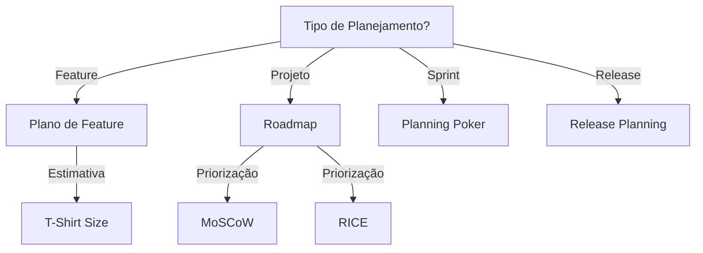

# Planning

Realiza planejamento estratégico e tático de projetos.

## Quando Usar

### Use quando:
- Planejando projeto ou iniciativa
- Criando roadmap
- Estimando esforço
- Fazendo breakdown de trabalho
- Priorizando backlog

### Não use quando:
- Tarefa imediata (< 1 hora)
- Bug fix simples
- Protótipo sem planejamento

### Skills relacionadas:
- `writing-plans` — para planos de implementação
- `governance` — para processos de equipe

## Decision Tree



## Workflow

### Fase 1: Decompor Iniciativa em Épico/Features/Tasks

1. Receba iniciativa:
   ```
   "Sistema de pagamento com múltiplos métodos"
   ```
2. Crie épico:
   ```markdown
   ## Épico: Sistema de Pagamento
   Valor: Permitir diferentes formas de pagamento
   ```
3. Quebre em features:
   ```markdown
   ### Feature: Integração com Cartão
   ### Feature: Integração com PIX
   ### Feature: Integração com Boleto
   ```
4. Quebre em tasks:
   ```markdown
   #### Task: Configurar gateway de cartão
   - [ ] Criar conta no gateway
   - [ ] Configurar credenciais
   - [ ] Implementar SDK
   ```
5. **Checkpoint**: Decomposição completa com estimativas

### Fase 2: Estimar Esforço

1. Use T-Shirt sizing:
   - **XS**: 1-2 horas
   - **S**: 1 dia
   - **M**: 3-5 dias
   - **L**: 1-2 semanas
2. Use Planning Poker para consenso:
   ```
   Task: Integrar gateway de pagamento
   Time: 8, 5, 13, 8 → Consenso: 8
   ```
3. **Checkpoint**: Estimativas validadas pela equipe

### Fase 3: Priorizar Backlog

1. Aplique MoSCoW:
   - **Must**: PIX (obrigatório para release)
   - **Should**: Cartão (importante)
   - **Could**: Boleto (desejável)
   - **Won't**: Crypto (não agora)
2. Calcule RICE score:
   ```
   Reach: 1000 usuários
   Impact: 3 (alto)
   Confidence: 80%
   Effort: 5
   Score = (1000 × 3 × 0.8) / 5 = 480
   ```
3. **Checkpoint**: Backlog priorizado com score

### Fase 4: Criar Roadmap Visual

1. Agrupe por trimestre:
   ```markdown
   ## Q1 2024
   - PIX
   - Cartão
   
   ## Q2 2024
   - Boleto
   - Assinatura
   ```
2. Adicione marcos:
   ```markdown
   - M1: PIX beta (2024-02-15)
   - M2: Cartão (2024-03-15)
   ```
3. **Checkpoint**: Roadmap com datas e marcos

## Conceitos Fundamentais

### Estrutura Hierárquica

#### Épico
Unidade grande de trabalho, múltiplas sprints.
- Alinhado a objetivo de negócio
- Entrega de valor mensurável

#### Feature
Conjunto de funcionalidades relacionadas, 1 sprint.
- Valor de negócio isolado
- Pode ser demonstrado

#### Task
Unidade mínima de trabalho, horas.
- Responsável único
- Critérios de aceitação claros

### Priorização

#### MoSCoW
- **Must**: obrigatório para a entrega
- **Should**: importante, mas não crítico
- **Could**: desejável, pode esperar
- **Won't**: não será feito agora

#### RICE
- **Reach**: quantos usuários afetados
- **Impact**: magnitude do impacto
- **Confidence**: certeza da estimativa
- **Effort**: custo de implementação

Score = (Reach × Impact × Confidence) / Effort

### Estimativas

- **T-Shirt**: XS/S/M/L/XL
- **Planning Poker**: Fibonacci (1, 2, 3, 5, 8, 13)
- **Story Points**: relativo, não absoluto

## Templates

### epic-card.md
Localização: `templates/epic-card.md`

Template para épico.

**Uso:**
```bash
cp templates/epic-card.md docs/epics/{epic}.md
```

### feature-card.md
Localização: `templates/feature-card.md`

Template para feature.

**Uso:**
```bash
cp templates/feature-card.md docs/features/{feature}.md
```

### task-card.md
Localização: `templates/task-card.md`

Template para task.

**Uso:**
```bash
cp templates/task-card.md docs/tasks/{task}.md
```

## Anti-patterns

### 🔴 Crítico

#### Task sem Critério de Aceitação
**O que é:** Task sem definição clara de "pronto".
**Por que é ruim:** Trabalho nunca termina, revisão impossível.
**Como evitar:** Sempre defina critérios antes de iniciar.
**Exemplo:**
```
# ❌ ERRADO
- [ ] Implementar login

# ✅ CORRETO
- [ ] Implementar login
  - Critérios:
    - [ ] OAuth com Google funciona
    - [ ] Callback cria JWT
    - [ ] Testes passam
```

#### Estimativa sem Base
**O que é:** Estimativa "chutômetro" sem justificativa.
**Por que é ruim:** Erro de planning, frustração da equipe.
**Como evitar:** Use referência histórica, decomponha.
**Exemplo:**
```
# ❌ ERRADO
"Vou estimar 3 dias"

# ✅ CORRETO
"Similar ao feature X que levou 2 dias
+ Complexidade Y adicional
= Estimativa: 3 dias"
```

### 🟡 Médio

#### Dependência Circular
**O que é:** Task A depende de Task B, B depende de A.
**Por que é ruim:** Impossível executar, deadlock.
**Como evitar:** Quebre dependência, use interface.
**Exemplo:**
```
# ❌ ERRADO
Task A: "Precisa do resultado de B"
Task B: "Precisa do resultado de A"

# ✅ CORRETO
Task A: "Define interface comum"
Task B: "Implementa interface"
Task C: "Integra A e B"
```

### 🟢 Baixo

#### Roadmap sem Datas
**O que é:** Roadmap sem datas ou marcos.
**Por que é ruim:** Ninguém sabe quando vai ser entregue.
**Como evitar:** Defina milestones no início.
**Exemplo:**
```markdown
# ✅ CORRETO
## Q1 2024
- PIX (2024-02-15)
- Cartão (2024-03-15)
```

## Checklists

### Checklist de Decomposição
- [ ] Épico tem objetivo de negócio claro
- [ ] Features decompostas em tasks
- [ ] Tasks têm critérios de aceitação
- [ ] Estimativas definidas
- [ ] Dependências mapeadas

### Checklist de Estimativa
- [ ] Task tem referência histórica
- [ ] Complexidade identificada
- [ ] Risco avaliado
- [ ] Esforço realista
- [ ] Consenso da equipe

### Checklist de Priorização
- [ ] MoSCoW aplicado
- [ ] RICE calculado
- [ ] Stakeholders alinhados
- [ ] Roadmap atualizado

## Edge Cases

### Projeto sem Histórico
**Situação:** Novo projeto sem referência histórica.
**Solução:** Use spike para explorar complexidade.
**Exceção:** Se tecnologia é conhecida, use experiência prévia.

```markdown
## Spike: Explorar complexidade
- Timebox: 2 dias
- Resultado: Estimativa mais precisa
```

### Estimativa para Tecnologia Nova
**Situação:** Tecnologia desconhecida pela equipe.
**Solução:** Adicione buffer de 50-100%.
**Exceção:** Se alguém tem experiência, use como referência.

```markdown
Estimativa: 5 dias + 50% buffer = 8 dias
```

### Scope Creep
**Situação:** Novas funcionalidades surgem durante execução.
**Solução:** Documente como "Could", reestime.
**Exceção:** Se é crítico, priorize e remova outro.

```markdown
## Novas funcionalidades
- [ ] Feature X (adicionado como Could)
```

## Referências

- `writing-plans` — para planos de implementação
- `governance` — para processos de equipe
- [RICE Framework](https://www.intercom.com/blog/rice-simple-prioritization-for-product-managers/)