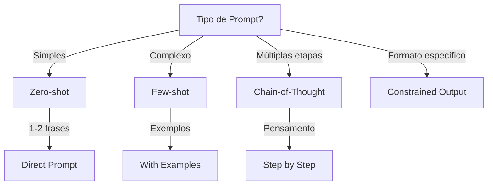

# Prompt Engineering

Diretrizes para engenharia de prompts eficazes.

## Quando Usar

### Use quando:
- Criando prompts para agentes de IA
- Otimizando interações com LLMs
- Treinando equipes em IA
- Padronizando prompts entre projetos
- Criando prompt para tarefa complexa

### Não use quando:
- Tarefa é simples (1-2 linhas)
- Prompt já existe e funciona
- Precisa de interação humana direta

### Skills relacionadas:
- `vibe-coding` — para desenvolvimento guiado por IA

## Decision Tree



## Workflow

### Fase 1: Criar Prompt para Tarefa Simples

1. Identifique a tarefa:
   ```
   "Formatar JSON para tabela markdown"
   ```
2. Crie prompt direto:
   ```
   Formate o seguinte JSON como tabela markdown:
   {json aqui}
   ```
3. Teste o prompt:
   ```bash
   # Use ferramenta de teste
   echo "prompt" | llm-prompt-test
   ```
4. **Checkpoint**: Prompt produz output correto

### Fase 2: Criar Prompt para Tarefa Complexa

1. Defina contexto (role):
   ```
   Você é um arquiteto de software sênior especializado em DDD.
   ```
2. Defina tarefa clara:
   ```
   Modele o domínio de um sistema de pedidos com:
   - Entidades: Order, Product, User
   - Value Objects: Money, Address
   - Aggregates: Order com OrderItems
   ```
3. Defina formato de saída:
   ```
   Responda em formato:
   - Entidades: lista
   - Value Objects: lista
   - Aggregates: lista com invariantes
   ```
4. Defina restrições:
   ```
   - Use TypeScript
   - Não inclua framework
   - Foque em domínio puro
   ```
5. **Checkpoint**: Prompt produz output estruturado

### Fase 3: Otimizar Prompt

1. Adicione few-shot se necessário:
   ```
   Exemplo 1:
   Input: Order com 2 items
   Output: Aggregate com invariantes...
   
   Exemplo 2:
   Input: User registration
   Output: Entity com validação...
   
   Agora processe:
   Input: {novo caso}
   ```
2. Adicione chain-of-thought:
   ```
   Pense passo a passo:
   1. Primeiro, identifique as entidades
   2. Depois, defina os value objects
   3. Finalmente, estabeleça os aggregates
   ```
3. Adicione constrained output:
   ```
   Responda APENAS com código TypeScript.
   Não inclua explicações.
   ```
4. **Checkpoint**: Output mais preciso e consistente

### Fase 4: Avaliar Qualidade de Prompt

1. Teste com múltiplos inputs:
   ```bash
   # Teste 1
   echo "input1" | llm
   
   # Teste 2
   echo "input2" | llm
   ```
2. Verifique consistência:
   - Mesmo formato?
   - Mesmo nível de detalhe?
3. Meça latência e custo:
   - Tokens usados
   - Tempo de resposta
4. **Checkpoint**: Prompt validado com múltiplos testes

## Conceitos Fundamentais

### Estrutura de Prompt

#### 1. Contexto
Quem é o agente, qual seu papel, qual o objetivo.

```
Você é um desenvolvedor sênior especializado em Node.js.
Sua tarefa é refatorar código legado.
```

#### 2. Tarefa
O que deve ser feito, de forma clara e específica.

```
Refatore a classe UserService para seguir Single Responsibility Principle.
Extraia validação para UserValidator.
```

#### 3. Formato de Saída
Estrutura esperada da resposta.

```
Responda em formato:
```typescript
// Antes
{código}

// Depois
{código}
```
```

#### 4. Restrições
O que NÃO fazer, limites e regras.

```
- Não altere comportamento
- Mantenha compatibilidade
- Use TypeScript
```

### Técnicas

#### Role Prompting
```
Você é um arquiteto de software sênior especializado em DDD...
```

#### Few-Shot
```
Exemplo 1:
Input: ...
Output: ...

Exemplo 2:
Input: ...
Output: ...

Agora processe:
Input: ...
```

#### Chain-of-Thought
```
Pense passo a passo:
1. Primeiro, ...
2. Depois, ...
3. Finalmente, ...
```

#### Constrained Output
```
Responda APENAS com o código final.
Não inclua explicações.
```

## Templates

### prompt-simple.md
Localização: `templates/prompt-simple.md`

Template para prompt simples.

**Uso:**
```bash
cat templates/prompt-simple.md
```

### prompt-complex.md
Localização: `templates/prompt-complex.md`

Template para prompt complexo com contexto.

**Uso:**
```bash
cat templates/prompt-complex.md
```

### prompt-evaluation.md
Localização: `templates/prompt-evaluation.md`

Template para avaliação de prompt.

**Uso:**
```bash
cat templates/prompt-evaluation.md
```

## Anti-patterns

### 🔴 Crítico

#### Prompt Vago
**O que é:** Prompt sem contexto ou tarefa clara.
**Por que é ruim:** Output imprevisível, precisa de múltiplas tentativas.
**Como evitar:** Sempre inclua contexto, tarefa, formato e restrições.
**Exemplo:**
```
# ❌ ERRADO
"Melhore o código"

# ✅ CORRETO
"Refatore o código para usar async/await em vez de callbacks.
Use TypeScript.
Mantenha o mesmo comportamento.
```typescript
{código}
```"
```

#### Múltiplas Tarefas em um Prompt
**O que é:** Prompt que pede múltiplas coisas diferentes.
**Por que é ruim:** Output misturado, difícil de validar.
**Como evitar:** Um prompt, uma tarefa.
**Exemplo:**
```
# ❌ ERRADO
"Modele o domínio, crie testes e documente a API"

# ✅ CORRETO
"Modele o domínio com DDD. Responda apenas com código TypeScript."
```

### 🟡 Médio

#### Instruções Contraditórias
**O que é:** Prompt com regras conflitantes.
**Por que é ruim:** Agente fica confuso, output inconsistente.
**Como evitar:** Revise prompt antes de enviar.
**Exemplo:**
```
# ❌ ERRADO
"Use JavaScript"
"Use TypeScript"

# ✅ CORRETO
"Use TypeScript"
```

#### Falta de Contexto
**O que é:** Prompt sem informações necessárias.
**Por que é ruim:** Output genérico, não específico do projeto.
**Como evitar:** Inclua contexto do projeto, stack, restrições.
**Exemplo:**
```
# ❌ ERRADO
"Crie API de usuários"

# ✅ CORRETO
"Crie API REST de usuários usando Node.js + Express + TypeScript.
Use Clean Architecture.
Endpoints: GET /users, POST /users, GET /users/:id"
```

### 🟢 Baixo

#### Prompt sem Formato de Saída
**O que é:** Prompt que não especifica formato esperado.
**Por que é ruim:** Output pode não ser usável.
**Como evitar:** Sempre especifique formato.
**Exemplo:**
```
# ❌ ERRADO
"Liste os endpoints"

# ✅ CORRETO
"Liste os endpoints em formato JSON:
{
  "endpoints": [
    { "method": "GET", "path": "/users" }
  ]
}"
```

## Checklists

### Checklist de Prompt
- [ ] Contexto definido (role do agente)
- [ ] Tarefa clara e específica
- [ ] Formato de saída definido
- [ ] Restrições incluídas
- [ ] Exemplos fornecidos (se complexo)
- [ ] Chain-of-thought incluído (se necessário)

### Checklist de Output
- [ ] Formato correto
- [ ] Código compila
- [ ] Testes passam
- [ ] Documentação incluída
- [ ] Segurança verificada

### Checklist de Constraint
- [ ] Output é apenas código
- [ ] Não inclui explicações
- [ ] Formato JSON/TS especificado
- [ ] Tamanho máximo definido

## Edge Cases

### Prompt para Código Legado
**Situação:** Precisa de prompt para refatorar código antigo.
**Solução:** Inclua contexto do legado, objetivo da refatoração.
**Exceção:** Se código é crítico, peça mais cuidado.

```
"Refatore este código JavaScript para TypeScript.
Mantenha 100% de compatibilidade.
Não altere comportamento externo."
```

### Prompt para Documentação em Língua Estrangeira
**Situação:** Precisa de prompt para documentar em inglês.
**Solução:** Especifique língua, inclua glossário.
**Exceção:** Se equipe é multilíngue, peça tradução.

```
"Documente em inglês americano.
Termos técnicos: Order (Pedido), Item (Item)"
```

## Referências

- `vibe-coding` — para desenvolvimento guiado por IA
- [Prompt Engineering Guide](https://www.promptingguide.org/)