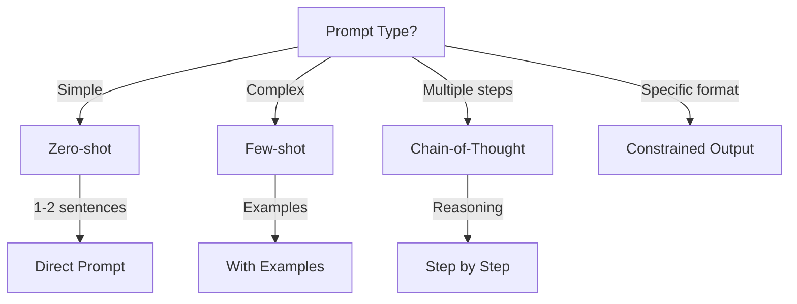

# Prompt Engineering

Guidelines for effective prompt engineering.

## When to Use

### Use when:
- Creating prompts for AI agents
- Optimizing interactions with LLMs
- Training teams in AI
- Standardizing prompts across projects
- Creating prompts for complex tasks

### Do not use when:
- Task is simple (1-2 lines)
- Prompt already exists and works
- Requires direct human interaction

### Related Skills:
- `vibe-coding` — for AI-guided development

## Decision Tree


```mermaid
graph TD
    A[Prompt Type?] -->|Simple| B[Zero-shot]
    A -->|Complex| C[Few-shot]
    A -->|Multiple steps| D[Chain-of-Thought]
    A -->|Specific format| E[Constrained Output]
    B -->|1-2 sentences| F[Direct Prompt]
    C -->|Examples| G[With Examples]
    D -->|Reasoning| H[Step by Step]
```

## Workflow

### Phase 1: Create Prompt for Simple Task

1. Identify the task:
   ```
   "Format JSON to table markdown"
   ```
2. Create direct prompt:
   ```
   Format the following JSON as a table markdown:
   {json here}
   ```
3. Test the prompt:
   ```bash
   # Use testing tool
   echo "prompt" | llm-prompt-test
   ```
4. **Checkpoint**: Prompt produces correct output

### Phase 2: Create Prompt for Complex Task

1. Define context (role):
   ```
   You are a senior software architect specializing in DDD.
   ```
2. Define clear task:
   ```
   Model the domain of a order system with:
   - Entities: Order, Product, User
   - Value Objects: Money, Address
   - Aggregates: Order with OrderItems
   ```
3. Define output format:
   ```
   Respond in the following format:
   - Entities: list
   - Value Objects: list
   - Aggregates: list with invariants
   ```
4. Define constraints:
   ```
   - Use TypeScript
   - Do not include framework
   - Focus on pure domain
   ```
5. **Checkpoint**: Prompt produces structured output

### Phase 3: Optimize Prompt

1. Add few-shot if necessary:
   ```
   Example 1:
   Input: Order with 2 items
   Output: Aggregate with invariants...
   
   Example 2:
   Input: User registration
   Output: Entity with validation...
   
   Now process:
   Input: {new case}
   ```
2. Add chain-of-thought:
   ```
   Think step by step:
   1. First, identify the entities
   2. Then, define the value objects
   3. Finally, establish the aggregates
   ```
3. Add constrained output:
   ```
   Respond ONLY with the final code.
   Do not include explanations.
   ```
4. **Checkpoint**: Output is more precise and consistent

### Phase 4: Evaluate Prompt Quality

1. Test with multiple inputs:
   ```bash
   # Test 1
   echo "input1" | llm
   
   # Test 2
   echo "input2" | llm
   ```
2. Verify consistency:
   - Same format?
   - Same level of detail?
3. Measure latency and cost:
   - Tokens used
   - Response time
4. **Checkpoint**: Prompt validated with multiple tests

## Fundamental Concepts

### Prompt Structure

#### 1. Context
Who is the agent, what is their role, what is the objective.

```
You are a senior software developer specializing in Node.js.
Your task is to refactor legacy code.
```

#### 2. Task
What needs to be done, clearly and specifically.

```
Refactor the UserService class to follow the Single Responsibility Principle.
Extract validation to UserValidator.
```

#### 3. Output Format
The expected structure of the response.

```
Respond in the following format:
```typescript
// Before
{code}

// After
{code}
```
```

#### 4. Constraints
What NOT to do, limits, and rules.

```
- Do not alter behavior
- Maintain compatibility
- Use TypeScript
```

### Techniques

#### Role Prompting
```
You are a senior software architect specializing in DDD...
```

#### Few-Shot
```
Example 1:
Input: ...
Output: ...

Example 2:
Input: ...
Output: ...

Now process:
Input: ...
```

#### Chain-of-Thought
```
Think step by step:
1. First, ...
2. Then, ...
3. Finally, ...
```

#### Constrained Output
```
Respond ONLY with the final code.
Do not include explanations.
```

## Templates

### prompt-simple.md
Location: `templates/prompt-simple.md`

Template for simple prompts.

**Usage:**
```bash
cat templates/prompt-simple.md
```

### prompt-complex.md
Location: `templates/prompt-complex.md`

Template for complex prompts with context.

**Usage:**
```bash
cat templates/prompt-complex.md
```

### prompt-evaluation.md
Location: `templates/prompt-evaluation.md`

Template for prompt evaluation.

**Usage:**
```bash
cat templates/prompt-evaluation.md
```

## Anti-patterns

### Critical

#### Vague Prompt
**What is it:** A prompt without context or clear task.
**Why is it bad:** Output is unpredictable, needs multiple attempts.
**How to avoid:** Always include context, task, format, and constraints.
**Example:**
```
# ❌ WRONG
"Improve the code"

# ✅ RIGHT
"Refactor the code to use async/await instead of callbacks.
Use TypeScript.
Maintain the same behavior.
```typescript
{code}
```"
```

#### Multiple Tasks in One Prompt
**What is it:** A prompt that asks for multiple things.
**Why is it bad:** Output is mixed, hard to validate.
**How to avoid:** One prompt, one task.
**Example:**
```
# ❌ WRONG
"Model the domain, create tests, and document the API"

# ✅ RIGHT
"Model the domain with DDD. Respond only with code TypeScript."
```

### Medium

#### Contradictory Instructions
**What is it:** A prompt with conflicting rules.
**Why is it bad:** Agent gets confused, output is inconsistent.
**How to avoid:** Review prompt before sending.
**Example:**
```
# ❌ WRONG
"Use JavaScript"
"Use TypeScript"

# ✅ RIGHT
"Use TypeScript"
```

#### Lack of Context
**What is it:** A prompt without necessary information.
**Why is it bad:** Output is generic, not specific to the project.
**How to avoid:** Include project context, stack, constraints.
**Example:**
```
# ❌ WRONG
"Create a user API"

# ✅ RIGHT
"Create a REST API for users using Node.js + Express + TypeScript.
Use Clean Architecture.
Endpoints: GET /users, POST /users, GET /users/:id"
```

### Low

#### Prompt without Output Format
**What is it:** A prompt that does not specify output format.
**Why is it bad:** Output may not be usable.
**How to avoid:** Always specify output format.
**Example:**
```
# ❌ WRONG
"List the endpoints"

# ✅ RIGHT
"List the endpoints in the following JSON format:
{
  "endpoints": [
    { "method": "GET", "path": "/users" }
  ]
}"
```

## Checklists

### Prompt Checklist
- [ ] Context defined (agent role)
- [ ] Task clear and specific
- [ ] Output format defined
- [ ] Constraints included
- [ ] Examples provided (if complex)
- [ ] Chain-of-thought included (if necessary)

### Output Checklist
- [ ] Correct format
- [ ] Code compiles
- [ ] Tests pass
- [ ] Documentation included
- [ ] Security verified

### Constraint Checklist
- [ ] Output is only code
- [ ] No explanations included
- [ ] JSON/TS format specified
- [ ] Maximum size defined

## Edge Cases

### Legacy Code Prompt
**Situation:** Need to create a prompt for refactoring legacy code.
**Solution:** Include legacy context, refactoring objective.
**Exception:** If code is critical, ask for more caution.

```
"Refactor this JavaScript code to TypeScript.
Maintain 100% compatibility.
Do not alter external behavior."
```

### Foreign Language Documentation Prompt
**Situation:** Need to create a prompt for documenting in a foreign language.
**Solution:** Specify language, include glossary.
**Exception:** If team is multilingual, ask for translation.

```
"Document in American English.
Technical terms: Order (Pedido), Item (Item)"
```

## References

- `vibe-coding` — for AI-guided development
- [Prompt Engineering Guide](https://www.promptingguide.org/)


## Domain SOTA & Industry Engineering Standards

- **Prompt Optimization Paradigms:** Chain-of-Density (CoD), Few-Shot Chain-of-Thought (CoT), Tree of Thoughts (ToT), and DSPy Declarative Signatures.
- **Security & Delimiters:** XML/Markdown boundary tags (`<context>`, `<instruction>`, `<schema>`) preventing prompt injection.
- **Context Compaction:** High signal-to-noise ratio prompt compaction eliminating conversational fluff.
- **Output Determinism:** Strict JSON Schema generation and constrained decoding formats.

### Chain-of-Density (CoD) Stepwise Compression:
1. **Step 1 (Draft):** Generate initial summary capturing main points.
2. **Step 2 (Identify Missing Entities):** Identify 1-3 critical missing domain entities.
3. **Step 3 (Fuse & Condense):** Re-write summary retaining exact word count while infusing missing entities.

### Exhaustive Heuristic Decision Rules:
- **Rule of Thumb 1 (Zero-Trust Architectural Boundaries):** Treat all external inputs, third-party payloads, and cross-module boundaries with strict zero-trust schema validation.
- **Rule of Thumb 2 (Fail-Fast & Deterministic Errors):** Reject invalid states immediately with typed, actionable error contracts rather than cascading silent failures.
- **Rule of Thumb 3 (Idempotency & AST Preservation):** State mutations and code transformations must maintain semantic idempotency across repeated executions.
- **Rule of Thumb 4 (Benchmark & Telemetry Alignment):** Measure critical execution latency ($P_{95}$) and memory overhead with structured telemetry and baseline benchmarks.
- **Rule of Thumb 5 (Event-Driven & Circuit Breaker Decoupling):** Isolate asynchronous operations behind circuit breakers and resilient retry mechanisms to prevent cascading failure.
- **Rule of Thumb 6 (Contract-First DDD Modeling):** Define clear domain aggregates, value objects, and typed interface contracts before implementing concrete logic.
- **Rule of Thumb 7 (RAG & Semantic Retrieval Precision):** Optimize context retrieval with hybrid lexical-vector search and reciprocal rank fusion to eliminate hallucinated routing.
- **Rule of Thumb 8 (OWASP & Supply Chain Verification):** Verify dependencies and data flows against OWASP Top 10 and SLSA Level 3 supply chain security standards.
- **Rule of Thumb 9 (Verification Gate Invariant):** Never declare completion without automated test execution evidence and zero compiler/linter warnings.
## Completion Gate

The task associated with the skill `prompt-engineering` can only be declared complete when:
1. All checks in the operational verification checklist have been satisfied.
2. The deliverable has been deterministically validated through execution evidence.
3. No structural debt, unresolved placeholders, or unhandled errors remain.

