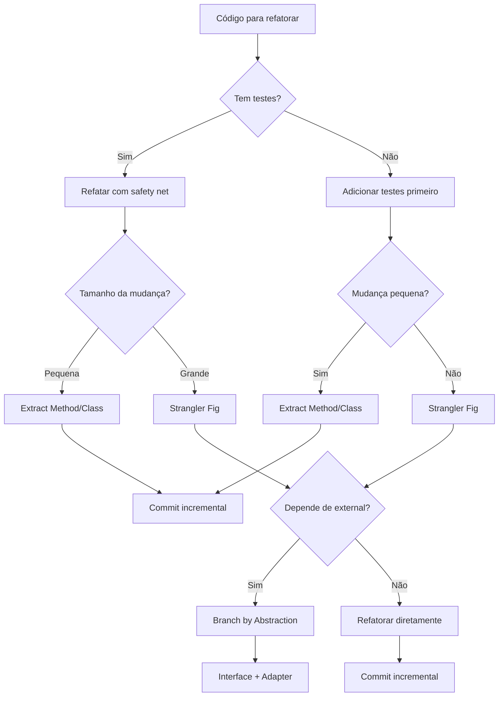

# Refactoring

Guia para refatoração segura, incremental e estruturada.

## Quando Usar

### Use quando:
- Código funciona mas é difícil de manter
- Precisa melhorar estrutura sem mudar comportamento
- Sistema legado precisa de modernização gradual
- Identificou code smells (duplicação, métodos longos, classes grandes)
- Precisa separar responsabilidades misturadas

### Não use quando:
- Não há testes e risco de quebra é alto
- Código está sendo descartado em breve
- Refatoração não traz valor mensurável
- Time não tem bandwidth para manter mudanças

### Skills relacionadas:
- `architecture-review-kilo` — para identificar violações arquiteturais antes de refatorar
- `ddd` — para modelar domínio rico durante refatoração
- `testing` — para criar safety net antes de refatorar

## Decision Tree



## Conceitos Fundamentais

### Code Smells Comuns

| Code Smell | Sintoma | Técnica de Refatoração |
|------------|---------|----------------------|
| Long Method | Função > 30 linhas | Extract Method |
| Large Class | Classe com múltiplas responsabilidades | Extract Class |
| Duplicated Code | Mesma lógica em 2+ lugares | Extract Method / Template Method |
| Feature Envy | Método usa mais dados de outra classe | Move Method |
| Primitive Obsession | Primitivos usados em vez de objetos | Replace with Value Object |
| Switch Statements | Múltiplos switches no mesmo lugar | Replace with Polymorphism |

### Strangler Fig Pattern

Migrar sistema legado gradualmente, construindo novo sistema ao redor:

```
Sistema Legado (monolito)
    │
    ├── Novo módulo A (microserviço)
    ├── Novo módulo B (microserviço)
    └── Legado restante (diminui com o tempo)
```

### Branch by Abstraction

Criar abstração para remover dependência antes de refatorar:

```
Código atual → Extrair interface → Criar adapter → Trocar implementação
```

## Workflow

### Fase 1: Analisar Código Atual

1. Identifique o code smell ou problema
2. Mapeie dependências e pontos de integração
3. Verifique se existem testes cobrindo o código
4. Use o template `templates/refactoring-catalog.md` para documentar
5. **Checkpoint**: Código, dependências e testes mapeados

### Fase 2: Criar Safety Net de Testes

1. Se não há testes, crie usando `templates/test-before-refactor.md`
2. Execute testes e confirme que passam
3. Adicione testes para caminhos de erro e edge cases
4. Commit os testes ANTES de qualquer refatoração
5. **Checkpoint**: Todos os testes passam, commit feito

### Fase 3: Executar Refatoração

1. Aplique uma técnica de refatoração por vez
2. Execute testes após cada mudança
3. Se teste quebra, revert imediatamente
4. Commite incrementalmente a cada mudança segura
5. **Checkpoint**: Testes continuam passando

### Fase 4: Revisar e Validar

1. Execute lint e typecheck
2. Verifique cobertura de testes não diminuiu
3. Peça review de pelo menos um colega
4. Documente mudanças no changelog
5. **Checkpoint**: PR aprovado, sem regressões

### Fase 5: Planejar Próxima Refatoração

1. Identifique próximo code smell na fila
2. Estime esforço e dependências
3. Atualize o catálogo de refatorações
4. Comunique progresso ao time
5. **Checkpoint**: Próxima refatoração planejada

### Fase 6: Migrar Sistema Legado (Strangler Fig)

1. Identifique borda do módulo legado
2. Crie interface para o módulo
3. Implemente novo módulo ao lado
4. Redirecione tráfego gradualmente
5. Remova código legado quando novo módulo estiver estável
6. **Checkpoint**: Módulo legado removido, novo módulo em produção

## Templates

### refactoring-catalog.md
Localização: `templates/refactoring-catalog.md`

Catálogo de refatorações para documentar mudanças planejadas.

**Uso:**
```bash
cp templates/refactoring-catalog.md docs/refactoring-catalog.md
```

### legacy-migration.md
Localização: `templates/legacy-migration.md`

Template para planejar migração de sistemas legados.

**Uso:**
```bash
cp templates/legacy-migration.md docs/migrations/{system}-migration.md
```

### test-before-refactor.md
Localização: `templates/test-before-refactor.md`

Template para criar testes antes de refatorar código sem cobertura.

**Uso:**
```bash
cp templates/test-before-refactor.md docs/test-plan-{module}.md
```

## Anti-patterns

### 🔴 Crítico

#### Refatorar sem Testes
**O que é:** Modificar código sem safety net de testes automatizados.
**Por que é ruim:** Impossível saber se comportamento foi preservado, regressões silenciosas.
**Como evitar:** Sempre criar testes antes de refatorar. Sem exceções.
**Exemplo:**
```typescript
// ❌ ERRADO - refatorar sem testes
function processOrder(order) {
  // mudar lógica sem testes cobrindo
  return order.items.reduce((sum, item) => sum + item.price * item.qty, 0);
}

// ✅ CORRETO - testar primeiro
it('should calculate total correctly', () => {
  expect(processOrder({ items: [{ price: 10, qty: 2 }] })).toBe(20);
});
// agora refatorar com segurança
```

#### Refatorar + Mudar Behavior ao Mesmo Tempo
**O que é:** Alterar comportamento e estrutura em uma mesma mudança.
**Por que é ruim:** Impossível isolar causa de bugs, commit não é atômico.
**Como evitar:** Separar refatoração (mesmo comportamento) de feature (novo comportamento).
**Exemplo:**
```typescript
// ❌ ERRADO - refatorar e mudar behavior
function calculateTotal(items) {
  return items.reduce((sum, i) => sum + i.price * i.qty, 0);
  // e mudar para incluir desconto - dois objetivos misturados
}

// ✅ CORRETO - separar commits
// Commit 1: refatorar (extract method)
// Commit 2: adicionar desconto (novo behavior)
```

### 🟡 Médio

#### Big Bang Refactoring
**O que é:** Refatorar sistema inteiro de uma vez.
**Por que é ruim:** Alto risco,难以 review, merge conflicts, regressões difíceis de localizar.
**Como evitar:** Refatorar incrementalmente, módulo por módulo.
**Exemplo:**
```typescript
// ❌ ERRADO - refatorar tudo
// "Vou refatorar o sistema inteiro esta sprint"

// ✅ CORRETO - incremental
// Sprint 1: Refatorar módulo de pagamento
// Sprint 2: Refatorar módulo de usuário
// Sprint 3: Refatorar módulo de notificação
```

#### Não Commitar Incrementalmente
**O que é:** Acumular muitas mudanças sem commit intermediário.
**Por que é ruim:** Diff gigante impossível de review,难以 reverter mudanças pontuais.
**Como evitar:** Commite a cada refatoração segura (testes passando).
**Exemplo:**
```bash
# ❌ ERRADO
git add -A && git commit -m "refatoração completa do sistema"

# ✅ CORRETO
git commit -m "refactor: extract calculateTotal method"
git commit -m "refactor: move validation to separate class"
git commit -m "refactor: replace switch with polymorphism"
```

### 🟢 Baixo

#### Refatorar Código que Ninguém Mantém
**O que é:** Refatorar código que ninguém usa ou mantém ativamente.
**Por que é ruim:** desperdício de tempo, não traz valor, código pode ser deletado.
**Como evitar:** Verifique se código é usado antes de refatorar.
**Exemplo:**
```typescript
// ❌ ERRADO - refatorar código morto
// função não chamada em nenhum lugar, ninguém mantém
function legacyCalculate() { /* ... */ }

// ✅ CORRETO - verificar uso primeiro
grep -r "legacyCalculate" src/
# resultado: 0 ocorrências → deletar, não refatorar
```

## Checklists

### Checklist Pré-Refatoração
- [ ] Testes existentes cobrem código a ser refatorado
- [ ] Todos os testes passam no momento atual
- [ ] Código fonte está commitado (sem mudanças pendentes)
- [ ] Dependências do módulo mapeadas
- [ ] Time ciente da refatoração planejada

### Checklist Durante Refatoração
- [ ] Apenas uma técnica de refatoração aplicada por commit
- [ ] Testes executados após cada mudança
- [ ] Nenhum teste quebrou (ou foi ajustado intencionalmente)
- [ ] Commits incrementais com mensagens claras
- [ ] Lint e typecheck passando

### Checklist Pós-Refatoração
- [ ] Todos os testes passam
- [ ] Cobertura de testes não diminuiu
- [ ] Code review realizado
- [ ] Documentação atualizada se necessário
- [ ] Nenhum TODO ou FIXME introduzido

## Edge Cases

### Código com Dependências Circulares
**Situação:** Módulos A e B dependem um do outro.
**Solução:** Use Branch by Abstraction: extraia interface, crie adapter, quebre ciclo.
**Exceção:** Se dependência é genuinamente bidirecional, considere merge de módulos.

```typescript
// ❌ Dependência circular
// module-a.ts → import from module-b
// module-b.ts → import from module-a

// ✅ Quebrar com interface
// interface.ts - defines contract
// module-a.ts - implements interface
// module-b.ts - uses interface only
```

### Código Sem Testes e Sem Dono
**Situação:** Código crítico sem testes e sem ninguém que conheça detalhes.
**Solução:** Adicione testes exploratórios (caracterização) antes de refatorar.
**Exceção:** Se código pode ser substituído por biblioteca externa,avalie替换.

```typescript
// Teste de caracterização - documentar comportamento atual
it('should match current behavior for order calculation', () => {
  // executar código legado e documentar resultado
  const result = legacyCalculate(order);
  expect(result).toBe(142.50); // valor documentado
});
```

### Sistema em Produção com Alto Tráfego
**Situação:** Refatorar código que processa milhares de requisições/segundo.
**Solução:** Use feature flags para alternar entre implementação antiga e nova.
**Exceção:** Se refatoração é puramente interna (mesma interface), pode ser direta.

```typescript
// Feature flag para migração gradual
function processPayment(order) {
  if (featureFlags.isEnabled('new-payment-processor')) {
    return newPaymentProcessor.process(order);
  }
  return legacyPaymentProcessor.process(order);
}
```

### Refatoração que Afeta API Pública
**Situação:** Mudança que quebra contrato com consumidores externos.
**Solução:** Versione a API, mantenha versão antiga deprecada por período.
**Exceção:** Se consumidores são internos e podem ser atualizados simultaneamente.

```typescript
// v1 - mantida por 6 meses
// v2 - nova implementação
// consumidores migram gradualmente
```

## Referências

- [Martin Fowler - Refactoring](https://martinfowler.com/books/refactoring.html)
- [Strangler Fig - Martin Fowler](https://martinfowler.com/bliki/StranglerFigApplication.html)
- [Refactoring Guru](https://refactoring.guru/)
- `architecture-review-kilo` — para identificar onde refatorar
- `ddd` — para modelar domínio durante refatoração
- `testing` — para criar safety net
