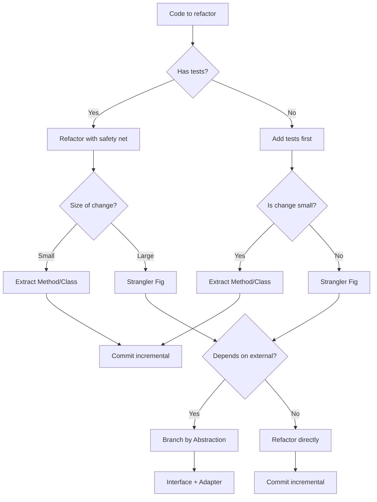

# Refactoring

Guide to safe, incremental, and structured refactoring.

## When to Use

### Use When:
- Code functions but is difficult to maintain
- Need to improve structure without changing behavior
- Legacy system needs gradual modernization
- Identified code smells (duplication, long methods, large classes)
- Need to separate mixed responsibilities

### Do Not Use When:
- No tests and high risk of breakage
- Code is being discarded soon
- Refactoring does not bring measurable value
- Team does not have bandwidth to maintain changes

### Related Skills:
- `architecture-review-kilo` — to identify architectural violations before refactoring
- `ddd` — to model rich domain during refactoring
- `testing` — to create safety net before refactoring

## Decision Tree


```mermaid
graph TD
    A[Code to refactor] --> B{Has tests?}
    B -->|Yes| C[Refactor with safety net]
    B -->|No| D[Add tests first]
    D --> E{Is change small?}
    C --> F{Size of change?}
    F -->|Small| G[Extract Method/Class]
    F -->|Large| H[Strangler Fig]
    E -->|Yes| I[Extract Method/Class]
    E -->|No| J[Strangler Fig]
    H --> K{Depends on external?}
    I --> L[Commit incremental]
    J --> K
    K -->|Yes| M[Branch by Abstraction]
    K -->|No| N[Refactor directly]
    M --> O[Interface + Adapter]
    N --> P[Commit incremental]
    G --> L
```

## Fundamental Concepts

### Common Code Smells

| Code Smell | Symptom | Refactoring Technique |
|------------|---------|----------------------|
| Long Method | Function > 30 lines | Extract Method |
| Large Class | Class with multiple responsibilities | Extract Class |
| Duplicated Code | Same logic in 2+ places | Extract Method / Template Method |
| Feature Envy | Method uses more data from another class | Move Method |
| Primitive Obsession | Primitives used instead of objects | Replace with Value Object |
| Switch Statements | Multiple switches in the same place | Replace with Polymorphism |

### Strangler Fig Pattern

Migrate legacy system gradually, building new system around it:

```
Legacy System (monolith)
    │
    ├── New module A (microservice)
    ├── New module B (microservice)
    └── Remaining legacy (diminishes over time)
```

### Branch by Abstraction

Create abstraction to remove dependency before refactoring:

```
Current code → Extract interface → Create adapter → Switch implementation
```

## Workflow

### Phase 1: Analyze Current Code

1. Identify code smell or problem
2. Map dependencies and integration points
3. Verify if there are tests covering the code
4. Use the `refactoring-catalog.md` template to document
5. **Checkpoint**: Code, dependencies, and tests mapped

### Phase 2: Create Safety Net of Tests

1. If no tests exist, create using `test-before-refactor.md` template
2. Execute tests and confirm they pass
3. Add tests for error paths and edge cases
4. Commit tests before any refactoring
5. **Checkpoint**: All tests pass, commit made

### Phase 3: Execute Refactoring

1. Apply one refactoring technique at a time
2. Execute tests after each change
3. If test breaks, revert immediately
4. Commit incrementally after each safe change
5. **Checkpoint**: Tests continue passing

### Phase 4: Review and Validate

1. Execute lint and typecheck
2. Verify test coverage did not decrease
3. Request review from at least one colleague
4. Document changes in changelog
5. **Checkpoint**: PR approved, no regressions

### Phase 5: Plan Next Refactoring

1. Identify next code smell in the queue
2. Estimate effort and dependencies
3. Update the refactoring catalog
4. Communicate progress to the team
5. **Checkpoint**: Next refactoring planned

### Phase 6: Migrate Legacy System (Strangler Fig)

1. Identify the edge of the legacy module
2. Create interface for the module
3. Implement new module alongside
4. Redirect traffic gradually
5. Remove legacy code when new module is stable
6. **Checkpoint**: Legacy module removed, new module in production

## Templates

### refactoring-catalog.md
Location: `templates/refactoring-catalog.md`

Refactoring catalog to document planned changes.

**Usage:**
```bash
cp templates/refactoring-catalog.md docs/refactoring-catalog.md
```

### legacy-migration.md
Location: `templates/legacy-migration.md`

Template for planning legacy system migration.

**Usage:**
```bash
cp templates/legacy-migration.md docs/migrations/{system}-migration.md
```

### test-before-refactor.md
Location: `templates/test-before-refactor.md`

Template for creating tests before refactoring code without coverage.

**Usage:**
```bash
cp templates/test-before-refactor.md docs/test-plan-{module}.md
```

## Anti-patterns

### Critical

#### Refactor Without Tests
**What is it:** Modifying code without a safety net of automated tests.
**Why is it bad:** Impossible to know if behavior was preserved, silent regressions.
**How to avoid:** Always create tests before refactoring. No exceptions.
**Example:**
```typescript
// ❌ WRONG - refactor without tests
function processOrder(order) {
  // change logic without tests covering
  return order.items.reduce((sum, item) => sum + item.price * item.qty, 0);
}

// ✅ RIGHT - test first
it('should calculate total correctly', () => {
  expect(processOrder({ items: [{ price: 10, qty: 2 }] })).toBe(20);
});
// now refactor safely
```

#### Refactor + Change Behavior at the Same Time
**What is it:** Altering behavior and structure in one change.
**Why is it bad:** Impossible to isolate cause of bugs, commit is not atomic.
**How to avoid:** Separate refactoring (same behavior) from feature (new behavior).
**Example:**
```typescript
// ❌ WRONG - refactor and change behavior
function calculateTotal(items) {
  return items.reduce((sum, i) => sum + i.price * i.qty, 0);
  // and change to include discount - two goals mixed
}

// ✅ RIGHT - separate commits
// Commit 1: refactor (same behavior)
// Commit 2: add discount (new behavior)
```

### Medium

#### Big Bang Refactoring
**What is it:** Refactoring the entire system at once.
**Why is it bad:** High risk, difficult to review, merge conflicts, regressions hard to locate.
**How to avoid:** Refactor incrementally, module by module.
**Example:**
```typescript
// ❌ WRONG - refactor everything
// "I'll refactor the entire system this sprint"

// ✅ RIGHT - incremental
// Sprint 1: Refactor payment module
// Sprint 2: Refactor user module
// Sprint 3: Refactor notification module
```

#### Do Not Commit Incrementally
**What is it:** Accumulating many changes without intermediate commits.
**Why is it bad:** Huge diff impossible to review, difficult to revert point changes.
**How to avoid:** Commit after each safe refactoring (tests passing).
**Example:**
```bash
# ❌ WRONG
git add -A && git commit -m "refactoring complete system"

# ✅ RIGHT
git commit -m "refactor: extract calculateTotal method"
git commit -m "refactor: move validation to separate class"
git commit -m "refactor: replace switch with polymorphism"
```

### Low

#### Refactor Code No One Maintains
**What is it:** Refactoring code that no one uses or maintains actively.
**Why is it bad:** Waste of time, does not bring value, code can be deleted.
**How to avoid:** Verify if code is used before refactoring.
**Example:**
```typescript
// ❌ WRONG - refactor dead code
// function not called anywhere, no one maintains
function legacyCalculate() { /* ... */ }

// ✅ RIGHT - check usage first
grep -r "legacyCalculate" src/
# result: 0 occurrences → delete, do not refactor
```

## Checklists

### Pre-Refactoring Checklist
- [ ] Existing tests cover code to be refactored
- [ ] All tests pass at the moment
- [ ] Source code is committed (no pending changes)
- [ ] Module dependencies are mapped
- [ ] Team is aware of the planned refactoring

### Refactoring Checklist
- [ ] Only one refactoring technique applied per commit
- [ ] Tests executed after each change
- [ ] No tests broke (or were intentionally adjusted)
- [ ] Commits are incremental with clear messages
- [ ] Lint and typecheck pass

### Post-Refactoring Checklist
- [ ] All tests pass
- [ ] Test coverage did not decrease
- [ ] Code review was done
- [ ] Documentation updated if necessary
- [ ] No TODOs or FIXMEs introduced

## Edge Cases

### Circular Dependencies
**Situation:** Modules A and B depend on each other.
**Solution:** Use Branch by Abstraction: extract interface, create adapter, break cycle.
**Exception:** If dependency is genuinely bidirectional, consider merging modules.

```typescript
// ❌ Circular dependency
// module-a.ts → import from module-b
// module-b.ts → import from module-a

// ✅ Break with interface
// interface.ts - defines contract
// module-a.ts - implements interface
// module-b.ts - uses interface only
```

### Code Without Tests and No Owner
**Situation:** Critical code without tests and no one knows details.
**Solution:** Add exploratory tests (characterization) before refactoring.
**Exception:** If code can be replaced by an external library, consider replacing.

```typescript
// Test characterization - document current behavior
it('should match current behavior for order calculation', () => {
  // execute legacy code and document result
  const result = legacyCalculate(order);
  expect(result).toBe(142.50); // documented value
});
```

### System in Production with High Traffic
**Situation:** Refactoring code that processes thousands of requests per second.
**Solution:** Use feature flags to gradually switch between old and new implementation.
**Exception:** If refactoring is purely internal (same interface), it can be direct.

```typescript
// Feature flag for gradual migration
function processPayment(order) {
  if (featureFlags.isEnabled('new-payment-processor')) {
    return newPaymentProcessor.process(order);
  }
  return legacyPaymentProcessor.process(order);
}
```

### Refactoring That Affects Public API
**Situation:** Change that breaks contract with external consumers.
**Solution:** Version the API, maintain old version deprecated for a period.
**Exception:** If consumers are internal and can be updated simultaneously.

```typescript
// v1 - maintained for 6 months
// v2 - new implementation
// consumers migrate gradually
```

## References

- [Martin Fowler - Refactoring](https://martinfowler.com/books/refactoring.html)
- [Strangler Fig - Martin Fowler](https://martinfowler.com/bliki/StranglerFigApplication.html)
- [Refactoring Guru](https://refactoring.guru/)
- `architecture-review-kilo` — to identify where to refactor
- `ddd` — to model domain during refactoring
- `testing` — to create safety net


## Domain SOTA & Industry Engineering Standards

- **Refactoring Foundations:** Martin Fowler's Refactoring Catalog (2nd Edition) and Joshua Kerievsky's Refactoring to Patterns.
- **Architecture Migration Patterns:** Strangler Fig Pattern, Branch by Abstraction, and Parallel Run verification.
- **Safety Invariant:** Characterization Tests (Golden Master Tests) established BEFORE modifying code.
- **Small Steps:** Micro-commits with continuous green test suite.

### Refactoring Risk & Invariance Model:
A refactoring step $R$ preserves observable behavior $B$:

$$B(f(x)) \equiv B(f'(x)) \quad \forall x \in \text{Inputs}$$

### Exhaustive Heuristic Decision Rules:
1. **Rule of Thumb 1 (Separate Refactoring from Features):** Never combine structural refactoring with new feature implementation in the same commit.
2. **Rule of Thumb 2 (Test Coverage Prerequisite):** Never refactor legacy code without establishing characterization tests first.
3. **Rule of Thumb 3 (Extract Before Modify):** When dealing with large monolithic functions, extract small helper methods before altering behavior.
4. **Rule of Thumb 4 (Revert on Red):** If tests fail during a refactoring step and the fix is not obvious in 2 minutes, revert immediately and take smaller steps.

## Completion Gate

A tarefa associada à skill `refactoring` só pode ser declarada concluída quando:
1. Todas as verificações do checklist operacional foram atendidas.
2. O resultado foi validado deterministamente através de evidências de execução.
3. Não restam pendências estruturais, placeholders ou erros não tratados.

