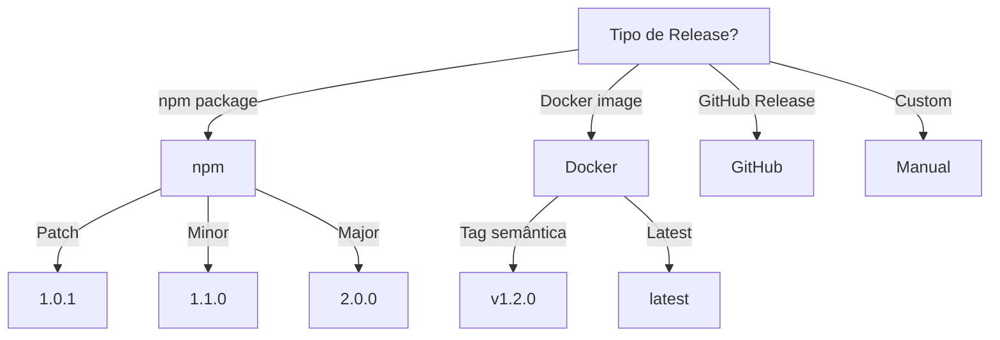

# Release

Guia para gestão de releases e versionamento.

## Quando Usar

### Use quando:
- Precisa preparar uma release
- Precisa publicar pacote npm/docker
- Precisa gerenciar versionamento semântico
- Precisa fazer rollback de release
- Precisa atualizar CHANGELOG

### Não use quando:
- Protótipo sem versionamento
- Projeto sem deploy automatizado
- Hotfix urgente (use skill git)

### Skills relacionadas:
- `git` — para tags e branching
- `governance` — para processo de aprovação

## Decision Tree



## Workflow

### Fase 1: Preparar Release

1. Atualize CHANGELOG.md:
   ```markdown
   ## [Unreleased]
   ### Added
   - Nova funcionalidade X
   
   ## [1.2.0] - 2024-01-15
   ### Added
   - Feature X
   ### Fixed
   - Bug Y
   ```
2. Bump versão em package.json:
   ```bash
   npm version minor  # ou major/patch
   ```
3. Atualize versão em outros arquivos:
   - package-lock.json (automático)
   - Dockerfile (se aplicável)
   - Helm chart (se aplicável)
4. **Checkpoint**: Versão bumpada e CHANGELOG atualizado

### Fase 2: Validar Release

1. Execute todos os testes:
   ```bash
   npm test
   npm run test:integration
   npm run test:e2e
   ```
2. Execute lint:
   ```bash
   npm run lint
   ```
3. Execute build:
   ```bash
   npm run build
   ```
4. Verifique security:
   ```bash
   npm audit
   ```
5. **Checkpoint**: Todos os checks passam

### Fase 3: Publicar Release

1. Commit das mudanças:
   ```bash
   git add .
   git commit -m "chore(release): prepare v1.2.0"
   ```
2. Crie tag:
   ```bash
   git tag -a v1.2.0 -m "Release v1.2.0"
   ```
3. Push com tags:
   ```bash
   git push origin main --tags
   ```
4. Publicar npm (se aplicável):
   ```bash
   npm publish
   ```
5. Publicar Docker (se aplicável):
   ```bash
   docker build -t myimage:v1.2.0 .
   docker push myimage:v1.2.0
   ```
6. Criar GitHub Release:
   ```bash
   gh release create v1.2.0 --generate-notes
   ```
7. **Checkpoint**: Release publicada em todos os canais

### Fase 4: Rollback

1. Identifique versão estável anterior:
   ```bash
   git tag | grep -E "^v[0-9]" | tail -5
   ```
2. Crie branch de rollback:
   ```bash
   git checkout -b rollback/v1.2.0-20240115 v1.1.0
   ```
3. Documente motivo:
   ```bash
   echo "Rollback v1.2.0 - motivo: memory leak" > ROLLBACK.md
   ```
4. Publique rollback:
   ```bash
   git tag v1.2.0-rollback-20240115
   git push origin rollback/v1.2.0-20240115 --tags
   ```
5. **Checkpoint**: Rollback publicado e documentado

## Conceitos Fundamentais

### Versionamento Semântico

Formato: `MAJOR.MINOR.PATCH[-PRERELEASE][+BUILD]`

- **MAJOR**: mudanças incompatíveis (breaking changes)
- **MINOR**: funcionalidades novas, retrocompatível
- **PATCH**: correções de bug, retrocompatível
- **PRERELEASE**: alpha, beta, rc
- **BUILD**: metadados de build

### Changelog Format

Siga [Keep a Changelog](https://keepachangelog.com/):

```markdown
# Changelog

## [Unreleased]
### Added
- Nova funcionalidade

## [1.2.0] - 2024-01-15
### Added
- Feature X
### Fixed
- Bug Y

[Unreleased]: https://github.com/.../compare/v1.2.0...HEAD
[1.2.0]: https://github.com/.../compare/v1.1.0...v1.2.0
```

## Templates

### changelog-entry.md
Localização: `templates/changelog-entry.md`

Template para entrada de changelog.

**Uso:**
```bash
# Adicione ao CHANGELOG.md
## [Unreleased]
### Added
- {{descrição da mudança}}
```

### release-checklist.md
Localização: `templates/release-checklist.md`

Checklist de validação pré-release.

**Uso:**
```bash
cp templates/release-checklist.md docs/release-checklist.md
```

### rollback-plan.md
Localização: `templates/rollback-plan.md`

Template para plano de rollback.

**Uso:**
```bash
cp templates/rollback-plan.md docs/rollback-plan.md
```

## Anti-patterns

### 🔴 Crítico

#### Release sem Changelog
**O que é:** Publicar release sem atualizar CHANGELOG.md.
**Por que é ruim:** Usuários não sabem o que mudou, dificulta upgrade.
**Como evitar:** Sempre atualize CHANGELOG antes do release.
**Exemplo:**
```
# ❌ ERRADO
git tag v1.2.0
git push --tags
npm publish

# ✅ CORRETO
# Atualizar CHANGELOG.md
git add CHANGELOG.md
git commit -m "docs: update changelog"
git tag v1.2.0
git push --tags
npm publish
```

#### Breaking Change sem Major Bump
**O que é:** Mudança que quebra API sem incrementar MAJOR.
**Por que é ruim:** Quebra projetos dos usuários, perde confiança.
**Como evitar:** SEMPRE major bump para breaking changes.
**Exemplo:**
```
# ❌ ERRADO
# Remover campo user.email sem major bump
npm version minor

# ✅ CORRETO
# Remover campo user.email
npm version major
```

### 🟡 Médio

#### Release sem Testes
**O que é:** Publicar release sem executar testes completos.
**Por que é ruim:** Bugs em produção, rollback necessário.
**Como evitar:** CI obrigatório antes do release.
**Exemplo:**
```
# ❌ ERRADO
npm version minor
git push --tags
npm publish

# ✅ CORRETO
npm test
npm run test:e2e
npm version minor
git push --tags
npm publish
```

#### Tag Duplicada
**O que é:** Criar tag com mesmo nome de release anterior.
**Por que é ruim:** Confusão, impossível rastrear histórico.
**Como evitar:** Delete tag antes de recriar, ou use suffix.
**Exemplo:**
```
# ❌ ERRADO
git tag v1.2.0  # já existe
git push --tags  # erro

# ✅ CORRETO
git tag -d v1.2.0
git tag v1.2.0
git push --tags
```

### 🟢 Baixo

#### Release sem Notas
**O que é:** Release sem descrição do que mudou.
**Por que é ruim:** Usuários não sabem se devem atualizar.
**Como evitar:** Use `gh release create --generate-notes` ou escreva manualmente.
**Exemplo:**
```
# ❌ ERRADO
git tag v1.2.0
git push --tags

# ✅ CORRETO
gh release create v1.2.0 --title "v1.2.0" --notes "Bug fixes and performance improvements"
```

## Checklists

### Checklist Pré-Release
- [ ] CHANGELOG.md atualizado
- [ ] Versão bumpada em package.json
- [ ] Todos os testes passam
- [ ] Lint passa
- [ ] Build passa
- [ ] npm audit sem vulnerabilidades altas
- [ ] Documentação atualizada
- [ ] README.md atualizado (se necessário)

### Checklist Pós-Release
- [ ] Tag criada e push
- [ ] npm publish (se aplicável)
- [ ] Docker push (se aplicável)
- [ ] GitHub Release criado
- [ ] Slack/Discord notificado
- [ ] Versão atualizada para próximo dev

### Checklist de Rollback
- [ ] Versão problemática identificada
- [ ] Versão anterior estável identificada
- [ ] Branch de rollback criada
- [ ] Rollback publicado
- [ ] Usuários notificados
- [ ] Issue criada para bug root cause

## Edge Cases

### Breaking Change não Documentado
**Situação:** Release contém breaking change sem documentação.
**Solução:** Reverta imediatamente, publique correção documentada.
**Exceção:** Se breaking é intencional e documentado em alpha/beta.

```bash
# Documentar breaking change
echo "BREAKING: user.email removed, use user.primaryEmail" >> CHANGELOG.md
```

### Hotfix Durante Release
**Situação:** Bug crítico encontrado enquanto prepara release.
**Solução:** Pausar release, fazer hotfix, depois continuar.
**Exceção:** Se hotfix é pequeno, pode incluir no release.

```bash
# Hotfix durante release
git checkout -b hotfix/critical-bug main
# ... corrigir ...
git checkout release/v1.2.0
git merge hotfix/critical-bug
```

## Referências

- [Keep a Changelog](https://keepachangelog.com/)
- [Semantic Versioning](https://semver.org/)
- `git` — para tags e branching
- `governance` — para processo de aprovação