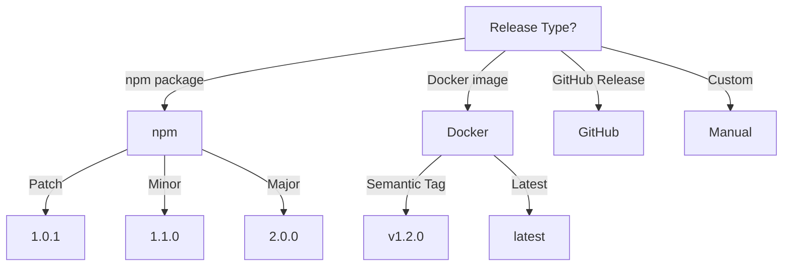
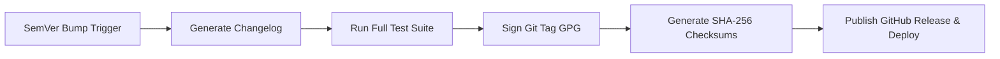

# Release

## When to Use

### Use when:
- Tagging and publishing production releases according to Semantic Versioning (SemVer 2.0.0)
- Generating cryptographically signed artifacts with SLSA Level 3 provenance
- Creating GitHub Releases with automated checksum manifests (`SHA256SUMS`)

### Do not use when:
- Local experimental development or unverified scratch builds

Guide for release management and versioning.

## Deterministic Execution Rules

> [!IMPORTANT]
> **UNINTERRUPTIBLE EXECUTION PROTOCOL (HARD GATE)**
> When triggering `/release`, the agent **MUST NEVER STOP** in the middle of the process or declare the task complete before **ALL THREE PHASES** (Prepare, Validate, and Publish Remotely) are executed continuously in the same turn.

### Unconditional Requirements:
1. **Branch Assignment**: If the release is initiated from a feature branch (`feat/...`), the agent **MUST** merge the branch into `main` (or master) before pushing remotely.
2. **Remote Push Mandatory**: The release **IS ONLY** considered complete after `git push origin main --tags` and `gh release create` (or remote channel publication).
3. **Forbidden Partial Completion**: Creating a local commit/tag and responding without pushing to the remote repository constitutes non-compliance.

## Decision Tree

### Use when:
- Need to prepare a release
- Need to publish an npm/docker package
- Need to manage semantic versioning
- Need to perform a release rollback
- Need to update the CHANGELOG

### Do not use when:
- Prototype without versioning
- Project without automated deployment
- Urgent hotfix (use `git` skill)

### Related Skills:
- `git` — for tags and branching
- `governance` — for approval process

## Decision Tree


```mermaid
graph TD
    A[Release Type?] -->|npm package| B[npm]
    A -->|Docker image| C[Docker]
    A -->|GitHub Release| D[GitHub]
    A -->|Custom| E[Manual]
    B -->|Patch| F[1.0.1]
    B -->|Minor| G[1.1.0]
    B -->|Major| H[2.0.0]
    C -->|Semantic Tag| I[v1.2.0]
    C -->|Latest| J[latest]
```

## Workflow

### Phase 1: Prepare Release

1. Update CHANGELOG.md:
   ```markdown
   ## [Unreleased]
   ### Added
   - New feature X
   
   ## [1.2.0] - 2024-01-15
   ### Added
   - Feature X
   ### Fixed
   - Bug Y
   ```
2. Bump version in package.json:
   ```bash
   npm version minor  # or major/patch
   ```
3. Update version in other files:
   - package-lock.json (automatic)
   - Dockerfile (if applicable)
   - Helm chart (if applicable)
4. **Checkpoint**: Version bumped and CHANGELOG updated

### Phase 2: Validate Release

1. Run all tests:
   ```bash
   npm test
   npm run test:integration
   npm run test:e2e
   ```
2. Run lint:
   ```bash
   npm run lint
   ```
3. Run build:
   ```bash
   npm run build
   ```
4. Verify security:
   ```bash
   npm audit
   ```
5. **Checkpoint**: All checks pass

### Phase 3: Publish Release

1. Commit changes:
   ```bash
   git add .
   git commit -m "chore(release): prepare v1.2.0"
   ```
2. Create tag:
   ```bash
   git tag -a v1.2.0 -m "Release v1.2.0"
   ```
3. Push with tags:
   ```bash
   git push origin main --tags
   ```
4. Publish npm (if applicable):
   ```bash
   npm publish
   ```
5. Publish Docker (if applicable):
   ```bash
   docker build -t myimage:v1.2.0 .
   docker push myimage:v1.2.0
   ```
6. Create GitHub Release:
   ```bash
   gh release create v1.2.0 --generate-notes
   ```
7. **Checkpoint**: Release published in all channels

### Phase 4: Rollback

1. Identify previous stable version:
   ```bash
   git tag | grep -E "^v[0-9]" | tail -5
   ```
2. Create rollback branch:
   ```bash
   git checkout -b rollback/v1.2.0-20240115 v1.1.0
   ```
3. Document reason:
   ```bash
   echo "Rollback v1.2.0 - reason: memory leak" > ROLLBACK.md
   ```
4. Publish rollback:
   ```bash
   git tag v1.2.0-rollback-20240115
   git push origin rollback/v1.2.0-20240115 --tags
   ```
5. **Checkpoint**: Rollback published and documented

## Fundamental Concepts

### Semantic Versioning

Format: `MAJOR.MINOR.PATCH[-PRERELEASE][+BUILD]`

- **MAJOR**: Incompatible changes (breaking changes)
- **MINOR**: New features, backward compatible
- **PATCH**: Bug fixes, backward compatible
- **PRERELEASE**: Alpha, beta, rc
- **BUILD**: Build metadata

### Changelog Format

Follow [Keep a Changelog](https://keepachangelog.com/):

```markdown
# Changelog

## [Unreleased]
### Added
- New feature

## [1.2.0] - 2024-01-15
### Added
- Feature X
### Fixed
- Bug Y

[Unreleased]: https://github.com/.../compare/v1.2.0...HEAD
[1.2.0]: https://github.com/.../compare/v1.1.0...v1.2.0
```

## Templates

### changelog-entry.md
Location: `templates/changelog-entry.md`

Template for changelog entry.

**Usage:**
```bash
# Add to CHANGELOG.md
## [Unreleased]
### Added
- {{change description}}
```

### release-checklist.md
Location: `templates/release-checklist.md`

Checklist for release validation.

**Usage:**
```bash
cp templates/release-checklist.md docs/release-checklist.md
```

### rollback-plan.md
Location: `templates/rollback-plan.md`

Template for rollback plan.

**Usage:**
```bash
cp templates/rollback-plan.md docs/rollback-plan.md
```

## Anti-patterns

### 🔴 Critical

#### Release without Changelog
**What is it:** Publishing release without updating CHANGELOG.md.
**Why is it bad:** Users don't know what changed, makes upgrade difficult.
**How to avoid:** Always update CHANGELOG before release.
**Example:**
```
# ❌ WRONG
git tag v1.2.0
git push --tags
npm publish

# ✅ RIGHT
# Update CHANGELOG.md
git add CHANGELOG.md
git commit -m "docs: update changelog"
git tag v1.2.0
git push --tags
npm publish
```

#### Breaking Change without Major Bump
**What is it:** Change that breaks API without incrementing MAJOR.
**Why is it bad:** Breaks user projects, loses trust.
**How to avoid:** ALWAYS major bump for breaking changes.
**Example:**
```
# ❌ WRONG
# Remove user.email without major bump
npm version minor

# ✅ RIGHT
# Remove user.email
npm version major
```

### 🟡 Medium

#### Release without Tests
**What is it:** Publishing release without running complete tests.
**Why is it bad:** Bugs in production, rollback necessary.
**How to avoid:** CI mandatory before release.
**Example:**
```
# ❌ WRONG
npm version minor
git push --tags
npm publish

# ✅ RIGHT
npm test
npm run test:e2e
npm version minor
git push --tags
npm publish
```

#### Duplicate Tag
**What is it:** Creating tag with same name as previous release.
**Why is it bad:** Confusion, impossible to track history.
**How to avoid:** Delete tag before recreating, or use suffix.
**Example:**
```
# ❌ WRONG
git tag v1.2.0  # already exists
git push --tags  # error

# ✅ RIGHT
git tag -d v1.2.0
git tag v1.2.0
git push --tags
```

### 🟢 Low

#### Release without Notes
**What is it:** Release without description of what changed.
**Why is it bad:** Users don't know if they should update.
**How to avoid:** Use `gh release create --generate-notes` or write manually.
**Example:**
```
# ❌ WRONG
git tag v1.2.0
git push --tags

# ✅ RIGHT
gh release create v1.2.0 --title "v1.2.0" --notes "Bug fixes and performance improvements"
```

## Checklists

### Pre-Release Checklist
- [ ] CHANGELOG.md updated
- [ ] Version bumped in package.json
- [ ] All tests pass
- [ ] Lint passes
- [ ] Build passes
- [ ] npm audit without high vulnerabilities
- [ ] Documentation updated
- [ ] README.md updated (if necessary)

### Post-Release Checklist
- [ ] Tag created and pushed
- [ ] npm publish (if applicable)
- [ ] Docker push (if applicable)
- [ ] GitHub Release created
- [ ] Slack/Discord notified
- [ ] Version updated for next dev

### Rollback Checklist
- [ ] Problematic version identified
- [ ] Previous stable version identified
- [ ] Rollback branch created
- [ ] Rollback published
- [ ] Users notified
- [ ] Issue created for root cause bug

## Edge Cases

### Undocumented Breaking Change
**Situation:** Release contains breaking change without documentation.
**Solution:** Revert immediately, publish correction documented.
**Exception:** If breaking is intentional and documented in alpha/beta.

```bash
# Document breaking change
echo "BREAKING: user.email removed, use user.primaryEmail" >> CHANGELOG.md
```

### Hotfix During Release
**Situation:** Critical bug found while preparing release.
**Solution:** Pause release, make hotfix, then continue.
**Exception:** If hotfix is small, can include in release.

```bash
# Hotfix during release
git checkout -b hotfix/critical-bug main
# ... fix ...
git checkout release/v1.2.0
git merge hotfix/critical-bug
```

## References

- [Keep a Changelog](https://keepachangelog.com/)
- [Semantic Versioning](https://semver.org/)
- `git` — for tags and branching
- `governance` — for approval process

## Domain SOTA & Industry Engineering Standards

- **Supply Chain Security:** Supply-chain Levels for Software Artifacts (SLSA Level 3) compliance and provenance attestation.
- **Cryptographic Asset Signing:** GPG commit signing and Cosign / Sigstore keyless container & binary signing.
- **Release Automation:** Semantic Release, GitHub Releases with automated asset uploads and SHA-256 checksum manifests.
- **Rollback Preparedness:** Automated canary releases, fast rollback triggers, and immutable release tags.

### Release Pipeline Flow:


```mermaid
graph LR
    A[SemVer Bump Trigger] --> B[Generate Changelog]
    B --> C[Run Full Test Suite]
    C --> D[Sign Git Tag GPG]
    D --> E[Generate SHA-256 Checksums]
    E --> F[Publish GitHub Release & Deploy]
```

### Exhaustive Heuristic Decision Rules:
- **Rule of Thumb 1 (Zero-Trust Architectural Boundaries):** Treat all external inputs, third-party payloads, and cross-module boundaries with strict zero-trust schema validation.
- **Rule of Thumb 2 (Fail-Fast & Deterministic Errors):** Reject invalid states immediately with typed, actionable error contracts rather than cascading silent failures.
- **Rule of Thumb 3 (Idempotency & AST Preservation):** State mutations and code transformations must maintain semantic idempotency across repeated executions.
- **Rule of Thumb 4 (Benchmark & Telemetry Alignment):** Measure critical execution latency ($P_{95}$) and memory overhead with structured telemetry and baseline benchmarks.
- **Rule of Thumb 5 (Event-Driven & Circuit Breaker Decoupling):** Isolate asynchronous operations behind circuit breakers and resilient retry mechanisms to prevent cascading failure.
- **Rule of Thumb 6 (Contract-First DDD Modeling):** Define clear domain aggregates, value objects, and typed interface contracts before implementing concrete logic.
- **Rule of Thumb 7 (RAG & Semantic Retrieval Precision):** Optimize context retrieval with hybrid lexical-vector search and reciprocal rank fusion to eliminate hallucinated routing.
- **Rule of Thumb 8 (OWASP & Supply Chain Verification):** Verify dependencies and data flows against OWASP Top 10 and SLSA Level 3 supply chain security standards.
- **Rule of Thumb 9 (Verification Gate Invariant):** Never declare completion without automated test execution evidence and zero compiler/linter warnings.
## Completion Gate

A tarefa associada à skill `release` só pode ser declarada concluída quando:
1. Todas as verificações do checklist operacional foram atendidas.
2. O resultado foi validado deterministamente através de evidências de execução.
3. Não restam pendências estruturais, placeholders ou erros não tratados.

