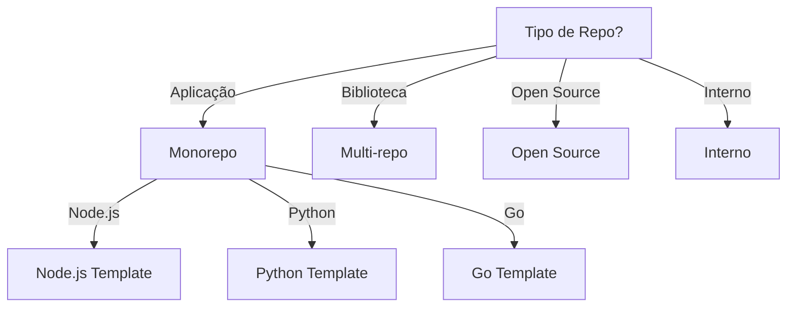

# Repo Bootstrap

Gera estrutura inicial padronizada para repositórios.

## Quando Usar

### Use quando:
- Inicializando novo repositório
- Padronizando estrutura existente
- Criando template de projeto
- Onboarding de novos projetos

### Não use quando:
- Repositório já existe e está padronizado
- Projeto sem documentação necessária

### Skills relacionadas:
- `governance` — para processos de equipe
- `documentation` — para padrões de docs
- `git` — para .gitignore

## Decision Tree



## Workflow

### Fase 1: Criar Repositório do Zero

1. Crie estrutura:
   ```bash
   mkdir -p docs/{adr,api,architecture}
   mkdir -p .github/workflows
   ```
2. Copie templates:
   ```bash
   cp templates/README.md README.md
   cp templates/CONTRIBUTING.md CONTRIBUTING.md
   cp templates/SECURITY.md SECURITY.md
   cp templates/ci.yml .github/workflows/ci.yml
   cp templates/AGENTS.md AGENTS.md
   ```
3. Crie arquivos:
   ```bash
   touch CHANGELOG.md
   touch LICENSE
   ```
4. **Checkpoint**: Estrutura criada, git init

### Fase 2: Adicionar Governança a Repo Existente

1. Verifique estrutura atual:
   ```bash
   ls -la
   ```
2. Adicione arquivos faltando:
   ```bash
   # Para cada arquivo faltando
   cp templates/{arquivo} ./{arquivo}
   ```
3. Atualize README:
   ```bash
   # Adicione badges, links
   ```
4. **Checkpoint**: Governança adicionada

### Fase 3: Configurar CI/CD

1. Crie workflow:
   ```bash
   mkdir -p .github/workflows
   cp templates/ci.yml .github/workflows/ci.yml
   ```
2. Configure secrets:
   ```bash
   # NPM_TOKEN, DOCKER_PASSWORD, etc.
   ```
3. Ative branch protection:
   ```bash
   # Settings > Branches > Add rule
   ```
4. **Checkpoint**: CI/CD funcionando

## Conceitos Fundamentais

### Estrutura Gerada

```
repo/
├── README.md
├── AGENTS.md
├── CHANGELOG.md
├── CONTRIBUTING.md
├── CODE_OF_CONDUCT.md
├── SECURITY.md
├── LICENSE
├── .github/
│   └── workflows/
│       └── ci.yml
├── docs/
│   ├── architecture/
│   ├── adr/
│   └── decisions/
└── src/
```

### Arquivos Gerados

#### README.md
- Descrição do projeto
- Instalação
- Uso básico
- Como contribuir

#### AGENTS.md
- Instruções para agentes
- Padrões de código
- Comandos importantes

#### CHANGELOG.md
- Formato Keep a Changelog
- Seções: Added, Changed, etc.

## Templates

### README.md
Localização: `templates/README.md`

Template para README de projeto.

**Uso:**
```bash
cp templates/README.md README.md
```

### CONTRIBUTING.md
Localização: `templates/CONTRIBUTING.md`

Template para contribuição.

**Uso:**
```bash
cp templates/CONTRIBUTING.md CONTRIBUTING.md
```

### SECURITY.md
Localização: `templates/SECURITY.md`

Política de segurança.

**Uso:**
```bash
cp templates/SECURITY.md SECURITY.md
```

### ci.yml
Localização: `templates/ci.yml`

Workflow de CI/CD.

**Uso:**
```bash
cp templates/ci.yml .github/workflows/ci.yml
```

### AGENTS.md
Localização: `templates/AGENTS.md`

Instruções para agentes.

**Uso:**
```bash
cp templates/AGENTS.md AGENTS.md
```

## Anti-patterns

### 🔴 Crítico

#### Repo sem LICENSE
**O que é:** Repositório sem arquivo de licença.
**Por que é ruim:** Uso não autorizado, problemas legais.
**Como evitar:** Sempre inclua LICENSE.
**Exemplo:**
```
# ❌ ERRADO
# Repo sem LICENSE

# ✅ CORRETO
# MIT License no arquivo LICENSE
```

#### Repo sem .gitignore
**O que é:** Repositório sem .gitignore.
**Por que é ruim:** Arquivos sensíveis commitados, repo sujo.
**Como evitar:** Use gitignore.io ou template.
**Exemplo:**
```
# ❌ ERRADO
# .env commitado

# ✅ CORRETO
# .gitignore inclui .env, node_modules, etc.
```

### 🟡 Médio

#### Repo sem CI
**O que é:** Repositório sem CI configurado.
**Por que é ruim:** Bugs em produção, qualidade não verificada.
**Como evitar:** Sempre configure CI.
**Exemplo:**
```
# ❌ ERRADO
# Push direto para main

# ✅ CORRETO
# CI verifica lint, testes, build
```

### 🟢 Baixo

#### Repo sem Badges
**O que é:** README sem badges de status.
**Por que é ruim:** Usuários não sabem status.
**Como evitar:** Adicione badges padrão.
**Exemplo:**
```markdown


```

## Checklists

### Checklist de Repo Completeness
- [ ] README.md presente
- [ ] LICENSE presente
- [ ] .gitignore configurado
- [ ] CI/CD configurado
- [ ] AGENTS.md presente
- [ ] CONTRIBUTING.md presente
- [ ] SECURITY.md presente

### Checklist de CI Pipeline
- [ ] Lint passa
- [ ] Testes passam
- [ ] Build funciona
- [ ] Coverage reportado
- [ ] Security scan

### Checklist de Security Basics
- [ ] .env no .gitignore
- [ ] Secrets configurados
- [ ] LICENSE incluída
- [ ] SECURITY.md presente

## Edge Cases

### Fork de Projeto Externo
**Situação:** Fork de projeto sem estrutura padronizada.
**Solução:** Mantenha compatibilidade, adicione AGENTS.md.
**Exceção:** Se fork é totalmente novo, reestruture.

```bash
# Manter estrutura original
# Adicionar AGENTS.md para agentes
```

### Monorepo com Múltiplas Linguagens
**Situação:** Monorepo com Node.js, Python, Go.
**Solução:** Estrutura por serviço, CI multi-stage.
**Exceção:** Se monolito é pequeno, unifique.

```
packages/
├── api/     # Node.js
├── ml/      # Python
└── cli/     # Go
```

## Referências

- `governance` — para processos
- `documentation` — para padrões
- `git` — para .gitignore