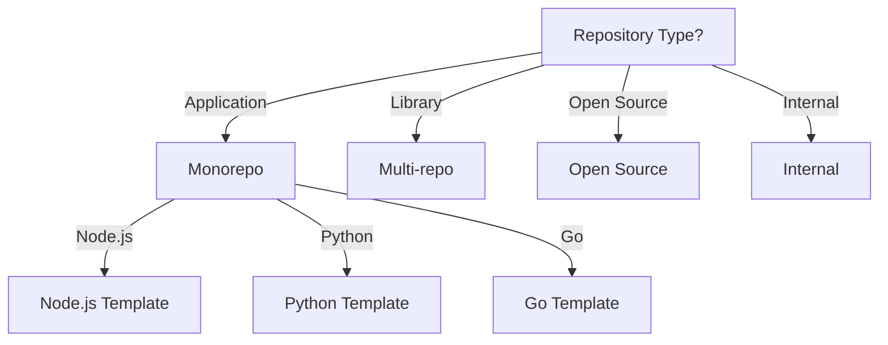

# Repo Bootstrap

Generates a standardized initial repository structure.

## When to Use

### Use when:
- Initializing a new repository
- Standardizing an existing structure
- Creating a project template
- Onboarding new projects

### Do not use when:
- Repository already exists and is standardized
- Project does not require documentation

### Related Skills:
- `governance` — for team processes
- `documentation` — for documentation standards
- `git` — for .gitignore

## Decision Tree


```mermaid
graph TD
    A[Repository Type?] -->|Application| B[Monorepo]
    A -->|Library| C[Multi-repo]
    A -->|Open Source| D[Open Source]
    A -->|Internal| E[Internal]
    B -->|Node.js| F[Node.js Template]
    B -->|Python| G[Python Template]
    B -->|Go| H[Go Template]
```

## Workflow

### Phase 1: Create Repository from Scratch

1. Create structure:
   ```bash
   mkdir -p docs/{adr,api,architecture}
   mkdir -p .github/workflows
   ```
2. Copy templates:
   ```bash
   cp templates/README.md README.md
   cp templates/CONTRIBUTING.md CONTRIBUTING.md
   cp templates/SECURITY.md SECURITY.md
   cp templates/ci.yml .github/workflows/ci.yml
   cp templates/AGENTS.md AGENTS.md
   ```
3. Create files:
   ```bash
   touch CHANGELOG.md
   touch LICENSE
   ```
4. **Checkpoint**: Structure created, git init

### Phase 2: Add Governance to Existing Repository

1. Verify current structure:
   ```bash
   ls -la
   ```
2. Add missing files:
   ```bash
   # For each missing file
   cp templates/{file} ./{file}
   ```
3. Update README:
   ```bash
   # Add badges, links
   ```
4. **Checkpoint**: Governance added

### Phase 3: Configure CI/CD

1. Create workflow:
   ```bash
   mkdir -p .github/workflows
   cp templates/ci.yml .github/workflows/ci.yml
   ```
2. Configure secrets:
   ```bash
   # NPM_TOKEN, DOCKER_PASSWORD, etc.
   ```
3. Enable branch protection:
   ```bash
   # Settings > Branches > Add rule
   ```
4. **Checkpoint**: CI/CD functioning

## Key Concepts

### Generated Structure

```
repo/
├── README.md
├── AGENTS.md
├── CHANGELOG.md
├── CONTRIBUTING.md
├── CODE_OF_CONDUCT.md
├── SECURITY.md
├── LICENSE
├── .github/
│   └── workflows/
│       └── ci.yml
├── docs/
│   ├── architecture/
│   ├── adr/
│   └── decisions/
└── src/
```

### Generated Files

#### README.md
- Project description
- Installation
- Basic usage
- Contributing guidelines

#### AGENTS.md
- Agent instructions
- Code standards
- Important commands

#### CHANGELOG.md
- Keep a Changelog format
- Sections: Added, Changed, etc.

## Templates

### README.md
Location: `templates/README.md`

Template for project README.

**Usage:**
```bash
cp templates/README.md README.md
```

### CONTRIBUTING.md
Location: `templates/CONTRIBUTING.md`

Template for contributing guidelines.

**Usage:**
```bash
cp templates/CONTRIBUTING.md CONTRIBUTING.md
```

### SECURITY.md
Location: `templates/SECURITY.md`

Security policy.

**Usage:**
```bash
cp templates/SECURITY.md SECURITY.md
```

### ci.yml
Location: `templates/ci.yml`

CI/CD workflow.

**Usage:**
```bash
cp templates/ci.yml .github/workflows/ci.yml
```

### AGENTS.md
Location: `templates/AGENTS.md`

Agent instructions.

**Usage:**
```bash
cp templates/AGENTS.md AGENTS.md
```

## Anti-patterns

### Critical

#### Repository without LICENSE
**What is it:** Repository without a license file.
**Why is it bad:** Unauthorized use, legal issues.
**How to avoid:** Always include a LICENSE file.
**Example:**
```
# ❌ WRONG
# Repository without LICENSE

# ✅ CORRECT
# MIT License in LICENSE file
```

#### Repository without .gitignore
**What is it:** Repository without a .gitignore file.
**Why is it bad:** Sensitive files committed, repository dirty.
**How to avoid:** Use gitignore.io or template.
**Example:**
```
# ❌ WRONG
# .env committed

# ✅ CORRECT
# .gitignore includes .env, node_modules, etc.
```

### Medium

#### Repository without CI
**What is it:** Repository without CI configured.
**Why is it bad:** Bugs in production, quality not verified.
**How to avoid:** Always configure CI.
**Example:**
```
# ❌ WRONG
# Push directly to main

# ✅ CORRECT
# CI verifies lint, tests, build
```

### Low

#### Repository without Badges
**What is it:** README without status badges.
**Why is it bad:** Users do not know the status.
**How to avoid:** Add standard badges.
**Example:**
```markdown


```

## Checklists

### Repository Completeness Checklist
- [ ] README.md present
- [ ] LICENSE present
- [ ] .gitignore configured
- [ ] CI/CD configured
- [ ] AGENTS.md present
- [ ] CONTRIBUTING.md present
- [ ] SECURITY.md present

### CI Pipeline Checklist
- [ ] Lint passes
- [ ] Tests pass
- [ ] Build functions
- [ ] Coverage reported
- [ ] Security scan

### Security Basics Checklist
- [ ] .env in .gitignore
- [ ] Secrets configured
- [ ] LICENSE included
- [ ] SECURITY.md present

## Edge Cases

### Fork of External Project
**Situation:** Fork of project without standardized structure.
**Solution:** Maintain compatibility, add AGENTS.md.
**Exception:** If fork is entirely new, restructure.

```bash
# Maintain original structure
# Add AGENTS.md for agents
```

### Monorepo with Multiple Languages
**Situation:** Monorepo with Node.js, Python, Go.
**Solution:** Structure by service, CI multi-stage.
**Exception:** If monolito is small, unify.

```
packages/
├── api/     # Node.js
├── ml/      # Python
└── cli/     # Go
```

## References

- `governance` — for team processes
- `documentation` — for documentation standards
- `git` — for .gitignore

## Domain SOTA & Industry Engineering Standards

- **6-Pillar Repository Governance:** `README.md`, `USAGE.md`, `CHANGELOG.md`, `CONTRIBUTING.md`, `CODE_OF_CONDUCT.md`, `SECURITY.md`, and `LICENSE`.
- **Agent Governance Standard:** Canonical `AGENTS.md` and `GEMINI.md` anchoring Single Source of Truth (SSOT).
- **CI/CD & Automation Scaffolding:** GitHub Actions workflows for automated linting, testing, and multi-runtime skill deployment.
- **Git Hooks Automation:** Husky / standalone `.git/hooks/` pre-commit and post-commit verification scripts.

### Repository Governance File Hierarchy:

```text
.
├── AGENTS.md                 # SSOT Governance rules for AI coding agents
├── README.md                 # Project elevator pitch & overview
├── USAGE.md                  # Comprehensive developer & agent usage guide
├── CHANGELOG.md              # Keep a Changelog (v1.1.0) release ledger
├── CONTRIBUTING.md           # Contribution guidelines & PR etiquette
├── CODE_OF_CONDUCT.md       # Contributor Covenant Code of Conduct
├── SECURITY.md               # Vulnerability reporting & security policy
└── LICENSE                   # Open-source license (MIT/Apache-2.0)
```

### Exhaustive Heuristic Decision Rules:
1. **Rule of Thumb 1 (SSOT Governance Invariant):** Every repository must contain an `AGENTS.md` specifying canonical tool use, architecture, and constraints.
2. **Rule of Thumb 2 (Security Policy Mandate):** Provide a clear `SECURITY.md` with private vulnerability disclosure instructions before public release.
3. **Rule of Thumb 3 (Deterministic Bootstrap Script):** Provide a single bootstrap command (`./scripts/bootstrap.sh` or `npm run setup`) that installs all dependencies and hooks.
4. **Rule of Thumb 4 (Consistent License):** Explicitly declare the open-source license in both `LICENSE` and `README.md`.

## Completion Gate

A tarefa associada à skill `repo-bootstrap` só pode ser declarada concluída quando:
1. Todas as verificações do checklist operacional foram atendidas.
2. O resultado foi validado deterministamente através de evidências de execução.
3. Não restam pendências estruturais, placeholders ou erros não tratados.

