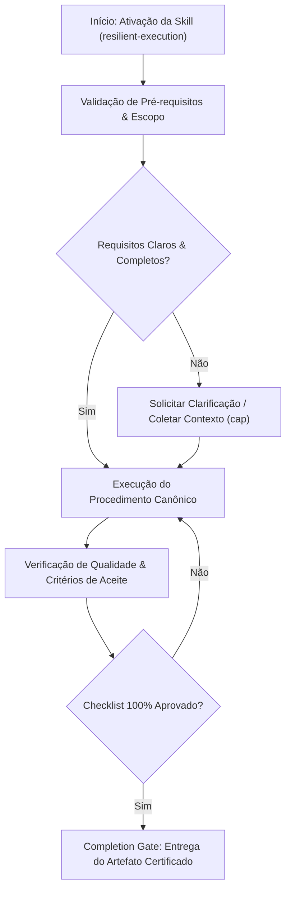

# Resilient Execution

## When to Use

### Use when:
- Executing distributed agent tasks subject to network latency, rate limits, or transient timeouts
- Wrapping unreliable external API calls and database connections with circuit breakers
- Implementing exponential backoff with full jitter and fallback degradation

### Do not use when:
- Purely deterministic local synchronous operations without network I/O

## Anti-patterns

### 🔴 Critical
- **Unbounded Retry Storms:** Retrying failed calls in a tight loop without exponential backoff or jitter.
- **Silent Exception Swallowing:** Catching errors without logging telemetry context or metrics.

### 🟡 Medium
- **Missing Fallback Degradation:** Crashing the application when a non-essential peripheral service fails.

## Completion Gate & Verification
Before declaring resilient execution configured:
- [ ] Circuit breaker threshold configured with half-open probe recovery
- [ ] Exponential backoff with jitter implemented
- [ ] Structured telemetry logs emitted for all retry attempts

## Overview

The resilient-execution skill prevents premature failure by enforcing a minimum of 3 genuinely different approaches before escalating to the user. It provides a structured error classification system, an approach cascade methodology, and transparent logging of each attempt. Without this skill, agents give up too early — with it, they systematically exhaust alternatives and only escalate with full evidence.

**Announce at start:** "I'm using the resilient-execution skill — I will try multiple approaches before escalating."

---

## Phase 1: Error Classification

When an approach fails, immediately classify the error before retrying:

| Error Type | Definition | Indicators | Correct Response |
|-----------|-----------|------------|-----------------|
| **Transient** | Temporary infrastructure failure | Network timeout, rate limit, 503 error, lock contention | Wait briefly, retry the same approach |
| **Environmental** | Missing or misconfigured dependency | Module not found, wrong version, missing env var, permission denied | Fix the environment, then retry same approach |
| **Logical** | Wrong approach or incorrect assumption | Wrong output, unexpected behavior, type mismatch, wrong API usage | Rethink the approach entirely |
| **Fundamental** | Genuinely impossible with available tools | API does not exist, hardware limitation, missing capability | Escalate to user with evidence |

<HARD-GATE>
You MUST try at least 3 different approaches before telling the user something cannot be done. "I tried and it didn't work" is not acceptable without evidence of 3 genuine attempts with meaningfully different strategies.
</HARD-GATE>

> **STOP: Classify the error before choosing your next approach. Wrong classification leads to wasted retries.**

---

## Phase 2: Approach Cascade

Execute the cascade systematically. Each attempt must be a genuinely different strategy.

```
Attempt 1: Primary approach (most direct solution)
    | fails
    v
Classify error -> Can same approach work with a fix?
    | YES -> Fix and retry (does NOT count as a new attempt)
    | NO  -> Proceed to Attempt 2
    v
Attempt 2: Alternative approach 1 (different technique)
    | fails
    v
Classify error -> Is this fundamentally blocked?
    | YES -> Proceed directly to escalation
    | NO  -> Proceed to Attempt 3
    v
Attempt 3: Alternative approach 2 (different path entirely)
    | fails
    v
Circuit breaker -> Present findings to user with full evidence
```

### For Each Attempt, Log:

```markdown
### Attempt N: [Approach Name]
**Strategy:** [what makes this different from previous attempts]
**What I tried:** [specific description with commands/code]
**What happened:** [exact error or unexpected result]
**Why it failed:** [root cause analysis]
**Classification:** [Transient / Environmental / Logical / Fundamental]
**What to try next:** [reasoning for next approach]
```

> **STOP: Log every attempt before moving to the next. Do NOT skip logging — it is evidence for the escalation report.**

---

## Phase 3: Alternative Approach Selection

When the primary approach fails, select the next approach using this decision table:

| Failure Type | Strategy 1 | Strategy 2 | Strategy 3 |
|-------------|-----------|-----------|-----------|
| Library/API does not work | Different library | Direct implementation (no library) | Shell command / external tool |
| Algorithm produces wrong result | Different algorithm | Decompose into smaller steps | Simplify constraints, solve easier version |
| Permission/access denied | Different access method | Escalate with manual steps | Work around via alternative path |
| Tool limitation | Different tool | Combine multiple tools | Provide manual instructions |
| Integration failure | Mock the dependency | Use alternative interface | Isolate and test components separately |
| Performance issue | Different data structure | Batch/stream processing | Approximate solution |

### Alternative Strategy Hierarchy

Try these in order of preference:

1. **Different tool** — use a different library, API, or command
2. **Different algorithm** — solve the same problem a different way
3. **Decompose** — break the problem into smaller, solvable parts
4. **Simplify** — remove constraints and solve a simpler version first
5. **Work around** — achieve the goal through a different path entirely
6. **Manual steps** — provide clear instructions the user can follow themselves

---

## Phase 4: Escalation Report

After 3 genuine attempts with different approaches, produce this report:

```markdown
## Execution Report

I tried 3 different approaches to [goal]:

### Attempt 1: [Approach Name]
**Strategy:** [description]
**Result:** Failed because [specific reason]
**Error:** [exact error message or unexpected output]

### Attempt 2: [Approach Name]
**Strategy:** [description]
**Result:** Failed because [specific reason]
**Error:** [exact error message or unexpected output]

### Attempt 3: [Approach Name]
**Strategy:** [description]
**Result:** Failed because [specific reason]
**Error:** [exact error message or unexpected output]

### Root Cause Analysis
[Why all three approaches failed — identify the common blocker]

### Recommended Next Steps
- **Option A:** [what the user could try]
- **Option B:** [alternative path]
- **Option C:** [if applicable]

### What I Need From You to Proceed
[Specific ask — access, information, permission, or decision]
```

> **STOP: Do NOT escalate without this report. The user needs evidence that 3 genuine attempts were made.**

---

## Decision Table: When Retries Count as "Genuine"

| Counts as Genuine Attempt | Does NOT Count |
|--------------------------|---------------|
| Different library or tool | Same library with different import |
| Different algorithm or data structure | Same algorithm with tweaked parameters |
| Different architectural approach | Same approach with minor code changes |
| Manual workaround vs automated | Same automation with retry loop |
| Breaking problem into sub-problems | Same monolithic approach with logging added |
| Using an entirely different API | Same API with different authentication method (unless auth was the error) |

---

## Anti-Patterns / Common Mistakes

| What NOT to Do | Why It Fails | What to Do Instead |
|----------------|-------------|-------------------|
| Retry the same approach 3 times and call it "3 attempts" | Same approach = same failure. Not genuine alternatives. | Each attempt must use a meaningfully different strategy |
| Give up after 1 failure | Misses 2+ viable approaches | Always try at least 3 genuinely different approaches |
| Skip error classification | Without classification, you retry wrong things | Classify BEFORE choosing next approach |
| Hide failed attempts from the user | User cannot help without context | Log and report every attempt transparently |
| Escalate without trying manual workaround | Many things that fail in automation work manually | Always consider manual steps as Approach 3 |
| Blame the platform without investigation | "Platform limitation" is often wrong | Search for workarounds before declaring impossible |
| Fix environment issues and count as new attempt | Fixing env + retrying same approach is 1 attempt | Only count genuinely different strategies |
| Skip logging intermediate attempts | Loses evidence trail, cannot produce escalation report | Log every attempt immediately |

---

## Anti-Rationalization Guards

| Thought | Reality |
|---------|---------|
| "This genuinely cannot be done" | Have you tried 3 different approaches? Probably not. |
| "The error is clear, I know what is wrong" | Clear errors can have hidden root causes. Investigate. |
| "I have already tried everything" | List what you tried. There are always more options. |
| "The user should fix this themselves" | Provide a manual path, but try 3 approaches first. |
| "This is a platform limitation" | Limitations often have workarounds. Search for them. |
| "The same error keeps happening" | Same error with different approaches = different root cause. Classify. |
| "This is taking too long" | Giving up takes longer when the user has to start over. |
| "A simpler version would not be useful" | A working simple version beats a broken complex one. |

> **Do NOT escalate without 3 genuine attempts. Period.**

---

## Integration Points

| Skill | Relationship |
|-------|-------------|
| `circuit-breaker` | Activated after resilient-execution exhausts retries at the loop level |
| `task-management` | Invokes resilient-execution when a task step fails |
| `self-learning` | Records failure patterns to avoid repeating them in future sessions |
| `planning` | Uses failure history to choose more robust approaches |
| `auto-improvement` | Tracks retry success rates and approach effectiveness |
| `verification-before-completion` | Invokes resilient-execution if verification fails |

---

## Concrete Examples

### Example: File Parsing Failure
```
Attempt 1: JSON.parse() on the file
  Result: SyntaxError — file contains comments (JSONC format)
  Classification: Logical — wrong parser for this format

Attempt 2: Strip comments with regex, then JSON.parse()
  Result: Failed — nested block comments not handled
  Classification: Logical — regex too simple for comment stripping

Attempt 3: Use `jsonc-parser` library (handles JSONC natively)
  Result: Success — file parsed correctly
```

### Example: API Integration Failure
```
Attempt 1: Direct HTTP request to API endpoint
  Result: 403 Forbidden — authentication required
  Classification: Environmental — missing auth config

  Fix: Add API key from .env
  Result: 429 Too Many Requests — rate limited
  Classification: Transient — wait and retry
  Result: 200 OK but response format changed from docs
  Classification: Logical — API version mismatch

Attempt 2: Use official SDK instead of raw HTTP
  Result: SDK throws "unsupported region" error
  Classification: Environmental — region config needed

Attempt 3: Use GraphQL endpoint instead of REST
  Result: Success — GraphQL endpoint supports all regions
```

---

## Key Principles

- **Never give up silently** — always show what was tried
- **Genuine alternatives** — each attempt must be a meaningfully different approach, not the same thing with minor tweaks
- **Root cause analysis** — understand WHY before trying the next approach
- **Learn from failure** — update memory with what did not work and why
- **Transparent** — show the user your reasoning at each step
- **Classify first** — error type determines whether to retry same approach or try a new one

---

## Skill Type

**RIGID** — The 3-attempt minimum is a HARD-GATE. Error classification is mandatory before each retry. The escalation report format must be followed exactly. Do not relax these requirements regardless of perceived simplicity.


## Decision Workflow




## Anti-Patterns & Operational Guardrails

| Anti-Pattern | Severidade | Impacto Negativo | Mitigação Canônica |
|:---|:---:|:---|:---|
| **Premature Execution Without Context** | 🔴 Critical | Context hallucination and destructive refactoring | Activate `cap` to acquire minimal evidence before editing. |
| **Omission of Validation Checklists** | 🟡 Medium | Delivering artifacts with syntax inconsistencies | Rigorously execute the checklist step-by-step before handoff. |
| **Falta de Documentação de Decisões** | 🟢 Low | Perda de rastreabilidade técnica e drift arquitetural | Registrar trade-offs relevantes via skill `adr-generator`. |


## Edge Cases & Failure Modes

- **Restricted / Read-Only Environment:** If the filesystem or sandbox is write-locked, report the constraint immediately with evidence and generate changes as a markdown diff patch.
- **Specification Conflict:** If contradictions emerge between user intent and the SSOT (`AGENTS.md`), halt and present trade-off options.
- **Context Exhaustion / Timeout:** For massive tasks, decompose into atomic sub-batches utilizing `subagent-driven-development`.


## Domain SOTA & Industry Engineering Standards

- **Fault Tolerance Patterns:** Graceful Degradation, Bulkhead Isolation, Retry with Budgeting, and Self-Healing Systems.
- **Idempotency Standards:** RFC 7231 safe methods and cryptographic idempotency key generation.
- **Disaster Recovery:** Automated Rollback Vectors and State Checkpoint Hydration.
- **Chaos Engineering:** Antifragile validation under synthetic failure injection.

### Degradation Ladder (4 Tiers):
1. **Tier 1 (Optimal):** Full live execution with external model inference and active tooling.
2. **Tier 2 (Cached/RAG Fallback):** Local SQLite RAG semantic search when external LLM endpoints are degraded.
3. **Tier 3 (Rule-Based Static Fallback):** Deterministic heuristic rules when semantic models are unavailable.
4. **Tier 4 (Safe Refusal):** Fast-fail with structured error diagnostic when data corruption risk is detected.

### Exhaustive Heuristic Decision Rules:
- **Rule of Thumb 1 (Zero-Trust Architectural Boundaries):** Treat all external inputs, third-party payloads, and cross-module boundaries with strict zero-trust schema validation.
- **Rule of Thumb 2 (Fail-Fast & Deterministic Errors):** Reject invalid states immediately with typed, actionable error contracts rather than cascading silent failures.
- **Rule of Thumb 3 (Idempotency & AST Preservation):** State mutations and code transformations must maintain semantic idempotency across repeated executions.
- **Rule of Thumb 4 (Benchmark & Telemetry Alignment):** Measure critical execution latency ($P_{95}$) and memory overhead with structured telemetry and baseline benchmarks.
- **Rule of Thumb 5 (Event-Driven & Circuit Breaker Decoupling):** Isolate asynchronous operations behind circuit breakers and resilient retry mechanisms to prevent cascading failure.
- **Rule of Thumb 6 (Contract-First DDD Modeling):** Define clear domain aggregates, value objects, and typed interface contracts before implementing concrete logic.
- **Rule of Thumb 7 (RAG & Semantic Retrieval Precision):** Optimize context retrieval with hybrid lexical-vector search and reciprocal rank fusion to eliminate hallucinated routing.
- **Rule of Thumb 8 (OWASP & Supply Chain Verification):** Verify dependencies and data flows against OWASP Top 10 and SLSA Level 3 supply chain security standards.
- **Rule of Thumb 9 (Verification Gate Invariant):** Never declare completion without automated test execution evidence and zero compiler/linter warnings.
## Operational Verification Checklist

- [ ] All prerequisites and target files inspected before modification.
- [ ] Procedure strictly adheres to specialization rules and best practices.
- [ ] Security, typing, and architectural style guidelines preserved.
- [ ] Unit tests or validation commands executed successfully.
- [ ] Final deliverable verified against the completion gate.

