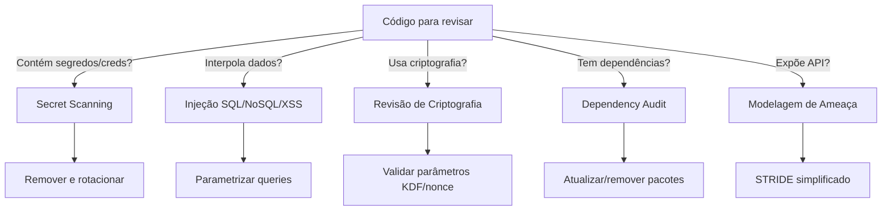

# Security Review

Realiza revisões de segurança abrangentes em código, focando em vulnerabilidades reais e práticas seguras.

## Quando Usar

### Use quando:
- Revisando código novo antes de merge
- Auditando dependências por CVEs conhecidos
- Validando implementações de criptografia (AES-GCM, scrypt, BIP39)
- Investigando potenciais vazamento de secrets
- Preparando release de aplicação sensível
- Verificando conformidade com OWASP Top 10

### Não use quando:
- Bug fix trivial sem impacto de segurança
- Refatoração puramente estética
- Documentação ou README
- Apenas testes unitários (use `testing`)

### Skills relacionadas:
- `governance` — processos de aprovação e branching
- `architecture-review-kilo` — revisão de design e padrões
- `testing` — validação funcional

## Decision Tree



## Conceitos Fundamentais

### Threat Categories (OWASP Top 10 2021)

| Categoria | Descrição | Onde procurar |
|-----------|-----------|---------------|
| A01: Broken Access Control | Controle de acesso inadequado | Endpoints, middleware, rotas |
| A02: Cryptographic Failures | Erros de criptografia | Chaves, nonces, algoritmos |
| A03: Injection | Injeção de código | Queries, templates, eval |
| A04: Insecure Design | Design inseguro | Arquitetura, fluxos |
| A05: Security Misconfiguration | Configuração incorreta | .env, headers, CORS |
| A06: Vulnerable Components | Componentes vulneráveis | package.json, lock files |
| A07: Auth Failures | Falhas de autenticação | Login, sessões, tokens |

### Criptografia — Parâmetros Críticos

**AES-GCM:**
- Nonce: 12 bytes, NUNCA reutilizado para a mesma chave
- Tag: 16 bytes (autenticação)
- Key: 256 bits para AES-256

**scrypt (KDF):**
- N (CPU/memory cost): ≥16384 (2^14)
- r (block size): ≥8
- p (parallelization): ≥1
- Salt: ≥16 bytes aleatórios

**BIP39 (mnemonic):**
- Entropy: 128-256 bits
- Wordlist: inglês ou português (não misturar)
- PBKDF2 com ≥2048 iterações

## Workflow

### Workflow 1: Secret Scanning

**Objetivo:** Detectar credenciais, chaves e segredos expostos no código.

1. Buscar padrões de secrets:
   - API keys: `sk_live_`, `pk_live_`, `AKIA`, `ghp_`
   - Passwords: `password =`, `passwd =`, `secret =`
   - Tokens: `bearer `, `token =`, `jwt `
2. Verificar arquivos `.env` e `.env.*`
3. Verificar `.gitignore` cobre arquivos sensíveis
4. Verificar se testes usam valores hardcoded
5. Verificar logs por dados sensíveis (PII, tokens)
6. **Checkpoint**: Nenhum secret encontrado ou todos são placeholders

### Workflow 2: Revisão de Dependências

**Objetivo:** Identificar dependências com vulnerabilidades conhecidas.

1. Executar `npm audit` / `yarn audit` / `pip audit` / `cargo audit`
2. Verificar CVEs em dependências diretas
3. Verificar dependências transitivas
4. Avaliar se dependências abandonadas
5. Verificar licenças (GPL em código proprietário)
6. **Checkpoint**: Zero vulnerabilidades críticas, <5 warnings

### Workflow 3: Validação de Criptografia

**Objetivo:** Garantir implementações criptográficas corretas.

1. Verificar algoritmos usados (não MD5, SHA1 para hashes de senha)
2. Validar parâmetros AES-GCM (nonce, tag, key size)
3. Validar parâmetros scrypt/KDF (N, r, p, salt)
4. Verificar se chaves estão hardcoded
5. Verificar se nonce é reutilizado
6. Verificar timing attacks em comparações
7. **Checkpoint**: Parâmetros criptográficos válidos

### Workflow 4: Modelagem de Ameaça Leve

**Objetivo:** Identificar vetores de ataque para endpoints e fluxos.

1. Listar endpoints/expostos
2. Para cada endpoint, aplicar STRIDE simplificado:
   - **S**poofing: Autenticação Adequada?
   - **T**ampering: Integridade Protegida?
   - **R**epudiation: Audit Trail?
   - **I**nformation Disclosure: Dados Sensíveis Expostos?
   - **D**enial of Service: Rate Limiting?
   - **E**levation of Privilege: Controle de Acesso?
3. Classificar risco (Crítico/Médio/Baixo)
4. **Checkpoint**: Todos os endpoints avaliados

### Workflow 5: Relatório de Vulnerabilidade

**Objetivo:** Documentar achados de forma acionável.

1. Para cada vulnerabilidade encontrada:
   - Título descritivo
   - Severidade (🔴 Crítico, 🟡 Médio, 🟢 Baixo)
   - Localização exata (arquivo + linha)
   - Descrição do impacto
   - PoC ou código vulnerável
   - Recomendação de correção
   - Referência (CWE, OWASP, CVE)
2. Classificar por severidade
3. **Checkpoint**: Relatório completo e acionável

## Templates

### security-checklist.md
Localização: `templates/security-checklist.md`

Checklist abrangente de segurança para revisão de código. Cobere secrets, dependências, criptografia, autenticação, autorização e validação de entrada.

### threat-model.md
Localização: `templates/threat-model.md`

Modelo de ameaça simplificado baseado em STRIDE. Listar endpoints, aplicar categorias, classificar risco.

### vulnerability-report.md
Localização: `templates/vulnerability-report.md`

Template para relatório de vulnerabilidade com severidade, localização, impacto e recomendação.

## Anti-patterns

### 🔴 Crítico

#### Nonce Reuso em AES-GCM
**O que é:** Usar o mesmo nonce para criptografar diferentes mensagens com a mesma chave.
**Por que é ruim:** Permite recuperação da chave via XOR das streams de cifra.
**Como evitar:** Gerar nonce aleatório de 12 bytes para cada operação; armazenar com o ciphertext.
**Exemplo:**
```
# ❌ ERRADO
const nonce = Buffer.from('fixed-nonce-12'); // sempre igual
cipher.update(data, 'utf8', 'hex', nonce);

# ✅ CORRETO
const nonce = crypto.randomBytes(12); // único por operação
cipher.update(data, 'utf8', 'hex', nonce);
```

#### KDF com Parâmetros Fracos
**O que é:** Usar scrypt/bcrypt com parâmetros abaixo do recomendado.
**Por que é ruim:** Torna o brute-force viável com hardware moderno.
**Como evitar:** scrypt N≥16384, r≥8, p≥1; bcrypt work factor≥12.
**Exemplo:**
```
# ❌ ERRADO
scrypt.sync(password, salt, { N: 1024, r: 1, p: 1 });

# ✅ CORRETO
scrypt.sync(password, salt, { N: 16384, r: 8, p: 1 });
```

#### Timing Attack em Comparações
**O que é:** Comparar tokens com `===` que faz curto-circuito no primeiro byte diferente.
**Por que é ruim:** Permite inferir o valor correto byte a byte.
**Como evitar:** Usar `crypto.timingSafeEqual()` para comparações de tokens.

### 🟡 Médio

#### Hardcoded Secrets em Testes
**O que é:** Colocar chaves reais em arquivos de teste.
**Por que é ruim:** Pode vazar para repositórios públicos.
**Como evitar:** Usar variáveis de ambiente ou mocks.

#### `.env` Commitado sem `.gitignore`
**O que é:** Arquivo .env com credenciais reais no version control.
**Por que é ruim:** Histórico do git preserva credenciais mesmo após remoção.
**Como evitar:** Adicionar `.env*` ao `.gitignore`; usar `.env.example` sem valores.

### 🟢 Baixo

#### Logs com Dados Sensíveis
**O que é:** Logar PII, tokens ou senhas em logs de produção.
**Por que é ruim:** Violação de privacidade e compliance (LGPD, GDPR).
**Como evitar:** Máscarar dados sensíveis antes de logar.

## Checklists

### Checklist de Revisão de Segurança
Localização: `checklists/security-review.md`

Executar antes de merge de código com impacto de segurança. Valida secrets, dependências, criptografia, autenticação e validação de entrada.

## Edge Cases

### Biblioteca de Criptografia Descontinuada
**Situação:** Projeto usa biblioteca de criptografia que não recebe atualizações.
**Solução:** Migrar para alternativa maintida (ex: `crypto` nativo do Node.js).
**Exceção:** Se a biblioteca é battle-tested e o uso é limitado, documentar risco aceito.

### Dependência com CVE em Dependência Transitiva
**Situação:** `npm audit` reporta CVE em pacote que é dependência de dependência.
**Solução:** Verificar se o código afetado é realmente usado; se sim, atualizar ou fazer override.
**Exceção:** Se o CVE afeta feature não utilizada, documentar e marcar como aceito.

### Aplicação com Múltiplos Algoritmos de Hash
**Situação:** Código usa SHA-256 para uma coisa e bcrypt para outra.
**Solução:** Verificar se cada algoritmo é adequado para seu caso de uso (não usar hash genérico para senhas).
**Exceção:** SHA-256 para checksums de integridade é aceitável.

### Secret em Variável de Ambiente mas Não em `.env.example`
**Situação:** Código lê de `process.env.API_KEY` mas `.env.example` não lista essa variável.
**Solução:** Adicionar ao `.env.example` com valor placeholder; documentar no README.
**Exceção:** Nenhuma — toda variável de ambiente deve estar documentada.

## Referências

- [OWASP Top 10 2021](https://owasp.org/Top10/)
- [CWE/SANS Top 25](https://cwe.mitre.org/top25/)
- [Node.js Crypto](https://nodejs.org/api/crypto.html)
- [Skill governance](../governance/SKILL.md)
- [Skill architecture-review-kilo](../architecture-review-kilo/SKILL.md)
- [Skill testing](../testing/SKILL.md)
