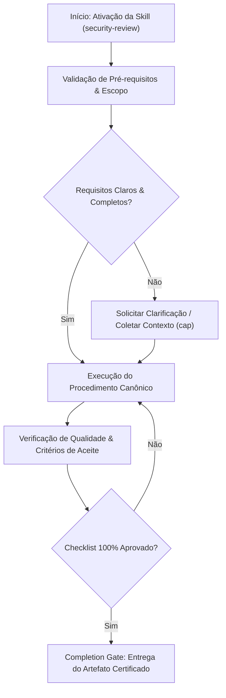

# Security Review

## When to Use

### Use when:
- Auditing source code and infrastructure for vulnerabilities against OWASP Top 10
- Conducting STRIDE threat modeling on new features, services, or APIs
- Verifying cryptographic configurations, input sanitization, and authorization rules

### Do not use when:
- Routine non-security stylistic code formatting reviews

## Overview

Systematically review code for security vulnerabilities, apply secure coding patterns, and ensure applications follow defense-in-depth principles. This skill covers the OWASP Top 10, authentication pattern selection, input validation, secrets management, dependency auditing, security headers, and threat modeling.

**Announce at start:** "I'm using the security-review skill to assess security posture."

---

## Phase 1: Scope and Threat Assessment

**Goal:** Identify the attack surface and prioritize review areas.

### Actions

1. Identify all user-facing endpoints and input surfaces
2. Map authentication and authorization boundaries
3. List external dependencies and their trust levels
4. Identify sensitive data flows (PII, credentials, payment)
5. Determine compliance requirements (SOC 2, GDPR, HIPAA)

### STOP — Do NOT proceed to Phase 2 until:
- [ ] Attack surface is mapped
- [ ] Sensitive data flows are identified
- [ ] Compliance requirements are known

---

## Phase 2: OWASP Top 10 Audit

**Goal:** Systematically check against each OWASP category.

### OWASP Top 10 Checklist (2021)

| # | Category | Key Check | Pass/Fail |
|---|----------|-----------|-----------|
| 1 | **Broken Access Control** | Authorization verified on every endpoint, deny by default | |
| 2 | **Cryptographic Failures** | No plaintext secrets, strong algorithms (AES-256, bcrypt) | |
| 3 | **Injection** | Parameterized queries, no string concatenation for SQL/commands | |
| 4 | **Insecure Design** | Threat model exists, rate limiting, abuse cases considered | |
| 5 | **Security Misconfiguration** | No defaults in production, minimal permissions, error messages leak nothing | |
| 6 | **Vulnerable Components** | Dependencies audited, no known CVEs, update policy in place | |
| 7 | **Auth Failures** | MFA available, passwords hashed, session management secure | |
| 8 | **Data Integrity Failures** | Verify signatures, validate CI/CD pipeline integrity | |
| 9 | **Logging Failures** | Log auth events, access control failures, input validation failures | |
| 10 | **SSRF** | Validate/allowlist URLs, no internal network access from user input | |

### STOP — Do NOT proceed to Phase 3 until:
- [ ] All 10 categories are checked
- [ ] Findings are documented with severity

---

## Phase 3: Deep Review by Category

**Goal:** Apply detailed security patterns to identified issues.

### Auth Pattern Selection Table

| Pattern | Use When | Key Requirements |
|---------|----------|-----------------|
| **JWT** | Stateless APIs, microservices, mobile backends | RS256 for multi-service; access token 15min max; HttpOnly cookies |
| **Session-based** | Traditional web apps, server-rendered pages | Server-side storage; HttpOnly + Secure + SameSite cookies; CSRF tokens |
| **OAuth2/OIDC** | Third-party login, SSO, delegated auth | Authorization Code + PKCE; validate ID token claims; server-side token storage |
| **Passkeys/WebAuthn** | Passwordless, high-security apps | Phishing-resistant; store public keys only; support multiple per account |

### JWT Security Checklist

| Aspect | Guidance |
|--------|----------|
| Signing | RS256 (asymmetric) for multi-service, HS256 for single service |
| Expiry | Access token: 15 minutes max. Refresh token: 7 days max |
| Storage | HttpOnly cookie (web) or secure storage (mobile). Never localStorage |
| Refresh | Rotate refresh tokens on use, invalidate on logout |
| Payload | Minimal claims (sub, exp, iat, roles). No sensitive data |

### Input Validation Patterns

**Allow-List Validation** (always prefer over block-list):
```python
# Good: allow-list
ALLOWED_SORT_FIELDS = {'name', 'created_at', 'price'}
if sort_field not in ALLOWED_SORT_FIELDS:
    raise ValidationError("Invalid sort field")

# Bad: block-list (always incomplete)
BLOCKED_CHARS = ['<', '>', '"']
```

**Parameterized Queries** (never concatenate user input):
```python
# Good: parameterized
cursor.execute("SELECT * FROM users WHERE id = %s", (user_id,))

# Bad: SQL injection vulnerability
cursor.execute(f"SELECT * FROM users WHERE id = {user_id}")
```

### File Upload Validation

- Validate MIME type server-side (not just extension)
- Enforce file size limits
- Generate random filenames (never use user-supplied names)
- Store uploads outside the web root
- Scan for malware if accepting from untrusted users

### STOP — Do NOT proceed to Phase 4 until:
- [ ] All identified issues have remediation recommendations
- [ ] Auth patterns are correctly applied
- [ ] Input validation is comprehensive

---

## Phase 4: Infrastructure and Dependency Hardening

**Goal:** Secure the deployment environment and supply chain.

### Secrets Management Rules

| Environment | Method |
|-------------|--------|
| Development | `.env` files (git-ignored) |
| CI/CD | Pipeline secrets (GitHub Secrets, GitLab CI vars) |
| Production | Secrets manager (AWS Secrets Manager, Vault, GCP Secret Manager) |

### Secrets Never List

- Never hard-code secrets in source code
- Never commit `.env` files to git
- Never log secrets (even at debug level)
- Never pass secrets as command-line arguments
- Never use the same secrets across environments

### Dependency Auditing Commands

```bash
# Node.js
npm audit
npx socket-security audit

# Python
pip-audit
safety check

# Go
govulncheck ./...

# Rust
cargo audit
```

### Security Headers

| Header | Value | Purpose |
|--------|-------|---------|
| `Content-Security-Policy` | `default-src 'self'` (customize per app) | Prevents XSS, data injection |
| `Strict-Transport-Security` | `max-age=63072000; includeSubDomains` | Forces HTTPS |
| `X-Content-Type-Options` | `nosniff` | Prevents MIME sniffing |
| `X-Frame-Options` | `DENY` or `SAMEORIGIN` | Prevents clickjacking |
| `Referrer-Policy` | `strict-origin-when-cross-origin` | Controls referer leakage |
| `Permissions-Policy` | Disable unused APIs | Limits browser feature access |

### CORS Rules

- Never use `Access-Control-Allow-Origin: *` with credentials
- Allowlist specific origins
- Restrict allowed methods and headers to what is needed

---

## Phase 5: Threat Modeling (STRIDE)

**Goal:** For new features or significant changes, walk through each threat category.

| Threat | Question | Mitigation |
|--------|----------|-----------|
| **Spoofing** | Can an attacker pretend to be someone else? | Strong authentication, MFA |
| **Tampering** | Can data be modified without detection? | Integrity checks, signatures |
| **Repudiation** | Can a user deny performing an action? | Audit logging |
| **Information Disclosure** | Can sensitive data leak through errors, logs, or side channels? | Error sanitization, encryption |
| **Denial of Service** | Can the system be overwhelmed? | Rate limits, resource quotas |
| **Elevation of Privilege** | Can a user gain permissions they should not have? | Least privilege, RBAC |

For each identified threat:
1. Document the threat and attack vector
2. Assess likelihood and impact
3. Define mitigations
4. Verify mitigations are implemented and tested

---

## Decision Table: Security Review Depth

| Change Type | Review Depth | Focus Areas |
|-------------|-------------|-------------|
| Auth/session changes | Full STRIDE + OWASP | All categories |
| User input handling | Injection + validation focus | OWASP 1, 3, 10 |
| Dependency update | CVE scan + changelog review | OWASP 6 |
| API endpoint addition | Access control + input validation | OWASP 1, 3, 5 |
| Config/infrastructure | Secrets + headers + misconfig | OWASP 2, 5 |
| File upload feature | Injection + SSRF + malware | OWASP 3, 10 |

---

## Anti-Patterns / Common Mistakes

| Anti-Pattern | Why It Is Wrong | Correct Approach |
|-------------|----------------|-----------------|
| Client-side only validation | Easily bypassed | Always validate server-side |
| Storing tokens in localStorage | XSS can steal them | Use HttpOnly cookies |
| Block-list input validation | Always incomplete | Use allow-list validation |
| Generic error messages in production | May leak internal details | Sanitize errors, log details server-side |
| Same secrets across environments | Breach of one compromises all | Unique secrets per environment |
| Ignoring dependency CVEs | Known vulnerabilities are actively exploited | Audit and update regularly |
| CORS wildcard with credentials | Defeats CORS protection entirely | Allowlist specific origins |
| Logging sensitive data | Log exposure creates data breach | Never log secrets, PII, or tokens |

---

## Secrets Rotation Schedule

| Secret Type | Rotation Frequency | After Suspected Compromise |
|------------|-------------------|--------------------------|
| API keys | Every 90 days | Immediately |
| Database passwords | Every 90 days | Immediately |
| Encryption keys | Annually (support key versioning) | Immediately |
| JWT signing keys | Every 6 months | Immediately |
| OAuth client secrets | Every 90 days | Immediately |

---

## Subagent Dispatch Opportunities

| Task Pattern | Dispatch To | When |
|---|---|---|
| Scanning different OWASP categories in parallel | `Agent` tool with `subagent_type="Explore"` (one per category) | When reviewing a large codebase across multiple vulnerability types |
| Authentication flow analysis | `Agent` tool with `subagent_type="general-purpose"` | When auth implementation spans multiple files/services |
| Dependency vulnerability scanning | `Bash` tool with `run_in_background=true` | When running `npm audit` or similar tools concurrently |

Follow the `dispatching-parallel-agents` skill protocol when dispatching.

---

## Integration Points

| Skill | Relationship |
|-------|-------------|
| `code-review` | Security findings are Critical category issues |
| `senior-backend` | Backend hardening follows security review findings |
| `senior-fullstack` | Auth implementation follows security patterns |
| `acceptance-testing` | Security requirements become acceptance criteria |
| `performance-optimization` | Rate limiting serves both security and performance |
| `systematic-debugging` | Security incidents trigger debugging workflow |

---

## Skill Type

**FLEXIBLE** — Adapt the depth of review to the change type using the decision table. The OWASP checklist and STRIDE analysis are strongly recommended for any auth or input-handling changes. Secrets management rules are non-negotiable.


## Decision Workflow


```mermaid
graph TD
    A["Início: Ativação da Skill (security-review)"] --> B["Validação de Pré-requisitos & Escopo"]
    B --> C{"Requisitos Claros & Completos?"}
    C -->|Não| D["Solicitar Clarificação / Coletar Contexto (cap)"]
    C -->|Sim| E["Execução do Procedimento Canônico"]
    D --> E
    E --> F["Verificação de Qualidade & Critérios de Aceite"]
    F --> G{"Checklist 100% Aprovado?"}
    G -->|Não| E
    G -->|Sim| H["Completion Gate: Entrega do Artefato Certificado"]
```


## Anti-Patterns & Operational Guardrails

| Anti-Pattern | Severidade | Impacto Negativo | Mitigação Canônica |
|:---|:---:|:---|:---|
| **Premature Execution Without Context** | 🔴 Critical | Context hallucination and destructive refactoring | Activate `cap` to acquire minimal evidence before editing. |
| **Omission of Validation Checklists** | 🟡 Medium | Delivering artifacts with syntax inconsistencies | Rigorously execute the checklist step-by-step before handoff. |
| **Falta de Documentação de Decisões** | 🟢 Low | Perda de rastreabilidade técnica e drift arquitetural | Registrar trade-offs relevantes via skill `adr-generator`. |


## Edge Cases & Failure Modes

- **Restricted / Read-Only Environment:** If the filesystem or sandbox is write-locked, report the constraint immediately with evidence and generate changes as a markdown diff patch.
- **Specification Conflict:** If contradictions emerge between user intent and the SSOT (`AGENTS.md`), halt and present trade-off options.
- **Context Exhaustion / Timeout:** For massive tasks, decompose into atomic sub-batches utilizing `subagent-driven-development`.


## Domain SOTA & Industry Engineering Standards

- **Threat Modeling:** STRIDE Framework (Spoofing, Tampering, Repudiation, Information Disclosure, Denial of Service, Elevation of Privilege).
- **Vulnerability Standards:** OWASP Top 10 (2021), OWASP API Security Top 10 (2023), and CWE Top 25.
- **Severity Scoring:** Common Vulnerability Scoring System (CVSS v3.1).
- **Cryptographic Standards:** NIST SP 800-57, TLS 1.3, Argon2id for password hashing, and AES-256-GCM for data at rest.

### STRIDE Assessment Rubric:
Every new service, endpoint, or architecture change must be evaluated against all 6 STRIDE dimensions.

### Exhaustive Heuristic Decision Rules:
- **Rule of Thumb 1 (Zero-Trust Architectural Boundaries):** Treat all external inputs, third-party payloads, and cross-module boundaries with strict zero-trust schema validation.
- **Rule of Thumb 2 (Fail-Fast & Deterministic Errors):** Reject invalid states immediately with typed, actionable error contracts rather than cascading silent failures.
- **Rule of Thumb 3 (Idempotency & AST Preservation):** State mutations and code transformations must maintain semantic idempotency across repeated executions.
- **Rule of Thumb 4 (Benchmark & Telemetry Alignment):** Measure critical execution latency ($P_{95}$) and memory overhead with structured telemetry and baseline benchmarks.
- **Rule of Thumb 5 (Event-Driven & Circuit Breaker Decoupling):** Isolate asynchronous operations behind circuit breakers and resilient retry mechanisms to prevent cascading failure.
- **Rule of Thumb 6 (Contract-First DDD Modeling):** Define clear domain aggregates, value objects, and typed interface contracts before implementing concrete logic.
- **Rule of Thumb 7 (RAG & Semantic Retrieval Precision):** Optimize context retrieval with hybrid lexical-vector search and reciprocal rank fusion to eliminate hallucinated routing.
- **Rule of Thumb 8 (OWASP & Supply Chain Verification):** Verify dependencies and data flows against OWASP Top 10 and SLSA Level 3 supply chain security standards.
- **Rule of Thumb 9 (Verification Gate Invariant):** Never declare completion without automated test execution evidence and zero compiler/linter warnings.
## Completion Gate & Verification
Before concluding security review:
- [ ] All STRIDE threat vectors evaluated with mitigation strategies
- [ ] Zero hardcoded secrets, SQL injection vulnerabilities, or insecure deserialization
- [ ] CVSS v3.1 scores assigned to any identified vulnerabilities with remediation tickets