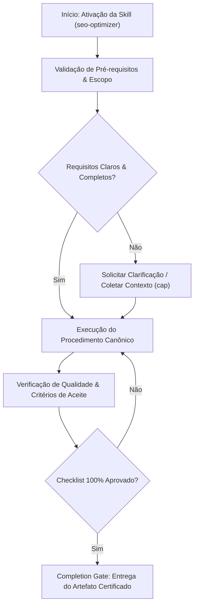

# SEO Optimizer

## When to Use

### Use when:
- Implementing technical SEO audits, JSON-LD Schema.org markup, and meta tags
- Optimizing Core Web Vitals (LCP, INP, CLS) and page indexability
- Setting up Open Graph social preview cards and XML sitemaps

### Do not use when:
- Internal authenticated intranets or private dashboards closed to web crawlers

## Overview

Optimize websites for search engine visibility through technical SEO, on-page optimization, structured data implementation, and Core Web Vitals performance tuning. This skill covers crawlability, indexability, meta tag strategy, Schema.org markup, sitemap generation, canonical URL management, internationalization (hreflang), and performance optimization for Google's ranking signals.

Apply this skill whenever a site needs better organic search performance, whether for a single page audit or a full-site overhaul.

## Multi-Phase Process

### Phase 1: Technical Audit

1. Crawl the site (Screaming Frog, Sitebulb, or custom script)
2. Check robots.txt and XML sitemap validity
3. Identify crawl errors, redirect chains, and broken links
4. Verify canonical URLs and duplicate content handling
5. Assess mobile-friendliness and responsive design
6. Check HTTPS implementation and mixed content
7. Evaluate page load performance (Core Web Vitals)

> **STOP — Do NOT proceed to Phase 2 until audit findings are documented and prioritized.**

### Phase 2: On-Page Optimization

1. Audit title tags (unique, 50-60 chars, keyword placement)
2. Review meta descriptions (unique, 150-160 chars, compelling CTAs)
3. Analyze heading hierarchy (single H1, logical H2-H6 structure)
4. Optimize image alt text and file names
5. Review internal linking structure and anchor text
6. Check URL structure (short, descriptive, hyphenated)
7. Validate Open Graph and Twitter Card tags

> **STOP — Do NOT proceed to Phase 3 until on-page changes are implemented and verified.**

### Phase 3: Structured Data Implementation

1. Identify applicable Schema.org types for content
2. Implement JSON-LD structured data
3. Validate with Google Rich Results Test
4. Test for rich snippet eligibility
5. Monitor Search Console for structured data errors

> **STOP — Do NOT proceed to Phase 4 until structured data passes validation.**

### Phase 4: Monitoring and Iteration

1. Set up Google Search Console monitoring
2. Track Core Web Vitals over time
3. Monitor indexation status and coverage
4. Review search performance (clicks, impressions, CTR, position)
5. Set up alerts for crawl errors and ranking drops

## Audit Priority Decision Table

| Finding | Severity | Fix Priority | Impact |
|---|---|---|---|
| No HTTPS / mixed content | Critical | Immediate | Ranking penalty, trust signals |
| Missing canonical URLs | Critical | Immediate | Duplicate content dilution |
| Broken redirect chains (3+ hops) | High | This sprint | Crawl budget waste, link equity loss |
| Missing or duplicate title tags | High | This sprint | CTR drop, ranking confusion |
| No structured data | Medium | Next sprint | Missing rich snippets |
| Missing alt text on images | Medium | Next sprint | Accessibility and image search loss |
| Suboptimal Core Web Vitals | Medium | Next sprint | Ranking signal, user experience |
| Missing hreflang tags (multi-language) | Low | Backlog | Geo-targeting issues |
| Non-descriptive URL slugs | Low | Backlog | Minor ranking and CTR effect |

## Meta Tag Reference

### Essential Meta Tags
```html
<head>
  <!-- Primary -->
  <title>Primary Keyword - Secondary Keyword | Brand Name</title>
  <meta name="description" content="Compelling 150-160 char description with target keyword and clear value proposition.">
  <link rel="canonical" href="https://example.com/page">

  <!-- Robots -->
  <meta name="robots" content="index, follow">
  <!-- or noindex, nofollow for pages that shouldn't be indexed -->

  <!-- Viewport (mobile) -->
  <meta name="viewport" content="width=device-width, initial-scale=1">

  <!-- Open Graph -->
  <meta property="og:type" content="website">
  <meta property="og:title" content="Page Title for Social Sharing">
  <meta property="og:description" content="Description optimized for social sharing.">
  <meta property="og:image" content="https://example.com/og-image.jpg">
  <meta property="og:url" content="https://example.com/page">
  <meta property="og:site_name" content="Brand Name">

  <!-- Twitter Card -->
  <meta name="twitter:card" content="summary_large_image">
  <meta name="twitter:title" content="Page Title">
  <meta name="twitter:description" content="Twitter-optimized description.">
  <meta name="twitter:image" content="https://example.com/twitter-image.jpg">

  <!-- Internationalization -->
  <link rel="alternate" hreflang="en" href="https://example.com/en/page">
  <link rel="alternate" hreflang="de" href="https://example.com/de/page">
  <link rel="alternate" hreflang="x-default" href="https://example.com/page">
</head>
```

### Meta Tag Optimization Matrix

| Element | Max Length | Priority Keywords | Common Mistakes |
|---|---|---|---|
| Title tag | 50-60 chars | Front-load primary keyword | Too long, keyword stuffing, duplicate |
| Meta description | 150-160 chars | Include CTA and keyword | Missing, duplicate, no CTA |
| H1 | N/A (single per page) | Primary keyword variation | Multiple H1s, missing H1 |
| URL slug | 3-5 words | Target keyword | Too long, parameters, underscores |
| Image alt | 125 chars | Descriptive, keyword if natural | Empty, "image of...", keyword stuffing |
| OG title | 60-90 chars | Engaging, shareable | Same as title tag (missed opportunity) |

## Structured Data (JSON-LD)

### Article
```html
<script type="application/ld+json">
{
  "@context": "https://schema.org",
  "@type": "Article",
  "headline": "How to Optimize Core Web Vitals",
  "author": {
    "@type": "Person",
    "name": "Jane Smith",
    "url": "https://example.com/authors/jane-smith"
  },
  "datePublished": "2026-03-01",
  "dateModified": "2026-03-15",
  "image": "https://example.com/images/article-hero.jpg",
  "publisher": {
    "@type": "Organization",
    "name": "Example Blog",
    "logo": {
      "@type": "ImageObject",
      "url": "https://example.com/logo.png"
    }
  },
  "description": "A comprehensive guide to improving LCP, FID, and CLS scores."
}
</script>
```

### Product
```html
<script type="application/ld+json">
{
  "@context": "https://schema.org",
  "@type": "Product",
  "name": "Widget Pro",
  "description": "Professional-grade widget for enterprise use.",
  "image": "https://example.com/widget-pro.jpg",
  "brand": { "@type": "Brand", "name": "WidgetCo" },
  "offers": {
    "@type": "Offer",
    "price": "49.99",
    "priceCurrency": "USD",
    "availability": "https://schema.org/InStock",
    "url": "https://example.com/widget-pro"
  },
  "aggregateRating": {
    "@type": "AggregateRating",
    "ratingValue": "4.7",
    "reviewCount": "312"
  }
}
</script>
```

### FAQ Page
```html
<script type="application/ld+json">
{
  "@context": "https://schema.org",
  "@type": "FAQPage",
  "mainEntity": [
    {
      "@type": "Question",
      "name": "What is Core Web Vitals?",
      "acceptedAnswer": {
        "@type": "Answer",
        "text": "Core Web Vitals are a set of metrics that measure real-world user experience for loading, interactivity, and visual stability."
      }
    }
  ]
}
</script>
```

### Schema Type Decision Guide

| Content Type | Schema Type | Rich Result |
|---|---|---|
| Blog post | Article | Article snippet |
| Product page | Product | Price, rating, availability |
| FAQ section | FAQPage | Expandable Q&A |
| How-to guide | HowTo | Step-by-step snippet |
| Recipe | Recipe | Image, time, rating |
| Event | Event | Date, location, price |
| Local business | LocalBusiness | Map pack, hours |
| Software | SoftwareApplication | Rating, price |
| Breadcrumbs | BreadcrumbList | Breadcrumb trail |
| Video | VideoObject | Thumbnail, duration |

## Core Web Vitals

### Metrics and Thresholds

| Metric | Good | Needs Improvement | Poor | Measures |
|---|---|---|---|---|
| LCP (Largest Contentful Paint) | <= 2.5s | <= 4.0s | > 4.0s | Loading performance |
| INP (Interaction to Next Paint) | <= 200ms | <= 500ms | > 500ms | Interactivity |
| CLS (Cumulative Layout Shift) | <= 0.1 | <= 0.25 | > 0.25 | Visual stability |

### LCP Optimization
```html
<!-- Preload hero image -->
<link rel="preload" as="image" href="/hero.webp" fetchpriority="high">

<!-- Use modern image formats -->
<picture>
  <source srcset="/hero.avif" type="image/avif">
  <source srcset="/hero.webp" type="image/webp">
  
</picture>
```

### CLS Prevention
```css
/* Always set dimensions on images and video */
img, video {
  width: 100%;
  height: auto;
  aspect-ratio: 16 / 9;
}

/* Reserve space for dynamic content */
.ad-slot {
  min-height: 250px;
}

/* Avoid inserting content above existing content */
.notification-bar {
  position: fixed; /* doesn't shift layout */
}
```

### INP Optimization
```javascript
// Break long tasks with yield
async function processLargeDataset(data) {
  for (let i = 0; i < data.length; i++) {
    processItem(data[i]);
    if (i % 100 === 0) {
      await new Promise(resolve => setTimeout(resolve, 0)); // yield to main thread
    }
  }
}

// Use requestIdleCallback for non-critical work
requestIdleCallback(() => {
  loadAnalytics();
  initNonCriticalFeatures();
});
```

## XML Sitemap

### Generation Pattern
```xml
<?xml version="1.0" encoding="UTF-8"?>
<urlset xmlns="http://www.sitemaps.org/schemas/sitemap/0.9">
  <url>
    <loc>https://example.com/</loc>
    <lastmod>2026-03-15</lastmod>
    <changefreq>daily</changefreq>
    <priority>1.0</priority>
  </url>
  <url>
    <loc>https://example.com/products</loc>
    <lastmod>2026-03-14</lastmod>
    <changefreq>weekly</changefreq>
    <priority>0.8</priority>
  </url>
</urlset>
```

### Sitemap Best Practices
- Maximum 50,000 URLs per sitemap file
- Use sitemap index for larger sites
- Include only canonical, indexable URLs
- Update `lastmod` only when content genuinely changes
- Submit via Google Search Console and robots.txt

## robots.txt Template
```
User-agent: *
Allow: /
Disallow: /admin/
Disallow: /api/
Disallow: /search?
Disallow: /*?sort=
Disallow: /*?filter=

Sitemap: https://example.com/sitemap.xml
```

## Next.js / React SEO Patterns

### Next.js Metadata API (App Router)
```typescript
import type { Metadata } from 'next';

export const metadata: Metadata = {
  title: {
    template: '%s | Brand Name',
    default: 'Brand Name - Tagline',
  },
  description: 'Site-wide default description.',
related_skills:
  - cap
  - implementation
  - technical-documentation
  openGraph: {
    type: 'website',
    locale: 'en_US',
    url: 'https://example.com',
    siteName: 'Brand Name',
  },
  twitter: {
    card: 'summary_large_image',
  },
  robots: {
    index: true,
    follow: true,
  },
  alternates: {
    canonical: 'https://example.com',
  },
};
```

### Dynamic Metadata per Page
```typescript
export async function generateMetadata({ params }): Promise<Metadata> {
  const product = await getProduct(params.slug);

  return {
    title: product.name,
    description: product.description.slice(0, 160),
related_skills:
  - cap
  - implementation
  - technical-documentation
    openGraph: {
      title: product.name,
      description: product.description.slice(0, 200),
related_skills:
  - cap
  - implementation
  - technical-documentation
      images: [{ url: product.image, width: 1200, height: 630 }],
    },
  };
}
```

## Anti-Patterns / Common Mistakes

| Anti-Pattern | Why It Fails | What To Do Instead |
|---|---|---|
| Keyword stuffing in titles/content | Triggers spam filters, reduces CTR | Use primary keyword once naturally, add variations |
| Same title/description across pages | Duplicate content signals, wasted opportunity | Unique, page-specific meta for every indexable URL |
| Blocking CSS/JS in robots.txt | Googlebot cannot render pages | Allow all rendering resources |
| Structured data mismatching page content | Google penalties, rich snippet removal | Schema must reflect visible content exactly |
| Redirect chains > 2 hops | Crawl budget waste, link equity loss | Redirect directly to final destination |
| JS-only navigation without SSR links | Crawler cannot discover pages | Server-render navigation links |
| Ignoring Core Web Vitals | Ranking signal degradation | Profile and optimize LCP, INP, CLS |
| Missing canonical URLs | Duplicate content penalties | Set canonical on every indexable page |
| Over-optimized anchor text | Unnatural link patterns trigger penalties | Use descriptive, varied anchor text |
| Hiding content with CSS for SEO | Cloaking violation | All SEO content must be visible to users |

## Anti-Rationalization Guards

- Do NOT skip the technical audit because "the site looks fine" -- crawl it.
- Do NOT add structured data without validating it passes the Rich Results Test.
- Do NOT assume meta tags are correct without checking every page type.
- Do NOT deploy SEO changes without before/after measurement.
- Do NOT optimize for search engines at the expense of user experience.

## Integration Points

| Skill | How It Connects |
|---|---|
| `content-creator` | SEO informs keyword targeting and headline strategy for marketing content |
| `content-research-writer` | Research-backed content needs SEO-optimized structure and meta tags |
| `senior-frontend` | Core Web Vitals optimization requires frontend performance tuning |
| `performance-optimization` | Page speed directly affects LCP and INP scores |
| `deployment` | SEO changes need proper cache invalidation and redirect configuration |
| `tech-docs-generator` | Documentation sites need sitemap, canonical, and structured data setup |

## Skill Type

**FLEXIBLE** — Adapt the optimization strategy to the site's technology stack, content type, and competitive landscape. Technical SEO fundamentals and structured data best practices are strongly recommended; specific implementation patterns vary by framework.


## Decision Workflow




## Anti-Patterns & Operational Guardrails

| Anti-Pattern | Severidade | Impacto Negativo | Mitigação Canônica |
|:---|:---:|:---|:---|
| **Premature Execution Without Context** | 🔴 Critical | Context hallucination and destructive refactoring | Activate `cap` to acquire minimal evidence before editing. |
| **Omission of Validation Checklists** | 🟡 Medium | Delivering artifacts with syntax inconsistencies | Rigorously execute the checklist step-by-step before handoff. |
| **Falta de Documentação de Decisões** | 🟢 Low | Perda de rastreabilidade técnica e drift arquitetural | Registrar trade-offs relevantes via skill `adr-generator`. |


## Edge Cases & Failure Modes

- **Restricted / Read-Only Environment:** If the filesystem or sandbox is write-locked, report the constraint immediately with evidence and generate changes as a markdown diff patch.
- **Specification Conflict:** If contradictions emerge between user intent and the SSOT (`AGENTS.md`), halt and present trade-off options.
- **Context Exhaustion / Timeout:** For massive tasks, decompose into atomic sub-batches utilizing `subagent-driven-development`.


## Domain SOTA & Industry Engineering Standards

- **Structured Data:** Schema.org JSON-LD `@graph` architectures (SoftwareApplication, TechArticle, Organization, BreadcrumbList).
- **Core Web Vitals (CWV):** Largest Contentful Paint (LCP $\le 2.5\text{s}$), Interaction to Next Paint (INP $\le 200\text{ms}$), Cumulative Layout Shift (CLS $\le 0.1$).
- **Canonical & Crawlability:** Self-referential canonical URLs, automated XML sitemaps, robots.txt directives, and hreflang localization.
- **Social Graph Optimization:** Open Graph (`og:image`, `og:title`) and Twitter Cards (`summary_large_image`).

### Schema.org JSON-LD Technical Specification:

```html
<script type="application/ld+json">
{
  "@context": "https://schema.org",
  "@graph": [
    {
      "@type": "SoftwareApplication",
      "name": "Ignite Agents Skills",
      "applicationCategory": "DeveloperApplication",
      "operatingSystem": "All",
      "offers": { "@type": "Offer", "price": "0", "priceCurrency": "USD" }
    }
  ]
}
</script>
```

### Exhaustive Heuristic Decision Rules:
- **Rule of Thumb 1 (Zero-Trust Architectural Boundaries):** Treat all external inputs, third-party payloads, and cross-module boundaries with strict zero-trust schema validation.
- **Rule of Thumb 2 (Fail-Fast & Deterministic Errors):** Reject invalid states immediately with typed, actionable error contracts rather than cascading silent failures.
- **Rule of Thumb 3 (Idempotency & AST Preservation):** State mutations and code transformations must maintain semantic idempotency across repeated executions.
- **Rule of Thumb 4 (Benchmark & Telemetry Alignment):** Measure critical execution latency ($P_{95}$) and memory overhead with structured telemetry and baseline benchmarks.
- **Rule of Thumb 5 (Event-Driven & Circuit Breaker Decoupling):** Isolate asynchronous operations behind circuit breakers and resilient retry mechanisms to prevent cascading failure.
- **Rule of Thumb 6 (Contract-First DDD Modeling):** Define clear domain aggregates, value objects, and typed interface contracts before implementing concrete logic.
- **Rule of Thumb 7 (RAG & Semantic Retrieval Precision):** Optimize context retrieval with hybrid lexical-vector search and reciprocal rank fusion to eliminate hallucinated routing.
- **Rule of Thumb 8 (OWASP & Supply Chain Verification):** Verify dependencies and data flows against OWASP Top 10 and SLSA Level 3 supply chain security standards.
- **Rule of Thumb 9 (Verification Gate Invariant):** Never declare completion without automated test execution evidence and zero compiler/linter warnings.
## Operational Verification Checklist

- [ ] All prerequisites and target files inspected before modification.
- [ ] Procedure strictly adheres to specialization rules and best practices.
- [ ] Security, typing, and architectural style guidelines preserved.
- [ ] Unit tests or validation commands executed successfully.
- [ ] Final deliverable verified against the completion gate.


## Completion Gate & Verification
Before concluding SEO optimization:
- [ ] JSON-LD structured data validates against Google Rich Results Test
- [ ] Core Web Vitals meet targets (LCP $\le 2.5\text{s}$, INP $\le 200\text{ms}$, CLS $\le 0.1$)
- [ ] Unique title and meta descriptions configured for all target routes