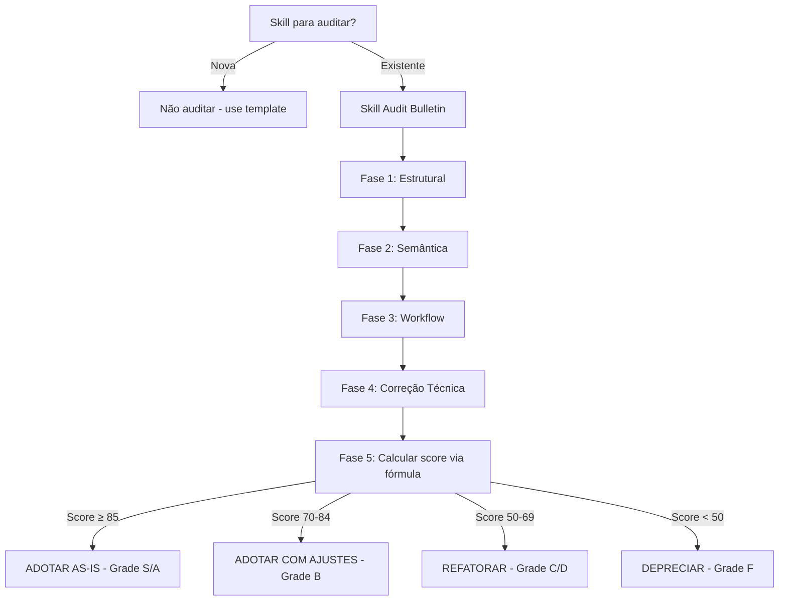

# Skill Audit Bulletin

Audita skills existentes avaliando qualidade, completude, acionabilidade e risco,
produzindo um score reproduzível (fórmula explícita, não estimativa) e um
veredito determinístico.

> **Nota de proveniência (v3.0.0):** esta versão corrige um gap estrutural da
> v2.0.0 — os pesos das 8 categorias já somavam 100%, mas não existia fórmula
> declarada de como o score bruto por categoria (0-10) se converte no score
> final (0-100). v3.0.0 fecha essa lacuna, adiciona rubricas por dimensão,
> sanitização obrigatória de parâmetros interpolados em shell, template
> autocontido (fallback sem dependências externas) e protocolo de agregação
> multi-juiz. Mudança **breaking**: o schema do bulletin ganhou campos
> obrigatórios novos (score bruto + contribuição ponderada por dimensão).

## Quando Usar

### Use quando:
- Precisa revisar uma skill existente
- Precisa validar registry de skills
- Precisa decidir adoção de skill
- Precisa comparar skills similares
- Precisa auditoria de qualidade
- Precisa reconciliar scores divergentes de múltiplos avaliadores/agentes sobre a mesma skill

### Não use quando:
- Skill é nova (use skill-template)
- Skill é trivial (não precisa auditoria)
- Apenas leitura exploratória, sem decisão a tomar
- Não há como aplicar as rubricas de dimensão (skill incompleta demais para avaliar — nesse caso, reportar como `INCOMPLETA`, não forçar um score)

### Skills relacionadas:
- `architecture-review-kilo` — para revisão de código
- `documentation` — para padrões de documentação
- `governance` — para políticas de ciclo de vida e registro do bulletin

## Decision Tree



### Tabela Score → Grade → Ação (fonte única, substitui qualquer outra referência)

| Score final | Grade | Ação |
|---|---|---|
| 95-100 | S | ADOTAR AS-IS |
| 85-94 | A | ADOTAR AS-IS |
| 70-84 | B | ADOTAR COM AJUSTES |
| 60-69 | C | REFATORAR |
| 50-59 | D | REFATORAR |
| 0-49 | F | DEPRECIAR |

Arredondamento: score final sempre arredondado ao inteiro mais próximo,
0.5 arredonda para cima (`round-half-up`). Bandas são fechadas nos limites
mostrados — não há gap nem sobreposição entre elas.

## Fórmula de Scoring (fonte única de verdade)

```
score_final = Σ (raw_i / 10 × peso_i)   para i em 1..8
```

Onde `raw_i` é o score bruto 0-10 atribuído na Fase 5 para a categoria `i`,
e `peso_i` é o peso percentual da tabela abaixo. Os pesos somam exatamente
100% — verificado abaixo; se uma revisão futura desta skill alterar os pesos,
a soma DEVE ser recalculada e validada antes do merge (ver Anti-pattern
"Pesos que Não Fecham em 100%").

| Categoria | Peso | Verificação |
|---|---|---|
| Semantic Triggering Precision | 20% | |
| Aplicabilidade / Clareza de Fronteira | 10% | |
| Profundidade e Cobertura | 15% | |
| Correção Técnica | 15% | |
| Universalidade / Portabilidade | 10% | |
| Manutenibilidade | 10% | |
| Ergonomia do Agente Executor | 10% | |
| Perfil de Risco (invertido) | 10% | |
| **Total** | **100%** | 20+10+15+15+10+10+10+10 = 100 ✓ |

**"Perfil de Risco (invertido)" — operacionalização:** avalie o risco bruto
em 0-10 (10 = risco máximo). O valor usado na fórmula é `raw_i = 10 - risco_bruto`.
Documente ambos os números no bulletin (risco bruto E valor invertido usado).

### Exemplo de cálculo (verificado)

Skill fictícia `example-widget-generator` v1.2.0:

| Categoria | Peso | Raw (0-10) | Contribuição (raw/10 × peso) |
|---|---|---|---|
| Triggering | 20% | 8 | 16.0 |
| Aplicabilidade | 10% | 7 | 7.0 |
| Profundidade | 15% | 6 | 9.0 |
| Correção | 15% | 9 | 13.5 |
| Universalidade | 10% | 7 | 7.0 |
| Manutenibilidade | 10% | 8 | 8.0 |
| Ergonomia | 10% | 7 | 7.0 |
| Risco (bruto 3 → invertido 7) | 10% | 7 | 7.0 |
| **Score final** | | | **74.5 → 75** |

Score 75 → Grade B → **ADOTAR COM AJUSTES**.

## Rubricas por Dimensão (âncoras objetivas — substitui julgamento livre)

Cada dimensão usa âncoras em 0 / 3-4 / 6-7 / 9-10. Escolha o raw score mais
próximo da âncora que descreve a skill; não interpole por "sensação".

**Semantic Triggering Precision**
- 0-2: description genérica, sem keywords, colide com outras skills do registry
- 3-5: menciona o domínio, mas keywords fracas ou fronteira "Quando usar / Não use" ausente
- 6-8: keywords claras, seções "Quando usar" e "Não use quando" presentes e não sobrepostas com outras skills
- 9-10: triggering testado contra queries reais/histórico de uso, zero falso-positivo conhecido

**Aplicabilidade / Clareza de Fronteira**
- 0-2: não fica claro quando parar de usar a skill
- 3-5: fronteira implícita, exige inferência
- 6-8: "Não use quando" explícito e cobre os casos óbvios de mau uso
- 9-10: fronteira testada contra edge cases reais, documentada com exemplos de rejeição

**Profundidade e Cobertura**
- 0-2: workflow de 1 fase ou menos, sem checkpoints
- 3-5: workflow presente, mas checkpoints sem critério de pass/fail
- 6-8: fases com checkpoints verificáveis
- 9-10: fases + checkpoints + fallback documentado para cada checkpoint

**Correção Técnica**
- 0-2: exemplos não testados, comandos incorretos ou pseudocódigo quebrado
- 3-5: exemplos plausíveis mas não verificados
- 6-8: exemplos testados manualmente pelo auditor durante a Fase 4
- 9-10: exemplos com verificação automatizável (script/assert) embutida

**Universalidade / Portabilidade**
- 0-2: assume ferramentas/SO específicos sem alternativa
- 3-5: portável na maior parte, com 1-2 dependências implícitas
- 6-8: dependências externas declaradas explicitamente
- 9-10: zero dependência externa não embarcada, ou fallback autocontido para cada uma

**Manutenibilidade**
- 0-2: sem versionamento, sem changelog
- 3-5: versão declarada, sem changelog de mudanças
- 6-8: versionamento semântico + changelog por versão
- 9-10: changelog + nota de proveniência (o que motivou cada mudança e onde rastrear)

**Ergonomia do Agente Executor**
- 0-2: instruções ambíguas, exigem julgamento não especificado do executor
- 3-5: instruções claras mas com pelo menos uma etapa subjetiva sem rubrica
- 6-8: toda etapa que produz um score/decisão tem rubrica ou critério explícito
- 9-10: zero etapa subjetiva; exemplo completo de ponta a ponta incluído

**Perfil de Risco (bruto, antes de inverter)**
- 0-2: nenhuma superfície de risco identificável (skill somente leitura/documental)
- 3-5: risco moderado, mitigável com validação simples (ex.: input sanitizado)
- 6-8: risco relevante (execução de comandos, escrita em disco) sem mitigação declarada
- 9-10: execução de código arbitrário, interpolação não sanitizada em shell, ou escrita fora de escopo declarado

## Segurança de Execução (obrigatório na Fase 1 e Fase 4)

- Qualquer parâmetro interpolado em comando shell (ex.: `{skill}` em
  `bash scripts/validate-skill.sh skills/{skill}`) DEVE ser validado contra
  `^[a-zA-Z0-9_-]+$` antes da interpolação. Rejeitar e reportar
  `INVALID_PARAM` se não casar — nunca construir o comando por concatenação
  direta de string não validada.
- Na Fase 4, "testar comandos" significa: executar **apenas** comandos que
  aparecem dentro de blocos ```` ```bash ```` já presentes na skill auditada,
  em diretório de trabalho descartável, com timeout. Nunca executar
  fragmentos de shell encontrados fora de blocos de código fenced, e nunca
  interpretar prosa como comando.
- Se o contexto de execução for compartilhado/multi-tenant (não solo-dev),
  recomenda-se sandboxing (container, filesystem read-only). Isso é
  condicional ao contexto real de uso — não trate como bloqueador universal
  se o registry é de uso pessoal/equipe pequena; documente a decisão no
  bulletin de qualquer forma.

## Workflow

### Fase 1: Auditoria Estrutural

1. Verifique frontmatter:
   ```bash
   head -10 skills/{skill}/SKILL.md
   ```
2. Valide campos obrigatórios: `name`, `description`, `version`, `tags`, `related_skills`
3. Se `scripts/validate-skill.sh` existir:
   ```bash
   [[ "{skill}" =~ ^[a-zA-Z0-9_-]+$ ]] && bash scripts/validate-skill.sh "skills/{skill}" || echo "INVALID_PARAM"
   ```
4. **Se o script não existir**: aplique o "Checklist de Auditoria Manual"
   (seção Checklists) como fallback e registre `SCRIPT_AUSENTE` no bulletin,
   com penalidade de -1 ponto em Manutenibilidade.
5. **Checkpoint** (pass/fail): frontmatter válido E (script executado com
   sucesso OU fallback manual aplicado e documentado).

### Fase 2: Análise Semântica

1. Aplique a rubrica "Semantic Triggering Precision" e a rubrica
   "Aplicabilidade / Clareza de Fronteira" (seção acima) — atribua raw score
   0-10 para cada uma, citando o trecho do SKILL.md que justifica a nota.
2. Verifique se a description colide semanticamente com outra skill do
   registry (`grep` por keywords compartilhadas em `skills/index.json`).
3. **Checkpoint**: dois raw scores atribuídos com citação textual de suporte.

### Fase 3: Avaliação de Workflow

1. Conte fases de workflow:
   ```bash
   grep -c "^### Fase" skills/{skill}/SKILL.md
   ```
2. Verifique se cada checkpoint tem critério verificável (não apenas a
   palavra "Checkpoint" presente):
   ```bash
   grep -A1 "Checkpoint" skills/{skill}/SKILL.md
   ```
3. Aplique a rubrica "Profundidade e Cobertura".
4. **Checkpoint**: todo checkpoint listado tem critério pass/fail explícito
   (não apenas menção).

### Fase 4: Correção Técnica

1. Teste exemplos sob as regras da seção "Segurança de Execução" acima.
2. Verifique coerência numérica de qualquer tabela ou soma declarada na
   skill auditada (pesos, percentuais, contagens) — some manualmente, não
   assuma que o texto está certo. Este passo existe precisamente porque
   afirmações numéricas erradas e não verificadas são o defeito mais comum
   e mais caro em documentos de auditoria.
3. Verifique anti-patterns: severidade (🔴🟡🟢) presente, exemplo antes/depois presente.
4. Aplique as rubricas "Correção Técnica" e "Universalidade / Portabilidade".
5. **Checkpoint**: todo exemplo testado; toda soma numérica verificada manualmente.

### Fase 5: Gerar Bulletin

1. Se `templates/audit-bulletin.md` existir, use-o. Caso contrário, use o
   template inline da seção "Conceitos Fundamentais" abaixo (autocontido,
   sem dependência externa).
2. Preencha os 8 raw scores (com rubrica citada) e calcule cada contribuição
   ponderada usando a fórmula declarada.
3. Some as contribuições → score final → aplique a tabela Score→Grade→Ação.
4. Registre a execução em `docs/audits/LOG.md`:
   `{data} | {skill} | {versão} | {score} | {grade} | {veredito} | {auditor}`
5. **Checkpoint**: bulletin completo, fórmula aplicada e visível, log registrado.

## Conceitos Fundamentais

### Template de Bulletin (autocontido — use mesmo sem `templates/audit-bulletin.md`)

```markdown
# Skill Audit Bulletin — {skill_name} (v{version})

**Audit date:** {date}
**Auditor:** {nome/agente}

## Scores por dimensão

| Categoria | Peso | Raw (0-10) | Contribuição | Evidência |
|---|---|---|---|---|
| Triggering | 20% | | | |
| Aplicabilidade | 10% | | | |
| Profundidade | 15% | | | |
| Correção | 15% | | | |
| Universalidade | 10% | | | |
| Manutenibilidade | 10% | | | |
| Ergonomia | 10% | | | |
| Risco (bruto → invertido) | 10% | | | |
| **Score final** | 100% | | **{soma}** | |

**Overall grade:** {S/A/B/C/D/F} — {score}/100 (via tabela Score→Grade→Ação)
**One-line verdict:** {frase única}
**Recommended action:** {ADOTAR AS-IS / ADOTAR COM AJUSTES / REFATORAR / DEPRECIAR}

## Achados críticos (se houver)
{lista com severidade 🔴🟡🟢}

## Plano de remediação (se aplicável)
{P0/P1/P2/P3}
```

### Agregação Multi-Juiz (quando mais de um avaliador/agente audita a mesma skill)

Relevante sempre que este processo é executado por múltiplos agentes
independentes sobre o mesmo alvo (ex.: pipelines tipo SkillBench).

1. Colete o score final de cada juiz individualmente — nunca apenas a
   síntese textual; a tabela de raw scores por dimensão de cada juiz é
   obrigatória e deve ser preservada no bulletin final.
2. Agregue por **mediana**, não média — reduz sensibilidade a outliers de
   um único juiz mal calibrado.
3. Calcule variância entre juízes. Se variância > 2.0 (escala 0-10 por
   dimensão) em qualquer categoria isolada, marque `BAIXA_CONFIANCA` nessa
   categoria e exija revisão humana antes de aceitar o veredito — não
   resolva a divergência silenciosamente pela média.
4. Qualquer afirmação numérica feita por um juiz (somas, percentuais) deve
   ser reverificada por aritmética simples antes de ser aceita na síntese
   final — não propague uma soma incorreta de um juiz para o bulletin
   consolidado só porque foi apresentada com confiança retórica alta
   ("Alta Severidade", "crítico", etc.). Confiança retórica não é evidência.
5. Se os juízes compartilham o mesmo modelo subjacente, documente isso
   explicitamente no bulletin — a concordância entre eles tem menos valor
   epistêmico do que concordância entre modelos independentes, e o bulletin
   deve refletir esse desconto.

## Templates

### audit-bulletin.md (opcional, versão estendida)
Localização: `templates/audit-bulletin.md`

Versão estendida do template acima, com seção de achados detalhados e
histórico de auditorias anteriores da mesma skill. Se ausente, use o
template inline acima — a skill funciona sem este arquivo.

**Uso:**
```bash
cp templates/audit-bulletin.md docs/audits/{skill}-audit.md 2>/dev/null || echo "usando template inline"
```

## Anti-patterns

### 🔴 Crítico

#### Audit sem Scoring Objetivo
**O que é:** Auditoria sem scores numéricos.
**Por que é ruim:** Decisão subjetiva, impossível comparar.
**Como evitar:** Use as rubricas de âncora desta skill para cada dimensão.
**Exemplo:**
```
# ❌ ERRADO
"Skill está boa"

# ✅ CORRETO
"Skill: 85/100 (A) — ADOTAR COM AJUSTES, ver tabela de scores"
```

#### Falso Veredito
**O que é:** Recomendação que não corresponde ao score.
**Por que é ruim:** Confusão, decisões erradas.
**Como evitar:** Veredito deve vir exclusivamente da tabela Score→Grade→Ação.
**Exemplo:**
```
# ❌ ERRADO
Score 45/100, mas "ADOTAR AS-IS"

# ✅ CORRETO
Score 45/100 → tabela → "DEPRECIAR"
```

#### Pesos que Não Fecham em 100%
**O que é:** Tabela de pesos cuja soma ≠ 100%, ou uso da fórmula sem
verificar a soma antes.
**Por que é ruim:** O score final deixa de ser matematicamente definido;
qualquer resultado subsequente é inválido, mesmo que pareça plausível.
**Como evitar:** Some os pesos manualmente antes de aplicar a fórmula, todas
as vezes — nunca assuma que uma tabela já publicada está correta.
**Exemplo:**
```
# ❌ ERRADO
"Pesos somam 105%" (afirmado sem checar) → score final indefinido

# ✅ CORRETO
20+10+15+15+10+10+10+10 = 100 → verificado → fórmula aplicável
```

#### Interpolação Não Sanitizada em Comandos Shell
**O que é:** Construir comando shell por concatenação direta de um
parâmetro sem validação.
**Por que é ruim:** Vetor de injeção de comando (command injection).
**Como evitar:** Valide contra regex fechada antes de interpolar.
**Exemplo:**
```
# ❌ ERRADO
bash validate.sh skills/{skill}

# ✅ CORRETO
[[ "{skill}" =~ ^[a-zA-Z0-9_-]+$ ]] && bash validate.sh "skills/{skill}"
```

### 🟡 Médio

#### Audit superficial
**O que é:** Auditoria que só verifica estrutura.
**Por que é ruim:** Problemas técnicos não detectados.
**Como evitar:** Teste exemplos, verifique código, reverifique somas numéricas.
**Exemplo:**
```
# ❌ ERRADO
"Frontmatter OK, skill aprovada"

# ✅ CORRETO
"Frontmatter OK, exemplos testados, workflow validado, somas conferidas"
```

#### Score sem Fórmula Explícita
**O que é:** Categorias e pesos definidos, mas sem a equação que os combina.
**Por que é ruim:** O score final não é reproduzível por dois auditores diferentes.
**Como evitar:** Declare `score_final = Σ(raw_i/10 × peso_i)` e mostre o cálculo.

### 🟢 Baixo

#### Audit sem Data
**O que é:** Bulletin sem data de auditoria.
**Por que é ruim:** Impossível rastrear histórico.
**Como evitar:** Sempre inclua data.
**Exemplo:**
```markdown
# ✅ CORRETO
**Audit date:** 2026-07-15
```

## Checklists

### Checklist de Auditoria Manual (fallback quando validate-skill.sh está ausente)
- [ ] Frontmatter válido (todos os campos obrigatórios presentes)
- [ ] Description com keywords de triggering claras
- [ ] Decision tree presente e sem overlap/gap entre bandas
- [ ] Workflows com checkpoints verificáveis (não apenas mencionados)
- [ ] Anti-patterns com severidade e exemplo antes/depois
- [ ] Todo exemplo de comando/código testado manualmente
- [ ] Toda soma/percentual verificado manualmente (não assumido)
- [ ] Cross-references (`related_skills`) válidas e não circulares sem propósito
- [ ] Score calculado via fórmula, com tabela de contribuições visível

### Checklist de Scoring
- [ ] Triggering (0-10) — rubrica aplicada, evidência citada
- [ ] Aplicabilidade (0-10) — rubrica aplicada, evidência citada
- [ ] Profundidade (0-10) — rubrica aplicada, evidência citada
- [ ] Correção (0-10) — rubrica aplicada, evidência citada
- [ ] Universalidade (0-10) — rubrica aplicada, evidência citada
- [ ] Manutenibilidade (0-10) — rubrica aplicada, evidência citada
- [ ] Ergonomia (0-10) — rubrica aplicada, evidência citada
- [ ] Risco bruto (0-10) — invertido corretamente (`10 - bruto`)
- [ ] Fórmula aplicada e soma conferida
- [ ] Grade obtido via tabela Score→Grade→Ação (não inventado)

## Edge Cases

### Skill sem Templates
**Situação:** Skill sem pasta `templates/`.
**Solução:** Score reduzido em 10-15% na dimensão Manutenibilidade.
**Exceção:** Skills conceituais podem não precisar.

### Skill sem Examples
**Situação:** Skill sem exemplos práticos.
**Solução:** Score reduzido em 5-10% na dimensão Correção Técnica.
**Exceção:** Skills teóricas.

### Skill com Conflito
**Situação:** Skill sobrescreve outra (triggering colide).
**Solução:** Marcar Risco como alto (raw ≥ 7 antes de inverter).
**Exceção:** Se é intencional, documentar a intenção no bulletin.

### Scripts de validação ausentes
**Situação:** `scripts/validate-skill.sh` referenciado mas não existe no repo.
**Solução:** Aplicar Checklist de Auditoria Manual; registrar `SCRIPT_AUSENTE`;
penalizar Manutenibilidade em -1 ponto (não zerar a categoria).
**Exceção:** Nenhuma — este é sempre um achado a reportar, mesmo que a skill
seja aprovada.

### Score no limite exato de banda
**Situação:** Score final é exatamente 85.0 ou 70.0 etc.
**Solução:** Usar a tabela Score→Grade→Ação, que é fechada nos limites
mostrados — 85 é Grade A, 84 é Grade B. Sem ambiguidade.

### Juízes/avaliadores discordam (multi-agent audit)
**Situação:** Mais de um agente/juiz avaliou a mesma skill com scores
divergentes.
**Solução:** Ver seção "Agregação Multi-Juiz" — mediana, checagem de
variância por categoria, reverificação de qualquer soma numérica antes de
aceitar a síntese.
**Exceção:** Se há apenas um avaliador, esta seção não se aplica.

## Referências

- `architecture-review-kilo` — para revisão de código
- `documentation` — para padrões de documentação
- `governance` — para política de ciclo de vida e registro de auditorias