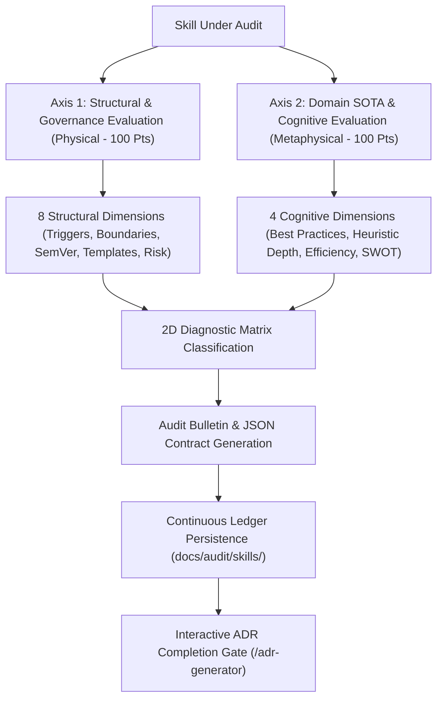

# Skill Audit Bulletin Engine (v5.1.0 — SOTA Dual-Axis & Ledger Edition)

Audits agent skills through an advanced **Dual-Axis Evaluation Engine**:
1. **Axis 1 (Physical / Structural & Governance)**: 8 dimensions evaluating metadata, SemVer, triggers, templates, boundaries, and operational risk.
2. **Axis 2 (Metaphysical / Domain SOTA & Cognitive Efficacy)**: 4 dimensions evaluating whether the skill's substantive knowledge represents true State-of-the-Art industry best practices, heuristic depth, SWOT analysis, and operational elegance.

Automatically synchronizes and persists results into the **Continuous Skill Audit Ledger** at [`docs/audit/skills/SKILL_AUDIT_LEDGER.md`](file:///home/loupan/.gemini/config/skills/docs/audit/skills/SKILL_AUDIT_LEDGER.md) and concludes with an interactive **ADR Decision Gate** linking directly to `adr-generator`.

---

## When to Use

### Use When:
- Auditing skills for quality, domain accuracy, structural conformance, or SOTA alignment.
- Performing pre-adoption, pre-release, or CI/CD compliance evaluations of new/updated skills.
- Evaluating whether a skill's procedural advice represents modern industry standards or outdated paradigms.
- Maintaining the continuous catalog audit history and score tracking in `docs/audit/skills/`.
- Deciding whether a skill warrants an architectural decision record (ADR) for refactoring, replacement, or deprecation.

### Do Not Use When:
- Scaffolding a brand new skill directory from scratch (use `skill-creator`).
- Discovering or routing natural language queries across the catalog (use `skill-discovery` or `find-skills`).
- Executing code implementations or ADR Decision Sets (use `implementation` or `adr-generator`).

### Related Skills:
- `adr-generator` — triggered by the completion gate to formalize corrective Decision Sets (ADR, Blueprint, TODO, Plan).
- `skill-creator` — creates and packages new skills following audit guidelines.
- `skill-discovery` — routes user queries to validated catalog skills.
- `technical-documentation` — reconciles repository documentation following skill audits.

---

## Dual-Axis Evaluation Architecture


```mermaid
graph TD
    A["Skill Under Audit"] --> B["Axis 1: Structural & Governance Evaluation (Physical - 100 Pts)"]
    A --> C["Axis 2: Domain SOTA & Cognitive Evaluation (Metaphysical - 100 Pts)"]
    
    B --> D["8 Structural Dimensions (Triggers, Boundaries, SemVer, Templates, Risk)"]
    C --> E["4 Cognitive Dimensions (Best Practices, Heuristic Depth, Efficiency, SWOT)"]
    
    D --> F["2D Diagnostic Matrix Classification"]
    E --> F
    
    F --> G["Audit Bulletin & JSON Contract Generation"]
    G --> H["Continuous Ledger Persistence (docs/audit/skills/)"]
    H --> I["Interactive ADR Completion Gate (/adr-generator)"]
```

---

## 1. Axis 1: Physical Structural & Governance Rubric (100 Pts)

| Dimension | Weight | Target & Verification Criteria |
|---|:---:|---|
| **1. Semantic Triggering** | 20% | Frontmatter `triggers` richness in EN/PT, exact match with description, distinct keyword coverage. |
| **2. Applicability & Boundaries** | 10% | Clear `When to Use` and explicit `Do Not Use When` sections with specific delegations. |
| **3. Depth & Coverage** | 15% | Multi-phase workflows, step-by-step procedures, and progressive disclosure support. |
| **4. Technical Accuracy** | 15% | Executable commands, working code snippets, valid template references, zero placeholders. |
| **5. Universality & Portability** | 10% | Stack-agnostic POSIX/standard library operations, zero hardcoded absolute host paths. |
| **6. Maintainability & SemVer** | 10% | Valid SemVer (`X.Y.Z`), `related_skills:` in frontmatter, structured anti-patterns with badges. |
| **7. Executor Ergonomics** | 10% | Visual Mermaid decision trees, copy-pasteable checklists, imperative verb-first instructions. |
| **8. Risk Profile (Inverted)** | 10% | Operational safety: `Inverted Score = 10 - Raw Risk (0-10)`. Zero destructive surprises. |

$$\text{Score}_{\text{Physical}} = \sum_{i=1}^{8} \left( \frac{\text{raw}_i}{10} \times \text{weight}_i \right)$$

---

## 2. Axis 2: Metaphysical Domain SOTA & Cognitive Rubric (100 Pts)

Acting as a Senior Principal Domain Architect, the model evaluates the substantive intelligence and real-world efficacy of the skill:

### 2.1 Methodological Adequacy & State of the Art (Weight: 35%)
- Does the skill prescribe modern, industry-standard SOTA methodologies or outdated/naive heuristics?
- Are the algorithms, architectural patterns, and security practices current (e.g. Clean Architecture, modern CSS clamp, OWASP top 10, deterministic RAG)?
- *Score (0–10)*: 10 = Industry Benchmark, 7 = Standard/Acceptable, 4 = Outdated/Naive, 1 = Flawed.

### 2.2 Conceptual Depth & Heuristic Robustness (Weight: 25%)
- Does the skill anticipate real-world friction, edge cases, race conditions, memory leaks, and failure modes?
- Are the decision trees and troubleshooting guidance comprehensive, or do they only cover naive happy paths?
- *Score (0–10)*: 10 = Exhaustive edge-case resilience, 7 = Good core coverage, 4 = Happy-path only, 1 = Fragile.

### 2.3 Operational Efficiency & Token Ergonomics (Weight: 20%)
- Is the workflow lean, deterministic, and token-efficient, or does it impose cognitive bloat, unnecessary loops, or token wastage?
- Does it respect the agent's context window through progressive disclosure and crisp instructions?
- *Score (0–10)*: 10 = Ultra-lean & token-optimal, 7 = Balanced, 4 = Token-heavy/redundant, 1 = Severe bloat.

### 2.4 Forensic SWOT Domain Analysis (Weight: 20%)
- Qualitative depth of the domain evaluation:
  - **Strengths (S)**: Competitive differentiators and high-value heuristics.
  - **Weaknesses (W)**: Conceptual gaps, omitted modern techniques, or blind spots.
  - **Opportunities (O)**: Potential architectural integrations and advanced capabilities.
  - **Threats (T)**: Risks of agent hallucination, misexecution, or technological obsolescence.
- *Score (0–10)*: 10 = Insightful, actionable SWOT, 7 = Standard assessment, 4 = Generic observations, 1 = Superficial.

$$\text{Score}_{\text{Cognitive}} = \sum_{j=1}^{4} \left( \frac{\text{raw}_j}{10} \times \text{weight}_j \right)$$

---

## 3. 2D Classification Matrix & Action Matrix

```
                      ▲ Axis 2: Domain SOTA (Cognitive / Substance)
                      │
   II. UNTAMED JEWEL  │   I. CANONICAL SOTA EXEMPLAR
       (Rich Content, │      (High Structure / High SOTA)
       Weak Structure)│      → ADOPT AS-IS
                      │
──────────────────────┼────────────────────────► Axis 1: Structural Conformance (Physical)
                      │
  IV. CRITICAL DEBT   │  III. HOLLOW SHELL
      (Low Structure, │       (Perfect Format,
       Weak Content)  │        Outdated / Weak Substance)
      → REWRITE / ADR │       → CREATE DOMAIN ADR
                      │
```

| Quadrant | Physical Grade | Cognitive Grade | Diagnosis | Recommended Action |
|:---:|:---:|:---:|---|---|
| **I** | **Grade A (≥85)** | **Grade A (≥85)** | 🏆 **Canonical SOTA Exemplar** | **ADOPT AS-IS** |
| **II** | **Grade B/C (<85)** | **Grade A (≥85)** | 💎 **Untamed Jewel** (Great depth, needs formatting) | **HOTFIX / FORMATTING** |
| **III** | **Grade A (≥85)** | **Grade B/C (<85)** | 🎭 **Hollow Shell** (Good metadata, weak domain advice) | **CREATE DOMAIN REFACTOR ADR** |
| **IV** | **Grade C/F (<70)** | **Grade C/F (<70)** | ⚠️ **Critical Tech Debt** (Fails both axes) | **CREATE REPLACEMENT ADR / DEPRECATE** |

---

## 4. Hard-Fail Gating

A Hard-Fail on either axis caps the entire evaluation to **Grade C (REFACTOR)** or **Grade F (DEPRECATE)**:
1. **Destructive Execution Risk**: Skill suggests dangerous shell commands without safety gates.
2. **Fabricated / Hallucinated Core Commands**: Tools, flags, or paths that do not exist.
3. **Severe Token Flooding**: Monolithic unformatted dumps (>15,000 tokens) crashing context windows.

---

## 5. Dual-Axis Audit Output Format

Every audit must produce the following structured Markdown bulletin:

````markdown
# Skill Audit Bulletin — <skill-name> (<version>)

**Audit Date:** YYYY-MM-DD  
**Auditor:** Antigravity SOTA Dual-Axis Auditor  
**Auditor Independence:** INDEPENDENT  

---

## 1. Axis 1: Physical Structural & Governance Scorecard (Score: X/100 — Grade X)

| Category | Weight | Raw (0-10) | Contribution | Evidence & Verification |
|---|:---:|:---:|:---:|---|
| **Semantic Triggering** | 20% | X | X.X | [Evidence] |
| **Applicability & Boundary** | 10% | X | X.X | [Evidence] |
| **Depth & Coverage** | 15% | X | X.X | [Evidence] |
| **Technical Accuracy** | 15% | X | X.X | [Evidence] |
| **Universality & Portability** | 10% | X | X.X | [Evidence] |
| **Maintainability & SemVer** | 10% | X | X.X | [Evidence] |
| **Executor Ergonomics** | 10% | X | X.X | [Evidence] |
| **Risk Profile (Inverted)** | 10% | X | X.X | [Evidence] |
| **Total Physical Score** | **100%** | — | **XX / 100** | **Grade X** |

---

## 2. Axis 2: Metaphysical Domain SOTA Scorecard (Score: Y/100 — Grade Y)

| Cognitive Category | Weight | Raw (0-10) | Contribution | Domain Rationale & Evidence |
|---|:---:|:---:|:---:|---|
| **Methodological SOTA & Best Practices** | 35% | Y | Y.Y | [Evaluation of modern industry practices] |
| **Conceptual Depth & Robustness** | 25% | Y | Y.Y | [Evaluation of edge cases and heuristic quality] |
| **Operational Efficiency & Token Cost** | 20% | Y | Y.Y | [Evaluation of execution flow and ergonomics] |
| **SWOT Domain Analysis** | 20% | Y | Y.Y | [Evaluation of substantive strengths and blindspots] |
| **Total Cognitive Score** | **100%** | — | **YY / 100** | **Grade Y** |

---

## 3. Forensic SWOT Domain Analysis

- **Strengths (S):** [Key architectural strengths and unique advantages]
- **Weaknesses (W):** [Substantive gaps, missing modern patterns, or vulnerabilities]
- **Opportunities (O):** [Enhancements to elevate this skill to world-class status]
- **Threats (T):** [Operational risks, drift, or agent execution failure modes]

---

## 4. 2D Matrix Classification & Verdict

- **2D Quadrant:** [Quadrant I / II / III / IV] — [Diagnosis Label]
- **Structural Score:** XX/100 (Grade X)
- **Domain SOTA Score:** YY/100 (Grade Y)
- **Aggregated Verdict:** [ADOPT_AS_IS / HOTFIX_FORMATTING / CREATE_DOMAIN_ADR / REWRITE]

---

## 5. Machine-Readable Dual-Axis JSON Contract

```json
{
  "skill": "<skill-name>",
  "version": "<version>",
  "audit_date": "YYYY-MM-DD",
  "auditor": "Antigravity SOTA Dual-Axis Auditor",
  "auditor_independence": "INDEPENDENT",
  "axis_1_physical": {
    "scores": {
      "triggering": {"raw": 0, "weight": 0.20, "contribution": 0.0},
      "applicability": {"raw": 0, "weight": 0.10, "contribution": 0.0},
      "depth": {"raw": 0, "weight": 0.15, "contribution": 0.0},
      "accuracy": {"raw": 0, "weight": 0.15, "contribution": 0.0},
      "universality": {"raw": 0, "weight": 0.10, "contribution": 0.0},
      "maintainability": {"raw": 0, "weight": 0.10, "contribution": 0.0},
      "ergonomics": {"raw": 0, "weight": 0.10, "contribution": 0.0},
      "risk": {"raw_risk": 0, "raw_inverted": 0, "weight": 0.10, "contribution": 0.0}
    },
    "score": 0,
    "grade": "X"
  },
  "axis_2_cognitive": {
    "scores": {
      "methodology_sota": {"raw": 0, "weight": 0.35, "contribution": 0.0},
      "conceptual_depth": {"raw": 0, "weight": 0.25, "contribution": 0.0},
      "operational_efficiency": {"raw": 0, "weight": 0.20, "contribution": 0.0},
      "swot_quality": {"raw": 0, "weight": 0.20, "contribution": 0.0}
    },
    "score": 0,
    "grade": "Y",
    "swot": {
      "strengths": [],
      "weaknesses": [],
      "opportunities": [],
      "threats": []
    }
  },
  "quadrant": "I_CANONICAL_SOTA",
  "action": "ADOPT_AS_IS",
  "adr_recommended": false
}
```
````

---

## 6. Continuous Skill Audit Ledger Persistence (`docs/audit/skills/`)

At the conclusion of each skill audit, the auditor **MUST** persist and update the repository ledger using the integrated ledger tool:

```bash
# Global canonical execution
python3 ~/.gemini/config/skills/skill-audit-bulletin/scripts/update_audit_ledger.py \
  --skill <skill-name> \
  --version <version> \
  --grade <grade> \
  --score <aggregated_score> \
  --physical-score <physical_score> \
  --cognitive-score <cognitive_score> \
  --action <verdict_action>
```

This updates:
1. `docs/audit/skills/SKILL_AUDIT_LEDGER.md` (Human-readable Markdown scorecard table)
2. `docs/audit/skills/SKILL_AUDIT_LEDGER.json` (Machine-readable stateful database)

---

## 7. Interactive Completion Gate & Transition

Present the user with explicit next steps:

```text
================================================================================
🎯 DECISION GATE: PRÓXIMOS PASSOS PARA ESTA SKILL
================================================================================
[1] Criar ADR para Refatoração / Evolução via /adr-generator
    (Formaliza o Decision Set: ADR, Blueprint, TODO e Implementation Plan)
[2] Aplicar correções estruturais no ato (Hotfix imediato de metadados e formato)
[3] Adotar como está e encerrar auditoria
================================================================================
```


## Anti-Patterns & Operational Guardrails

| Anti-Pattern | Severidade | Impacto Negativo | Mitigação Canônica |
|:---|:---:|:---|:---|
| **Execução Prematura sem Contexto** | 🔴 Critical | Alucinação de contexto e refatoração destrutiva | Ativar a skill `cap` para adquirir evidências mínimas antes de editar. |
| **Omissão de Checklists de Validação** | 🟡 Medium | Entrega de artefatos com inconsistências sintáticas | Executar rigorosamente o checklist passo a passo antes do handoff. |
| **Falta de Documentação de Decisões** | 🟢 Low | Perda de rastreabilidade técnica e drift arquitetural | Registrar trade-offs relevantes via skill `adr-generator`. |


## Edge Cases & Failure Modes

- **Ambiente Restrito / Read-Only:** Se o filesystem ou sandbox estiver bloqueado contra escrita, reportar o bloqueio com evidência imediata e gerar o patch em markdown diff.
- **Conflito de Especificação:** Caso encontre contradições entre a intenção do usuário e o SSOT (`AGENTS.md`), interromper e sinalizar as opções com trade-offs.
- **Timeout ou Exaustão de Contexto:** Em tarefas volumosas, decompor em sub-lotes atômicos utilizando a skill `subagent-driven-development`.


## Operational Verification Checklist

- [ ] Todos os pré-requisitos e arquivos-alvo foram inspecionados antes da modificação.
- [ ] O procedimento seguiu estritamente as regras e boas práticas da especialização.
- [ ] As diretrizes de segurança, tipagem e estilo foram preservadas.
- [ ] Os testes unitários ou comandos de validação foram executados com sucesso.
- [ ] O artefato final foi inspecionado contra o completion gate.

