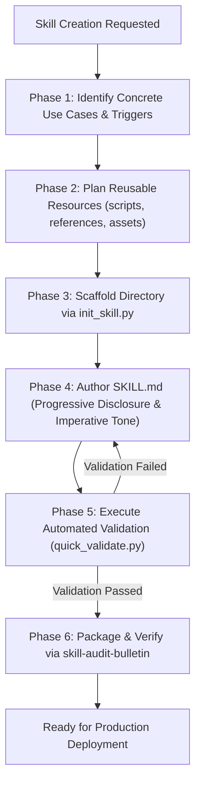

# Skill Creator (SOTA Edition)

Authoritative framework and scaffolding toolkit for designing, building, validating, and packaging high-quality skills for autonomous AI agents (Gemini CLI, Antigravity, Claude Code).

---

## When to Use

### Use When:
- Creating a new skill from scratch to equip agents with domain workflows, specialized knowledge, or tool integrations.
- Refactoring, modularizing, or upgrading an existing skill to meet modern SOTA standards.
- Scaffolding canonical skill directories with `init_skill.py`.
- Validating YAML frontmatter and directory conventions with `quick_validate.py`.
- Packaging and distributing skills into production-ready `.zip` bundles via `package_skill.py`.

### Do Not Use When:
- Auditing existing skills against the 8-dimension rubric (use `skill-audit-bulletin`).
- Searching or routing existing catalog skills (use `skill-discovery` or `find-skills`).
- Creating repository-level governance files or ADRs (use `repo-bootstrap` or `adr-generator`).
- Writing general documentation without skill packaging (use `technical-documentation`).

### Related Skills:
- `skill-audit-bulletin` — evaluates and audits created skills against the 8-dimension quality rubric.
- `skill-discovery` — catalogs and routes queries to relevant installed skills.
- `writing-skills` — guidelines for prompt tuning and agent persona authoring.
- `technical-documentation` — documentation standards and template management.

---

## Decision Tree & Lifecycle Flow



---

## Progressive Disclosure Design Principle

Skills manage context efficiently through a 3-tier loading architecture:

| Tier | Component | Loading Trigger | Context Footprint | Content Responsibility |
|:---:|---|---|:---:|---|
| **Tier 1** | **YAML Metadata** (`name` & `description`) | Always loaded in system memory | ~50–100 tokens | Tells the agent *what* the skill does and *when* to invoke it. |
| **Tier 2** | **`SKILL.md` Body** | Loaded when skill triggers | < 4,000 tokens | Procedural steps, decision trees, checklists, and anti-patterns. |
| **Tier 3** | **Bundled Resources** (`scripts/`, `references/`, `assets/`) | Loaded on-demand as needed | Unlimited | Large schemas, full documentation, reusable scripts, and templates. |

---

## Anatomy of a Canonical Skill

Every skill follows a deterministic directory structure:

```
skill-name/
├── SKILL.md                     # [REQUIRED] Frontmatter metadata + operational instructions
├── scripts/                     # [OPTIONAL] Deterministic Python/Bash tools
│   └── helper_tool.py
├── references/                  # [OPTIONAL] Deep documentation, schemas, domain guides (>10k tokens)
│   └── domain_reference.md
└── assets/                      # [OPTIONAL] Boilerplate code, templates, fonts, images
    └── starter_template/
```

### 1. Frontmatter Contract (`SKILL.md`)
```yaml
---
name: my-skill-name
version: 1.0.0
description: Precise explanation of capabilities and invocation triggers in 3rd person.
domain: domain-stack
triggers:
  - my-skill-name
  - alternate-trigger-1
  - alternate-trigger-2
tags:
  - my-skill-name
  - category
related_skills:
  - related-skill-1
metadata:
  author: Author Name
  provenance: internal
  last_audited: "2026-08-26"
---
```

---

## Skill Creation Workflow (6-Step Lifecycle)

### Step 1: Concrete Use Cases & Trigger Mapping
- Identify 3–5 realistic user prompts that should trigger this skill.
- Map distinct keywords (in Portuguese and English) to the `triggers:` list.
- Formulate clear "When to Use" and "Do Not Use When" boundaries.

### Step 2: Plan Reusable Resources
- **`scripts/`**: Is there logic that would otherwise require rewriting identical boilerplate? Include a Python script.
- **`references/`**: Is there deep domain reference material (e.g. database schemas, large API specs)? Move it to `references/` to keep `SKILL.md` concise.
- **`assets/`**: Are there template files, initial boilerplates, or static artifacts? Store them in `assets/`.

### Step 3: Scaffold Directory via `init_skill.py`
Run the scaffolding script:

```bash
# Workspace Local execution
python3 ~/.gemini/config/skills/skill-creator/scripts/init_skill.py <skill-name> --path <output-directory>

# In-repo execution
python3 scripts/init_skill.py <skill-name> --path .
```

The script initializes `SKILL.md`, standard YAML frontmatter, and placeholder directories (`scripts/`, `references/`, `assets/`).

### Step 4: Author `SKILL.md` (SOTA Standards)
- **Imperative / Verb-First Style**: Write instructions as commands ("Extract data", "Verify schema", "Execute build") rather than conversational prose.
- **Zero Placeholders**: Eliminate `{{TODO}}`, dummy text, or unverified imports.
- **Decision Trees**: Add Mermaid flowcharts for non-trivial conditional branches.
- **Checklists**: Provide copy-pasteable acceptance checklists.

### Step 5: Automated Validation & Packaging
Validate the created skill against schema and naming constraints:

```bash
# Validate skill structure
python3 ~/.gemini/config/skills/skill-creator/scripts/quick_validate.py <path/to/skill-folder>

# Package into distributable zip
python3 ~/.gemini/config/skills/skill-creator/scripts/package_skill.py <path/to/skill-folder> [dist_dir]
```

### Step 6: Audit Gating with `skill-audit-bulletin`
Before publishing, audit the skill using `skill-audit-bulletin` to ensure it reaches **Grade A (Score ≥ 85/100)** across all 8 dimensions:
1. Semantic Triggering Precision (20%)
2. Applicability & Boundaries (10%)
3. Depth & Coverage (15%)
4. Technical Accuracy (15%)
5. Universality & Portability (10%)
6. Maintainability (10%)
7. Agent Executor Ergonomics (10%)
8. Risk Profile (10%)

---

## Anti-patterns

### 🔴 Critical

#### Bloated Monolithic SKILL.md
- **What is it:** Dumping entire 50-page manuals, schemas, or large source files directly into `SKILL.md`.
- **Why is it bad:** Saturates the AI agent's context window on initial trigger, degrading performance and increasing costs.
- **How to avoid:** Apply Progressive Disclosure. Keep `SKILL.md` under 4,000 tokens and move deep material into `references/`.

#### Hallucinated External Tools
- **What is it:** Instructing the agent to run CLI commands that do not exist or are not installed in the environment.
- **Why is it bad:** Causes execution loops and immediate runtime failures.
- **How to avoid:** Bundle required tools as self-contained Python scripts in `scripts/` using the Python Standard Library.

#### Single-Word Triggers & Vague Descriptions
- **What is it:** Having only `triggers: [skill-name]` with a generic description like "Helps with stuff".
- **Why is it bad:** RAG and semantic routers fail to activate the skill when users query in natural language.
- **How to avoid:** Include 5–10 diverse triggers, action verbs, and English/Portuguese variations.

### 🟡 Medium

#### Conversational Second-Person Tone
- **What is it:** Writing "You should do this" or "If you want, you can".
- **How to avoid:** Use objective, imperative instructions: "Execute step 1", "Parse YAML", "Verify exit code".

#### Hardcoded Host-Specific Paths
- **What is it:** Referencing `/home/user/...` in scripts or instructions.
- **How to avoid:** Use dynamic path resolution (`Path(__file__).resolve()` or relative paths).

---

## Checklist for SOTA Skill Delivery

- [ ] Frontmatter includes `name`, `version`, `description`, `triggers`, `tags`, `related_skills`, and `metadata`.
- [ ] `description` clearly specifies capabilities and trigger scenarios in 3rd person.
- [ ] `When to Use` and `Do Not Use When` sections clearly define boundaries.
- [ ] Progressive Disclosure applied (`references/` and `scripts/` used for heavy resources).
- [ ] All code snippets, CLI commands, and scripts verified without placeholders.
- [ ] Validated with `quick_validate.py`.
- [ ] Audited with `skill-audit-bulletin` achieving Grade A (≥85/100).
