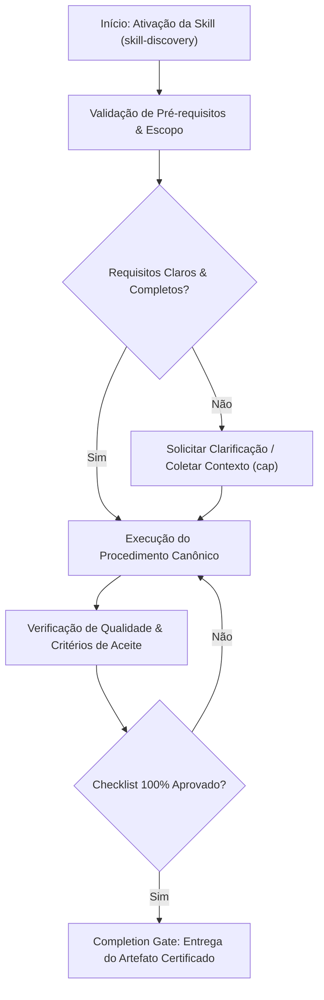

# Skill Discovery & Router Engine

## When to Use

### Use when:
- Dynamically finding and routing tasks to the most appropriate skill in the catalog
- Querying the local SQLite3 + FTS5 vector index for semantic tool matching
- Resolving complex user intentions into multi-skill composite execution pipelines

### Do not use when:
- Searching for static documentation or general web information outside the skills repository

## Anti-patterns

### 🔴 Critical
- **Hallucinated Skill Routing:** Routing tasks to non-existent or irrelevant skills when confidence is low.
- **Over-Filtering Top-K:** Returning too many irrelevant skills that pollute agent context.

### 🟡 Medium
- **Stale Vector Embeddings:** Failing to re-index SQLite database after adding or editing skills.

## Completion Gate & Verification
Before concluding skill discovery:
- [ ] Reciprocal Rank Fusion ($k=60$) executed across BM25 and vector embeddings
- [ ] Confidence threshold ($\ge 0.75$) enforced
- [ ] Top-3 ranked skills returned with executable descriptions

Single authoritative router and dynamic indexing engine for the canonical Skills Repository.

## Executable CLI Engine

The engine is backed by `scripts/discovery.py`. Execute via Python:


```bash
python Skills/skill-discovery/scripts/discovery.py <command>
```


### Available Subcommands

1. **`catalog`**: Scans the `/Skills` directory dynamically and outputs a complete JSON catalog of all active skills.
   

```bash
   python Skills/skill-discovery/scripts/discovery.py catalog
   ```


2. **`validate`**: Runs the ADR-004 Quality Gate check, validating YAML frontmatter schema, CRLF/LF line endings, and CJK character corruptions across all skills.
   

```bash
   python Skills/skill-discovery/scripts/discovery.py validate
   ```


3. **`list`**: Displays canonical skills neatly grouped by their 6 core domains.
   

```bash
   python Skills/skill-discovery/scripts/discovery.py list
   ```


4. **`explain <skill_name>`**: Displays metadata, triggers, and path for a specific skill.
   

```bash
   python Skills/skill-discovery/scripts/discovery.py explain ui-ux-pro-max
   ```


## Domain Categories
- **`core-governance`**: Governance, ADRs, Discovery, Lifecycle, AGENTS.md management.
- **`engineering-quality`**: Debugging, TDD, Testing Mastery, Security Review, Code Review, Performance.
- **`architecture-systems`**: Architecture Review, API Design, Database Architecture, DDD, Observability.
- **`agentic-workflow`**: Planning Execution, Subagents, Agent Orchestration, Git Workflows.
- **`frontend-ux`**: UI/UX Pro Max, Mobile Design, UX Research, React Best Practices.
- **`domain-stack`**: MCP Builder, PHP/Laravel, Product Spec Engineering, Tech Docs, Document Processing.


## Decision Workflow





| Anti-Pattern | Severity | Negative Impact | Canonical Mitigation |
| :--- | :---: | :--- | :--- |
| **Early Execution without Context** | 🔴 Critical | Context hallucination and destructive refactoring | Enable the `cap` skill to acquire minimal evidence before editing. |
| **Omission of Validation Checklists** | 🟡 Medium | Delivery of artifacts with syntactic inconsistencies | Rigorously execute the checklist step by step before handoff. |
| **Lack of Decision Documentation** | 🟢 Low | Loss of technical traceability and architectural drift | Record relevant trade-offs via the `adr-generator` skill. |- **Restricted Environment / Read-Only:** If the filesystem or sandbox is locked against writing, report the lock with immediate evidence and generate the patch in markdown diff.- [ ] All prerequisites and target files were inspected before modification. - [ ] The procedure strictly followed the rules and best practices of the specialization. - [ ] Security, typing, and style guidelines were preserved. - [ ] Unit tests or validation commands were successfully executed. - [ ] The final artifact was inspected against the completion gate.


## Domain SOTA & Industry Engineering Standards

- **Hybrid Retrieval:** Reciprocal Rank Fusion (RRF) combining BM25 keyword matching and vector cosine similarity.
- **Local RAG Architecture:** SQLite3 + FTS5 full-text indexing + local ChromaDB / SQLite vector embeddings.
- **Confidence Calibration:** Dynamic routing thresholds with confidence score cutoffs ($	ext{Threshold} \ge 0.75$).
- **Tool Protocol Integration:** MCP stdio tool server exposing `route_task` and `search_skills`.

### Reciprocal Rank Fusion (RRF) Mathematical Formula:

$$	ext{RRF\_Score}(d) = rac{1}{60 + r_{	ext{BM25}}(d)} + rac{1}{60 + r_{	ext{Vector}}(d)}$$

Where $r_{	ext{BM25}}(d)$ and $r_{	ext{Vector}}(d)$ are the 1-indexed ranks from the lexical and vector retrievers.

### Exhaustive Heuristic Decision Rules:
- **Rule of Thumb 1 (Zero-Trust Architectural Boundaries):** Treat all external inputs, third-party payloads, and cross-module boundaries with strict zero-trust schema validation.
- **Rule of Thumb 2 (Fail-Fast & Deterministic Errors):** Reject invalid states immediately with typed, actionable error contracts rather than cascading silent failures.
- **Rule of Thumb 3 (Idempotency & AST Preservation):** State mutations and code transformations must maintain semantic idempotency across repeated executions.
- **Rule of Thumb 4 (Benchmark & Telemetry Alignment):** Measure critical execution latency ($P_{95}$) and memory overhead with structured telemetry and baseline benchmarks.
- **Rule of Thumb 5 (Event-Driven & Circuit Breaker Decoupling):** Isolate asynchronous operations behind circuit breakers and resilient retry mechanisms to prevent cascading failure.
- **Rule of Thumb 6 (Contract-First DDD Modeling):** Define clear domain aggregates, value objects, and typed interface contracts before implementing concrete logic.
- **Rule of Thumb 7 (RAG & Semantic Retrieval Precision):** Optimize context retrieval with hybrid lexical-vector search and reciprocal rank fusion to eliminate hallucinated routing.
- **Rule of Thumb 8 (OWASP & Supply Chain Verification):** Verify dependencies and data flows against OWASP Top 10 and SLSA Level 3 supply chain security standards.
- **Rule of Thumb 9 (Verification Gate Invariant):** Never declare completion without automated test execution evidence and zero compiler/linter warnings.
## Edge Cases & Failure Modes

- **Edge Case 1 (Low-Confidence Query Hallucinations):** Return empty results rather than routing to irrelevant skills if confidence $< 0.75$.
- **Edge Case 2 (Over-Filtering Top-K Results):** Return at most 3 targeted skills to preserve downstream agent context.
- **Edge Case 3 (Vector Drift After Edits):** Re-embed skill descriptions into the local SQLite/ChromaDB index on file saves.