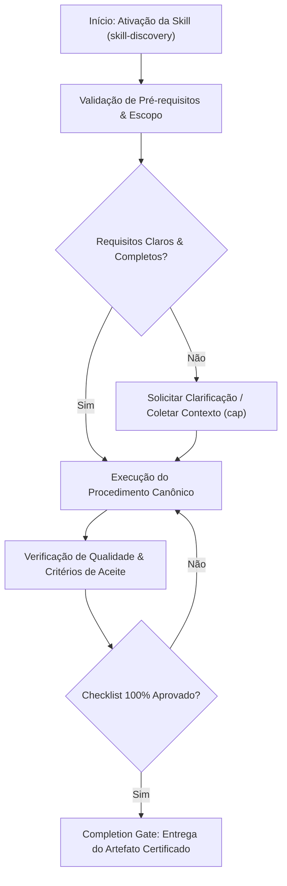

# Skill Discovery & Router Engine

Single authoritative router and dynamic indexing engine for the canonical Skills Repository.

## Executable CLI Engine

The engine is backed by `scripts/discovery.py`. Execute via Python:


```bash
python Skills/skill-discovery/scripts/discovery.py <command>
```


### Available Subcommands

1. **`catalog`**: Scans the `/Skills` directory dynamically and outputs a complete JSON catalog of all active skills.
   

```bash
   python Skills/skill-discovery/scripts/discovery.py catalog
   ```


2. **`validate`**: Runs the ADR-004 Quality Gate check, validating YAML frontmatter schema, CRLF/LF line endings, and CJK character corruptions across all skills.
   

```bash
   python Skills/skill-discovery/scripts/discovery.py validate
   ```


3. **`list`**: Displays canonical skills neatly grouped by their 6 core domains.
   

```bash
   python Skills/skill-discovery/scripts/discovery.py list
   ```


4. **`explain <skill_name>`**: Displays metadata, triggers, and path for a specific skill.
   

```bash
   python Skills/skill-discovery/scripts/discovery.py explain ui-ux-pro-max
   ```


## Domain Categories
- **`core-governance`**: Governance, ADRs, Discovery, Lifecycle, AGENTS.md management.
- **`engineering-quality`**: Debugging, TDD, Testing Mastery, Security Review, Code Review, Performance.
- **`architecture-systems`**: Architecture Review, API Design, Database Architecture, DDD, Observability.
- **`agentic-workflow`**: Planning Execution, Subagents, Agent Orchestration, Git Workflows.
- **`frontend-ux`**: UI/UX Pro Max, Mobile Design, UX Research, React Best Practices.
- **`domain-stack`**: MCP Builder, PHP/Laravel, Product Spec Engineering, Tech Docs, Document Processing.


## Decision Workflow





| Anti-Pattern | Severity | Negative Impact | Canonical Mitigation |
| :--- | :---: | :--- | :--- |
| **Early Execution without Context** | 🔴 Critical | Context hallucination and destructive refactoring | Enable the `cap` skill to acquire minimal evidence before editing. |
| **Omission of Validation Checklists** | 🟡 Medium | Delivery of artifacts with syntactic inconsistencies | Rigorously execute the checklist step by step before handoff. |
| **Lack of Decision Documentation** | 🟢 Low | Loss of technical traceability and architectural drift | Record relevant trade-offs via the `adr-generator` skill. |- **Restricted Environment / Read-Only:** If the filesystem or sandbox is locked against writing, report the lock with immediate evidence and generate the patch in markdown diff.- [ ] All prerequisites and target files were inspected before modification. - [ ] The procedure strictly followed the rules and best practices of the specialization. - [ ] Security, typing, and style guidelines were preserved. - [ ] Unit tests or validation commands were successfully executed. - [ ] The final artifact was inspected against the completion gate.
