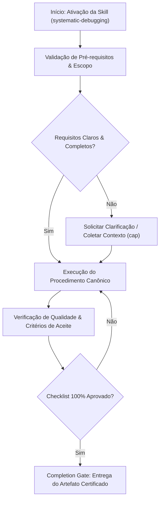

# Systematic Debugging

## When to Use

### Use when:
- Investigating non-trivial bugs, crashes, race conditions, or test regressions
- Executing root cause analysis (RCA) on production incidents
- Bisecting historical regressions across large commit ranges

### Do not use when:
- Trivial syntax errors or typos with obvious compiler error messages
- Routine feature development without an active defect or anomaly

## Overview

Debugging is investigation, not experimentation. This skill enforces a rigorous 4-phase process — root cause investigation, pattern analysis, hypothesis testing, and architecture questioning — that prevents shotgun debugging and ensures every fix is understood before it is applied.

**Announce at start:** "I'm using the systematic-debugging skill to investigate this issue."

---

## Core Principle

```
┌─────────────────────────────────────────────────────────────────┐
│  HARD-GATE: NEVER GUESS. NEVER SHOTGUN DEBUG.                  │
│  NEVER CHANGE CODE WITHOUT UNDERSTANDING WHY IT IS BROKEN.     │
│                                                                 │
│  You are a detective gathering evidence, not a gambler trying   │
│  random fixes. If you are changing code without understanding   │
│  the root cause, STOP immediately.                             │
└─────────────────────────────────────────────────────────────────┘
```

---

## Phase 1: Root Cause Investigation

**Goal:** Understand exactly WHAT is happening, not what you think is happening.

### Actions

1. **Read the error message carefully.** The entire message. Every line. Including the stack trace.
2. **Reproduce the bug.** If you cannot reproduce it, you cannot fix it. Find the exact steps.
3. **Gather evidence.** Collect:
   - Full error message and stack trace
   - Input that triggers the bug
   - Expected behavior vs actual behavior
   - Environment details (versions, config, OS)
4. **Check recent changes.** What changed since this last worked?
   - Recent commits (`git log`, `git diff`)
   - Dependency updates
   - Configuration changes
   - Environment changes

### Evidence Gathering Checklist

- [ ] Full error message captured (not truncated)
- [ ] Stack trace read from bottom to top
- [ ] Bug reproduced reliably with specific steps
- [ ] Expected vs actual behavior documented
- [ ] Recent changes reviewed (`git log --oneline -20`)
- [ ] Relevant logs examined

### STOP — HARD-GATE: Do NOT proceed to Phase 2 until:
- [ ] You can reproduce the bug consistently
- [ ] You have the full error message and stack trace
- [ ] You know what changed recently
- [ ] You can describe the bug precisely (not vaguely)

---

## Phase 2: Pattern Analysis

**Goal:** Narrow down WHERE the problem lives and WHEN it occurs.

### Actions

1. **Find working examples.** Does this feature work in other contexts? With other inputs? In other environments?
2. **Compare working vs broken.** What is different between the case that works and the case that does not?
3. **Check dependencies.** Are all required services/libraries/configs present and correct?
4. **Isolate the scope.** Can you reproduce with a minimal example? Strip away everything non-essential.

### Comparison Matrix

Fill this out to identify the pattern:

| Factor | Working Case | Broken Case | Different? |
|--------|-------------|-------------|------------|
| Input data | | | |
| Environment | | | |
| Configuration | | | |
| Dependencies | | | |
| Timing/order | | | |
| User/permissions | | | |
| State/context | | | |

### STOP — HARD-GATE: Do NOT proceed to Phase 3 until:
- [ ] You have identified at least one working case for comparison
- [ ] You have compared working vs broken and identified differences
- [ ] You have isolated the scope to the smallest reproducible case
- [ ] Dependencies have been verified (versions, availability, config)

---

## Phase 3: Hypothesis and Testing

**Goal:** Form ONE specific, testable hypothesis and verify it with the smallest possible change.

### Actions

1. **Form ONE hypothesis.** Based on evidence from Phases 1-2, what is the single most likely cause?
   - State it explicitly: "The bug occurs because [specific cause]"
   - If you cannot state it specifically, go back to Phase 1 or 2
2. **Design a minimal test.** What is the smallest change to confirm or deny this hypothesis?
   - Prefer adding a test case over modifying production code
   - Prefer logging/assertions over code changes
   - Prefer reverting a change over writing new code
3. **Apply the change and test.**
   - Make ONLY the change needed to test the hypothesis
   - Run the test suite
   - Observe the result
4. **Evaluate.**
   - If CONFIRMED: proceed with the fix, write a regression test
   - If DENIED: record what you learned, form a new hypothesis, return to step 1

### Hypothesis Log Template

```
Hypothesis #1: [description]
Test: [what you did]
Result: CONFIRMED / DENIED
Learning: [what this taught you]

Hypothesis #2: ...
```

### Decision Table: Hypothesis Testing Approach

| Hypothesis Type | Testing Method | Example |
|----------------|---------------|---------|
| Recent code change caused it | `git bisect` or revert commit | "The bug was introduced in commit abc123" |
| Data shape mismatch | Add logging/assertion | "The API returns null instead of array" |
| Race condition | Add timing logs or serialize | "Request B completes before request A" |
| Configuration error | Compare configs across environments | "Production uses different DB host" |
| Dependency version issue | Lock to known-good version | "Library 2.0 changed the API surface" |

### STOP — HARD-GATE: Do NOT proceed to Phase 4 unless:
- [ ] You have tested at least 3 hypotheses and ALL were denied
- [ ] Each hypothesis was specific and testable
- [ ] Each test was minimal (one change at a time)
- [ ] You recorded learnings from each failed hypothesis

---

## Phase 4: Architecture Questioning

**Goal:** If 3+ hypotheses have failed, the problem may be structural. Step back and question assumptions.

This phase is triggered ONLY after Phase 3 has been attempted at least 3 times without success.

### Actions

1. **Question your assumptions.** What have you been assuming is true that might not be?
   - Is the data shaped the way you think it is?
   - Is the control flow what you expect?
   - Are the types what you think they are?
   - Is the API contract what you assumed?
2. **Question the design.** Is the current approach fundamentally flawed?
   - Is there a race condition in the design?
   - Is there a state management problem?
   - Is there an incorrect abstraction?
   - Are responsibilities misplaced?
3. **Consider redesign.** Sometimes the fix is not a patch but a restructuring.
   - Can you simplify the design to eliminate the bug class entirely?
   - Is there a pattern that handles this case better?
   - Should you replace rather than fix?
4. **Seek external input.** If you are stuck:
   - Explain the problem to someone else (rubber duck debugging)
   - Search for known issues in dependencies
   - Check if others have encountered similar problems

### STOP — HARD-GATE: Do NOT continue without:
- [ ] Written list of assumptions that were questioned
- [ ] Explicit decision: patch the current design OR redesign
- [ ] If redesigning: a plan before implementing
- [ ] If patching: a new hypothesis informed by the assumption review

---

## Debugging Decision Flowchart

```
Error encountered
    |
    v
Can you reproduce it?
    |
    +-- NO --> Gather more information (logs, user reports, monitoring)
    |          Try different inputs, environments, timing
    |          Do NOT proceed until reproducible
    |
    +-- YES -> Read the FULL error message and stack trace
               |
               v
         Is the cause obvious from the error?
               |
               +-- YES -> Form hypothesis, test it (Phase 3)
               |          Still write a regression test
               |
               +-- NO --> Complete Phase 1 evidence gathering
                          |
                          v
                    Find working case for comparison (Phase 2)
                          |
                          v
                    Identify differences
                          |
                          v
                    Form and test hypotheses (Phase 3)
                          |
                          +-- Fixed --> Write regression test, verify
                          |
                          +-- 3+ failed hypotheses --> Phase 4
```

---

## Red Flags Table

| Red Flag | What It Means | Action |
|----------|--------------|--------|
| Changing code without understanding the bug | Shotgun debugging | Go back to Phase 1 |
| Fix works but you do not know why | Accidental fix, likely to regress | Investigate until you understand |
| Same bug keeps coming back | Root cause not addressed | Go to Phase 4, question design |
| Fix causes new bugs elsewhere | Unexpected coupling | Map dependencies before proceeding |
| "It works on my machine" | Environment difference | Go to Phase 2, comparison matrix |
| Fix requires more than 20 lines | Might be a design issue | Go to Phase 4 |
| Debugging for 30+ minutes | Tunnel vision | Take a break, re-read evidence from Phase 1 |
| Reading the same code repeatedly | Missing something fundamental | Get a fresh perspective, explain aloud |
| Multiple causes seem equally likely | Insufficient investigation | Go back to Phase 1, gather more evidence |

---

## Anti-Patterns / Common Mistakes

| Anti-Pattern | Why It Is Wrong | Correct Approach |
|-------------|----------------|-----------------|
| Changing random things to see if bug goes away | Wastes time, introduces new bugs | Form a hypothesis first |
| Adding try/catch to suppress the error | Hides the real problem | Fix the root cause |
| Rewriting the feature from scratch | Nuclear option is rarely needed | Isolate and fix the specific issue |
| Blaming the framework/library without evidence | Usually your code is wrong | Prove the framework bug with minimal repro |
| Skipping the regression test after fixing | Bug will return | Write the test, always |
| Fixing symptoms instead of root causes | Patches accumulate, system degrades | Trace to the actual cause |
| Debugging for 45+ minutes without stepping back | Tunnel vision reduces effectiveness | Take a break, re-read Phase 1 evidence |
| Ignoring error messages or stack traces | The answer is often in the error | Read every line of the error |

---

## Integration Points

| Skill | Relationship |
|-------|-------------|
| `test-driven-development` | Every bug fix MUST include a regression test (RED-GREEN cycle) |
| `verification-before-completion` | After fixing a bug, verify with fresh evidence |
| `resilient-execution` | When debugging during task execution, pause task, complete debugging, resume |
| `code-review` | Review the fix for completeness and side effects |
| `self-learning` | Record new debugging patterns in learned-patterns.md |
| `acceptance-testing` | Verify fix does not break acceptance criteria |

---

## Quick Reference: What NOT To Do

1. **Do NOT** change random things and see if the bug goes away
2. **Do NOT** add try/catch to suppress the error
3. **Do NOT** rewrite the feature from scratch as a first resort
4. **Do NOT** blame the framework/library without evidence
5. **Do NOT** skip writing a regression test after fixing
6. **Do NOT** fix symptoms instead of root causes
7. **Do NOT** debug for more than 45 minutes without stepping back
8. **Do NOT** ignore error messages or stack traces

---

## Skill Type

**RIGID** — The 4-phase process is mandatory and must be followed in order. Each phase has a HARD-GATE that must be satisfied before proceeding. Never change code without understanding why it is broken.


## Decision Workflow




## Anti-Patterns & Operational Guardrails

| Anti-Pattern | Severidade | Impacto Negativo | Mitigação Canônica |
|:---|:---:|:---|:---|
| **Execução Prematura sem Contexto** | 🔴 Critical | Alucinação de contexto e refatoração destrutiva | Ativar a skill `cap` para adquirir evidências mínimas antes de editar. |
| **Omissão de Checklists de Validação** | 🟡 Medium | Entrega de artefatos com inconsistências sintáticas | Executar rigorosamente o checklist passo a passo antes do handoff. |
| **Falta de Documentação de Decisões** | 🟢 Low | Perda de rastreabilidade técnica e drift arquitetural | Registrar trade-offs relevantes via skill `adr-generator`. |


## Edge Cases & Failure Modes

- **Ambiente Restrito / Read-Only:** Se o filesystem ou sandbox estiver bloqueado contra escrita, reportar o bloqueio com evidência imediata e gerar o patch em markdown diff.
- **Conflito de Especificação:** Caso encontre contradições entre a intenção do usuário e o SSOT (`AGENTS.md`), interromper e sinalizar as opções com trade-offs.
- **Timeout ou Exaustão de Contexto:** Em tarefas volumosas, decompor em sub-lotes atômicos utilizando a skill `subagent-driven-development`.


## Domain SOTA & Industry Engineering Standards

- **Scientific Debugging Framework:** Andreas Zeller's Why Programs Fail (Scientific Method applied to software debugging).
- **Search & Bisection Algebra:** Binary search across git history ($O(\log N)$) via `git bisect`.
- **Root Cause Analysis (RCA):** 5-Whys Tree, Ishikawa (Fishbone) diagrams, and Fault Tree Analysis (FTA).
- **Anti-Pattern Elimination:** Strict prohibition of shotgun debugging, speculation without evidence, and cosmetic patches.

### Scientific Debugging Search Complexity:

$$\text{Steps}_{\text{bisect}} \le \lceil \log_2(N_{\text{commits}}) \rceil$$

### 4-Phase Scientific Hypothesis Protocol:
1. **Phase 1 (Reproduce):** Build a deterministic, minimal reproducible example (automated test script).
2. **Phase 2 (Hypothesize):** Formulate a single, falsifiable hypothesis explaining the root cause.
3. **Phase 3 (Experiment):** Execute a targeted experiment or bisect step to prove or disprove the hypothesis.
4. **Phase 4 (Fix & Guard):** Apply minimal root-cause fix and add a permanent regression test.

### Exhaustive Heuristic Decision Rules:
1. **Rule of Thumb 1 (No Code Change Without Failing Test):** You cannot claim a bug is fixed until you write a test that fails before the fix and passes after.
2. **Rule of Thumb 2 (Single Variable Rule):** Change only ONE variable per experiment during debugging.
3. **Rule of Thumb 3 (Root Cause vs Symptom):** Fixing a `NullPointerException` with `if (x != null)` is a symptom fix; investigate *why* `x` was null.
4. **Rule of Thumb 4 (Explain the Fix):** If you cannot explain *why* the fix works, you do not understand the bug yet.

## Completion Gate & Verification
Before concluding debugging investigation:
- [ ] Minimal reproduction script created and verified failing
- [ ] Root cause verified through falsifiable hypothesis testing
- [ ] Fix applied and permanent regression test passes with green build